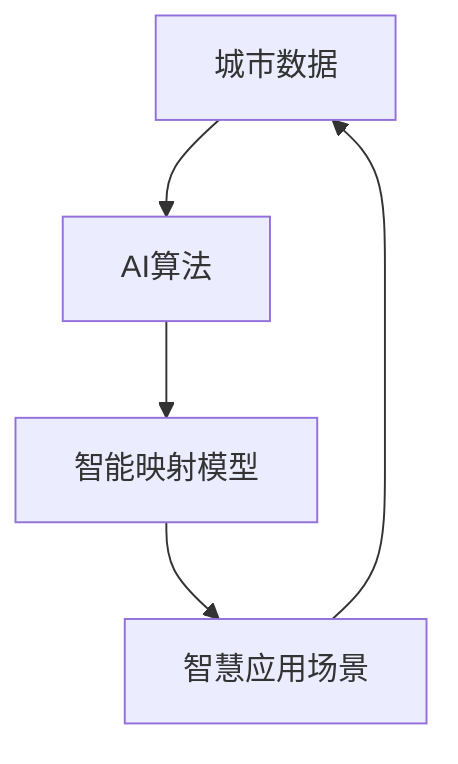

# 一切皆是映射：AI在智慧城市构建中的作用

## 1.背景介绍
### 1.1 智慧城市的兴起
随着城市化进程的不断推进,城市面临的各种问题和挑战日益突出,如交通拥堵、环境污染、能源短缺、公共安全等。为了应对这些挑战,世界各国纷纷提出了智慧城市的建设理念和规划。智慧城市利用物联网、大数据、人工智能等新一代信息技术,将城市的各个系统和服务数字化、网络化、智能化,以提高城市管理和服务的效率,改善市民的生活质量。

### 1.2 AI在智慧城市中的重要性
人工智能作为智慧城市建设的核心技术之一,在城市规划、交通管理、能源优化、公共安全等方面发挥着越来越重要的作用。AI可以快速处理海量城市数据,优化资源配置,预测未来趋势,辅助决策制定。同时AI还可以通过机器学习不断迭代优化,使城市系统更加智能和高效。可以说,没有AI技术的加持,智慧城市就难以真正实现"智慧"。

### 1.3 映射的哲学思想
映射是数学和计算机科学中的重要概念,指两个集合之间的对应关系。从哲学的角度看,世界万物都可以看作不同事物之间的映射。城市作为一个复杂系统,其内部的各个要素之间,以及城市与外部环境之间,都存在着错综复杂的映射关系。理解和把握这些映射关系,对于智慧城市的构建至关重要。而AI恰恰是连接和处理这些映射的利器。

## 2.核心概念与联系
### 2.1 智慧城市的内涵
智慧城市并没有一个统一的定义,但一般认为智慧城市应具备以下特征:
- 数据驱动的城市管理和决策
- 高度互联的城市信息基础设施
- 广泛应用物联网感知城市动态
- 充分利用大数据分析城市问题
- 积极采用人工智能优化城市服务

智慧城市的核心是利用先进的信息技术提升城市管理和服务水平,让城市更加高效、便捷、宜居、可持续。

### 2.2 AI与智慧城市的关系
AI与智慧城市是相辅相成的关系。一方面,智慧城市建设为AI技术提供了广阔的应用场景和海量的数据支撑。城市系统的智能化离不开AI算法的支持。另一方面,AI是赋能智慧城市建设的关键技术,AI可以挖掘城市数据的价值,优化城市资源配置,创新城市管理模式,为智慧城市注入源源不断的智慧。

### 2.3 映射思想在智慧城市中的体现
智慧城市本质上就是城市系统内部以及与外部的映射过程。比如:
- 交通路网是道路与车辆的映射
- 能源网络是能源设施与用能需求的映射
- 城市规划是土地资源与城市功能的映射
- 城市经济是产业结构与市场需求的映射

AI在智慧城市中的作用,就是利用机器学习等技术,构建和优化城市系统的映射模型,让城市运行更加智能高效。下图展示了AI与智慧城市映射的关系:



## 3.核心算法原理和操作步骤

### 3.1 机器学习在智慧城市中的应用
机器学习是AI的核心技术,在智慧城市建设中应用广泛。主要应用场景包括:
- 交通流量预测与疏导
- 城市能耗分析与优化
- 环境污染监测与预警
- 公共安全事件检测与处置
- 市政设施健康监测与维护

### 3.2 监督学习算法
监督学习是最常用的机器学习范式,适用于有标注数据的场景。在智慧城市中,监督学习可用于:
- 交通拥堵分类与预测
- 建筑能效评估与分级
- 垃圾分类与处理优化
- 城市灾害预警与分级响应

以交通拥堵分类为例,其主要步骤如下:
1. 数据采集:收集道路监控视频、车辆GPS轨迹、路况传感器数据等
2. 数据标注:由人工标注道路通畅/缓行/拥堵等状态
3. 特征工程:提取道路车速、车流量、占有率等特征
4. 模型训练:用决策树、SVM等算法训练分类模型
5. 模型评估:用准确率、召回率等指标评估模型性能 
6. 模型应用:用训练好的模型对新的交通数据进行拥堵分类

### 3.3 无监督学习算法
无监督学习对没有标注的数据进行建模,在智慧城市中的应用包括:
- 城市功能区划分
- 用户画像与群体挖掘
- 设备异常检测与原因分析

以城市功能区划分为例,其主要步骤如下:
1. 数据采集:POI数据、用电数据、手机信令数据等
2. 数据预处理:清洗异常数据,统一数据格式
3. 特征选择:提取各区域POI密度、用电负荷、人口热度等特征
4. 模型训练:用K-means、DBSCAN等聚类算法对区域聚类
5. 结果解释:根据聚类结果划分城市商业区、居住区、工业区等功能区
6. 结果应用:为城市规划、产业布局提供决策支持

### 3.4 强化学习算法
强化学习通过智能体与环境的交互学习最优决策,在智慧城市中可用于:
- 自适应交通信号灯控制
- 电网需求侧响应优化
- 城市供水管网压力调度

以信号灯控制为例,其核心思想是将信号灯视为智能体,将车流情况视为环境状态,将通行效率视为奖励值,通过Q-learning等算法学习最佳的信号配时策略。其主要步骤如下:
1. 定义状态空间:用车道占有率、排队长度等表征
2. 定义动作空间:每个相位的红绿灯时长
3. 定义奖励函数:用行程时间、停车次数、通行能力等表征 
4. 初始化Q表:各状态-动作值初始化为0
5. 智能体与环境交互:获取状态,执行动作,获取奖励,更新状态
6. 更新Q表:根据Q-learning公式更新Q值
$$
Q(s,a) \leftarrow Q(s,a)+\alpha [r+\gamma \max _{a^{\prime }} Q(s^{\prime },a^{\prime })-Q(s,a)]
$$
7. 决策应用:根据Q表选择最优动作,生成实时信号配时

## 4.数学模型和公式详解

### 4.1 映射的数学定义
映射是两个集合之间的对应关系。设X、Y是两个非空集合,如果存在一个法则f,使得对X中每个元素x,在Y中都有唯一确定的元素y与之对应,则称f为从X到Y的映射,记为$f:X \rightarrow Y$。其中X称为定义域,Y称为值域,y称为x在映射f下的像,记为f(x)。

### 4.2 智慧城市的映射模型
智慧城市可以看作一个多层次、多维度的映射系统。设智慧城市系统为S,城市数据集合为D,智慧应用集合为A,AI算法集合为F,则智慧城市的映射模型可表示为:
$$S=\{D,A,F\}$$
$$D=\{d_1,d_2,...,d_n\}$$
$$A=\{a_1,a_2,...,a_m\}$$
$$F=\{f_1,f_2,...,f_k\}$$
其中,$f_i:D \rightarrow A$表示第i个AI算法,它将城市数据映射为智慧应用。

### 4.3 交通流量预测模型
以交通流量预测为例,假设某路段有n个车道,每个车道布设一个车辆检测器,检测器每隔Δt时间上报一次该车道在Δt时间内通过的车辆数。记第i个车道在第j个时间片内的车流量为$q_{ij}$,则路段总车流量为:
$$Q_j=\sum_{i=1}^n q_{ij}$$
假设用一个长短时记忆网络(LSTM)模型预测未来1小时内的车流量,模型输入为过去m个时间片的车流量,输出为未来p个时间片的车流量。则LSTM的前向传播公式为:
$$
i_t=\sigma(W_{ii}x_t+b_{ii}+W_{hi}h_{t-1}+b_{hi}) \\
f_t=\sigma(W_{if}x_t+b_{if}+W_{hf}h_{t-1}+b_{hf}) \\ 
g_t=\tanh(W_{ig}x_t+b_{ig}+W_{hg}h_{t-1}+b_{hg}) \\
o_t=\sigma(W_{io}x_t+b_{io}+W_{ho}h_{t-1}+b_{ho}) \\
c_t=f_t*c_{t-1}+i_t*g_t \\
h_t=o_t*\tanh(c_t)
$$
其中,
- $x_t$为t时刻的输入向量,即$[Q_{t-m+1},...,Q_t]$
- $h_t$为t时刻的隐藏状态,$c_t$为t时刻的细胞状态
- $i_t,f_t,o_t$分别为输入门、遗忘门、输出门
- $W,b$为待学习的权重矩阵和偏置向量
- $\sigma$为sigmoid激活函数,$\tanh$为双曲正切激活函数
- $*$为Hadamard乘积,即逐元素相乘

模型的输出层为一个全连接层:
$$\hat{Q}_{t+1},...,\hat{Q}_{t+p}=W_{yh}h_t+b_y$$

模型的损失函数为均方误差:
$$L=\frac{1}{p}\sum_{i=1}^p (\hat{Q}_{t+i}-Q_{t+i})^2$$

## 5.项目实践:代码实例和详细解释

下面以Python代码实现一个简单的城市交通流量预测模型。使用的数据集为PeMS,包含加州高速公路的交通流量数据。

```python
import numpy as np
import pandas as pd
import matplotlib.pyplot as plt
from sklearn.preprocessing import StandardScaler
from keras.models import Sequential
from keras.layers import LSTM, Dense

# 读取数据
data = pd.read_csv('pems.csv', header=None)
data = data.values[:, 3:4].astype('float32')  # 只取第3列车流量数据

# 数据预处理
scaler = StandardScaler()
data = scaler.fit_transform(data)

# 构造时间序列样本
def create_dataset(dataset, look_back=1, look_forward=1):
    X, Y = [], []
    for i in range(len(dataset)-look_back-look_forward+1):
        x = dataset[i:(i+look_back), 0]
        y = dataset[(i+look_back):(i+look_back+look_forward), 0]
        X.append(x)
        Y.append(y)
    return np.array(X), np.array(Y)

look_back = 12  # 过去1小时
look_forward = 12  # 未来1小时
X, Y = create_dataset(data, look_back, look_forward) 

# 划分训练集和测试集
train_size = int(len(X) * 0.7)
X_train, Y_train = X[:train_size], Y[:train_size]
X_test, Y_test = X[train_size:], Y[train_size:]

# 构建LSTM模型
model = Sequential()
model.add(LSTM(64, input_shape=(look_back, 1)))  
model.add(Dense(look_forward))
model.compile(loss='mse', optimizer='adam')

# 模型训练
model.fit(X_train, Y_train, epochs=100, batch_size=16, verbose=2)

# 模型预测
train_predict = model.predict(X_train)
test_predict = model.predict(X_test)

# 反归一化还原真实值
train_predict = scaler.inverse_transform(train_predict)
Y_train = scaler.inverse_transform(Y_train)
test_predict = scaler.inverse_transform(test_predict)
Y_test = scaler.inverse_transform(Y_test)

# 计算MSE误差
train_score = np.mean((train_predict - Y_train)**2)
print('Train Score: %.2f MSE' % (train_score