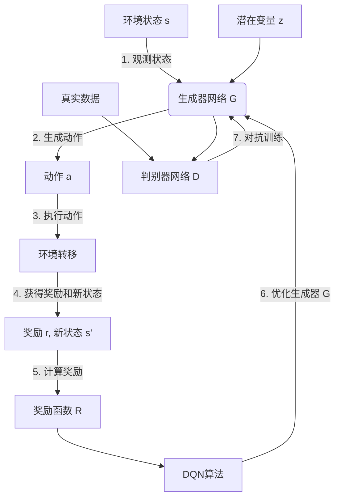

# 一切皆是映射：DQN与GANs的结合应用：创造性学习模型

## 1.背景介绍

### 1.1 深度强化学习与生成对抗网络

近年来,人工智能领域出现了两种革命性的技术:深度强化学习(Deep Reinforcement Learning, DRL)和生成对抗网络(Generative Adversarial Networks, GANs)。

深度强化学习是机器学习的一个分支,它使用深度神经网络来近似最优策略和价值函数,从而解决序列决策问题。其中,深度Q网络(Deep Q-Network, DQN)是DRL中最成功和最广为人知的算法之一。DQN通过Q-Learning的思想,使用深度神经网络来近似Q函数,从而解决高维状态和动作空间下的强化学习问题。

另一方面,生成对抗网络(GANs)是一种用于生成式建模的框架,由生成器网络和判别器网络组成。生成器网络从潜在空间采样,并生成新的样本;判别器网络则尝试区分生成的样本和真实数据。通过生成器和判别器之间的对抗训练,GANs能够捕获数据分布,并生成逼真的样本。

### 1.2 创造性学习的兴起

创造性学习(Creative Learning)是人工智能领域中新兴的一个分支,旨在开发能够进行创造性工作的智能系统。传统的机器学习算法通常是从现有数据中学习,而创造性学习则希望能够创造出全新的、有意义的内容。

创造性学习的应用场景包括艺术创作、产品设计、科学发现等领域。例如,通过创造性学习,我们可以生成新的音乐作品、绘画作品、文学作品等;也可以设计出新颖的产品,或者发现新的科学定理和公理。

### 1.3 DQN与GANs结合的创新

DQN和GANs分别来自强化学习和生成式建模两个不同领域,但它们在创造性学习中的结合具有巨大潜力。一方面,DQN可以通过奖励机制来优化创造性内容的质量;另一方面,GANs可以生成新颖的创造性内容。

将DQN与GANs相结合,可以构建出一种新型的创造性学习模型。在这种模型中,生成器网络负责生成创造性内容,而DQN则根据奖励信号来优化生成器,使其生成的内容质量不断提高。同时,判别器网络也会与生成器对抗,促使生成的内容更加逼真。

这种创新的DQN-GAN模型不仅可以创造出新颖的内容,而且这些内容的质量也得到了优化,具有更高的实用价值。它为人工智能系统赋予了真正的"创造力",开辟了全新的应用前景。

## 2.核心概念与联系  

### 2.1 深度Q网络(DQN)

深度Q网络(Deep Q-Network, DQN)是深度强化学习中的一种算法,它使用深度神经网络来近似Q函数,从而解决高维状态和动作空间下的强化学习问题。

Q函数定义为在给定状态s下执行动作a后,可以获得的期望累积奖励。通过学习Q函数,智能体就可以选择在当前状态下执行哪个动作,从而最大化未来的累积奖励。

在DQN中,我们使用一个深度神经网络来近似Q函数,其输入为当前状态s,输出为所有可能动作a对应的Q值Q(s,a)。在训练过程中,我们根据贝尔曼方程的目标值不断调整网络参数,使得Q网络的输出值逼近真实的Q值。

DQN算法的核心思想是使用经验回放(Experience Replay)和目标网络(Target Network)两种技术来提高训练的稳定性和效率。经验回放通过存储过去的经验来打破数据相关性,提高数据利用效率;目标网络则通过定期更新目标Q网络的参数,使得目标值更加稳定。

$$
\begin{aligned}
Q(s_t, a_t) &\leftarrow Q(s_t, a_t) + \alpha \Big(r_t + \gamma \max_{a'} Q(s_{t+1}, a') - Q(s_t, a_t)\Big) \\
\text{Loss} &= \mathbb{E}_{(s_t, a_t, r_t, s_{t+1}) \sim \mathcal{D}} \Big[\Big(r_t + \gamma \max_{a'} Q(s_{t+1}, a'; \theta^-) - Q(s_t, a_t; \theta)\Big)^2\Big]
\end{aligned}
$$

其中,$\alpha$是学习率,$\gamma$是折扣因子,$(s_t, a_t, r_t, s_{t+1})$是从经验回放池$\mathcal{D}$中采样的转换,$\theta$是Q网络的参数,$\theta^-$是目标网络的参数。

### 2.2 生成对抗网络(GANs)

生成对抗网络(Generative Adversarial Networks, GANs)是一种用于生成式建模的框架,由生成器网络(Generator)和判别器网络(Discriminator)组成。

生成器网络的目标是从潜在空间(Latent Space)中采样,并生成逼真的样本,使得判别器网络无法区分生成的样本和真实数据。判别器网络则尝试区分生成的样本和真实数据,其目标是最大化正确分类的概率。

生成器G和判别器D可以看作是一个两人零和博弈,它们的目标函数可以表示为:

$$\min_G \max_D V(D, G) = \mathbb{E}_{x \sim p_\text{data}(x)}[\log D(x)] + \mathbb{E}_{z \sim p_z(z)}[\log(1 - D(G(z)))]$$

在训练过程中,生成器G和判别器D通过对抗训练不断提高自身的能力。生成器G努力生成更加逼真的样本来欺骗判别器D,而判别器D则努力提高自身的判别能力。最终,当生成器G生成的样本无法被判别器D区分时,就达到了生成式对抗网络的Nash均衡。

GANs已经在图像、语音、文本等多个领域取得了巨大的成功,展现出了强大的生成能力。

### 2.3 DQN与GANs的结合

虽然DQN和GANs分别来自强化学习和生成式建模两个不同领域,但它们在创造性学习中的结合具有巨大潜力。

在传统的GAN框架中,生成器网络通常是一个确定性映射,从潜在空间映射到数据空间。而在DQN-GAN模型中,我们将生成器网络G视为一个策略网络$\pi_\theta$,其输入是当前状态s和潜在变量z,输出是下一个动作(即生成的数据点)。

与此同时,我们引入一个奖励函数R(s, a),用于评估在当前状态s下生成动作a的质量。奖励函数可以由人工设计,也可以通过判别器网络D的输出来自动获得。

在DQN-GAN模型中,生成器网络G的目标是最大化其生成的动作序列的累积奖励,而判别器网络D的目标则是最大化正确分类的概率。形式化地,它们的目标函数可以表示为:

$$\begin{aligned}
\max_\theta \ \mathbb{E}_{z \sim p_z(z)}\Big[\sum_{t=0}^T R(s_t, a_t)\Big], \quad \text{where } a_t \sim \pi_\theta(a_t | s_t, z) \\
\max_D V(D, G) = \mathbb{E}_{x \sim p_\text{data}(x)}[\log D(x)] + \mathbb{E}_{z \sim p_z(z)}[\log(1 - D(G(z)))]
\end{aligned}$$

在训练过程中,我们可以采用策略梯度算法(如REINFORCE、Actor-Critic等)来优化生成器网络G的参数$\theta$,使其生成的动作序列获得更高的累积奖励。同时,生成器G和判别器D也会通过对抗训练相互提高,促使生成的内容更加逼真。

这种DQN与GANs的创新结合,赋予了人工智能系统真正的"创造力"。生成器网络不仅能够生成新颖的内容,而且这些内容的质量也得到了奖励函数的优化,具有更高的实用价值。同时,判别器网络的存在也确保了生成内容的真实性和多样性。

## 3.核心算法原理具体操作步骤

### 3.1 DQN-GAN模型框架

DQN-GAN模型的总体框架如下所示:

算法的具体步骤如下:

1. 观测当前环境状态s。
2. 将当前状态s和采样的潜在变量z输入到生成器网络G(即策略网络$\pi_\theta$),生成下一个动作a。
3. 执行动作a,环境转移到新状态s'并返回奖励r。
4. 通过奖励函数R(s, a)计算当前动作a在状态s下的奖励值。
5. 使用DQN算法(如REINFORCE、Actor-Critic等)根据累积奖励来优化生成器网络G的参数$\theta$。
6. 将生成器网络G生成的样本和真实数据输入到判别器网络D中,通过对抗训练提高生成器G和判别器D的能力。
7. 重复上述过程,直到模型收敛。

在实际应用中,我们可以根据具体问题对上述算法框架进行调整和优化。例如,可以使用不同的DQN算法变体、不同的奖励函数设计、不同的对抗训练策略等。

### 3.2 关键技术细节

#### 3.2.1 生成器网络G

生成器网络G的核心是一个策略网络$\pi_\theta(a_t | s_t, z)$,它根据当前状态s_t和潜在变量z输出下一个动作a_t。

策略网络$\pi_\theta$通常是一个深度神经网络,可以使用卷积神经网络(CNN)、循环神经网络(RNN)、变分自编码器(VAE)等不同的网络结构。其输入是当前状态s_t和潜在变量z,输出是动作a_t的概率分布或者连续的动作值。

在训练过程中,我们使用策略梯度算法(如REINFORCE、Actor-Critic等)来优化策略网络$\pi_\theta$的参数$\theta$,使其生成的动作序列获得更高的累积奖励。

#### 3.2.2 奖励函数R

奖励函数R(s, a)用于评估在当前状态s下生成动作a的质量,是DQN-GAN模型的核心部分之一。

奖励函数可以由人工设计,也可以通过判别器网络D的输出来自动获得。人工设计的奖励函数需要对问题领域有深入的理解,而自动获得的奖励函数则更加通用和自适应。

当使用判别器网络D作为奖励函数时,我们可以将D(x)视为样本x的奖励值,即R(s, a) = D(G(s, z))。这种方式下,生成器网络G的目标就是最大化判别器D对其生成样本的评分,从而生成更加逼真的内容。

除了使用判别器网络D的输出作为奖励函数,我们还可以设计其他形式的奖励函数,例如:

- 基于人工评分的奖励函数
- 基于特定目标的评估函数(如图像清晰度、文本流畅度等)
- 多个奖励函数的加权组合

合理设计奖励函数对于DQN-GAN模型的性能至关重要。一个好的奖励函数不仅能够正确评估生成内容的质量,还应当能够促进探索和创新。

#### 3.2.3 对抗训练

对抗训练是GAN模型的核心部分,也是DQN-