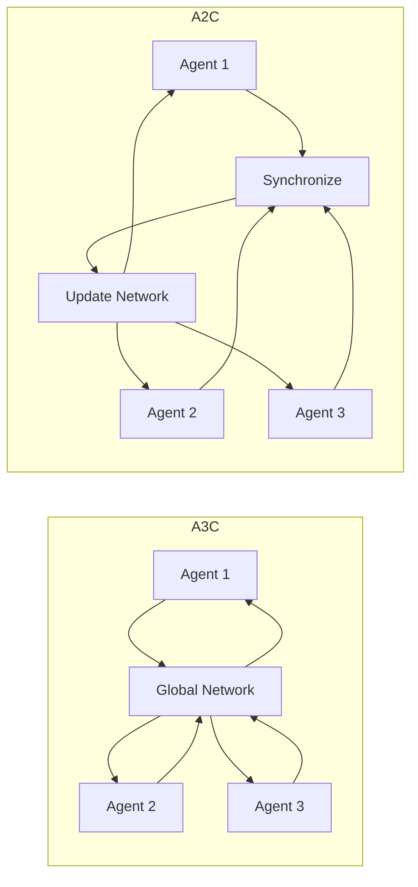

# 一切皆是映射：DQN中的异步方法：A3C与A2C详解

## 1. 背景介绍
### 1.1 强化学习的崛起
近年来,强化学习(Reinforcement Learning,RL)在人工智能领域掀起了一股热潮。从AlphaGo战胜世界冠军到自动驾驶汽车的突破,RL展现出了广阔的应用前景。作为机器学习的一个重要分支,RL旨在让智能体(Agent)通过与环境的交互来学习最优策略,以获得最大的累积奖励。

### 1.2 DQN的局限性
在RL算法中,DQN(Deep Q-Network)是一个里程碑式的算法。它将深度神经网络与Q学习相结合,实现了端到端的学习。然而,DQN存在一些局限性:
- 训练不稳定,容易发散
- 样本利用率低,训练效率不高
- 难以处理连续动作空间

为了克服这些局限性,研究者们提出了一系列DQN的改进算法,其中异步方法(Asynchronous Methods)备受关注。

### 1.3 异步方法的优势  
异步方法通过并行地训练多个Agent,实现了更高效、更稳定的学习。其代表性算法包括A3C(Asynchronous Advantage Actor-Critic)和A2C(Advantage Actor-Critic)。相比DQN,异步方法具有以下优势:
- 更稳定的训练过程
- 更高的样本利用率
- 更好的探索能力
- 支持连续动作空间

本文将深入探讨A3C和A2C算法的原理、实现及应用,帮助读者全面理解DQN中的异步方法。

## 2. 核心概念与联系
### 2.1 马尔可夫决策过程(MDP) 
强化学习问题可以用马尔可夫决策过程(Markov Decision Process,MDP)来建模。MDP由状态集合S、动作集合A、转移概率P、奖励函数R和折扣因子γ组成。Agent与环境交互的过程可以看作在MDP中序列决策的过程。

### 2.2 值函数与策略函数
- 状态值函数$V^\pi(s)$:在策略$\pi$下,状态s的期望累积奖励。
- 动作值函数$Q^\pi(s,a)$:在策略$\pi$下,状态s采取动作a的期望累积奖励。
- 策略函数$\pi(a|s)$:在状态s下选择动作a的概率。

RL的目标是寻找最优策略$\pi^*$,使得值函数最大化。

### 2.3 Actor-Critic架构
Actor-Critic是一类重要的RL算法,由Actor和Critic两部分组成:
- Actor:策略函数$\pi_\theta(a|s)$,根据当前状态选择动作。
- Critic:值函数$V_\phi(s)$或$Q_\phi(s,a)$,评估状态或动作的价值。

其中$\theta$和$\phi$分别表示Actor和Critic的参数。Actor根据Critic的评估来更新策略,Critic根据TD误差来更新值函数。

### 2.4 A3C与A2C的联系与区别
- 联系:A3C和A2C都是基于Actor-Critic架构,使用异步方法来并行训练多个Agent。
- 区别:A3C各个Agent独立更新参数,而A2C在多个Agent上采样后统一更新参数。

下图展示了A3C与A2C的核心架构:



## 3. 核心算法原理与具体步骤
### 3.1 A3C算法
A3C的核心思想是:多个Agent在不同的环境副本中与环境交互,独立地更新局部网络参数,并定期与全局网络同步参数。算法主要步骤如下:

1. 初始化全局网络参数$\theta$和$\phi$。
2. 创建N个Agent,每个Agent包含局部策略网络$\pi_{\theta'}$和值网络$V_{\phi'}$,初始参数从全局网络复制。
3. 对每个Agent并行执行以下步骤:
   - 与环境交互,采集一个Episode的轨迹数据$(s_t,a_t,r_t,s_{t+1})$。
   - 计算优势函数$A(s_t,a_t)=\sum_{i=0}^{k-1} \gamma^i r_{t+i} + \gamma^k V_{\phi'}(s_{t+k}) - V_{\phi'}(s_t)$。
   - 计算策略损失$L_\pi=-\log \pi_{\theta'}(a_t|s_t)A(s_t,a_t)$和值函数损失$L_V=\frac{1}{2}(r_t+\gamma V_{\phi'}(s_{t+1})-V_{\phi'}(s_t))^2$。
   - 计算总损失$L=L_\pi+\alpha L_V$,其中$\alpha$为值函数损失的权重。
   - 用梯度下降法更新局部网络参数$\theta'$和$\phi'$。
   - 将局部网络参数$\theta'$和$\phi'$推送到全局网络,并将全局网络参数拉取到局部网络。
4. 重复步骤3,直到满足终止条件(如达到最大迭代次数)。

### 3.2 A2C算法
A2C在多个Agent上采样,然后统一计算梯度并更新网络参数。算法主要步骤如下:

1. 初始化全局策略网络$\pi_\theta$和值网络$V_\phi$。
2. 创建N个Agent,每个Agent包含与全局网络相同的策略网络和值网络。
3. 对每个Agent并行执行以下步骤:
   - 与环境交互,采集一个Episode的轨迹数据$(s_t,a_t,r_t,s_{t+1})$。
   - 计算优势函数$A(s_t,a_t)=r_t+\gamma V_\phi(s_{t+1})-V_\phi(s_t)$。
   - 计算策略梯度$\nabla_\theta J(\theta)=\nabla_\theta \log \pi_\theta(a_t|s_t)A(s_t,a_t)$和值函数梯度$\nabla_\phi J(\phi)=\nabla_\phi \frac{1}{2}(r_t+\gamma V_\phi(s_{t+1})-V_\phi(s_t))^2$。
4. 同步所有Agent的梯度,计算平均梯度$\bar{\nabla}_\theta J(\theta)$和$\bar{\nabla}_\phi J(\phi)$。
5. 用梯度下降法更新全局网络参数$\theta$和$\phi$。 
6. 重复步骤3-5,直到满足终止条件。

## 4. 数学模型与公式详解
### 4.1 策略梯度定理
策略梯度定理给出了期望累积奖励(目标函数)关于策略参数的梯度:

$$\nabla_\theta J(\theta)=\mathbb{E}_{\pi_\theta}[\nabla_\theta \log \pi_\theta(a|s)Q^{\pi_\theta}(s,a)]$$

其中$J(\theta)$为目标函数,$\pi_\theta$为参数化策略函数,$Q^{\pi_\theta}(s,a)$为动作值函数。这个公式告诉我们,可以通过提高优势函数(Advantage)大的动作的概率,来提高期望累积奖励。

在实际应用中,我们用优势函数$A^{\pi_\theta}(s,a)$来替代$Q^{\pi_\theta}(s,a)$,即:

$$\nabla_\theta J(\theta)=\mathbb{E}_{\pi_\theta}[\nabla_\theta \log \pi_\theta(a|s)A^{\pi_\theta}(s,a)]$$

其中优势函数$A^{\pi_\theta}(s,a)=Q^{\pi_\theta}(s,a)-V^{\pi_\theta}(s)$,表示在状态s下选择动作a相比平均表现的优势。

### 4.2 A3C的损失函数
A3C的损失函数由策略损失和值函数损失组成:

$$L=L_\pi+\alpha L_V$$

其中策略损失$L_\pi$为:

$$L_\pi=-\log \pi_{\theta'}(a_t|s_t)A(s_t,a_t)$$

值函数损失$L_V$为:

$$L_V=\frac{1}{2}(r_t+\gamma V_{\phi'}(s_{t+1})-V_{\phi'}(s_t))^2$$

$\alpha$为值函数损失的权重,用于平衡两个损失项。

### 4.3 A2C的梯度计算
A2C的策略梯度为:

$$\nabla_\theta J(\theta)=\nabla_\theta \log \pi_\theta(a_t|s_t)A(s_t,a_t)$$

值函数梯度为:

$$\nabla_\phi J(\phi)=\nabla_\phi \frac{1}{2}(r_t+\gamma V_\phi(s_{t+1})-V_\phi(s_t))^2$$

在并行采样后,计算所有Agent的平均梯度:

$$\bar{\nabla}_\theta J(\theta)=\frac{1}{N}\sum_{i=1}^N \nabla_\theta J(\theta_i)$$

$$\bar{\nabla}_\phi J(\phi)=\frac{1}{N}\sum_{i=1}^N \nabla_\phi J(\phi_i)$$

其中$N$为Agent的数量,$\theta_i$和$\phi_i$分别表示第$i$个Agent的策略和值函数参数。

## 5. 项目实践:代码实例与详解
下面以PyTorch为例,给出A3C和A2C算法的简要实现。

### 5.1 A3C的代码实现

```python
import torch
import torch.nn as nn
import torch.multiprocessing as mp

class ActorCritic(nn.Module):
    def __init__(self):
        super(ActorCritic, self).__init__()
        self.fc1 = nn.Linear(4, 256)
        self.fc_pi = nn.Linear(256, 2) 
        self.fc_v = nn.Linear(256, 1)
        
    def pi(self, x, softmax_dim=1):
        x = torch.relu(self.fc1(x))
        x = self.fc_pi(x)
        prob = torch.softmax(x, dim=softmax_dim)
        return prob
    
    def v(self, x):
        x = torch.relu(self.fc1(x))
        v = self.fc_v(x)
        return v
      
def worker(worker_id, master_end, worker_end):
    master_end.close()  # Forbid worker to use the master end for messaging
    env = gym.make('CartPole-v1')
    env.seed(worker_id)
    
    while True:
        cmd, data = worker_end.recv()
        if cmd == 'step':
            ob, reward, done, info = env.step(data)
            if done:
                ob = env.reset()
            worker_end.send((ob, reward, done, info))
        elif cmd == 'reset':
            ob = env.reset()
            worker_end.send(ob)
        elif cmd == 'reset_task':
            ob = env.reset_task()
            worker_end.send(ob)
        elif cmd == 'close':
            worker_end.close()
            break
        elif cmd == 'get_spaces':
            worker_end.send((env.observation_space, env.action_space))
        else:
            raise NotImplementedError
            
class ParallelEnv:
    def __init__(self, n_train_processes):
        self.nenvs = n_train_processes
        self.waiting = False
        self.closed = False
        self.workers = list()

        master_ends, worker_ends = zip(*[mp.Pipe() for _ in range(self.nenvs)])
        self.master_ends, self.worker_ends = master_ends, worker_ends

        for worker_id, (master_end, worker_end) in enumerate(zip(master_ends, worker_ends)):
            p = mp.Process(target=worker,
                           args=(worker_id, master_end, worker_end))
            p.daemon = True
            p.start()
            self.workers.append(p)

        for worker_end in worker_ends:
            worker_end.close()

    def step_async(self, actions):
        for master_end, action in zip(self.master_ends, actions):
            master_end.send(('step', action))
        self.waiting = True

    def step_wait(self):
        results = [master_end.recv() for master_end in self.master_ends]
        self.waiting = False
        obs, rews, dones, infos = zip(*results)
        return np.stack(obs), np.stack(rews), np.stack(dones), infos

    def reset(self):
        for master_end in self.master_ends:
            master_end.send(('reset', None))
        return np.stack([master_end.recv() for master_end in self.master_ends])

    def step(self, actions):
        self.step_async(