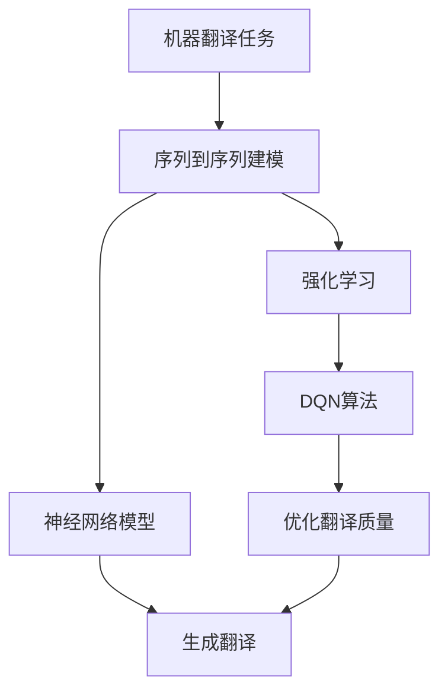

# 一切皆是映射：DQN在机器翻译领域的应用：潜力与挑战

## 1.背景介绍

### 1.1 机器翻译的重要性

在这个日益全球化的世界中,跨语言沟通成为了一个日益重要的需求。机器翻译技术为不同语言之间的交流提供了一种高效、低成本的解决方案,在商业、科研、政府等多个领域发挥着重要作用。

### 1.2 机器翻译的发展历程

早期的机器翻译系统主要基于规则,需要大量的人工制定语法规则和词典。随着统计机器翻译和神经机器翻译的兴起,机器翻译的性能得到了大幅提升。尤其是近年来,benefiting from 深度学习和大数据的快速发展,神经机器翻译取得了令人瞩目的成就。

### 1.3 深度强化学习在机器翻译中的应用

作为深度学习的一个重要分支,深度强化学习已经在很多领域取得了卓越的成绩,如AlphaGo战胜人类顶尖棋手。最近,深度强化学习也开始在机器翻译领域崭露头角,展现出巨大的潜力。其中,DQN(Deep Q-Network)作为一种经典的深度强化学习算法,在机器翻译任务中的应用备受关注。

## 2.核心概念与联系

### 2.1 机器翻译任务

机器翻译的目标是将一种自然语言(源语言)转换为另一种自然语言(目标语言),同时保持语义内容的等价性。形式化地,给定一个源语言句子 $X=\{x_1,x_2,...,x_n\}$,需要生成一个在目标语言中与其语义等价的句子 $Y=\{y_1,y_2,...,y_m\}$。

机器翻译可以看作是一个序列到序列(Sequence-to-Sequence)的建模问题。传统的统计机器翻译方法通过构建复杂的特征函数来直接对条件概率 $P(Y|X)$ 进行建模。而神经机器翻译则是通过序列到序列的模型(如RNN、Transformer等)来端到端地学习该条件概率。

### 2.2 强化学习在机器翻译中的作用

虽然神经机器翻译取得了长足的进步,但仍然存在一些需要解决的问题,如翻译的不连贯性、缺乏多样性等。强化学习为解决这些问题提供了一种新的思路。

在强化学习中,智能体(Agent)与环境(Environment)进行交互,根据执行的行为获得奖赏或惩罚,并且通过不断尝试来学习获取最大化累积奖赏的策略。将机器翻译任务建模为一个强化学习过程,就可以使用强化学习算法来优化翻译质量。

DQN作为一种基于价值迭代的强化学习算法,可以用于估计在机器翻译任务中执行某个动作(如生成某个词)的长期收益。通过最大化这个长期收益,DQN可以学习到一个生成高质量翻译的策略。



## 3.核心算法原理具体操作步骤

DQN算法的核心思想是使用一个深度神经网络来估计在当前状态执行某个动作所能获得的长期收益(即Q值)。对于机器翻译任务,我们可以将当前已生成的部分译文看作状态,将词的生成看作动作。

具体地,DQN算法在机器翻译中可以分为以下几个步骤:

### 3.1 状态和动作的表示

对于当前时间步 $t$,已经生成的部分译文 $Y_t=\{y_1,y_2,...,y_t\}$ 就是当前状态 $s_t$。动作 $a_t$ 则是在时间步 $t$ 生成的词 $y_{t+1}$。

### 3.2 Q值的计算

我们使用一个深度神经网络 $Q(s_t,a_t;\theta)$ 来估计在状态 $s_t$ 执行动作 $a_t$ 后能获得的长期收益(Q值)。这个神经网络的输入是状态 $s_t$ 和动作 $a_t$ 的表示,输出是对应的Q值。

### 3.3 Q值的更新

在强化学习中,我们希望Q值能够逼近真实的长期收益。因此需要不断根据获得的奖赏来更新Q值。具体地,在时间步 $t+1$,我们有:

$$Q(s_t,a_t) \leftarrow Q(s_t,a_t) + \alpha[r_{t+1} + \gamma\max_{a'}Q(s_{t+1},a';\theta^-) - Q(s_t,a_t;\theta)]$$

其中 $r_{t+1}$ 是在时间步 $t+1$ 获得的奖赏, $\gamma$ 是折现因子, $\theta^-$ 是目标网络的参数(用于估计 $\max_{a'}Q(s_{t+1},a';\theta^-)$),而 $\theta$ 是当前网络的参数。 $\alpha$ 是学习率。

通过不断更新Q值,神经网络就可以逐步学习到一个能够最大化长期收益的策略。

### 3.4 生成翻译

在生成翻译时,我们根据当前的Q值选择具有最大Q值的动作(词),并将其添加到已生成的译文中,形成新的状态。重复该过程,直到生成完整的译文。

具体地,在时间步 $t$,我们选择动作:

$$a_t = \arg\max_{a'}Q(s_t,a';\theta)$$

并将其添加到 $Y_t$ 中,得到新的状态 $s_{t+1}$。

### 3.5 经验回放和目标网络

为了提高训练的稳定性和样本利用率,DQN引入了经验回放(Experience Replay)和目标网络(Target Network)两种技术。

经验回放是将智能体与环境的互动存储到经验池中,并在训练时随机取样,而不是直接使用连续的数据。这种方式可以打破数据的相关性,提高训练效率。

目标网络是为了估计 $\max_{a'}Q(s_{t+1},a';\theta^-)$ 时使用一个相对稳定的网络,而不直接使用当前网络的参数 $\theta$。这样可以提高训练的稳定性。目标网络的参数 $\theta^-$ 会每隔一定步数复制一次当前网络的参数。

## 4.数学模型和公式详细讲解举例说明

在DQN算法中,我们需要学习一个能够估计Q值的神经网络模型。设该神经网络为 $Q(s,a;\theta)$,其中 $\theta$ 为模型参数。

我们的目标是使Q值 $Q(s,a;\theta)$ 能够尽可能逼近真实的长期收益 $Q^*(s,a)$。也就是说,我们希望最小化下面的损失函数:

$$L(\theta) = \mathbb{E}_{(s,a,r,s')\sim D}\left[(Q^*(s,a) - Q(s,a;\theta))^2\right]$$

其中 $D$ 是经验回放池中的数据分布, $(s,a,r,s')$ 分别表示状态、动作、奖赏和下一状态。

由于无法直接获得 $Q^*(s,a)$,我们使用贝尔曼方程(Bellman Equation)对其进行估计:

$$Q^*(s,a) = \mathbb{E}_{s'\sim\mathcal{P}}\left[r + \gamma\max_{a'}Q^*(s',a')\right]$$

其中 $\mathcal{P}$ 是状态转移概率分布, $\gamma$ 是折现因子。

将贝尔曼方程代入损失函数,我们得到:

$$L(\theta) = \mathbb{E}_{(s,a,r,s')\sim D}\left[\left(r + \gamma\max_{a'}Q(s',a';\theta^-) - Q(s,a;\theta)\right)^2\right]$$

这就是我们在前面提到的Q值更新公式。通过最小化该损失函数,我们可以使Q值 $Q(s,a;\theta)$ 逐步逼近真实的长期收益 $Q^*(s,a)$。

在实际应用中,我们通常使用随机梯度下降(SGD)或其变体来优化上述损失函数,从而学习神经网络参数 $\theta$。

## 5.项目实践:代码实例和详细解释说明

为了更好地理解DQN在机器翻译中的应用,我们提供了一个基于PyTorch的简化实现示例。该示例使用英语到德语的翻译任务进行说明。

### 5.1 数据预处理

```python
import torch
from torchtext.legacy import data, datasets

# 加载数据集
train_data, valid_data, test_data = datasets.Multi30k(language_pair=('en', 'de'))

# 构建词表
EN = data.Field(tokenize='spacy', lower=True)
DE = data.Field(tokenize='spacy', lower=True)

train_data = data.TabularDataset(
    path='data/train.tsv', format='tsv',
    fields=[('en', EN), ('de', DE)])

valid_data = data.TabularDataset(
    path='data/val.tsv', format='tsv',
    fields=[('en', EN), ('de', DE)])

EN.build_vocab(train_data, max_size=50000)
DE.build_vocab(train_data, max_size=50000)
```

首先,我们从 torchtext 库中加载 Multi30k 数据集,这是一个常用的英语-德语翻译数据集。然后构建源语言(英语)和目标语言(德语)的词表。

### 5.2 定义 DQN 模型

```python
import torch.nn as nn
import torch.nn.functional as F

class DQN(nn.Module):
    def __init__(self, src_vocab_size, tgt_vocab_size, embed_size, hidden_size):
        super(DQN, self).__init__()
        self.src_embed = nn.Embedding(src_vocab_size, embed_size)
        self.tgt_embed = nn.Embedding(tgt_vocab_size, embed_size)
        self.encoder = nn.GRU(embed_size, hidden_size, bidirectional=True)
        self.decoder = nn.GRUCell(embed_size, hidden_size)
        self.out = nn.Linear(2*hidden_size, tgt_vocab_size)
        
    def forward(self, src, tgt, hidden=None):
        src_embed = self.src_embed(src)
        tgt_embed = self.tgt_embed(tgt)
        
        _, hidden = self.encoder(src_embed)
        
        q_values = []
        for i in range(tgt_embed.size(1)):
            hidden = self.decoder(tgt_embed[:,i,:], hidden)
            q_value = self.out(torch.cat((hidden[0], hidden[1]), dim=1))
            q_values.append(q_value)
            
        q_values = torch.stack(q_values, dim=1)
        return q_values
```

这是一个简化的 DQN 模型实现。模型由以下几个部分组成:

- `src_embed` 和 `tgt_embed`: 源语言和目标语言的词嵌入层。
- `encoder`: 一个双向 GRU 编码器,用于编码源语言序列。
- `decoder`: 一个 GRU 解码器单元,用于解码目标语言序列。
- `out`: 一个全连接层,将解码器隐藏状态映射到词的 Q 值。

在前向传播时,我们首先通过编码器获取源语言序列的编码表示。然后,对于每个时间步,我们使用解码器单元和前一时间步的输出计算当前时间步的隐藏状态,并通过全连接层获得该时间步所有词的 Q 值。

### 5.3 训练 DQN 模型

```python
import torch.optim as optim

model = DQN(len(EN.vocab), len(DE.vocab), 256, 512)
optimizer = optim.Adam(model.parameters())
criterion = nn.CrossEntropyLoss()

for epoch in range(num_epochs):
    for src, tgt in train_iter:
        optimizer.zero_grad()
        
        q_values = model(src, tgt)
        
        # 计算 Q-learning 目标
        targets = tgt[:, 1:].contiguous().view(-1)
        q_values = q_values[:, :-1].contiguous().view(-1, len(DE.vocab))
        
        loss = criterion(q_values, targets)
        
        loss.backward()
        optimizer.step()
```

在训练过程中,我们首先通过模型获取每个时间步的 Q 值。然后,我们根据下一时间步的实际词作为 Q-learning 目标,计算交