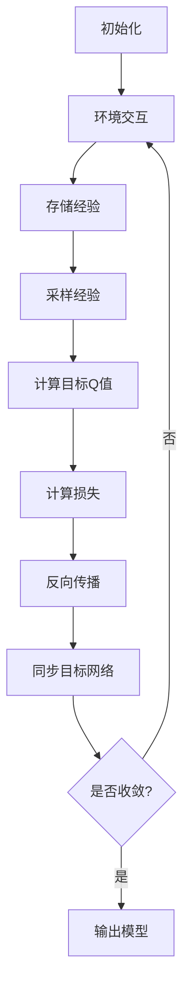

# 一切皆是映射：DQN的模型评估与性能监控方法

## 1.背景介绍

### 1.1 强化学习与深度Q网络

强化学习(Reinforcement Learning, RL)是机器学习中一个重要分支,它关注智能体(Agent)如何通过与环境(Environment)的交互来学习获取最大化的累积奖励。在强化学习中,智能体根据当前状态选择行为,环境会根据这个行为给出新的状态和对应的奖励。智能体的目标是学习一种策略(Policy),使得在给定状态下选择的行为能够最大化预期的累积奖励。

深度Q网络(Deep Q-Network, DQN)是将深度神经网络应用于强化学习中的一种突破性方法。传统的Q-Learning算法使用表格来存储每个状态-行为对的Q值,但在高维状态空间下,这种方法会遇到维数灾难的问题。DQN通过使用深度神经网络来近似Q函数,从而能够处理高维的连续状态空间,极大地扩展了强化学习的应用范围。

### 1.2 DQN在实际应用中的重要性

DQN已经在许多实际应用中取得了巨大成功,例如:

- **游戏AI**: DQN可以通过与游戏环境交互来学习如何玩游戏,在多种经典游戏(如Atari游戏)中表现出超越人类的水平。
- **机器人控制**: DQN可以用于控制机器人在复杂环境中执行任务,如机械臂抓取、无人机导航等。
- **自动驾驶**: DQN可以应用于自动驾驶场景,通过与模拟环境交互来学习驾驶策略。
- **资源管理**: DQN可以用于数据中心资源管理、网络流量控制等场景,优化资源利用效率。

随着DQN在实际应用中的不断推广,对其模型评估和性能监控的需求也越来越迫切。只有通过全面的评估和监控,才能保证DQN模型的稳定性、可靠性和高效性。

## 2.核心概念与联系

### 2.1 DQN模型评估的关键指标

评估DQN模型的关键指标包括:

1. **收敛速度**: 模型在训练过程中达到稳定状态所需的时间或迭代次数。收敛速度越快,训练效率越高。
2. **最终性能**: 模型在训练完成后,在测试环境中的表现。通常使用累积奖励或分数来衡量。
3. **稳定性**: 模型在不同的随机种子、环境设置下的性能波动情况。稳定性越高,模型越可靠。
4. **泛化能力**: 模型在看不见的新环境中的表现,反映了模型的泛化能力。
5. **样本效率**: 模型达到一定性能所需的环境交互样本数量。样本效率越高,学习效率越高。

### 2.2 DQN性能监控的重点内容

在DQN模型的训练和部署过程中,需要重点监控以下几个方面:

1. **损失函数值**: 监控损失函数的变化趋势,判断模型是否收敛。
2. **Q值分布**: 检查Q值的分布情况,判断模型是否过度估计或低估了Q值。
3. **探索与利用**: 监控探索策略(如ε-贪婪)的变化,确保探索与利用之间的平衡。
4. **经验回放**: 监控经验回放池的大小和更新频率,防止过拟合或欠拟合。
5. **硬件资源使用**: 监控GPU/CPU利用率、内存占用等,优化资源利用效率。
6. **在线推理性能**: 监控模型在线推理的延迟和吞吐量,确保实时响应。

通过全面的模型评估和性能监控,我们可以深入了解DQN模型的行为,及时发现和解决潜在问题,从而提高模型的稳定性和可靠性。

## 3.核心算法原理具体操作步骤

### 3.1 DQN算法原理

DQN算法的核心思想是使用深度神经网络来近似Q函数,并通过经验回放和目标网络等技术来提高训练的稳定性和效率。具体来说,DQN算法包括以下几个关键步骤:

1. **初始化**: 初始化评估网络(Q网络)和目标网络(Target Network),两个网络的权重初始时相同。
2. **环境交互**: 智能体与环境交互,根据当前状态s使用ε-贪婪策略选择行为a,执行该行为并观察到新状态s'和奖励r。
3. **存储经验**: 将(s, a, r, s')的经验存储到经验回放池(Experience Replay Buffer)中。
4. **采样经验**: 从经验回放池中随机采样一个批次(Batch)的经验。
5. **计算目标Q值**: 使用目标网络计算下一状态s'的最大Q值,作为当前状态行为对(s, a)的目标Q值。
6. **计算损失**: 使用评估网络计算(s, a)对应的Q值,与目标Q值的差异作为损失。
7. **反向传播**: 使用优化算法(如RMSProp或Adam)对评估网络进行反向传播,更新网络权重。
8. **同步目标网络**: 每隔一定步数,将评估网络的权重复制到目标网络,保持目标网络相对稳定。
9. **循环迭代**: 重复上述步骤,直到模型收敛或达到预设的最大迭代次数。

### 3.2 DQN算法流程图



上图展示了DQN算法的核心流程。其中,经验回放和目标网络是DQN算法的两大关键技术:

1. **经验回放(Experience Replay)**: 将智能体与环境的交互经验存储在经验回放池中,并在训练时从中随机采样,打破了经验数据之间的相关性,提高了数据的利用效率和模型的稳定性。
2. **目标网络(Target Network)**: 将Q网络的权重定期复制到目标网络,使目标Q值相对稳定,避免了Q网络的连续更新导致的不稳定性。

通过这两项技术,DQN算法能够有效地解决传统Q-Learning算法中的不稳定性问题,实现了稳定的训练过程和良好的收敛性能。

## 4.数学模型和公式详细讲解举例说明

### 4.1 Q-Learning算法

在介绍DQN之前,我们先回顾一下传统的Q-Learning算法。Q-Learning算法的目标是找到一个最优的行为价值函数(Action-Value Function) $Q^*(s, a)$,它表示在状态s下选择行为a,之后能获得的最大化期望累积奖励。该函数满足贝尔曼最优方程(Bellman Optimality Equation):

$$Q^*(s, a) = \mathbb{E}_{s' \sim \mathcal{P}}\left[r(s, a) + \gamma \max_{a'} Q^*(s', a')\right]$$

其中:
- $\mathcal{P}$是环境的状态转移概率分布
- $r(s, a)$是在状态s下执行行为a获得的即时奖励
- $\gamma \in [0, 1]$是折现因子,用于权衡即时奖励和未来奖励的重要性

Q-Learning算法通过不断更新Q值,使其逼近最优的$Q^*$函数。具体的更新规则为:

$$Q(s, a) \leftarrow Q(s, a) + \alpha \left[r(s, a) + \gamma \max_{a'} Q(s', a') - Q(s, a)\right]$$

其中$\alpha$是学习率,控制了每次更新的步长。

### 4.2 DQN中的Q网络

在高维连续状态空间中,使用表格存储Q值是行不通的,因此DQN引入了深度神经网络来近似Q函数。具体来说,DQN使用一个评估网络(Q网络)$Q(s, a; \theta)$,其中$\theta$是网络的可训练参数。

对于给定的状态s,Q网络会输出一个向量,其中每个元素对应着在该状态下选择不同行为a的Q值$Q(s, a; \theta)$。我们希望通过训练,使Q网络的输出值尽可能逼近真实的Q值函数$Q^*(s, a)$。

在DQN算法中,我们使用以下损失函数来训练Q网络:

$$\mathcal{L}(\theta) = \mathbb{E}_{(s, a, r, s') \sim \mathcal{D}}\left[\left(r + \gamma \max_{a'} Q(s', a'; \theta^-) - Q(s, a; \theta)\right)^2\right]$$

其中:
- $\mathcal{D}$是经验回放池,从中采样的$(s, a, r, s')$是过去的经验数据
- $\theta^-$是目标网络的参数,用于计算$\max_{a'} Q(s', a'; \theta^-)$
- $\theta$是评估网络(Q网络)的参数,需要通过优化算法(如RMSProp或Adam)来最小化损失函数

通过最小化上述损失函数,我们可以使Q网络的输出值逐渐逼近真实的Q值函数,从而学习到一个良好的策略。

### 4.3 Q值估计的改进

在原始的DQN算法中,Q值的估计存在一些问题,例如:

1. **过度估计**: Q值被系统性地高估,导致智能体过于乐观,难以收敛。
2. **不稳定性**: Q值的更新存在高方差,导致训练过程不稳定。

为了解决这些问题,研究人员提出了一些改进方法,例如:

1. **Double DQN**: 使用两个Q网络分别计算行为选择和Q值估计,减少了过度估计的问题。
2. **Dueling DQN**: 将Q网络分解为两部分,分别估计状态值函数和优势函数,提高了估计的稳定性和准确性。
3. **分位数回归DQN**: 使用分位数回归来估计Q值的分布,而不是单一的期望值,提高了估计的鲁棒性。

以Double DQN为例,其损失函数可以表示为:

$$\mathcal{L}(\theta) = \mathbb{E}_{(s, a, r, s') \sim \mathcal{D}}\left[\left(r + \gamma Q\left(s', \arg\max_{a'} Q(s', a'; \theta); \theta^-\right) - Q(s, a; \theta)\right)^2\right]$$

其中,行为选择和Q值估计使用了不同的Q网络,从而减少了过度估计的问题。

通过这些改进方法,DQN算法的稳定性和准确性都得到了提高,使其在更多复杂任务中取得了良好的表现。

## 5.项目实践:代码实例和详细解释说明

在这一节,我们将通过一个基于PyTorch的DQN实现示例,来深入理解DQN算法的细节。我们将使用经典的CartPole环境作为示例,该环境是一个控制杆子保持平衡的任务,是强化学习入门的典型案例。

### 5.1 环境设置

首先,我们需要导入必要的库并设置环境:

```python
import gym
import torch
import torch.nn as nn
import torch.optim as optim
import numpy as np

# 创建环境
env = gym.make('CartPole-v1')

# 设置随机种子
env.seed(0)
torch.manual_seed(0)

# 定义状态和行为空间
state_size = env.observation_space.shape[0]
action_size = env.action_space.n
```

在这个示例中,我们使用OpenAI Gym库来创建CartPole环境。状态空间是一个4维连续向量,表示杆子的位置、速度、角度和角速度。行为空间是一个离散的空间,包含两个行为(向左或向右推杆子)。

### 5.2 定义Q网络

接下来,我们定义Q网络的结构:

```python
class QNetwork(nn.Module):
    def __init__(self, state_size, action_size, hidden_size=64):
        super(QNetwork, self).__init__()
        self.fc1 = nn.Linear(state_size, hidden_size)
        self.fc2 = nn.Linear(hidden_size, action_size)

    def forward(self, x):
        x = torch.relu(