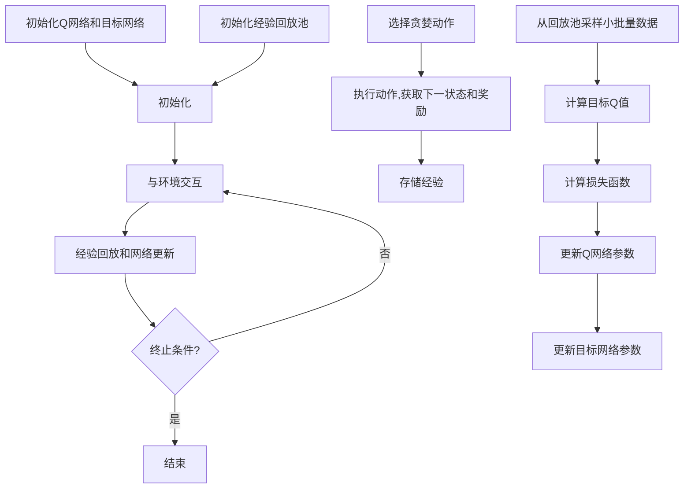

# 一切皆是映射：DQN算法的行业标准化：走向商业化应用

## 1.背景介绍

### 1.1 强化学习的兴起

在过去的几年里,人工智能领域经历了一场深度学习革命。在计算机视觉、自然语言处理等领域,深度学习取得了令人瞩目的成就。然而,在决策序列问题上,例如机器人控制、智能交通系统等,传统的深度学习方法往往表现不佳。这促使研究人员转向强化学习(Reinforcement Learning,RL)。

强化学习是一种基于环境交互的学习范式,其目标是通过试错来学习一系列行为,从而最大化预期的累积奖励。与监督学习不同,强化学习没有提供标签数据的教师,智能体需要自主探索环境并从经验中学习。

### 1.2 深度强化学习的崛起

尽管强化学习理论早已存在,但由于处理高维观测数据和连续动作空间的挑战,其在实际应用中一直受到限制。直到2013年,DeepMind提出的深度Q网络(Deep Q-Network,DQN)算法,将深度学习与Q-Learning相结合,成功解决了高维输入问题,在多种Atari游戏中展现出超人的表现,开启了深度强化学习的新纪元。

DQN算法的关键创新在于引入了深度神经网络来估计Q值函数,并采用经验回放和目标网络等技巧来提高训练稳定性。自此,深度强化学习在连续控制、多智能体系统、元学习等领域取得了长足进展,成为人工智能研究的热点方向之一。

## 2.核心概念与联系

### 2.1 马尔可夫决策过程

马尔可夫决策过程(Markov Decision Process,MDP)是强化学习的数学基础。MDP由一组状态S、一组动作A、状态转移概率P和奖励函数R组成。在每个时间步,智能体根据当前状态s选择动作a,然后环境转移到新状态s',同时返回奖励r。智能体的目标是学习一个策略π,使预期的累积奖励最大化。

形式上,MDP可以定义为一个五元组$(S, A, P, R, \gamma)$,其中:

- $S$是有限的状态集合
- $A$是有限的动作集合 
- $P(s'|s,a)$是状态转移概率,表示在状态$s$执行动作$a$后,转移到状态$s'$的概率
- $R(s,a,s')$是奖励函数,表示在状态$s$执行动作$a$后,转移到状态$s'$所获得的奖励
- $\gamma \in [0,1)$是折现因子,用于权衡当前奖励和未来奖励的重要性

MDP的核心目标是找到一个最优策略$\pi^*$,使得在任何初始状态$s_0$下,预期的累积折现奖励最大:

$$\pi^* = \arg\max_\pi \mathbb{E}_\pi \left[ \sum_{t=0}^\infty \gamma^t R(s_t, a_t, s_{t+1}) \right]$$

其中$s_t, a_t, s_{t+1}$分别表示时间步$t$的状态、动作和下一状态。

### 2.2 Q-Learning

Q-Learning是一种基于价值函数的强化学习算法,用于寻找MDP的最优策略。它定义了一个Q函数$Q(s,a)$,表示在状态$s$执行动作$a$后,可获得的预期累积奖励。根据Bellman方程,最优Q函数$Q^*(s,a)$满足:

$$Q^*(s,a) = \mathbb{E}_{s' \sim P(\cdot|s,a)} \left[ R(s,a,s') + \gamma \max_{a'} Q^*(s',a') \right]$$

我们可以通过迭代更新来近似求解$Q^*$:

$$Q(s,a) \leftarrow Q(s,a) + \alpha \left( R(s,a,s') + \gamma \max_{a'} Q(s',a') - Q(s,a) \right)$$

其中$\alpha$是学习率。在获得$Q^*$后,最优策略$\pi^*$可以简单地通过选择每个状态下Q值最大的动作来获得:

$$\pi^*(s) = \arg\max_a Q^*(s,a)$$

然而,在高维观测数据和连续动作空间的情况下,Q-Learning的表现往往不佳,这就需要借助深度神经网络来拟合Q函数。

### 2.3 深度Q网络(DQN)

深度Q网络(Deep Q-Network,DQN)是DeepMind于2013年提出的一种结合深度学习和Q-Learning的算法,用于解决高维输入的强化学习问题。DQN的核心思想是使用深度神经网络来近似Q函数,即$Q(s,a;\theta) \approx Q^*(s,a)$,其中$\theta$是网络参数。

为了提高训练稳定性,DQN引入了两个关键技术:

1. **经验回放(Experience Replay)**: 在训练过程中,智能体的经验$e_t=(s_t,a_t,r_t,s_{t+1})$被存储在经验回放池中。每次迭代时,从回放池中随机采样一个小批量数据进行训练,这种方式打破了数据间的相关性,提高了数据的利用效率。

2. **目标网络(Target Network)**: 除了要学习的Q网络之外,DQN还维护了一个目标网络,用于计算目标Q值。目标网络的参数$\theta^-$是Q网络参数$\theta$的拷贝,但是只会间隔一定步数进行更新,从而增加了目标值的稳定性。

具体地,在每个时间步,DQN根据当前状态$s_t$选择一个贪婪动作$a_t=\arg\max_a Q(s_t,a;\theta)$,并观察到下一状态$s_{t+1}$和奖励$r_t$。然后从经验回放池中采样一个小批量$(s_j,a_j,r_j,s_{j+1})$,并计算目标Q值:

$$y_j = \begin{cases} r_j &\text{if } s_{j+1} \text{ is terminal}\\ r_j + \gamma \max_{a'} Q(s_{j+1}, a';\theta^-) &\text{otherwise}\end{cases}$$

最后,通过最小化损失函数$L(\theta) = \mathbb{E}_{(s,a,r,s')\sim U(D)}\left[(y - Q(s,a;\theta))^2\right]$来更新Q网络的参数$\theta$,其中$U(D)$表示从经验回放池$D$中均匀采样。

DQN算法的伪代码如下:

```python
初始化Q网络参数θ和目标网络参数θ-
初始化经验回放池D
for episode in range(num_episodes):
    初始化环境,获取初始状态s
    while not terminated:
        选择贪婪动作a = argmax_a Q(s,a;θ)
        执行动作a,获取下一状态s'和奖励r
        将经验(s,a,r,s')存入D
        从D中采样小批量数据
        计算目标Q值y_j
        更新Q网络参数θ,最小化L(θ)
        每隔一定步数,将θ-更新为θ
        s = s'
```

通过上述技术,DQN算法成功解决了高维输入的问题,在多种Atari游戏中展现出超人的表现,开启了深度强化学习的新纪元。

## 3.核心算法原理具体操作步骤

DQN算法的核心原理可以概括为以下几个关键步骤:

### 3.1 初始化

1. 初始化Q网络和目标网络,两个网络的参数初始时相同。
2. 初始化经验回放池,用于存储智能体与环境的交互经验。

### 3.2 与环境交互

1. 根据当前状态$s_t$,使用Q网络选择贪婪动作$a_t = \arg\max_a Q(s_t, a;\theta)$。
2. 在环境中执行动作$a_t$,获得下一状态$s_{t+1}$和奖励$r_t$。
3. 将经验$(s_t, a_t, r_t, s_{t+1})$存入经验回放池。

### 3.3 经验回放和网络更新

1. 从经验回放池中随机采样一个小批量数据$(s_j, a_j, r_j, s_{j+1})$。
2. 计算目标Q值$y_j$:
   - 如果$s_{j+1}$是终止状态,则$y_j = r_j$。
   - 否则,使用目标网络计算$y_j = r_j + \gamma \max_{a'} Q(s_{j+1}, a';\theta^-)$。
3. 计算损失函数$L(\theta) = \mathbb{E}_{(s,a,r,s')\sim U(D)}\left[(y - Q(s,a;\theta))^2\right]$。
4. 使用优化算法(如随机梯度下降)更新Q网络参数$\theta$,最小化损失函数$L(\theta)$。
5. 每隔一定步数,将目标网络参数$\theta^-$更新为当前Q网络参数$\theta$的值。

### 3.4 算法流程图

下面是DQN算法的流程图,使用Mermaid语法绘制:



通过上述步骤,DQN算法可以有效地学习Q函数,从而找到最优策略来解决强化学习问题。

## 4.数学模型和公式详细讲解举例说明

在DQN算法中,涉及到了一些重要的数学模型和公式,下面我们将详细讲解并给出具体例子。

### 4.1 Bellman方程

Bellman方程是强化学习中的一个基本等式,它描述了最优Q函数$Q^*(s,a)$和最优价值函数$V^*(s)$之间的关系。对于任意状态$s$和动作$a$,Bellman方程为:

$$Q^*(s,a) = \mathbb{E}_{s' \sim P(\cdot|s,a)} \left[ R(s,a,s') + \gamma \max_{a'} Q^*(s',a') \right]$$
$$V^*(s) = \max_a Q^*(s,a)$$

其中:

- $Q^*(s,a)$表示在状态$s$执行动作$a$后,可获得的最大预期累积奖励。
- $V^*(s)$表示在状态$s$下,执行任何策略都无法获得比$V^*(s)$更高的预期累积奖励。
- $\gamma \in [0,1)$是折现因子,用于权衡当前奖励和未来奖励的重要性。

让我们通过一个简单的网格世界示例来理解Bellman方程。假设智能体位于一个3x3的网格世界中,目标是从起点(0,0)到达终点(2,2)。每一步移动都会获得-1的奖励,到达终点后获得+10的奖励。我们设置折现因子$\gamma=0.9$。

在状态(1,1)下,有四种可能的动作:上、下、左、右。根据Bellman方程,我们可以计算$Q^*(1,1,a)$:

- 上: $Q^*(1,1,\text{上}) = -1 + 0.9 \times \max\{Q^*(0,1,\cdot), Q^*(2,1,\cdot)\}$
- 下: $Q^*(1,1,\text{下}) = -1 + 0.9 \times \max\{Q^*(0,1,\cdot), Q^*(2,1,\cdot)\}$
- 左: $Q^*(1,1,\text{左}) = -1 + 0.9 \times \max\{Q^*(1,0,\cdot), Q^*(1,2,\cdot)\}$
- 右: $Q^*(1,1,\text{右}) = -1 + 0.9 \times 10 = 8$

显然,在状态(1,1)下,向右移动是最优策略,因为它可以直接到达终点,获得最大的预期累积奖励。