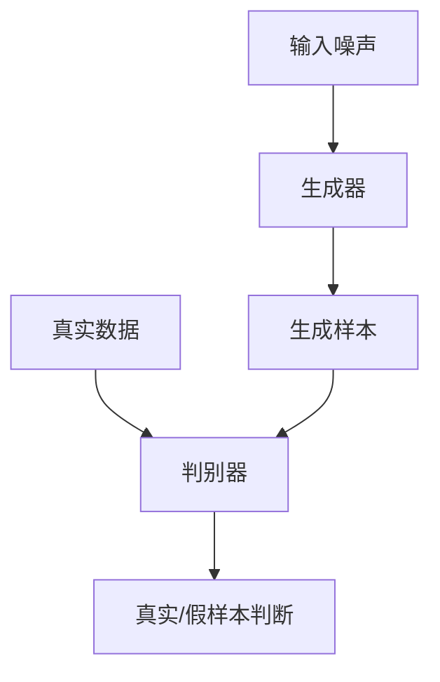

# 一切皆是映射：GAN在艺术创作中的应用实例

## 1.背景介绍

### 1.1 艺术与技术的融合

在当今时代，艺术和技术的融合已成为一种趋势。人工智能(AI)技术的飞速发展为艺术创作带来了新的可能性。其中,生成对抗网络(Generative Adversarial Networks,GAN)作为一种创新的深度学习架构,正在改变着艺术创作的方式。

### 1.2 GAN的兴起

GAN是一种由两个神经网络组成的生成模型,包括生成器(Generator)和判别器(Discriminator)。生成器旨在生成逼真的数据样本,而判别器则试图区分生成的样本和真实数据。通过这种对抗性训练,GAN可以学习数据的真实分布,并生成新的、逼真的样本。自2014年被提出以来,GAN已在图像、音频、视频等多个领域展现出巨大潜力。

### 1.3 GAN与艺术创作

艺术家一直在探索新的创作媒介和技术,以扩展艺术表现力。GAN为艺术家提供了一种全新的创作工具,可以生成独特的视觉图像、音乐作品等。通过调整GAN的训练数据和参数,艺术家可以控制生成结果的风格和特征,实现个性化的艺术创作。

## 2.核心概念与联系

### 2.1 生成对抗网络(GAN)

GAN由生成器(Generator)和判别器(Discriminator)两个神经网络组成。生成器的目标是生成逼真的数据样本,而判别器则试图区分生成的样本和真实数据。两个网络通过对抗性训练相互竞争,最终达到一种动态平衡,使生成器能够生成逼真的数据样本。



### 2.2 生成器(Generator)

生成器是GAN中的一个神经网络,其目标是从随机噪声中生成逼真的数据样本。生成器通过学习真实数据的分布,逐步优化自身参数,使生成的样本越来越逼真。

$$
G(z) = x_{fake}
$$

其中,$z$是随机噪声向量,$x_{fake}$是生成器生成的假样本。

### 2.3 判别器(Discriminator)

判别器是GAN中的另一个神经网络,其目标是区分真实数据和生成器生成的假样本。判别器通过学习真实数据和生成样本的差异,逐步优化自身参数,提高区分能力。

$$
D(x) = \begin{cases}
1, & \text{if $x$ is real data} \\
0, & \text{if $x$ is fake data}
\end{cases}
$$

其中,$x$是输入样本,$D(x)$是判别器输出的概率值,表示样本为真实数据的可能性。

### 2.4 对抗性训练

生成器和判别器通过对抗性训练相互竞争,推动彼此不断进步。生成器试图生成更加逼真的样本来欺骗判别器,而判别器则努力提高区分能力。这种对抗性训练过程可以表示为一个最小-最大博弈问题:

$$
\min_G \max_D V(D, G) = \mathbb{E}_{x \sim p_{data}(x)}[\log D(x)] + \mathbb{E}_{z \sim p_z(z)}[\log (1 - D(G(z)))]
$$

其中,$p_{data}(x)$是真实数据分布,$p_z(z)$是噪声向量的分布。

## 3.核心算法原理具体操作步骤

GAN的训练过程可以概括为以下步骤:

1. **初始化生成器和判别器**:使用随机权重初始化两个神经网络。

2. **加载训练数据**:准备用于训练的真实数据集。

3. **生成噪声向量**:从噪声分布(如高斯分布)中采样一批噪声向量。

4. **生成假样本**:将噪声向量输入生成器,生成一批假样本。

5. **训练判别器**:
   a. 将真实数据和生成的假样本输入判别器。
   b. 计算判别器对真实数据和假样本的判断结果。
   c. 计算判别器的损失函数(如二元交叉熵损失)。
   d. 反向传播,更新判别器的权重。

6. **训练生成器**:
   a. 将噪声向量输入生成器,生成一批假样本。
   b. 将假样本输入判别器,获取判别器的判断结果。
   c. 计算生成器的损失函数(如二元交叉熵损失,目标是使判别器将假样本判断为真实数据)。
   d. 反向传播,更新生成器的权重。

7. **重复步骤3-6**:重复训练生成器和判别器,直到达到满意的结果或达到最大迭代次数。

在训练过程中,生成器和判别器会不断对抗,相互推动对方进步。最终,生成器将能够生成逼真的样本,而判别器将无法有效区分真实数据和生成样本。

## 4.数学模型和公式详细讲解举例说明

### 4.1 生成器损失函数

生成器的目标是生成足够逼真的样本,以欺骗判别器。因此,生成器的损失函数可以定义为:

$$
\mathcal{L}_G = \mathbb{E}_{z \sim p_z(z)}[\log(1 - D(G(z)))]
$$

其中,$z$是从噪声分布$p_z(z)$采样的噪声向量,$G(z)$是生成器生成的假样本,$D(G(z))$是判别器对假样本的判断结果。生成器的目标是最小化这个损失函数,使判别器将生成的假样本判断为真实数据。

### 4.2 判别器损失函数

判别器的目标是正确区分真实数据和生成的假样本。因此,判别器的损失函数可以定义为:

$$
\mathcal{L}_D = -\mathbb{E}_{x \sim p_{data}(x)}[\log D(x)] - \mathbb{E}_{z \sim p_z(z)}[\log(1 - D(G(z)))]
$$

其中,$x$是真实数据样本,$p_{data}(x)$是真实数据分布,$z$是从噪声分布$p_z(z)$采样的噪声向量,$G(z)$是生成器生成的假样本。判别器的目标是最大化这个损失函数,即正确判断真实数据为真,假样本为假。

### 4.3 对抗性训练目标

综合生成器和判别器的损失函数,GAN的对抗性训练目标可以表示为:

$$
\min_G \max_D V(D, G) = \mathbb{E}_{x \sim p_{data}(x)}[\log D(x)] + \mathbb{E}_{z \sim p_z(z)}[\log (1 - D(G(z)))]
$$

这是一个最小-最大博弈问题,生成器$G$试图最小化$V(D, G)$,而判别器$D$试图最大化$V(D, G)$。通过这种对抗性训练,生成器和判别器相互竞争,推动彼此不断进步。

### 4.4 示例:生成手写数字

让我们以生成手写数字为例,说明GAN的工作原理。假设我们有一个包含手写数字图像的真实数据集$X$,我们希望训练一个GAN模型,能够生成新的、逼真的手写数字图像。

1. 初始化生成器$G$和判别器$D$,两者都是卷积神经网络。

2. 从噪声分布$p_z(z)$(如高斯分布)中采样一批噪声向量$z$。

3. 将噪声向量$z$输入生成器$G$,生成一批假样本$G(z)$,即生成的手写数字图像。

4. 从真实数据集$X$中采样一批真实手写数字图像$x$。

5. 将真实样本$x$和生成样本$G(z)$输入判别器$D$,获取判别器的判断结果$D(x)$和$D(G(z))$。

6. 计算判别器的损失函数:
   $$
   \mathcal{L}_D = -\mathbb{E}_{x \sim X}[\log D(x)] - \mathbb{E}_{z \sim p_z(z)}[\log(1 - D(G(z)))]
   $$
   反向传播,更新判别器$D$的权重。

7. 计算生成器的损失函数:
   $$
   \mathcal{L}_G = \mathbb{E}_{z \sim p_z(z)}[\log(1 - D(G(z)))]
   $$
   反向传播,更新生成器$G$的权重。

8. 重复步骤2-7,直到达到满意的结果或达到最大迭代次数。

通过这种对抗性训练,生成器$G$将逐步学习生成更加逼真的手写数字图像,而判别器$D$也将提高区分真实和生成样本的能力。最终,生成器$G$将能够生成难以区分的手写数字图像。

## 5.项目实践:代码实例和详细解释说明

在这一部分,我们将提供一个使用PyTorch实现的GAN项目示例,用于生成手写数字图像。

### 5.1 导入所需库

```python
import torch
import torch.nn as nn
import torchvision
import torchvision.transforms as transforms
import matplotlib.pyplot as plt
import numpy as np
```

### 5.2 加载数据集

我们将使用MNIST手写数字数据集进行训练。

```python
# 下载并加载MNIST数据集
transform = transforms.Compose([
    transforms.ToTensor(),
    transforms.Normalize((0.5,), (0.5,))
])

train_dataset = torchvision.datasets.MNIST(root='./data', train=True, download=True, transform=transform)
train_loader = torch.utils.data.DataLoader(train_dataset, batch_size=64, shuffle=True)
```

### 5.3 定义生成器

生成器是一个卷积神经网络,输入是一个噪声向量,输出是一个手写数字图像。

```python
class Generator(nn.Module):
    def __init__(self, latent_dim):
        super(Generator, self).__init__()
        self.latent_dim = latent_dim
        
        self.generator = nn.Sequential(
            nn.ConvTranspose2d(self.latent_dim, 512, 4, 1, 0, bias=False),
            nn.BatchNorm2d(512),
            nn.ReLU(True),
            nn.ConvTranspose2d(512, 256, 4, 2, 1, bias=False),
            nn.BatchNorm2d(256),
            nn.ReLU(True),
            nn.ConvTranspose2d(256, 128, 4, 2, 1, bias=False),
            nn.BatchNorm2d(128),
            nn.ReLU(True),
            nn.ConvTranspose2d(128, 1, 4, 2, 1, bias=False),
            nn.Tanh()
        )

    def forward(self, z):
        return self.generator(z.view(-1, self.latent_dim, 1, 1))
```

### 5.4 定义判别器

判别器是一个卷积神经网络,输入是一张图像,输出是一个标量值,表示图像是真实数据还是生成数据。

```python
class Discriminator(nn.Module):
    def __init__(self):
        super(Discriminator, self).__init__()
        
        self.discriminator = nn.Sequential(
            nn.Conv2d(1, 64, 4, 2, 1, bias=False),
            nn.LeakyReLU(0.2, inplace=True),
            nn.Conv2d(64, 128, 4, 2, 1, bias=False),
            nn.BatchNorm2d(128),
            nn.LeakyReLU(0.2, inplace=True),
            nn.Conv2d(128, 256, 4, 2, 1, bias=False),
            nn.BatchNorm2d(256),
            nn.LeakyReLU(0.2, inplace=True),
            nn.Conv2d(256, 512, 4, 2, 1, bias=False),
            nn.BatchNorm2d(512),
            nn.LeakyReLU(0.2, inplace=True),
            nn.Conv2d(512, 1, 4, 1, 0, bias=False),
            nn.Sigmoid()
        )

    def forward(self, x):
        return self.discriminator(x).view(-1, 1).squeeze(1)
```

### 5.5 定义损失函数和优化器

我们使用二元交叉熵损失函数,并使用Adam优化器进行优化。

```python
# 损失函数
criterion = nn.BCELoss()

# 初始化生成器和判别器
latent_dim = 100
generator = Generator(latent