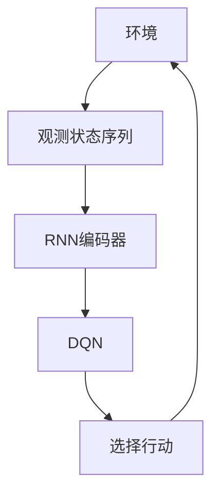
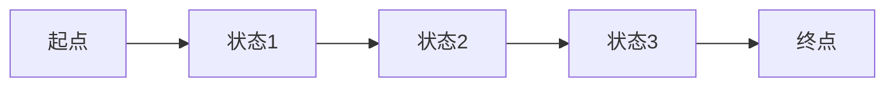

# 一切皆是映射：RNN与DQN的结合：处理序列决策问题的新方法

## 1. 背景介绍

### 1.1 序列决策问题的挑战

在现实世界中,我们经常会遇到需要基于历史信息做出一系列决策的情况。例如,在玩游戏时,我们需要根据游戏的当前状态和之前的行动来决定下一步的行动;在机器人控制中,我们需要根据传感器的读数和之前的行动来决定机器人的下一步动作。这些都属于序列决策问题(Sequential Decision Making Problems)的范畴。

序列决策问题具有以下几个关键特征:

1. **序列性**: 决策是基于之前的状态和行动序列做出的,而不是孤立的单一时刻。
2. **延迟奖励**: 当前行动的好坏往往需要经过一段时间后才能体现出来,这与传统的监督学习任务不同。
3. **非平稳环境**: 环境的状态会随着时间的推移而发生变化,决策需要对这种变化做出相应的调整。

### 1.2 传统方法的局限性

传统的序列决策方法主要有两大类:基于规则的方法和基于动态规划的方法。

- **基于规则的方法**: 依赖专家知识手工设计一系列规则,根据当前状态匹配相应的规则来做出决策。这种方法的缺点是缺乏通用性,难以应对复杂动态环境。
- **基于动态规划的方法**: 包括马尔可夫决策过程(MDP)和部分可观测马尔可夫决策过程(POMDP)等。这些方法需要事先建模环境的转移概率和奖励函数,并通过价值迭代或策略迭代算法求解最优策略。但是对于大规模复杂问题,建模和求解往往是不可行的。

近年来,benefited from 受益于强大的计算能力和大量数据的驱动,基于深度学习的方法在序列决策领域取得了长足的进展,展现出了巨大的潜力。

## 2. 核心概念与联系

### 2.1 递归神经网络(RNN)

递归神经网络(Recurrent Neural Network, RNN)是一种处理序列数据的有力工具。不同于前馈神经网络,RNN在隐藏层之间建立了循环连接,使得网络具有"记忆"能力,能够很好地捕捉序列数据中的长期依赖关系。

在序列决策问题中,我们可以使用RNN来建模状态和行动的序列,并预测下一个状态或行动。然而,传统的RNN在捕捉长期依赖关系方面存在一定的困难,容易出现梯度消失或梯度爆炸的问题。为了解决这一问题,出现了长短期记忆网络(LSTM)和门控循环单元(GRU)等改进的RNN变体。

### 2.2 深度Q网络(DQN)

深度Q网络(Deep Q-Network, DQN)是深度强化学习领域的一个里程碑式的工作。DQN将传统的Q学习算法与深度神经网络相结合,使得智能体能够直接从原始的高维状态空间(如视频游戏画面)中学习出最优策略,而无需人工设计特征。

DQN的核心思想是使用一个深度神经网络来近似Q函数,也就是在给定状态下,每个行动所对应的长期累计奖励的期望值。通过不断地与环境交互并更新网络参数,DQN能够逐步学习到一个近似最优的Q函数,并据此选择最优行动。

### 2.3 RNN与DQN的结合

虽然DQN在处理单步决策问题上取得了巨大的成功,但它无法直接应用于序列决策问题。这是因为DQN的输入只是当前时刻的状态,而没有考虑历史信息。为了解决这一问题,我们可以将RNN与DQN相结合,利用RNN来编码状态和行动的序列,然后将RNN的输出作为DQN的输入,从而使DQN能够基于整个序列做出决策。

这种RNN-DQN的结合方法,不仅能够处理序列决策问题,而且还能够利用DQN的优势来解决RNN在训练过程中的不稳定性问题。通过经验回放(Experience Replay)和目标网络(Target Network)等技术,DQN能够大大提高训练的稳定性和样本利用效率。

## 3. 核心算法原理具体操作步骤

### 3.1 算法框架

RNN-DQN算法的整体框架如下所示:

1. 从环境中观测到一个状态序列
2. 使用RNN编码器对状态序列进行编码,得到一个向量表示
3. 将RNN编码器的输出作为DQN的输入
4. DQN输出每个行动对应的Q值
5. 根据Q值选择行动,并将行动执行在环境中
6. 观测到新的状态序列,循环执行以上步骤

### 3.2 RNN编码器

RNN编码器的作用是将状态序列 $s_1, s_2, \ldots, s_t$ 映射到一个固定长度的向量表示 $h_t$,该向量编码了序列中的重要信息。常用的RNN编码器包括LSTM和GRU等。

对于LSTM,在时刻 $t$ 时,其隐藏状态 $h_t$ 的计算公式为:

$$
\begin{aligned}
f_t &= \sigma(W_f[h_{t-1}, s_t] + b_f) \\
i_t &= \sigma(W_i[h_{t-1}, s_t] + b_i) \\
o_t &= \sigma(W_o[h_{t-1}, s_t] + b_o) \\
\tilde{c}_t &= \tanh(W_c[h_{t-1}, s_t] + b_c) \\
c_t &= f_t \odot c_{t-1} + i_t \odot \tilde{c}_t \\
h_t &= o_t \odot \tanh(c_t)
\end{aligned}
$$

其中 $f_t, i_t, o_t$ 分别表示遗忘门、输入门和输出门,用于控制信息的流动。$c_t$ 是细胞状态,编码了长期信息。

对于GRU,其隐藏状态 $h_t$ 的计算公式为:

$$
\begin{aligned}
r_t &= \sigma(W_r[h_{t-1}, s_t]) \\
z_t &= \sigma(W_z[h_{t-1}, s_t]) \\
\tilde{h}_t &= \tanh(W_h[r_t \odot h_{t-1}, s_t]) \\
h_t &= (1 - z_t) \odot h_{t-1} + z_t \odot \tilde{h}_t
\end{aligned}
$$

其中 $r_t$ 是重置门,用于控制历史信息的遗忘程度;$z_t$ 是更新门,用于控制新信息的引入程度。

### 3.3 DQN

DQN的核心是一个深度神经网络,用于近似Q函数 $Q(s, a; \theta)$,其中 $s$ 表示状态, $a$ 表示行动, $\theta$ 是网络参数。

在RNN-DQN算法中,DQN的输入是RNN编码器的输出 $h_t$,因此Q函数可以表示为 $Q(h_t, a; \theta)$。

为了训练DQN,我们需要最小化以下损失函数:

$$
L(\theta) = \mathbb{E}_{(s_t, a_t, r_t, s_{t+1}) \sim D}\left[(y_t^{Q} - Q(h_t, a_t; \theta))^2\right]
$$

其中 $D$ 是经验回放池,用于存储过去的转移样本 $(s_t, a_t, r_t, s_{t+1})$。$y_t^Q$ 是目标Q值,定义为:

$$
y_t^Q = r_t + \gamma \max_{a'} Q(h_{t+1}, a'; \theta^-)
$$

其中 $\gamma$ 是折现因子,用于权衡即时奖励和长期奖励的重要性;$\theta^-$ 是目标网络的参数,用于增加训练的稳定性。

在训练过程中,我们不断地从经验回放池中采样小批量的转移样本,计算损失函数,并使用优化算法(如随机梯度下降)更新网络参数 $\theta$。

### 3.4 探索与利用的平衡

在序列决策问题中,我们需要权衡探索(Exploration)和利用(Exploitation)之间的平衡。探索是指选择一些看似次优但未被充分探索的行动,以发现潜在的更优策略;利用是指选择当前已知的最优行动,以获得最大的即时奖励。

常用的探索策略包括 $\epsilon$-greedy 和 Boltzmann 探索等。在 $\epsilon$-greedy 策略中,我们以概率 $\epsilon$ 随机选择一个行动(探索),以概率 $1-\epsilon$ 选择当前最优行动(利用)。随着训练的进行,我们会逐渐降低 $\epsilon$ 的值,以增加利用的比重。

## 4. 数学模型和公式详细讲解举例说明

在上一节中,我们介绍了RNN-DQN算法的核心原理和公式。现在,我们将通过一个具体的例子,进一步解释和说明这些公式在实际应用中的含义。

### 4.1 示例:玩具环境

假设我们有一个简单的玩具环境,如下图所示:

在这个环境中,智能体从起点开始,可以选择向前移动或者原地不动。每移动一步,智能体会获得一定的奖励(正值或负值)。当到达终点时,一个回合结束。

我们的目标是训练一个RNN-DQN智能体,使其能够学习到一个最优策略,即在每个状态下选择能够获得最大累计奖励的行动序列。

### 4.2 RNN编码器示例

假设在时刻 $t$,智能体观测到的状态序列为 $s_1, s_2, \ldots, s_t$,其中每个 $s_i$ 是一个one-hot向量,表示当前所处的状态。我们使用一个LSTM作为RNN编码器,将这个状态序列映射到一个固定长度的向量表示 $h_t$。

具体来说,对于每个时刻 $i$,LSTM的计算过程如下:

$$
\begin{aligned}
f_i &= \sigma(W_f[h_{i-1}, s_i] + b_f) \\
i_i &= \sigma(W_i[h_{i-1}, s_i] + b_i) \\
o_i &= \sigma(W_o[h_{i-1}, s_i] + b_o) \\
\tilde{c}_i &= \tanh(W_c[h_{i-1}, s_i] + b_c) \\
c_i &= f_i \odot c_{i-1} + i_i \odot \tilde{c}_i \\
h_i &= o_i \odot \tanh(c_i)
\end{aligned}
$$

其中 $W_f, W_i, W_o, W_c$ 是LSTM的权重矩阵,需要通过训练来学习;$b_f, b_i, b_o, b_c$ 是偏置向量;$\sigma$ 是sigmoid激活函数;$\odot$ 表示元素wise乘积。

在时刻 $t$,我们得到了LSTM的最终输出 $h_t$,它编码了从起点到当前状态的整个状态序列信息。接下来,我们将 $h_t$ 作为DQN的输入,用于预测每个行动的Q值。

### 4.3 DQN示例

假设在当前状态下,智能体有两个可选行动:移动(move)和不动(stay)。我们使用一个简单的全连接神经网络作为DQN,其输入是RNN编码器的输出 $h_t$,输出是两个Q值 $Q(h_t, \text{move}; \theta)$ 和 $Q(h_t, \text{stay}; \theta)$,分别表示移动和不动行动在当前状态下的预期累计奖励。

具体来说,DQN的计算过程如下:

$$
\begin{aligned}
z &= W_2 \cdot \text{ReLU}(W_1 h_t + b_1) + b_2 \\
Q