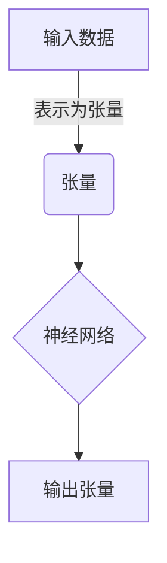

# 一切皆是映射：TensorFlow 和 PyTorch 实战对比

## 1. 背景介绍

### 1.1 深度学习的兴起

近年来，深度学习在各个领域取得了令人瞩目的成就，从计算机视觉、自然语言处理到推荐系统等。这些成就的背后，离不开强大的深度学习框架的支持。TensorFlow 和 PyTorch 作为两大主流深度学习框架，为研究人员和工程师提供了高效的工具来构建、训练和部署深度神经网络模型。

### 1.2 TensorFlow 和 PyTorch 简介

TensorFlow 是由 Google 开发的开源深度学习框架，它具有强大的计算能力和灵活的架构设计。TensorFlow 采用静态计算图的方式构建模型,并提供了丰富的工具和库,支持在多种平台上部署模型。

PyTorch 则由 Facebook 人工智能研究院(FAIR)开发,它采用动态计算图的方式构建模型,具有更加直观和灵活的编程范式。PyTorch 的设计理念是"高效可复现的研究平台",因此它在研究领域备受青睐。

### 1.3 映射的概念

在深度学习中,我们经常会将输入数据映射到输出空间。这个映射过程就是神经网络的本质,无论是卷积神经网络(CNN)、递归神经网络(RNN)还是其他类型的网络,它们都在学习一种从输入到输出的映射关系。因此,理解和掌握这种映射过程,对于深入理解深度学习模型至关重要。

## 2. 核心概念与联系

### 2.1 张量(Tensor)

张量是 TensorFlow 和 PyTorch 中的核心数据结构,它可以看作是一个多维数组。在深度学习中,我们通常会将输入数据(如图像、文本等)表示为张量,然后通过神经网络对这些张量进行变换和映射。



### 2.2 计算图

计算图是 TensorFlow 和 PyTorch 中表示计算过程的数据结构。它由一系列节点(代表张量)和边(代表操作)组成,描述了从输入到输出的计算流程。

TensorFlow 采用静态计算图,意味着在执行计算之前,需要先构建完整的计算图。而 PyTorch 采用动态计算图,可以在运行时动态构建和修改计算图。


### 2.3 自动微分

自动微分是深度学习框架中一个非常重要的功能,它可以自动计算出目标函数相对于模型参数的梯度,从而支持基于梯度的优化算法(如梯度下降)。TensorFlow 和 PyTorch 都提供了自动微分功能,但实现方式不同。

TensorFlow 采用的是符号微分,而 PyTorch 则使用反向自动微分。两者在计算效率和内存使用上有一些差异,但都能够有效地支持深度神经网络的训练。

### 2.4 模型构建

TensorFlow 和 PyTorch 在模型构建方式上也有所不同。TensorFlow 更倾向于通过组合低级别的操作来构建模型,而 PyTorch 则提供了更高级别的模块化接口,使得模型构建过程更加直观和灵活。

## 3. 核心算法原理具体操作步骤

### 3.1 TensorFlow 中的模型构建

在 TensorFlow 中,我们需要先定义计算图,然后再执行计算。以下是一个简单的示例,展示了如何构建一个线性回归模型:

1. 导入所需的模块:

```python
import tensorflow as tf
```

2. 定义输入张量和模型参数:

```python
X = tf.placeholder(tf.float32, shape=[None, 1])
Y = tf.placeholder(tf.float32, shape=[None, 1])
W = tf.Variable(tf.random_normal([1]), name='weight')
b = tf.Variable(tf.random_normal([1]), name='bias')
```

3. 定义模型输出和损失函数:

```python
y_pred = tf.add(tf.multiply(X, W), b)
loss = tf.reduce_mean(tf.square(Y - y_pred))
```

4. 定义优化器和训练操作:

```python
optimizer = tf.train.GradientDescentOptimizer(learning_rate=0.01)
train_op = optimizer.minimize(loss)
```

5. 初始化变量和启动会话:

```python
init = tf.global_variables_initializer()
with tf.Session() as sess:
    sess.run(init)
    # 训练循环...
```

在上面的示例中,我们首先定义了输入张量 `X` 和 `Y`、模型参数 `W` 和 `b`。然后,我们构建了线性回归模型的输出 `y_pred` 和损失函数 `loss`。接下来,我们定义了优化器和训练操作 `train_op`。最后,我们初始化变量并启动会话,在会话中执行训练循环。

### 3.2 PyTorch 中的模型构建

在 PyTorch 中,我们可以使用更加直观和面向对象的方式来构建模型。以下是一个线性回归模型的示例:

1. 导入所需的模块:

```python
import torch
import torch.nn as nn
```

2. 定义模型:

```python
class LinearRegression(nn.Module):
    def __init__(self, input_size):
        super(LinearRegression, self).__init__()
        self.linear = nn.Linear(input_size, 1)

    def forward(self, x):
        out = self.linear(x)
        return out
```

3. 实例化模型,定义损失函数和优化器:

```python
input_size = 1
model = LinearRegression(input_size)
criterion = nn.MSELoss()
optimizer = torch.optim.SGD(model.parameters(), lr=0.01)
```

4. 训练循环:

```python
for epoch in range(num_epochs):
    inputs = torch.from_numpy(X)
    targets = torch.from_numpy(Y)

    optimizer.zero_grad()
    outputs = model(inputs)
    loss = criterion(outputs, targets)
    loss.backward()
    optimizer.step()
```

在上面的示例中,我们首先定义了一个继承自 `nn.Module` 的线性回归模型类 `LinearRegression`。在这个类中,我们定义了模型的结构(`__init__`)和前向传播过程(`forward`)。

接下来,我们实例化模型,并定义损失函数(`nn.MSELoss`)和优化器(`torch.optim.SGD`)。在训练循环中,我们将输入数据转换为 PyTorch 张量,计算模型输出和损失,然后执行反向传播和参数更新。

### 3.3 自动微分

自动微分是深度学习框架中一个非常重要的功能,它可以自动计算出目标函数相对于模型参数的梯度,从而支持基于梯度的优化算法。

在 TensorFlow 中,我们可以使用 `tf.GradientTape` 来记录计算过程,并自动计算梯度:

```python
with tf.GradientTape() as tape:
    y_pred = model(X)
    loss = loss_fn(y_pred, Y)

gradients = tape.gradient(loss, model.trainable_variables)
optimizer.apply_gradients(zip(gradients, model.trainable_variables))
```

在 PyTorch 中,我们可以使用 `torch.autograd` 模块来实现自动微分。PyTorch 采用动态计算图的方式,可以在运行时自动构建计算图并计算梯度:

```python
outputs = model(inputs)
loss = criterion(outputs, targets)
loss.backward()
optimizer.step()
```

在上面的代码中,我们首先计算模型输出和损失,然后调用 `loss.backward()` 来执行反向传播,计算梯度。最后,我们调用优化器的 `step()` 方法来更新模型参数。

## 4. 数学模型和公式详细讲解举例说明

在深度学习中,我们经常会遇到各种数学模型和公式。以下是一些常见的数学模型和公式,以及它们在 TensorFlow 和 PyTorch 中的实现方式。

### 4.1 线性回归

线性回归是一种基础的机器学习模型,它试图找到一个最佳拟合的直线,使得输入数据和输出数据之间的误差最小化。线性回归模型可以表示为:

$$y = Wx + b$$

其中 $y$ 是预测值, $x$ 是输入数据, $W$ 是权重矩阵, $b$ 是偏置项。

在 TensorFlow 中,我们可以使用 `tf.matmul` 和 `tf.add` 操作来实现线性回归:

```python
y_pred = tf.add(tf.matmul(X, W), b)
```

在 PyTorch 中,我们可以使用 `torch.mm` 和 `torch.add` 函数:

```python
y_pred = torch.mm(X, W.t()) + b
```

### 4.2 逻辑回归

逻辑回归是一种用于二分类问题的模型,它将输入数据映射到 0 到 1 之间的概率值,表示输入数据属于某个类别的概率。逻辑回归模型可以表示为:

$$p = \sigma(Wx + b)$$

其中 $p$ 是预测概率, $\sigma$ 是sigmoid函数, $W$ 是权重矩阵, $b$ 是偏置项。

在 TensorFlow 中,我们可以使用 `tf.sigmoid` 函数来实现sigmoid激活函数:

```python
logits = tf.matmul(X, W) + b
p = tf.sigmoid(logits)
```

在 PyTorch 中,我们可以使用 `torch.sigmoid` 函数:

```python
logits = torch.mm(X, W.t()) + b
p = torch.sigmoid(logits)
```

### 4.3 softmax回归

softmax回归是一种用于多分类问题的模型,它将输入数据映射到多个类别的概率分布。softmax回归模型可以表示为:

$$p_i = \frac{e^{z_i}}{\sum_{j=1}^{K}e^{z_j}}$$

其中 $p_i$ 是输入数据属于第 $i$ 类的概率, $z_i$ 是第 $i$ 类的线性分数, $K$ 是类别数。

在 TensorFlow 中,我们可以使用 `tf.nn.softmax` 函数来实现softmax激活函数:

```python
logits = tf.matmul(X, W) + b
p = tf.nn.softmax(logits)
```

在 PyTorch 中,我们可以使用 `torch.softmax` 函数:

```python
logits = torch.mm(X, W.t()) + b
p = torch.softmax(logits, dim=1)
```

### 4.4 交叉熵损失函数

交叉熵损失函数是一种常用的损失函数,它可以衡量预测概率分布与真实标签之间的差异。对于二分类问题,交叉熵损失函数可以表示为:

$$\text{loss} = -\frac{1}{N}\sum_{i=1}^{N}[y_i\log(p_i) + (1-y_i)\log(1-p_i)]$$

其中 $N$ 是样本数, $y_i$ 是第 $i$ 个样本的真实标签(0或1), $p_i$ 是第 $i$ 个样本预测为正类的概率。

在 TensorFlow 中,我们可以使用 `tf.nn.sigmoid_cross_entropy_with_logits` 函数来计算二分类交叉熵损失:

```python
logits = tf.matmul(X, W) + b
loss = tf.reduce_mean(tf.nn.sigmoid_cross_entropy_with_logits(logits=logits, labels=Y))
```

在 PyTorch 中,我们可以使用 `torch.nn.BCELoss` 函数:

```python
logits = torch.mm(X, W.t()) + b
criterion = torch.nn.BCELoss()
loss = criterion(torch.sigmoid(logits), Y)
```

对于多分类问题,交叉熵损失函数可以表示为:

$$\text{loss} = -\frac{1}{N}\sum_{i=1}^{N}\sum_{j=1}^{K}y_{ij}\log(p_{ij})$$

其中 $K$ 是类别数, $y_{ij}$ 是第 $i$ 个样本属于第 $j$ 类的真实标签(0或1), $p_{ij}$ 是第 $i$ 个样本预测为第 $j$ 类的概率。

在 TensorFlow 中,我们可以使用 `tf.nn.softmax_cross_entropy_with_logits` 函数来计算多分类交叉熵损失:

```python
logits = tf.matmul(X, W) + b
loss = tf.reduce_mean(tf.nn.softmax_cross_entropy_with_logits(log