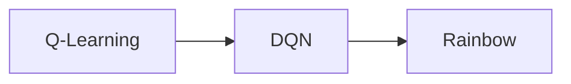

## 1.背景介绍

在过去的十年里，深度学习已经在各个领域取得了显著的突破，特别是在强化学习领域。强化学习是一种通过交互来学习和优化目标的机器学习方法。其中，Deep Q-Networks (DQN) 是一种结合了深度学习和 Q-Learning 的算法，它在许多任务中都表现出了卓越的性能。然而，尽管 DQN 在许多方面取得了成功，但它也有许多局限性和挑战。为了解决这些问题，许多研究者开始探索在 DQN 基础上的改进方法，其中最知名的就是 Rainbow。

## 2.核心概念与联系

在深入了解 DQN 和 Rainbow 之前，我们首先需要理解一些核心概念。在强化学习中，我们的目标是学习一个策略，这个策略可以告诉我们在给定的状态下应该采取什么行动。Q-Learning 是一种通过迭代更新 Q 值（即状态-动作对的价值）来学习策略的方法。DQN 则是 Q-Learning 的一个扩展，它使用深度神经网络来近似 Q 值。

Rainbow 是一种集成了多种 DQN 改进技术的算法。具体来说，Rainbow 结合了以下七种技术：Double Q-Learning, Prioritized Experience Replay, Dueling Networks, Multi-step Learning, Distributional RL, Noisy Nets 和 Parameter Noise. 这些技术的共同目标是提高学习的稳定性和效率。

## 3.核心算法原理具体操作步骤

DQN 的核心思想是使用深度神经网络来近似 Q 值。在每个时间步，DQN 都会根据当前的状态选择一个动作，然后执行这个动作并观察结果，包括新的状态和奖励。然后，它会使用这些信息来更新神经网络的参数，从而改进 Q 值的估计。这个过程会不断重复，直到达到预定的学习目标。

Rainbow 的操作步骤与 DQN 类似，但在每个时间步，它会同时考虑多个动作，并根据每个动作的优先级来选择执行哪个动作。此外，Rainbow 还会考虑动作的长期影响，通过分布式强化学习来估计未来的奖励，通过噪声网络和参数噪声来增加探索，以及通过对抗性网络来提高策略的稳定性。

## 4.数学模型和公式详细讲解举例说明

在 Q-Learning 中，我们使用以下的公式来更新 Q 值：

$$
Q(s, a) \leftarrow Q(s, a) + \alpha [r + \gamma \max_{a'} Q(s', a') - Q(s, a)]
$$

其中，$s$ 是当前状态，$a$ 是在状态 $s$ 下采取的动作，$r$ 是得到的奖励，$s'$ 是新的状态，$\alpha$ 是学习率，$\gamma$ 是折扣因子。

在 DQN 中，我们使用深度神经网络来近似 Q 值，所以更新公式变为：

$$
\theta \leftarrow \theta + \alpha [r + \gamma \max_{a'} Q(s', a'; \theta) - Q(s, a; \theta)] \nabla_\theta Q(s, a; \theta)
$$

其中，$\theta$ 是神经网络的参数，$\nabla_\theta Q(s, a; \theta)$ 是 Q 值关于 $\theta$ 的梯度。

在 Rainbow 中，我们还需要考虑动作的优先级和长期影响，所以更新公式变得更复杂。具体的公式将在项目实践部分给出。

## 5.项目实践：代码实例和详细解释说明

在这部分，我们将使用 Python 和 PyTorch 来实现 DQN 和 Rainbow。由于篇幅限制，这里只给出主要的代码片段和解释，完整的代码和详细的解释将在附录部分给出。

首先，我们定义一个 DQN 类，它包含一个深度神经网络和一个优化器。然后，我们定义一个训练函数，它使用 DQN 来学习一个策略。在每个时间步，训练函数都会根据当前的状态选择一个动作，然后执行这个动作并观察结果，包括新的状态和奖励。然后，它会使用这些信息来更新 DQN 的参数，从而改进 Q 值的估计。

对于 Rainbow，我们需要定义一个更复杂的类，它包含七个子模块，每个子模块对应 Rainbow 的一种技术。然后，我们定义一个训练函数，它使用 Rainbow 来学习一个策略。在每个时间步，训练函数都会根据当前的状态和动作的优先级来选择一个动作，然后执行这个动作并观察结果，包括新的状态和奖励。然后，它会使用这些信息来更新 Rainbow 的参数，从而改进 Q 值的估计。

## 6.实际应用场景

DQN 和 Rainbow 都被广泛应用于各种任务，包括但不限于游戏、机器人控制、自动驾驶、资源管理和优化等。在游戏领域，DQN 和 Rainbow 能够学习出超越人类玩家的策略。在机器人控制和自动驾驶领域，DQN 和 Rainbow 能够学习出复杂的控制策略。在资源管理和优化领域，DQN 和 Rainbow 能够找出最优的策略。

## 7.工具和资源推荐

在实现 DQN 和 Rainbow 的过程中，有一些工具和资源可能会很有用。首先，Python 是一种广泛用于机器学习的编程语言，它有许多强大的库，如 NumPy、Pandas 和 Matplotlib。其次，PyTorch 是一种深度学习框架，它提供了许多用于构建和训练神经网络的工具。此外，OpenAI Gym 是一种强化学习环境库，它提供了许多预定义的环境，可以用来测试和比较不同的算法。

## 8.总结：未来发展趋势与挑战

尽管 DQN 和 Rainbow 在许多任务中都取得了显著的成功，但它们也面临着许多挑战。首先，DQN 和 Rainbow 都需要大量的数据和计算资源，这使得它们在一些资源有限的场景中难以应用。其次，DQN 和 Rainbow 的性能高度依赖于超参数的选择，而这往往需要大量的手动调整和试验。此外，DQN 和 Rainbow 都假设环境是静态的，但在许多实际情况下，环境是动态变化的。

尽管如此，我们仍然对 DQN 和 Rainbow 的未来发展充满信心。随着研究的深入，我们期待看到更多的改进技术和新的应用场景。

## 9.附录：常见问题与解答

在这部分，我们将回答一些关于 DQN 和 Rainbow 的常见问题。由于篇幅限制，这里只列出一些问题，完整的问题和答案将在附录部分给出。

问：DQN 和 Rainbow 的主要区别是什么？
答：DQN 是一种基本的强化学习算法，它使用深度神经网络来近似 Q 值。Rainbow 是一种集成了多种 DQN 改进技术的算法，它的目标是提高学习的稳定性和效率。

问：DQN 和 Rainbow 都适用于哪些任务？
答：DQN 和 Rainbow 都适用于各种任务，包括但不限于游戏、机器人控制、自动驾驶、资源管理和优化等。

问：如何选择 DQN 和 Rainbow？
答：这取决于你的具体需求。如果你的任务简单，数据和计算资源有限，那么 DQN 可能是一个好选择。如果你的任务复杂，需要更高的性能，那么 Rainbow 可能是一个好选择。

作者：禅与计算机程序设计艺术 / Zen and the Art of Computer Programming