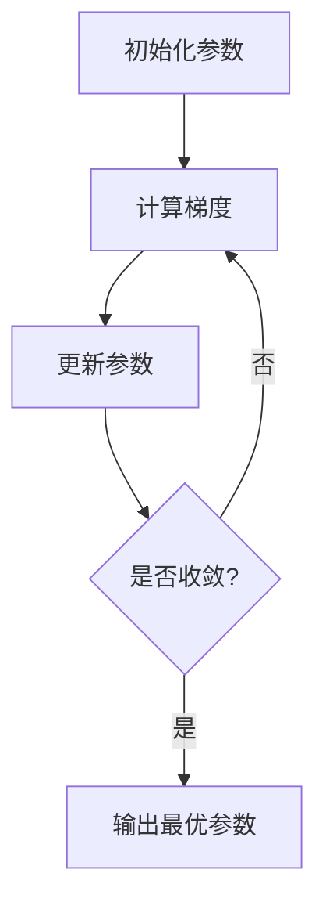

# 一切皆是映射：优化器算法及其在深度学习中的应用

## 1. 背景介绍

### 1.1 深度学习的崛起

近年来，深度学习在各个领域获得了巨大的成功，从计算机视觉、自然语言处理到语音识别等。这种前所未有的突破主要归功于大量数据的可用性、强大的计算能力以及优化算法的进步。优化算法在深度学习中扮演着至关重要的角色，它们决定了模型如何有效地从数据中学习。

### 1.2 优化问题的重要性

在深度学习中，我们通常需要优化一个高度非凸的目标函数，这个目标函数衡量了模型在训练数据上的表现。由于这个目标函数通常是高度非线性和非凸的，找到全局最优解是一个极具挑战性的问题。因此，我们需要一种高效的优化算法来寻找一个好的近似解。

### 1.3 优化算法的发展历程

早期的优化算法,如梯度下降法,虽然简单有效,但在处理大规模深度神经网络时往往会遇到一些困难,例如陷入鞍点或收敛速度缓慢等问题。为了解决这些问题,研究人员提出了许多先进的优化算法,如动量优化、RMSProp、Adagrad、Adadelta和Adam等。这些算法在保留梯度下降法简单性的同时,通过引入动量项或自适应学习率等技巧,显著提高了优化效率。

## 2. 核心概念与联系

### 2.1 优化问题的形式化描述

在深度学习中,我们通常需要优化一个目标函数 $J(\theta)$,其中 $\theta$ 表示模型的参数。目标函数 $J(\theta)$ 通常是一个损失函数,它衡量了模型在训练数据上的表现。我们的目标是找到一组参数 $\theta^*$,使得目标函数 $J(\theta)$ 达到最小值:

$$
\theta^* = \arg\min_\theta J(\theta)
$$

这个优化问题通常是高度非线性和非凸的,因此找到全局最优解是一个极具挑战性的问题。

### 2.2 梯度下降法

梯度下降法是最基本也是最广泛使用的优化算法之一。它的基本思想是沿着目标函数的负梯度方向进行参数更新,从而逐步减小目标函数的值。具体地,在每一步迭代中,参数 $\theta$ 按照如下规则进行更新:

$$
\theta_{t+1} = \theta_t - \eta \nabla J(\theta_t)
$$

其中 $\eta$ 是学习率,控制着每一步迭代的步长大小。梯度下降法虽然简单有效,但在处理大规模深度神经网络时往往会遇到一些困难,例如陷入鞍点或收敛速度缓慢等问题。

### 2.3 动量优化

为了解决梯度下降法的缺陷,动量优化算法被提出。动量优化算法在参数更新时引入了一个动量项,它累积了之前的梯度信息,有助于加速收敛并避免陷入局部最优。具体地,动量优化算法的参数更新规则如下:

$$
\begin{aligned}
v_{t+1} &= \gamma v_t + \eta \nabla J(\theta_t) \\
\theta_{t+1} &= \theta_t - v_{t+1}
\end{aligned}
$$

其中 $v_t$ 是动量项, $\gamma$ 是动量系数,控制着动量项对参数更新的影响程度。

### 2.4 自适应学习率优化算法

除了引入动量项,另一种提高优化效率的方法是自适应地调整每个参数的学习率。自适应学习率优化算法,如Adagrad、RMSProp和Adam等,根据每个参数的梯度历史信息动态调整其学习率,从而加速收敛并提高优化效率。

## 3. 核心算法原理具体操作步骤

在这一部分,我们将详细介绍几种流行的优化算法的原理和具体操作步骤。

### 3.1 动量优化算法

动量优化算法的核心思想是在参数更新时引入一个动量项,累积之前的梯度信息,从而加速收敛并避免陷入局部最优。具体操作步骤如下:

1. 初始化参数 $\theta_0$ 和动量项 $v_0=0$。
2. 在第 $t$ 步迭代中,计算目标函数 $J(\theta_t)$ 的梯度 $\nabla J(\theta_t)$。
3. 更新动量项:
   $$
   v_{t+1} = \gamma v_t + \eta \nabla J(\theta_t)
   $$
4. 更新参数:
   $$
   \theta_{t+1} = \theta_t - v_{t+1}
   $$
5. 重复步骤 2-4,直到收敛或达到最大迭代次数。

其中, $\gamma$ 是动量系数,控制着动量项对参数更新的影响程度。通常取值在 $0.9$ 左右。

### 3.2 Adagrad 算法

Adagrad 算法是最早提出的自适应学习率优化算法之一。它的核心思想是根据每个参数的梯度历史信息动态调整其学习率,从而加速收敛并提高优化效率。具体操作步骤如下:

1. 初始化参数 $\theta_0$ 和累积梯度平方和 $G_0=0$。
2. 在第 $t$ 步迭代中,计算目标函数 $J(\theta_t)$ 的梯度 $\nabla J(\theta_t)$。
3. 更新累积梯度平方和:
   $$
   G_{t+1} = G_t + (\nabla J(\theta_t))^2
   $$
4. 更新参数:
   $$
   \theta_{t+1} = \theta_t - \frac{\eta}{\sqrt{G_{t+1} + \epsilon}} \odot \nabla J(\theta_t)
   $$
   其中 $\epsilon$ 是一个小常数,用于避免分母为零。 $\odot$ 表示元素wise乘积。
5. 重复步骤 2-4,直到收敛或达到最大迭代次数。

Adagrad 算法的一个缺点是,由于累积梯度平方和会持续增加,学习率会持续衰减,导致后期收敛变慢。

### 3.3 RMSProp 算法

为了解决 Adagrad 算法的缺陷,RMSProp 算法被提出。它的核心思想是使用指数加权移动平均来估计每个参数的梯度平方的指数衰减平均值,从而避免了累积梯度平方和持续增加的问题。具体操作步骤如下:

1. 初始化参数 $\theta_0$ 和累积梯度平方和 $E_0=0$。
2. 在第 $t$ 步迭代中,计算目标函数 $J(\theta_t)$ 的梯度 $\nabla J(\theta_t)$。
3. 更新累积梯度平方和:
   $$
   E_{t+1} = \beta E_t + (1 - \beta) (\nabla J(\theta_t))^2
   $$
   其中 $\beta$ 是一个衰减系数,通常取值在 $0.9$ 左右。
4. 更新参数:
   $$
   \theta_{t+1} = \theta_t - \frac{\eta}{\sqrt{E_{t+1} + \epsilon}} \odot \nabla J(\theta_t)
   $$
   其中 $\epsilon$ 是一个小常数,用于避免分母为零。
5. 重复步骤 2-4,直到收敛或达到最大迭代次数。

RMSProp 算法通过指数加权移动平均来估计每个参数的梯度平方的指数衰减平均值,从而避免了 Adagrad 算法的缺陷。

### 3.4 Adam 算法

Adam 算法是一种结合了动量优化和自适应学习率调整的优化算法,它综合了动量优化和 RMSProp 算法的优点。具体操作步骤如下:

1. 初始化参数 $\theta_0