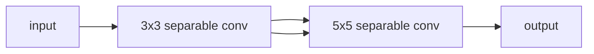

# 一切皆是映射：元学习中的神经架构搜索（NAS）

## 1. 背景介绍

### 1.1 深度学习的挑战

深度学习在过去几年取得了令人瞩目的成就,但同时也面临着一些挑战。其中一个主要挑战是神经网络架构的设计。传统上,神经网络架构是由人工设计和调整的,这需要大量的时间、经验和试错。随着深度学习模型变得越来越复杂,手动设计高效的神经网络架构变得越来越困难。

### 1.2 神经架构搜索(NAS)的兴起

为了解决这一挑战,神经架构搜索(Neural Architecture Search, NAS)应运而生。NAS旨在自动化神经网络架构的设计过程,使用机器学习算法来搜索和优化网络架构,从而获得更高的性能。这种自动化方法不仅可以减轻人工设计的负担,还能发现人类难以想象的创新架构。

## 2. 核心概念与联系

### 2.1 搜索空间

在NAS中,搜索空间是指所有可能的神经网络架构的集合。这个空间通常是离散的和结构化的,包含了不同的操作(如卷积、池化等)和连接方式。搜索空间的定义直接影响到NAS算法的效率和搜索质量。

### 2.2 搜索策略

搜索策略指的是NAS算法在搜索空间中探索和评估架构的方式。常见的搜索策略包括:

- 强化学习(Reinforcement Learning)
- 进化算法(Evolutionary Algorithms)
- 梯度优化(Gradient-based Optimization)
- 贝叶斯优化(Bayesian Optimization)

不同的搜索策略具有不同的优缺点,适用于不同的场景。

### 2.3 评估指标

评估指标用于衡量神经网络架构的性能,通常包括准确率、时间/空间复杂度等。在NAS中,评估指标不仅决定了搜索的目标,还影响了搜索过程的效率。

### 2.4 元学习(Meta-Learning)

元学习是NAS的核心思想之一。它旨在从过去的经验中学习元知识,并将其应用于新的任务和环境。在NAS中,元学习可以帮助搜索算法更快地收敛到高质量的架构,提高搜索效率。

## 3. 核心算法原理具体操作步骤

NAS算法的核心步骤如下:

1. **定义搜索空间**: 首先需要确定神经网络架构的搜索空间,包括可用的操作和连接方式。

2. **初始化种群**: 根据搜索空间,随机生成一批初始架构作为种群。

3. **评估架构性能**: 对每个架构进行训练和评估,获取相应的性能指标。

4. **选择和进化**: 根据性能指标,选择表现优异的架构,并通过变异(如改变操作或连接方式)产生新的架构。

5. **更新种群**: 用新产生的架构替换种群中的部分架构。

6. **重复3-5步骤**: 重复评估、选择和进化的过程,直到满足终止条件(如达到预期性能或搜索次数上限)。

7. **返回最佳架构**: 输出搜索过程中性能最优的神经网络架构。

不同的NAS算法在具体实现上会有所不同,但总体遵循上述核心步骤。下面我们将介绍几种常见的NAS算法。

### 3.1 强化学习方法

强化学习方法将神经网络架构的生成过程视为一个序列决策问题。每一步都需要选择一个操作或连接方式,最终形成一个完整的架构。该过程由一个智能体(Agent)控制,智能体的目标是最大化架构的期望性能。

智能体通过与环境(即搜索空间)交互来学习,每次选择一个操作后,环境会返回相应的奖励信号(如准确率)。智能体根据这些奖励信号调整自身的策略,以期在未来获得更高的累积奖励。

强化学习方法的优点是可以直接优化目标性能指标,但缺点是需要大量的架构评估,计算开销较大。著名的强化学习NAS算法包括NASNet和ENAS。

### 3.2 进化算法

进化算法模拟自然界中的进化过程,通过"适者生存"的原理来搜索最优架构。算法从一个初始种群出发,每一代中表现优异的架构会被选中,并通过变异(如改变操作或连接)产生新的架构。新产生的架构将替换种群中的部分架构,形成新一代种群。

这个过程持续迭代,直到满足终止条件。进化算法的优点是简单高效,但缺点是容易陷入局部最优解。著名的进化算法NAS包括AmoebaNet和HierEvoBio。

### 3.3 梯度优化方法

梯度优化方法将神经网络架构编码为一个连续的向量,然后使用梯度下降等优化算法来搜索最优架构。这种方法的关键是设计一个可微分的架构编码函数,使得架构向量的微小变化可以映射到合法的架构变化。

梯度优化方法的优点是计算效率高,可以直接优化目标指标。但缺点是需要设计复杂的编码函数,并且容易陷入不合法的架构空间。著名的梯度优化NAS算法包括DARTS和ProxylessNAS。

### 3.4 贝叶斯优化方法

贝叶斯优化方法将神经网络架构视为一个黑箱函数,利用高效的采样策略来逼近该函数的最优解。具体来说,算法会维护一个概率模型,用于预测每个架构的期望性能。在每一步,算法会根据当前的模型,选择一个具有高期望性能且具有探索价值的架构进行评估。评估结果会被用于更新概率模型,从而指导后续的搜索过程。

贝叶斯优化方法的优点是样本高效,能够快速收敛到高质量的架构。但缺点是需要设计合理的先验分布和获取代表性的初始数据。著名的贝叶斯优化NAS算法包括BONAS和NASWOT。

## 4. 数学模型和公式详细讲解举例说明

在NAS算法中,常常需要使用数学模型来描述和优化神经网络架构。下面我们将介绍一些常见的数学模型和公式。

### 4.1 架构编码

为了便于优化,我们需要将神经网络架构编码为一个数学表示形式。一种常见的编码方式是将架构表示为一个有向无环图(Directed Acyclic Graph, DAG)。

在DAG中,每个节点表示一个张量(如特征图),边表示对该张量进行的操作(如卷积或池化)。通过遍历图中的所有路径,我们可以重构出完整的神经网络架构。

数学上,我们可以使用邻接矩阵$\mathbf{A}$来表示DAG,其中$A_{ij}$表示从节点$i$到节点$j$的操作。此外,我们还需要一个操作向量$\mathbf{o}$,其中$o_i$表示应用于节点$i$的具体操作类型。

因此,一个神经网络架构可以用元组$(\mathbf{A}, \mathbf{o})$来表示。在搜索过程中,我们可以通过改变$\mathbf{A}$和$\mathbf{o}$的值来生成新的架构。

### 4.2 架构评估

评估架构性能是NAS算法的核心环节。常见的评估指标包括:

- 分类准确率(Classification Accuracy):

$$
\text{Accuracy} = \frac{1}{N}\sum_{i=1}^{N}\mathbb{1}(y_i = \hat{y}_i)
$$

其中$N$是样本数量,$y_i$是真实标签,$\hat{y}_i$是预测标签,$\mathbb{1}$是指示函数。

- 模型复杂度(Model Complexity):

$$
\text{Complexity} = \sum_{l=1}^{L}\text{Params}(l) + \sum_{l=1}^{L}\text{FLOPs}(l)
$$

其中$L$是网络层数,$\text{Params}(l)$是第$l$层的参数量,$\text{FLOPs}(l)$是第$l$层的计算量。

在NAS中,我们通常希望在准确率和复杂度之间寻找一个平衡点。一种常见的做法是将两个指标线性组合:

$$
\mathcal{L}(\mathbf{A}, \mathbf{o}) = \text{Accuracy}(\mathbf{A}, \mathbf{o}) - \lambda \cdot \text{Complexity}(\mathbf{A}, \mathbf{o})
$$

其中$\lambda$是一个权重系数,用于平衡准确率和复杂度。NAS算法的目标就是最大化$\mathcal{L}(\mathbf{A}, \mathbf{o})$。

### 4.3 梯度优化

在梯度优化NAS算法中,我们需要计算架构参数$\mathbf{A}$和$\mathbf{o}$相对于损失函数$\mathcal{L}$的梯度,然后使用梯度下降法进行优化。

假设我们有一个可微分的架构编码函数$f$,它将$\mathbf{A}$和$\mathbf{o}$映射到一个具体的神经网络架构。我们可以计算$\mathcal{L}$相对于$\mathbf{A}$和$\mathbf{o}$的梯度:

$$
\frac{\partial\mathcal{L}}{\partial\mathbf{A}} = \frac{\partial\mathcal{L}}{\partial f}\frac{\partial f}{\partial\mathbf{A}}, \quad \frac{\partial\mathcal{L}}{\partial\mathbf{o}} = \frac{\partial\mathcal{L}}{\partial f}\frac{\partial f}{\partial\mathbf{o}}
$$

其中$\frac{\partial f}{\partial\mathbf{A}}$和$\frac{\partial f}{\partial\mathbf{o}}$是架构编码函数的雅可比矩阵。

有了这些梯度,我们就可以使用标准的优化算法(如随机梯度下降)来更新$\mathbf{A}$和$\mathbf{o}$:

$$
\mathbf{A} \leftarrow \mathbf{A} - \eta_A \frac{\partial\mathcal{L}}{\partial\mathbf{A}}, \quad \mathbf{o} \leftarrow \mathbf{o} - \eta_o \frac{\partial\mathcal{L}}{\partial\mathbf{o}}
$$

其中$\eta_A$和$\eta_o$是学习率。通过不断迭代这个过程,我们可以逐步优化神经网络架构。

需要注意的是,由于架构空间是离散的,我们通常需要在每一步优化后对$\mathbf{A}$和$\mathbf{o}$进行离散化,以保证生成的是合法的架构。

## 5. 项目实践: 代码实例和详细解释说明

为了更好地理解NAS算法的原理和实现,我们将通过一个简单的示例项目来演示如何使用强化学习方法搜索卷积神经网络的最优架构。

### 5.1 搜索空间定义

在这个示例中,我们将搜索空间定义为一个有向无环图(DAG),其中每个节点表示一个特征张量,边表示对该张量进行的操作。我们考虑以下几种操作:

- 3x3 separable convolution
- 5x5 separable convolution
- 3x3 dilated separable convolution
- max pooling 3x3
- average pooling 3x3

每个节点最多有两个输入,输入张量将通过对应的操作进行处理,然后按元素相加得到该节点的输出张量。

为了编码这个搜索空间,我们使用两个张量:

- 邻接张量$\mathbf{A}$,其中$A_{ij}$表示从节点$i$到节点$j$的操作编号。
- 操作张量$\mathbf{o}$,其中$o_i$表示应用于节点$i$的具体操作类型。

下面是一个示例架构及其对应的编码:

对应的编码为:
$$\mathbf{A} = \begin{bmatrix}
0 & 1 & 0\\
0 & 0 & 2\\
0 & 0 & 0
\end{bmatrix}, \quad \mathbf{o} = \begin{b