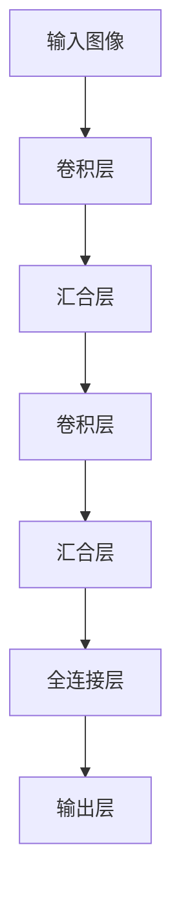

# 一切皆是映射：卷积神经网络(CNN)原理解析

## 1.背景介绍

### 1.1 人工智能的崛起

人工智能(Artificial Intelligence, AI)作为一门跨学科的综合性科学,近年来发展迅猛,成为了科技界的焦点热门领域。在计算机视觉、自然语言处理、决策系统等诸多领域,AI技术展现出了令人惊叹的能力,正在深刻改变着人类的生产和生活方式。

### 1.2 深度学习的核心地位

在AI技术的多个分支中,深度学习(Deep Learning)因其在多个领域取得了突破性进展,而被公认为AI的核心驱动力量。作为一种模仿人脑神经网络结构和工作原理的算法模型,深度学习能够自主从海量数据中挖掘出有价值的模式,从而解决人工设计的传统算法难以很好处理的复杂问题。

### 1.3 卷积神经网络的重要性

在深度学习的众多模型中,卷积神经网络(Convolutional Neural Network, CNN)因其在计算机视觉领域取得的卓越表现而备受瞩目。CNN借鉴了生物学视觉系统的分层处理机制,能够自动从图像或视频中高效提取出多层次的特征模式,从而实现高精度的识别和分类任务。凭借这一独特的优势,CNN已经成为计算机视觉领域不可或缺的基础模型。

## 2.核心概念与联系

### 2.1 卷积神经网络的基本结构

CNN由多个卷积层(Convolutional Layer)、汇合层(Pooling Layer)和全连接层(Fully Connected Layer)等不同类型的层次构成。这些层按照一定的拓扑结构组合在一起,形成了一个端到端的前馈神经网络模型。



### 2.2 局部连接与权值共享

与传统的全连接神经网络不同,CNN的卷积层采用了局部连接(Local Connectivity)和权值共享(Weight Sharing)的策略。这一设计灵感来源于生物视觉系统中视觉皮层神经元对局部接受域高度敏感的特点。

局部连接使得每个神经元仅与输入数据的一个局部区域相连,从而大大减少了网络的参数量和计算复杂度。而权值共享则使得在整个输入数据上滑动的神经元共享相同的权值参数,从而进一步降低了模型参数的存储需求。

### 2.3 平移不变性

CNN还具有一个重要的数学属性——平移不变性(Translation Invariance)。这意味着无论输入图像中的目标对象出现在什么位置,CNN都能够可靠地检测到它。这一特性源自于卷积层中权值共享和局部连接的设计,使得CNN能够有效地捕捉图像的空间层次结构。

## 3.核心算法原理具体操作步骤

### 3.1 卷积运算

卷积(Convolution)是CNN中最关键的运算,它模拟了生物视觉系统中视觉皮层简单细胞的感受野机制。具体来说,卷积层中的神经元通过一个小的权值核(Kernel)在输入特征图(Feature Map)上滑动,对每个局部区域进行加权求和运算,生成一个新的特征图。

$$
y_{i,j} = \sum_{m}\sum_{n}w_{m,n}x_{i+m,j+n} + b
$$

其中,$y_{i,j}$表示输出特征图上$(i,j)$位置的像素值,$x_{i+m,j+n}$表示输入特征图上对应的局部区域像素值,$w_{m,n}$是卷积核的权值参数,而$b$是偏置项。通过在整个输入特征图上滑动卷积核,我们可以得到一个新的特征映射,它对应着输入图像在更高层次上的表示。

### 3.2 汇合层

在卷积层之后,CNN通常会加入一个汇合层(Pooling Layer),对卷积层的输出进行下采样(Downsampling),从而降低后续层的计算负担。最常用的汇合方式是最大汇合(Max Pooling),它从每个感受野中选取最大的激活值作为输出。

$$
y_{i,j} = \max\limits_{m,n}x_{i+m,j+n}
$$

其中,$y_{i,j}$表示输出特征图上$(i,j)$位置的像素值,$x_{i+m,j+n}$表示输入特征图上对应的局部区域像素值。最大汇合不仅降低了特征维度,还能保留输入数据中的主要特征,从而提高了模型的鲁棒性。

### 3.3 全连接层与分类

在CNN的最后一个阶段,我们会加入一个或多个全连接层(Fully Connected Layer),将前面层次的高层特征映射到最终的目标空间。全连接层的每个神经元与前一层的所有神经元相连,从而综合了所有的特征信息。

最终,CNN会通过一个分类器(Classifier)层,如Softmax层,将全连接层的输出映射到不同的类别标签上,从而实现对输入数据的分类或识别。

## 4.数学模型和公式详细讲解举例说明

### 4.1 卷积层的数学模型

卷积层是CNN中最核心的组成部分,我们有必要对其数学原理进行深入探讨。设输入特征图为$X$,卷积核的权值为$W$,偏置项为$b$,则卷积层的前向传播过程可以表示为:

$$
Y = f(W * X + b)
$$

其中,$*$表示卷积运算符,而$f$是激活函数,如ReLU函数。

对于二维卷积运算,我们可以进一步展开:

$$
Y_{i,j} = f\left(\sum_{m}\sum_{n}W_{m,n}X_{i+m,j+n} + b\right)
$$

这里,$Y_{i,j}$表示输出特征图上$(i,j)$位置的像素值,$X_{i+m,j+n}$表示输入特征图上对应的局部区域像素值,$W_{m,n}$是卷积核的权值参数。通过在整个输入特征图上滑动卷积核,我们可以得到一个新的特征映射。

### 4.2 最大汇合层的数学模型

最大汇合层的作用是对输入特征图进行下采样,降低后续层的计算负担。设输入特征图为$X$,汇合窗口大小为$k \times k$,则最大汇合层的前向传播过程可以表示为:

$$
Y_{i,j} = \max\limits_{m,n}X_{i\cdot k+m,j\cdot k+n}
$$

其中,$Y_{i,j}$表示输出特征图上$(i,j)$位置的像素值,$X_{i\cdot k+m,j\cdot k+n}$表示输入特征图上对应的$k \times k$局部区域像素值。通过在整个输入特征图上滑动汇合窗口,我们可以得到一个下采样后的特征映射。

### 4.3 全连接层的数学模型

全连接层是CNN中用于将高层特征映射到目标空间的关键组件。设输入特征向量为$x$,权值矩阵为$W$,偏置向量为$b$,则全连接层的前向传播过程可以表示为:

$$
y = f(W^Tx + b)
$$

其中,$f$是激活函数,如ReLU或Sigmoid函数。

对于多分类问题,我们通常会在全连接层之后加入一个Softmax层,将输出映射到概率分布上:

$$
p_i = \frac{e^{y_i}}{\sum_{j}e^{y_j}}
$$

其中,$p_i$表示样本属于第$i$类的概率,$y_i$是全连接层对应第$i$类的输出。通过选择概率最大的类别,我们可以实现对输入数据的分类或识别。

### 4.4 反向传播与梯度更新

CNN的训练过程采用了反向传播(Backpropagation)算法,通过计算损失函数关于权值的梯度,并沿着梯度的反方向更新权值参数,从而不断降低损失函数的值,提高模型的性能。

对于卷积层和全连接层,我们可以使用链式法则计算损失函数关于权值的梯度:

$$
\frac{\partial L}{\partial W} = \frac{\partial L}{\partial Y} \cdot \frac{\partial Y}{\partial W}
$$

其中,$L$是损失函数,$Y$是层的输出。通过反向传播算法,我们可以高效地计算出每一层的梯度,并使用优化算法(如SGD、Adam等)对权值参数进行更新。

## 5.项目实践:代码实例和详细解释说明

为了更好地理解CNN的原理和实现,我们以一个基于PyTorch的手写数字识别项目为例,详细解释CNN的代码实现细节。

### 5.1 定义CNN模型

首先,我们定义一个简单的CNN模型,包含两个卷积层、两个汇合层和一个全连接层:

```python
import torch.nn as nn

class CNN(nn.Module):
    def __init__(self):
        super(CNN, self).__init__()
        self.conv1 = nn.Conv2d(1, 16, kernel_size=3, stride=1, padding=1)
        self.pool1 = nn.MaxPool2d(kernel_size=2, stride=2)
        self.conv2 = nn.Conv2d(16, 32, kernel_size=3, stride=1, padding=1)
        self.pool2 = nn.MaxPool2d(kernel_size=2, stride=2)
        self.fc = nn.Linear(32 * 7 * 7, 10)

    def forward(self, x):
        x = self.pool1(nn.functional.relu(self.conv1(x)))
        x = self.pool2(nn.functional.relu(self.conv2(x)))
        x = x.view(-1, 32 * 7 * 7)
        x = self.fc(x)
        return x
```

在`__init__`方法中,我们定义了两个卷积层(`conv1`和`conv2`)、两个最大汇合层(`pool1`和`pool2`)和一个全连接层(`fc`)。`forward`方法则定义了CNN的前向传播过程,包括卷积、汇合、激活函数计算和全连接层的操作。

### 5.2 数据预处理

接下来,我们加载MNIST手写数字数据集,并对其进行预处理:

```python
import torchvision.datasets as datasets
import torchvision.transforms as transforms

transform = transforms.Compose([
    transforms.ToTensor(),
    transforms.Normalize((0.1307,), (0.3081,))
])

train_dataset = datasets.MNIST(root='data/', train=True, transform=transform, download=True)
test_dataset = datasets.MNIST(root='data/', train=False, transform=transform, download=True)
```

我们使用`torchvision.transforms`模块对数据进行了标准化处理,将像素值缩放到0到1之间的范围。然后,我们加载了MNIST训练集和测试集。

### 5.3 模型训练

下一步,我们定义训练循环,并使用PyTorch的`nn.CrossEntropyLoss`函数计算交叉熵损失:

```python
import torch.optim as optim

model = CNN()
criterion = nn.CrossEntropyLoss()
optimizer = optim.SGD(model.parameters(), lr=0.01)

for epoch in range(10):
    running_loss = 0.0
    for inputs, labels in train_loader:
        optimizer.zero_grad()
        outputs = model(inputs)
        loss = criterion(outputs, labels)
        loss.backward()
        optimizer.step()
        running_loss += loss.item()
    print(f'Epoch {epoch+1} loss: {running_loss / len(train_loader):.3f}')
```

在每个训练epoch中,我们遍历训练数据,计算模型输出和真实标签之间的损失,并通过反向传播算法更新模型参数。我们使用了SGD优化器,并打印每个epoch的平均损失值。

### 5.4 模型评估

最后,我们在测试集上评估训练好的CNN模型:

```python
correct = 0
total = 0
with torch.no_grad():
    for inputs, labels in test_loader:
        outputs = model(inputs)
        _, predicted = torch.max(outputs.data, 1)
        total += labels.size(0)
        correct += (predicted == labels).sum().item()

print(f'Accuracy on test set: {100 * correct / total}%')
```

我们遍历测试数据,计算模型的预测输出,并与真实标签进行比较,从而得到模型在测试集上的准确率。

通过这个实例,我们可以清晰地看到CNN的核心组件(卷积