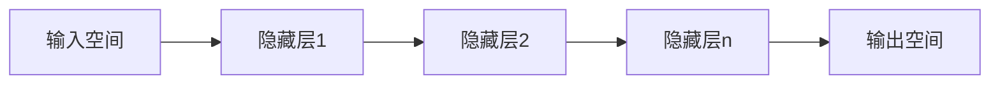

# 一切皆是映射：少量样本学习和神经网络的挑战

## 1. 背景介绍
### 1.1 人工智能的发展历程
#### 1.1.1 早期的人工智能
#### 1.1.2 机器学习的兴起  
#### 1.1.3 深度学习的崛起
### 1.2 神经网络的应用现状
#### 1.2.1 计算机视觉领域
#### 1.2.2 自然语言处理领域
#### 1.2.3 其他应用领域
### 1.3 少量样本学习的挑战
#### 1.3.1 传统机器学习方法的局限性
#### 1.3.2 深度学习面临的Few-Shot Learning难题
#### 1.3.3 少量样本学习的重要意义

## 2. 核心概念与联系
### 2.1 映射的定义与性质
#### 2.1.1 映射的数学定义
#### 2.1.2 映射的单射、满射与双射
#### 2.1.3 映射的连续性
### 2.2 神经网络与映射的关系
#### 2.2.1 神经网络的数学表示
#### 2.2.2 神经网络实现非线性映射
#### 2.2.3 深度神经网络的层次映射
### 2.3 少量样本学习中的映射
#### 2.3.1 Few-Shot Learning的形式化描述
#### 2.3.2 元学习与映射的关系
#### 2.3.3 度量学习与映射空间

## 3. 核心算法原理具体操作步骤
### 3.1 基于度量的Few-Shot Learning
#### 3.1.1 Siamese网络
#### 3.1.2 Prototypical网络
#### 3.1.3 Relation网络
### 3.2 基于优化的Few-Shot Learning
#### 3.2.1 MAML算法
#### 3.2.2 Reptile算法
#### 3.2.3 LEO算法
### 3.3 基于数据增强的Few-Shot Learning
#### 3.3.1 数据增强技术概述
#### 3.3.2 基于特征增强的方法
#### 3.3.3 基于样本合成的方法

## 4. 数学模型和公式详细讲解举例说明
### 4.1 Siamese网络的数学模型
#### 4.1.1 孪生网络结构
#### 4.1.2 对比损失函数
$$L(x_1,x_2,y) = (1-y)\frac{1}{2}(D_w)^2+y\frac{1}{2}\{max(0,m-D_w)\}^2$$
#### 4.1.3 训练过程与优化
### 4.2 Prototypical网络的数学模型  
#### 4.2.1 原型表示
$$c_k=\frac{1}{|S_k|}\sum_{(x_i,y_i)\in S_k}\phi(x_i)$$
#### 4.2.2 欧氏距离度量
#### 4.2.3 概率输出与损失函数
### 4.3 MAML的数学模型
#### 4.3.1 双重优化目标
$$\min_\phi\sum_{\mathcal{T}_i \sim p(\mathcal{T})} \mathcal{L}_{\mathcal{T}_i}(f_{\phi_i}') \quad s.t. \quad \phi_i'=\phi-\alpha\nabla_\phi\mathcal{L}_{\mathcal{T}_i}(f_\phi)$$
#### 4.3.2 元梯度计算
#### 4.3.3 算法流程与实现

## 5. 项目实践：代码实例和详细解释说明
### 5.1 基于Pytorch的Prototypical网络实现
#### 5.1.1 数据集准备与预处理
#### 5.1.2 模型构建与训练
#### 5.1.3 测试与结果分析
### 5.2 基于Tensorflow的MAML算法实现
#### 5.2.1 任务采样与数据准备
#### 5.2.2 模型定义与元训练
#### 5.2.3 测试与性能评估
### 5.3 少量样本学习项目实战
#### 5.3.1 项目背景与需求分析
#### 5.3.2 数据收集与标注
#### 5.3.3 模型选择与训练调优
#### 5.3.4 系统集成与部署应用

## 6. 实际应用场景
### 6.1 医学影像分析
#### 6.1.1 医学影像数据的特点与挑战
#### 6.1.2 Few-Shot Learning在医学影像中的应用
#### 6.1.3 案例分析：少量样本下的肿瘤识别
### 6.2 工业缺陷检测
#### 6.2.1 工业缺陷检测的痛点
#### 6.2.2 Few-Shot Learning助力工业质检
#### 6.2.3 案例分析：PCB板缺陷检测
### 6.3 人脸识别与验证
#### 6.3.1 人脸识别的应用现状
#### 6.3.2 Few-Shot Learning在人脸识别中的优势
#### 6.3.3 案例分析：少量身份的人脸认证系统

## 7. 工具和资源推荐
### 7.1 数据集资源
#### 7.1.1 Mini-ImageNet
#### 7.1.2 Omniglot
#### 7.1.3 CUB-200
### 7.2 开源框架与库
#### 7.2.1 Pytorch
#### 7.2.2 Tensorflow
#### 7.2.3 OpenFSL
### 7.3 学习资料与社区
#### 7.3.1 Few-Shot Learning相关论文
#### 7.3.2 在线课程与教程
#### 7.3.3 Github项目与社区交流

## 8. 总结：未来发展趋势与挑战
### 8.1 Few-Shot Learning的研究进展
#### 8.1.1 算法的不断创新
#### 8.1.2 大规模Few-Shot Learning数据集的构建
#### 8.1.3 领域自适应与跨域Few-Shot Learning
### 8.2 未来发展趋势
#### 8.2.1 元学习与Few-Shot Learning的融合
#### 8.2.2 多模态Few-Shot Learning
#### 8.2.3 终身学习与持续学习
### 8.3 面临的挑战
#### 8.3.1 小样本数据的质量与多样性
#### 8.3.2 模型泛化能力与鲁棒性
#### 8.3.3 可解释性与可信性

## 9. 附录：常见问题与解答
### 9.1 什么是Few-Shot Learning？
Few-Shot Learning是指在只有少量标注样本的情况下进行机器学习的一类方法，旨在通过极少的样本就能快速学习新的概念和任务。与传统的机器学习方法相比，Few-Shot Learning更加注重学习的效率和泛化能力。

### 9.2 Few-Shot Learning与传统机器学习有何不同？
传统的机器学习方法通常需要大量的标注数据来训练模型，而Few-Shot Learning则试图在极少样本的情况下学习新的概念。Few-Shot Learning更加关注快速适应和泛化到新任务的能力，而不是在特定数据集上的性能表现。

### 9.3 Few-Shot Learning常用的算法有哪些？
Few-Shot Learning的算法主要分为三大类：基于度量的方法、基于优化的方法和基于数据增强的方法。常见的算法包括Siamese网络、Prototypical网络、MAML、Reptile等。这些算法从不同角度出发，通过度量学习、元学习、数据增强等技术来解决Few-Shot Learning问题。

### 9.4 如何评估Few-Shot Learning算法的性能？
评估Few-Shot Learning算法的性能通常采用N-way K-shot的测试协议。即在测试时，随机选择N个类别，每个类别提供K个样本作为支持集，然后在查询集上进行分类测试。常用的评估指标包括准确率、F1值等。此外，还需要考察算法在不同数据集和任务上的泛化能力。

### 9.5 Few-Shot Learning面临的主要挑战有哪些？
Few-Shot Learning面临的主要挑战包括：（1）如何在极少样本的情况下提取有效的特征表示；（2）如何设计高效的度量函数来度量样本之间的相似性；（3）如何快速适应新的任务并避免过拟合；（4）如何在不同领域和任务之间进行知识迁移和泛化。这些挑战需要从算法、数据、模型等多个角度入手，不断探索和创新。

作者：禅与计算机程序设计艺术 / Zen and the Art of Computer Programming