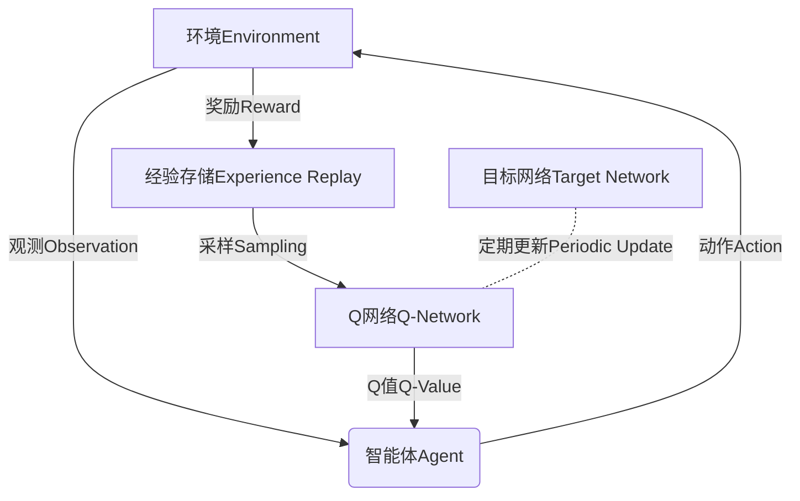

# 一切皆是映射：强化学习中的不稳定性和方差问题：DQN案例研究

## 1.背景介绍

### 1.1 强化学习概述

强化学习(Reinforcement Learning, RL)是机器学习的一个重要分支,旨在让智能体(Agent)通过与环境(Environment)的交互来学习如何采取最优策略,以最大化累积回报(Cumulative Reward)。与监督学习不同,强化学习没有给定的输入-输出对样本,智能体需要通过试错来探索环境,获取经验,并基于这些经验调整自身的策略。

### 1.2 不稳定性和方差问题

在强化学习中,不稳定性(Instability)和高方差(High Variance)是两个常见的挑战。不稳定性指的是在训练过程中,算法的表现可能会出现剧烈的波动,甚至发散。高方差则意味着在不同的训练实例中,算法的性能可能存在较大差异,缺乏一致性。这两个问题可能导致训练过程变得困难,并影响最终模型的性能。

### 1.3 DQN算法及其意义

为了解决传统强化学习算法中的不稳定性和高方差问题,DeepMind在2015年提出了深度Q网络(Deep Q-Network, DQN)算法。DQN算法将深度神经网络引入到Q-learning中,通过经验回放(Experience Replay)和目标网络(Target Network)等技术,显著提高了训练的稳定性和性能。DQN算法的提出标志着深度学习与强化学习的成功结合,开启了深度强化学习(Deep Reinforcement Learning)的新时代。

## 2.核心概念与联系

### 2.1 Q-learning

Q-learning是强化学习中的一种基于价值的算法,它试图学习一个Q函数,该函数可以为每个状态-动作对(state-action pair)估计一个Q值,表示在该状态下采取该动作所能获得的累积回报。通过不断更新Q函数,智能体可以逐步找到最优策略。传统的Q-learning使用表格或者简单的函数逼近器来表示Q函数,但在处理高维或连续状态空间时,表现往往不尽人意。

### 2.2 深度神经网络

深度神经网络(Deep Neural Network, DNN)是一种强大的机器学习模型,能够从大量数据中自动学习特征表示。由于其强大的非线性拟合能力,深度神经网络被广泛应用于计算机视觉、自然语言处理等领域。在强化学习中,深度神经网络可以用来逼近Q函数,从而解决高维状态空间的问题。

### 2.3 DQN算法

DQN算法的核心思想是使用深度神经网络来逼近Q函数,同时引入了经验回放(Experience Replay)和目标网络(Target Network)等技术来提高训练的稳定性。经验回放通过存储过去的经验,打破了数据样本之间的相关性,提高了数据利用效率。目标网络则通过定期复制主网络的权重,减小了目标值的变化幅度,从而避免了不稳定性。



上图展示了DQN算法的核心流程。智能体与环境交互,获取观测、执行动作并获得奖励,这些经验被存储在经验回放池中。在训练时,从经验回放池中采样数据,输入到Q网络中计算Q值,并与目标Q值进行比较,更新Q网络的权重。目标网络则定期从Q网络复制权重,以保持目标值的稳定性。

## 3.核心算法原理具体操作步骤

### 3.1 Q-learning更新规则

在Q-learning算法中,Q函数的更新规则如下:

$$Q(s_t, a_t) \leftarrow Q(s_t, a_t) + \alpha \left[ r_t + \gamma \max_{a} Q(s_{t+1}, a) - Q(s_t, a_t) \right]$$

其中:

- $s_t$和$a_t$分别表示当前状态和动作
- $r_t$是执行动作$a_t$后获得的即时回报
- $\gamma$是折现因子,用于权衡未来回报的重要性
- $\alpha$是学习率,控制着Q函数更新的幅度

这个更新规则试图让Q值逼近真实的Q值,即期望在当前状态采取当前动作所能获得的累积回报。

### 3.2 深度Q网络

在DQN算法中,我们使用一个深度神经网络$Q(s, a; \theta)$来逼近Q函数,其中$\theta$表示网络的权重参数。该网络将状态$s$作为输入,输出所有可能动作的Q值。在训练时,我们需要最小化以下损失函数:

$$L(\theta) = \mathbb{E}_{(s, a, r, s')\sim U(D)}\left[ \left(r + \gamma \max_{a'} Q(s', a'; \theta^-) - Q(s, a; \theta)\right)^2 \right]$$

其中:

- $D$是经验回放池,$(s, a, r, s')$是从中采样的一个转移样本
- $\theta^-$是目标网络的权重,用于计算目标Q值$\max_{a'} Q(s', a'; \theta^-)$
- $\theta$是主Q网络的权重,需要通过梯度下降等优化算法进行更新

这个损失函数实际上是Q-learning更新规则的平方形式,通过最小化该损失函数,可以使Q网络的输出值逼近真实的Q值。

### 3.3 经验回放

经验回放(Experience Replay)是DQN算法中一个关键的技术。在传统的强化学习算法中,数据样本之间存在强烈的相关性,这可能导致训练过程中的不稳定性。经验回放通过维护一个固定大小的回放池$D$,存储智能体与环境交互过程中获得的转移样本$(s, a, r, s')$。在训练时,我们从回放池中均匀随机采样一个小批量的样本,输入到Q网络中进行训练。这种方式打破了数据样本之间的相关性,提高了数据利用效率,从而增强了训练的稳定性。

### 3.4 目标网络

目标网络(Target Network)是DQN算法中另一个重要的技术。在Q-learning的更新规则中,目标Q值$\max_{a'} Q(s', a')$是不断变化的,这可能导致训练过程中的不稳定性。为了减小目标值的变化幅度,DQN算法维护了一个目标网络$Q(s, a; \theta^-)$,其权重$\theta^-$是主Q网络$Q(s, a; \theta)$权重的复制。在一定的训练步长之后,目标网络的权重会被主网络的权重所替代,从而保持目标值的相对稳定性。

算法伪代码如下:

```python
初始化主Q网络 Q(s, a; θ) 和目标Q网络 Q(s, a; θ^-)
初始化经验回放池 D
for episode in range(num_episodes):
    初始化环境状态 s
    while not done:
        使用ε-贪婪策略选择动作 a
        执行动作 a,观测奖励 r 和新状态 s'
        将转移样本 (s, a, r, s') 存入回放池 D
        从 D 中采样一个小批量的转移样本
        计算损失函数 L(θ)
        使用优化算法(如梯度下降)更新主Q网络权重 θ
        if 达到目标网络更新周期:
            将主Q网络权重 θ 复制到目标Q网络 θ^-
        s = s'
    end while
end for
```

上述伪代码展示了DQN算法的核心操作步骤。在每一个episode中,智能体与环境交互,获取转移样本并存入回放池。然后从回放池中采样一个小批量的样本,计算损失函数并更新主Q网络的权重。在一定的训练步长之后,将主Q网络的权重复制到目标Q网络,以保持目标值的稳定性。

## 4.数学模型和公式详细讲解举例说明

### 4.1 Q-learning更新规则

Q-learning更新规则的数学形式如下:

$$Q(s_t, a_t) \leftarrow Q(s_t, a_t) + \alpha \left[ r_t + \gamma \max_{a} Q(s_{t+1}, a) - Q(s_t, a_t) \right]$$

这个更新规则试图让Q值逼近真实的Q值,即期望在当前状态采取当前动作所能获得的累积回报。让我们分解一下这个公式:

- $Q(s_t, a_t)$表示当前状态$s_t$下采取动作$a_t$的Q值
- $r_t$是执行动作$a_t$后获得的即时回报
- $\gamma \max_{a} Q(s_{t+1}, a)$表示在下一个状态$s_{t+1}$下,采取最优动作所能获得的期望累积回报(折现并考虑未来回报)
- $\alpha$是学习率,控制着Q值更新的幅度

更新规则的本质是让当前的Q值朝着"即时回报 + 折现的未来最大期望回报"的方向调整。通过不断更新,Q值最终会收敛到真实的Q值。

让我们用一个简单的例子来说明更新过程。假设我们有一个格子世界环境,智能体的目标是从起点到达终点。每一步行动都会获得-1的回报,到达终点则获得+100的回报。假设当前状态为$s_t$,智能体采取动作$a_t$,获得回报$r_t=-1$,并到达新状态$s_{t+1}$。在$s_{t+1}$状态下,如果采取最优策略,可以获得期望累积回报为90(假设折现因子$\gamma=1$)。那么,根据更新规则,我们可以更新$Q(s_t, a_t)$的值:

$$Q(s_t, a_t) \leftarrow Q(s_t, a_t) + \alpha \left[ -1 + 90 - Q(s_t, a_t) \right]$$

如果我们设置学习率$\alpha=0.1$,并假设$Q(s_t, a_t)$的初始值为0,那么更新后的$Q(s_t, a_t)$值将变为8.9。通过不断更新,Q值最终会收敛到真实的Q值,从而指导智能体采取最优策略。

### 4.2 DQN损失函数

在DQN算法中,我们使用一个深度神经网络$Q(s, a; \theta)$来逼近Q函数,其中$\theta$表示网络的权重参数。该网络将状态$s$作为输入,输出所有可能动作的Q值。在训练时,我们需要最小化以下损失函数:

$$L(\theta) = \mathbb{E}_{(s, a, r, s')\sim U(D)}\left[ \left(r + \gamma \max_{a'} Q(s', a'; \theta^-) - Q(s, a; \theta)\right)^2 \right]$$

这个损失函数实际上是Q-learning更新规则的平方形式。让我们分解一下这个公式:

- $(s, a, r, s')$是从经验回放池$D$中均匀随机采样的一个转移样本
- $r$是执行动作$a$后获得的即时回报
- $\gamma \max_{a'} Q(s', a'; \theta^-)$是目标网络计算出的,在下一个状态$s'$下采取最优动作所能获得的期望累积回报
- $Q(s, a; \theta)$是主Q网络在当前状态$s$下,对动作$a$的Q值估计

损失函数的目标是让主Q网络的输出值$Q(s, a; \theta)$尽可能接近"即时回报 + 折现的未来最大期望回报"。通过最小化这个平方损失函数,可以使Q网络的输出值逼近真实的Q值。

让我们用一个具体的例子来说明。假设我们有一个简单的网格世界环境,智能体的目标是从起点到达终点。在某一个时刻,智能体处于状态$s$,采取动作$a$,获得即时回报$r=-1$,并到达新状态$s'$。假设目标网络计算出,在$s'$状态下采取最优动作,可以获得期望累积回报为90(假设折现因子$\gamma=1$)。那么,对于这