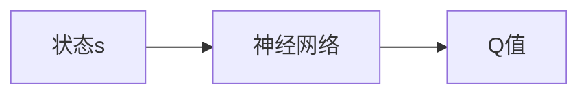

## 1.背景介绍

深度Q网络（DQN）是一种结合了深度学习和强化学习的算法，它在许多领域都有广泛的应用，包括游戏、机器人技术和自动驾驶等。然而，DQN的网络结构和其变种的理解和应用仍然是一个挑战。本文将深入探讨DQN的核心概念、网络结构以及其变种，以期为读者提供一个全面的视角。

## 2.核心概念与联系

### 2.1 Q学习

Q学习是一种值迭代算法，它通过学习一个动作-价值函数$Q(s, a)$来评估在给定状态$s$下执行特定动作$a$的预期回报。Q学习的目标是找到一个策略，使得对于所有的状态和动作，$Q(s, a)$都能达到最大。

### 2.2 深度Q网络

深度Q网络（DQN）是一种结合了深度学习和Q学习的算法。在DQN中，我们使用一个神经网络来近似Q函数。这个神经网络接收一个状态$s$作为输入，输出每个可能动作的Q值。



## 3.核心算法原理具体操作步骤

DQN的训练过程主要包括以下几个步骤：

1. 初始化Q网络和目标Q网络。
2. 对于每一个训练步骤：
    1. 选择一个动作$a$，根据当前的Q网络和$\varepsilon$-贪婪策略。
    2. 执行动作$a$，观察新的状态$s'$和奖励$r$。
    3. 将经验$(s, a, r, s')$存储到经验回放缓冲区。
    4. 从经验回放缓冲区中随机抽取一个批量的经验。
    5. 使用目标Q网络计算目标Q值。
    6. 使用当前的Q网络计算预测的Q值。
    7. 计算损失函数，然后使用梯度下降法更新Q网络的参数。
    8. 每隔一定的步骤，更新目标Q网络的参数。

## 4.数学模型和公式详细讲解举例说明

在DQN中，我们使用神经网络来近似Q函数。这个神经网络的参数$\theta$通过最小化以下损失函数来学习：

$$
L(\theta) = \mathbb{E}_{(s, a, r, s') \sim U(D)}\left[(r + \gamma \max_{a'}Q(s', a'; \theta^-) - Q(s, a; \theta))^2\right]
$$

其中，$D$是经验回放缓冲区，$U(D)$表示从$D$中随机抽取一个经验，$\gamma$是折扣因子，$\theta^-$是目标Q网络的参数。

## 5.项目实践：代码实例和详细解释说明

以下是一个简单的DQN实现的代码示例：

```python
class DQN:
    def __init__(self, state_dim, action_dim, hidden_dim=64, lr=1e-3):
        self.q_net = Network(state_dim, action_dim, hidden_dim)
        self.target_q_net = Network(state_dim, action_dim, hidden_dim)
        self.optimizer = torch.optim.Adam(self.q_net.parameters(), lr=lr)
        self.buffer = ReplayBuffer()

    def update(self, batch_size=32, gamma=0.99):
        states, actions, rewards, next_states = self.buffer.sample(batch_size)
        q_values = self.q_net(states)
        next_q_values = self.target_q_net(next_states)
        q_value = q_values.gather(1, actions.unsqueeze(1)).squeeze(1)
        next_q_value = next_q_values.max(1)[0]
        expected_q_value = rewards + gamma * next_q_value
        loss = (q_value - expected_q_value.detach()).pow(2).mean()
        self.optimizer.zero_grad()
        loss.backward()
        self.optimizer.step()
```

## 6.实际应用场景

DQN在许多领域都有广泛的应用，包括：

- 游戏：DQN首次被引入是在Atari游戏中，它能够在许多游戏中超越人类的表现。
- 机器人技术：DQN可以用于训练机器人执行各种任务，例如抓取、导航和操纵。
- 自动驾驶：DQN可以用于训练自动驾驶系统，使其能够在复杂的交通环境中进行决策。

## 7.工具和资源推荐

- OpenAI Gym：一个提供各种环境的强化学习库，可以用来测试DQN和其他强化学习算法。
- PyTorch：一个强大的深度学习库，可以用来实现DQN。
- Stable Baselines：一个提供各种强化学习算法实现的库，包括DQN。

## 8.总结：未来发展趋势与挑战

尽管DQN已经在许多应用中取得了巨大的成功，但是仍然存在一些挑战和未来的发展趋势，包括：

- 样本效率：DQN需要大量的样本来进行训练，这在某些应用中可能是不可行的。
- 稳定性：DQN的训练过程可能会非常不稳定，尤其是在复杂的环境中。
- 探索与利用的平衡：DQN需要在探索新的状态和动作与利用已知的信息之间找到一个平衡。

## 9.附录：常见问题与解答

Q: DQN的优点是什么？
A: DQN能够处理具有高维度状态空间的问题，且不需要环境的模型。

Q: DQN的缺点是什么？
A: DQN可能需要大量的训练样本，且训练过程可能会非常不稳定。

作者：禅与计算机程序设计艺术 / Zen and the Art of Computer Programming