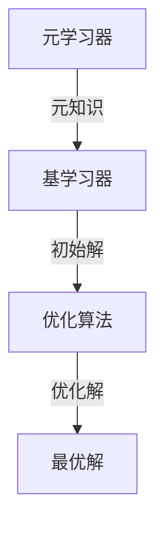

# 一切皆是映射：构建元学习启发式优化算法

## 1. 背景介绍

### 1.1 优化问题的挑战

在现实世界中,我们经常会遇到各种优化问题,例如路径规划、资源分配、机器学习模型的超参数调优等。这些问题通常具有以下特点:

- 高维、非线性、非凸
- 目标函数复杂、多模态
- 约束条件多样、难以满足

传统的数学优化方法往往难以有效解决这些复杂的优化问题。

### 1.2 启发式优化算法的兴起

为了应对这些挑战,启发式优化算法(Metaheuristic Optimization Algorithms)应运而生。这类算法借鉴自然界中的进化过程、群体行为等现象,通过模拟这些过程来探索解空间,逐步逼近最优解。常见的启发式优化算法包括:

- 遗传算法(Genetic Algorithms)
- 蚁群优化算法(Ant Colony Optimization)
- 粒子群优化算法(Particle Swarm Optimization)
- 模拟退火算法(Simulated Annealing)

尽管这些算法展现出了不同程度的优异性能,但它们也存在一些共同的局限性:

- 算法性能高度依赖于参数设置
- 容易陷入局部最优解
- 缺乏足够的探索能力

为了克服这些局限性,元学习启发式优化算法(Meta-Learning Metaheuristic Optimization Algorithms)应运而生。

## 2. 核心概念与联系

### 2.1 元学习的概念

元学习(Meta-Learning)是机器学习领域的一个新兴方向,其核心思想是通过学习各种任务之间的共性知识,从而提高在新任务上的学习效率和性能。

在优化算法领域,元学习的目标是从历史优化任务中学习经验,并将这些经验应用于新的优化问题,从而加速优化过程,提高算法性能。

### 2.2 元学习启发式优化算法的框架

元学习启发式优化算法通常包括以下三个主要组成部分:

1. **元学习器(Meta-Learner)**: 负责从历史优化任务中提取元知识,并将其编码为可传递的表示形式。

2. **基学习器(Base-Learner)**: 在新的优化任务上利用元知识,快速生成高质量的初始解并指导后续的搜索过程。

3. **优化算法(Optimization Algorithm)**: 基于基学习器生成的初始解,进行进一步的局部搜索,逐步优化解的质量。



通过这种分工合作的方式,元学习启发式优化算法能够有效地利用历史经验,加速新任务的优化过程,从而提高算法的整体性能。

### 2.3 元学习启发式优化算法的优势

相比于传统的启发式优化算法,元学习启发式优化算法具有以下优势:

1. **快速收敛**: 利用元知识生成高质量的初始解,减少了无效的盲目搜索。

2. **避免局部最优陷阱**: 元知识可以指导算法跳出局部最优,提高全局搜索能力。

3. **自适应性强**: 通过持续学习,算法可以自动调整参数,适应不同的优化任务。

4. **可解释性好**: 元知识的形式通常具有一定的可解释性,有助于理解算法的行为。

## 3. 核心算法原理具体操作步骤

虽然不同的元学习启发式优化算法在具体实现上可能有所不同,但它们通常遵循以下基本步骤:

1. **收集历史优化任务数据**

   从先前解决的优化任务中收集数据,包括问题描述、约束条件、最优解等信息。这些数据将用于训练元学习器。

2. **训练元学习器**

   使用机器学习技术(如神经网络、决策树等)从历史数据中学习元知识。元知识可以编码为模型参数、启发式规则等形式。

3. **初始化基学习器**

   利用元知识初始化基学习器,生成针对新优化任务的初始解集合。

4. **局部搜索优化**

   基于基学习器生成的初始解,使用传统的启发式优化算法(如遗传算法、模拟退火等)进行局部搜索优化,逐步改进解的质量。

5. **更新元知识**

   将新的优化任务及其最优解纳入历史数据集,重新训练元学习器,不断更新和完善元知识。

6. **迭代优化**

   重复步骤3-5,直到满足终止条件(如达到最大迭代次数、找到满意解等)。

通过上述步骤的不断迭代,元学习启发式优化算法可以逐步提高性能,适应不同的优化任务。

## 4. 数学模型和公式详细讲解举例说明

在元学习启发式优化算法中,数学模型和公式扮演着重要的角色。下面将详细介绍其中的一些核心概念和方法。

### 4.1 优化问题的数学表示

一般来说,优化问题可以表示为:

$$
\begin{aligned}
&\underset{x}{\text{minimize}}& & f(x) \\
&\text{subject to}& & g_i(x) \leq 0, \quad i=1,2,...,m \\
& & & h_j(x) = 0, \quad j=1,2,...,p
\end{aligned}
$$

其中:

- $x$ 是决策变量向量
- $f(x)$ 是目标函数
- $g_i(x)$ 是不等式约束条件
- $h_j(x)$ 是等式约束条件

优化的目标是在满足所有约束条件的前提下,找到使目标函数 $f(x)$ 最小化的决策变量 $x^*$。

### 4.2 元学习器的数学模型

元学习器的核心任务是从历史优化任务中学习元知识。常见的元学习模型包括:

1. **基于神经网络的模型**

   将优化问题的描述(如目标函数、约束条件等)作为输入,通过神经网络学习生成初始解或启发式规则作为输出。

   例如,可以使用编码器-解码器(Encoder-Decoder)架构,将优化问题编码为潜在表示,再解码生成初始解。

2. **基于决策树的模型**

   构建决策树模型,根据优化问题的特征选择合适的启发式规则或参数设置。

   例如,可以使用随机森林(Random Forest)等集成学习方法,提高模型的泛化能力。

3. **基于贝叶斯优化的模型**

   将元学习建模为一个贝叶斯优化问题,通过高效的采样策略逐步优化模型参数。

   例如,可以使用高斯过程(Gaussian Process)等概率模型来近似目标函数,并采用期望改善(Expected Improvement)等采集函数来平衡探索和利用。

### 4.3 基学习器的数学模型

基学习器的主要任务是利用元知识生成高质量的初始解。常见的基学习器模型包括:

1. **构造性启发式模型**

   根据元知识中的启发式规则,构造出满足约束条件的可行解。

   例如,对于旅行商问题,可以使用最近邻居(Nearest Neighbor)或插入启发式(Insertion Heuristic)等规则生成初始解。

2. **基于模型的优化模型**

   利用元知识构建目标函数的代理模型(Surrogate Model),并在代理模型上进行优化,得到初始解。

   例如,可以使用高斯过程回归(Gaussian Process Regression)或人工神经网络(Artificial Neural Network)等技术构建代理模型。

3. **基于规则的优化模型**

   根据元知识中的规则,对初始解进行修复或改进,使其更加接近最优解。

   例如,对于车辆路径规划问题,可以使用避障(Obstacle Avoidance)、平滑(Smoothing)等规则对初始路径进行优化。

通过上述模型,基学习器可以快速生成高质量的初始解,为后续的局部搜索优化奠定基础。

## 5. 项目实践:代码实例和详细解释说明

为了更好地理解元学习启发式优化算法的实现细节,下面将以一个具体的项目实践为例进行说明。

### 5.1 问题描述

我们将使用一个经典的组合优化问题——旅行商问题(Traveling Salesman Problem,TSP)作为示例。

给定一组城市及它们之间的距离,旅行商需要确定一条访问每个城市一次并回到起点的最短路径。该问题可以形式化为:

$$
\begin{aligned}
&\underset{\pi}{\text{minimize}}& & \sum_{i=1}^{n} d_{\pi(i),\pi(i+1)} + d_{\pi(n),\pi(1)} \\
&\text{subject to}& & \pi \text{ is a permutation of } \{1,2,...,n\}
\end{aligned}
$$

其中:

- $n$ 是城市数量
- $d_{ij}$ 是城市 $i$ 和城市 $j$ 之间的距离
- $\pi$ 是一个排列,表示访问城市的顺序

### 5.2 元学习器实现

在本例中,我们将使用基于神经网络的编码器-解码器架构作为元学习器。

```python
import torch
import torch.nn as nn

class TSPEncoder(nn.Module):
    def __init__(self, input_size, hidden_size):
        super(TSPEncoder, self).__init__()
        self.fc1 = nn.Linear(input_size, hidden_size)
        self.fc2 = nn.Linear(hidden_size, hidden_size)
        self.relu = nn.ReLU()

    def forward(self, x):
        out = self.fc1(x)
        out = self.relu(out)
        out = self.fc2(out)
        out = self.relu(out)
        return out

class TSPDecoder(nn.Module):
    def __init__(self, hidden_size, output_size):
        super(TSPDecoder, self).__init__()
        self.fc1 = nn.Linear(hidden_size, output_size)

    def forward(self, x):
        out = self.fc1(x)
        return out

class TSPMetaLearner(nn.Module):
    def __init__(self, input_size, hidden_size, output_size):
        super(TSPMetaLearner, self).__init__()
        self.encoder = TSPEncoder(input_size, hidden_size)
        self.decoder = TSPDecoder(hidden_size, output_size)

    def forward(self, x):
        encoded = self.encoder(x)
        decoded = self.decoder(encoded)
        return decoded
```

在这个实现中,我们将TSP问题的描述(如城市坐标、距离矩阵等)作为输入,通过编码器网络将其编码为潜在表示,再由解码器网络解码生成初始解(即城市访问顺序)。

训练过程如下:

```python
# 准备训练数据
train_data = ...  # 包含多个TSP问题实例及其最优解
meta_learner = TSPMetaLearner(input_size, hidden_size, output_size)
optimizer = torch.optim.Adam(meta_learner.parameters(), lr=0.001)
loss_fn = nn.CrossEntropyLoss()

for epoch in range(num_epochs):
    for instance, solution in train_data:
        optimizer.zero_grad()
        output = meta_learner(instance)
        loss = loss_fn(output, solution)
        loss.backward()
        optimizer.step()
```

通过上述训练过程,元学习器可以学习到生成高质量初始解的能力。

### 5.3 基学习器实现

基学习器的任务是利用元学习器生成的初始解,并进行局部搜索优化。在本例中,我们将使用基于规则的优化模型作为基学习器。

```python
from collections import deque

def nearest_neighbor(cities, start):
    """最近邻居启发式"""
    path = [start]
    unvisited = set(range(len(cities)))
    unvisited.remove(start)
    while unvisited:
        nearest = min(unvisited, key=lambda x: cities[path[-1]][x])
        path.append(nearest)
        unvisited.remove(nearest)
    return path

def two_opt(path, cities):
    """2-opt局部搜索"""
    best = path
    improved = True
    while improved:
        improved = False
        for i in range(len(path)):
            for j in range(i + 2, len(path)):
                new_path = path[:i] + path[i:j][::-1] + path[j:]
                new_dist = path_distance(new_path, cities)
                old_dist = path_distance(path, cities)
                if new_dist < old_dist:
                    path = new_path
                    improved =