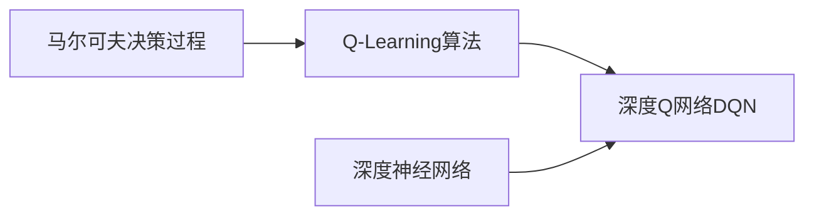
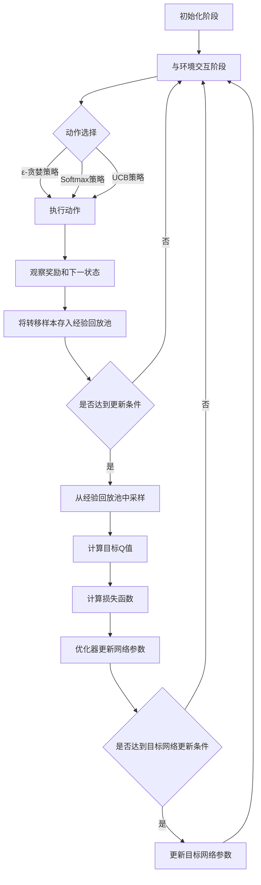

# 一切皆是映射：深度Q网络（DQN）在交通控制系统的应用

## 1.背景介绍

随着城市化进程的不断加快，交通拥堵已经成为全球性的难题。传统的交通控制系统已经难以应对日益复杂的交通状况。近年来，人工智能技术的快速发展为解决交通拥堵问题提供了新的思路。其中，深度强化学习（Deep Reinforcement Learning，DRL）因其强大的自主学习和决策能力而备受关注。深度Q网络（Deep Q-Network，DQN）作为DRL的代表性算法之一，在交通控制领域展现出了广阔的应用前景。

本文将深入探讨DQN在交通控制系统中的应用，揭示其背后的核心概念和算法原理，并通过实际项目案例和代码实现，为读者提供全面而深入的理解。我们还将展望DQN在交通控制领域的未来发展趋势和面临的挑战，为相关研究和应用提供参考和启示。

### 1.1 交通拥堵问题的现状与挑战

#### 1.1.1 城市化进程加剧交通压力
#### 1.1.2 传统交通控制系统的局限性
#### 1.1.3 智能交通控制的必要性

### 1.2 人工智能在交通控制中的应用

#### 1.2.1 机器学习在交通预测和优化中的应用
#### 1.2.2 深度学习在交通流量预测中的应用
#### 1.2.3 强化学习在交通信号控制中的应用

### 1.3 深度强化学习（DRL）的兴起

#### 1.3.1 强化学习的基本原理
#### 1.3.2 深度学习与强化学习的结合
#### 1.3.3 DRL在复杂决策问题中的优势

## 2.核心概念与联系

在深入探讨DQN算法之前，我们需要了解其背后的核心概念以及它们之间的联系。这将有助于我们更好地理解DQN的工作原理和应用价值。

### 2.1 马尔可夫决策过程（MDP）

#### 2.1.1 状态、动作和奖励的定义
#### 2.1.2 状态转移概率和奖励函数
#### 2.1.3 最优策略与值函数

### 2.2 Q-Learning算法

#### 2.2.1 Q值的定义和更新规则
#### 2.2.2 探索与利用的平衡
#### 2.2.3 Q-Learning的收敛性证明

### 2.3 深度神经网络（DNN）

#### 2.3.1 人工神经元与激活函数
#### 2.3.2 前馈神经网络的结构和训练
#### 2.3.3 卷积神经网络（CNN）和循环神经网络（RNN）

### 2.4 DQN的核心思想

#### 2.4.1 将Q值函数近似为深度神经网络
#### 2.4.2 经验回放（Experience Replay）机制
#### 2.4.3 目标网络（Target Network）的引入



## 3.核心算法原理具体操作步骤

在明确了DQN的核心概念后，我们将详细阐述其算法原理和具体操作步骤。通过对算法流程的分解和分析，读者将能够深入理解DQN的内部机制，为后续的实践应用奠定基础。

### 3.1 DQN算法流程概述

#### 3.1.1 初始化阶段
#### 3.1.2 与环境交互阶段
#### 3.1.3 网络更新阶段

### 3.2 状态表示与预处理

#### 3.2.1 状态空间的设计与编码
#### 3.2.2 状态预处理技术
#### 3.2.3 状态归一化与特征提取

### 3.3 动作选择策略

#### 3.3.1 ε-贪婪策略
#### 3.3.2 Softmax策略
#### 3.3.3 上限置信区间（UCB）策略

### 3.4 经验回放机制

#### 3.4.1 经验回放池的构建
#### 3.4.2 经验采样策略
#### 3.4.3 优先级经验回放（Prioritized Experience Replay）

### 3.5 目标网络更新

#### 3.5.1 目标网络的作用与必要性
#### 3.5.2 软更新与硬更新策略
#### 3.5.3 更新频率的选择

### 3.6 损失函数与优化算法

#### 3.6.1 均方误差损失函数
#### 3.6.2 Huber损失函数
#### 3.6.3 随机梯度下降（SGD）与Adam优化器



## 4.数学模型和公式详细讲解举例说明

为了更深入地理解DQN算法，我们需要对其背后的数学模型和公式进行详细的讲解和举例说明。通过对这些数学概念的掌握，读者将能够更好地把握DQN的理论基础，为算法的改进和创新提供思路。

### 4.1 马尔可夫决策过程的数学表示

#### 4.1.1 状态转移概率矩阵
#### 4.1.2 奖励函数的数学定义
#### 4.1.3 贝尔曼方程与最优值函数

状态转移概率矩阵$P$表示从状态$s$采取动作$a$后转移到状态$s'$的概率，数学上表示为：

$$P_{ss'}^a = P[S_{t+1}=s'|S_t=s, A_t=a]$$

奖励函数$R$表示在状态$s$下采取动作$a$后获得的即时奖励，数学上表示为：

$$R_s^a = E[R_{t+1}|S_t=s, A_t=a]$$

贝尔曼方程描述了状态的值函数$V(s)$与其后继状态的值函数之间的递归关系，数学上表示为：

$$V(s) = \max_a \left\{ R_s^a + \gamma \sum_{s'} P_{ss'}^a V(s') \right\}$$

其中，$\gamma$为折扣因子，用于平衡即时奖励和未来奖励的重要性。

### 4.2 Q-Learning的数学表达

#### 4.2.1 Q值的贝尔曼方程
#### 4.2.2 Q值更新公式的推导
#### 4.2.3 Q-Learning算法的收敛性证明

Q值函数$Q(s,a)$表示在状态$s$下采取动作$a$的期望累积奖励，其贝尔曼方程为：

$$Q(s,a) = R_s^a + \gamma \sum_{s'} P_{ss'}^a \max_{a'} Q(s',a')$$

Q-Learning算法通过以下更新公式来逼近最优Q值函数：

$$Q(s,a) \leftarrow Q(s,a) + \alpha \left[ R + \gamma \max_{a'} Q(s',a') - Q(s,a) \right]$$

其中，$\alpha$为学习率，控制每次更新的步长。

### 4.3 DQN的损失函数与优化目标

#### 4.3.1 均方误差损失函数的数学定义
#### 4.3.2 Huber损失函数的数学定义
#### 4.3.3 DQN的优化目标与梯度计算

DQN使用均方误差（MSE）作为损失函数，其数学定义为：

$$L(\theta) = E_{(s,a,r,s')\sim D} \left[ \left( r + \gamma \max_{a'} Q(s',a';\theta^-) - Q(s,a;\theta) \right)^2 \right]$$

其中，$\theta$为当前网络的参数，$\theta^-$为目标网络的参数，$D$为经验回放池。

Huber损失函数在MSE的基础上对较大的误差进行了截断，其数学定义为：

$$L_\delta(x) = \begin{cases} \frac{1}{2}x^2 & \text{if } |x| \leq \delta \\ \delta(|x|-\frac{1}{2}\delta) & \text{otherwise} \end{cases}$$

DQN的优化目标是最小化损失函数，即：

$$\min_\theta L(\theta)$$

通过梯度下降算法来更新网络参数，梯度计算公式为：

$$\nabla_\theta L(\theta) = E_{(s,a,r,s')\sim D} \left[ \left( r + \gamma \max_{a'} Q(s',a';\theta^-) - Q(s,a;\theta) \right) \nabla_\theta Q(s,a;\theta) \right]$$

### 4.4 目标网络更新的数学表示

#### 4.4.1 软更新策略的数学公式
#### 4.4.2 硬更新策略的数学公式
#### 4.4.3 更新频率对算法性能的影响

软更新策略通过以下公式来更新目标网络参数：

$$\theta^- \leftarrow \tau \theta + (1-\tau) \theta^-$$

其中，$\tau$为软更新系数，控制目标网络更新的速度。

硬更新策略则直接将当前网络参数复制给目标网络：

$$\theta^- \leftarrow \theta$$

硬更新通常以固定的频率进行，如每隔$C$步更新一次。

## 5.项目实践：代码实例和详细解释说明

为了将DQN算法应用于实际的交通控制系统，我们需要通过代码实现来验证其可行性和有效性。本节将提供一个基于Python和PyTorch的DQN交通信号控制项目，并对关键代码进行详细解释说明。

### 5.1 项目概述

#### 5.1.1 项目目标与评价指标
#### 5.1.2 交通环境的建模与模拟
#### 5.1.3 DQN算法的设计与实现

### 5.2 环境与网络构建

#### 5.2.1 交通环境类的定义与接口设计
#### 5.2.2 DQN网络结构的设计与实现
#### 5.2.3 经验回放池的实现

```python
class TrafficEnv(gym.Env):
    def __init__(self, config):
        # 初始化交通环境
        pass
    
    def reset(self):
        # 重置环境状态
        return state
    
    def step(self, action):
        # 执行动作，返回下一状态、奖励和是否结束
        return next_state, reward, done, info

class DQN(nn.Module):
    def __init__(self, state_dim, action_dim):
        super(DQN, self).__init__()
        # 定义网络结构
        self.fc1 = nn.Linear(state_dim, 64)
        self.fc2 = nn.Linear(64, 64)
        self.fc3 = nn.Linear(64, action_dim)
        
    def forward(self, x):
        x = F.relu(self.fc1(x))
        x = F.relu(self.fc2(x))
        x = self.fc3(x)
        return x

class ReplayBuffer:
    def __init__(self, capacity):
        self.buffer = deque(maxlen=capacity)
    
    def push(self, state, action, reward, next_state, done):
        self.buffer.append((state, action, reward, next_state, done))
    
    def sample(self, batch_size):
        samples = random.sample(self.buffer, batch_size)
        return zip(*samples)
```

### 5.3 训练与测试流程

#### 5.3.1 训练循环的实现
#### 5.3.2 ε-贪婪策略的实现
#### 5.3.3 网络更新与损失计算

```python
def train(env, agent, num_episodes, batch_size, gamma, tau, epsilon_start, epsilon_end, epsilon_decay):
    rewards = []
    epsilon = epsilon_start
    for episode in range(num_episodes):
        state = env.reset()
        episode_reward = 0
        done = False
        while not done:
            if random.random() < epsilon:
                action = env.action_space.sample()
            else:
                action = agent.get_action(state)
            next_state, reward, done, _ = env.step(action)
            agent.replay_buffer.push(state, action, reward, next_state, done