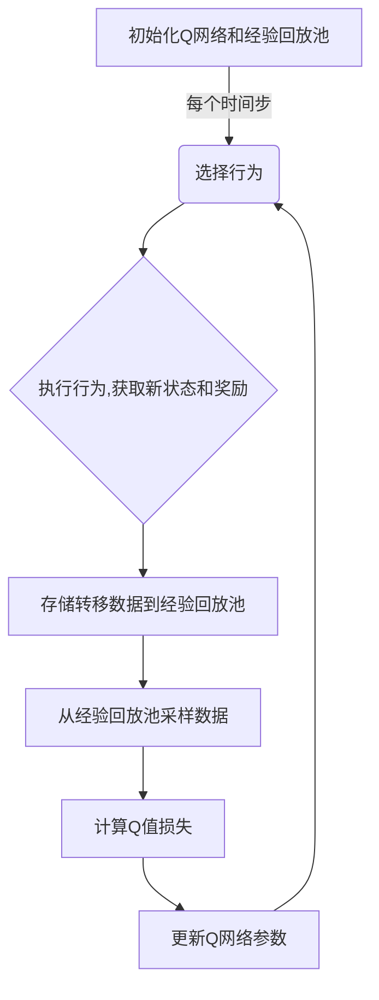
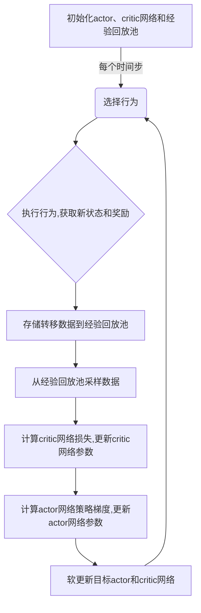

# 一切皆是映射：深度学习与游戏AI的结合

## 1. 背景介绍

### 1.1 游戏AI的发展历程

游戏AI是人工智能领域的一个重要分支,它的发展历程几乎与人工智能的发展同步。早期的游戏AI主要采用基于规则的方法,通过编写一系列规则来控制游戏中的角色行为。这种方法简单直观,但是灵活性和智能水平有限。

随着机器学习技术的兴起,游戏AI开始采用基于学习的方法。通过从大量游戏数据中学习,AI系统可以自主发现隐藏的规律和策略,从而展现出更加人性化和智能化的行为。其中,深度学习作为一种强大的机器学习方法,为游戏AI的发展注入了新的活力。

### 1.2 深度学习在游戏AI中的应用

深度学习凭借其强大的特征学习能力和端到端的训练方式,在游戏AI领域展现出了巨大的潜力。以下是深度学习在游戏AI中的一些典型应用:

- **游戏策略学习**: 通过深度强化学习,AI可以自主学习最优的游戏策略,例如AlphaGo在围棋领域的成就。
- **游戏内容生成**: 利用生成对抗网络(GAN)等技术,可以自动生成游戏关卡、角色模型等内容,提高游戏的多样性。
- **游戏玩家建模**: 通过分析玩家的行为数据,深度学习可以建立玩家模型,从而为个性化游戏体验提供支持。

## 2. 核心概念与联系

### 2.1 深度学习基础

深度学习是机器学习的一个重要分支,它的核心思想是通过构建深层神经网络模型,从原始数据中自动学习出多层次的特征表示。常见的深度学习模型包括卷积神经网络(CNN)、递归神经网络(RNN)和transformer等。

深度学习模型通常采用端到端的训练方式,可以直接从原始输入(如图像、文本等)学习到最终的输出,无需人工设计特征提取器。这种自动化的特征学习能力使得深度学习在计算机视觉、自然语言处理等领域取得了巨大的成功。

### 2.2 强化学习基础

强化学习是机器学习的另一个重要分支,它旨在学习一个智能体(Agent)在特定环境中采取何种行为序列,以maximizemaximize累积的奖励。强化学习的核心思想是通过试错和反馈,不断优化智能体的策略,使其能够在未知环境中做出正确的决策。

强化学习算法通常分为两大类:基于价值函数的算法(如Q-Learning)和基于策略梯度的算法(如REINFORCE)。前者旨在估计每个状态-行为对的价值函数,后者则直接优化策略模型的参数。

### 2.3 深度学习与强化学习的结合

深度强化学习(Deep Reinforcement Learning)是将深度学习与强化学习相结合的一种方法。在这种方法中,深度神经网络被用于逼近强化学习中的价值函数或策略模型,从而提高了模型的表示能力和泛化性能。

深度强化学习的一个典型代表是Deep Q-Network(DQN),它使用深度卷积神经网络来估计Q值函数,并通过经验回放和目标网络等技巧来提高训练的稳定性。另一个重要的代表是Deep Deterministic Policy Gradient(DDPG),它采用actor-critic架构,使用深度神经网络同时学习策略和价值函数。

深度强化学习在游戏AI领域取得了巨大的成功,例如AlphaGo、AlphaZero等系统在国际象棋、围棋等复杂游戏中展现出了超人的水平。

## 3. 核心算法原理具体操作步骤

### 3.1 深度Q网络(DQN)

Deep Q-Network(DQN)是深度强化学习中的一种经典算法,它使用深度神经网络来近似Q值函数,从而解决了传统Q-Learning算法在处理高维观测数据时的困难。DQN的核心思想是通过minimizemaximize损失函数来训练Q网络,使其输出的Q值尽可能接近真实的Q值。

DQN算法的具体步骤如下:

1. 初始化Q网络,通常使用卷积神经网络作为网络结构。
2. 初始化经验回放池,用于存储智能体与环境的交互数据。
3. 对于每一个时间步:
   a. 根据当前状态,使用Q网络选择行为(通常采用$\epsilon$-greedy策略)。
   b. 执行选择的行为,观测到新的状态和奖励。
   c. 将(状态,行为,奖励,新状态)的转移数据存入经验回放池。
   d. 从经验回放池中采样一批数据,计算目标Q值和当前Q值之间的损失。
   e. 使用优化算法(如随机梯度下降)minimizemaximize损失,更新Q网络的参数。
4. 重复步骤3,直到智能体达到所需的性能水平。

为了提高训练的稳定性和效率,DQN还引入了一些重要的技巧,如目标网络(target network)、双Q学习(double Q-learning)和优先经验回放(prioritized experience replay)等。



### 3.2 Deep Deterministic Policy Gradient(DDPG)

DDPG是另一种流行的深度强化学习算法,它采用actor-critic架构,使用深度神经网络同时学习策略(actor)和价值函数(critic)。DDPG可以处理连续动作空间的问题,在机器人控制、视频游戏等领域有广泛的应用。

DDPG算法的具体步骤如下:

1. 初始化actor网络(策略网络)和critic网络(价值网络),通常使用神经网络作为网络结构。
2. 初始化目标actor网络和目标critic网络,用于提高训练稳定性。
3. 初始化经验回放池,用于存储智能体与环境的交互数据。
4. 对于每一个时间步:
   a. 根据当前状态,使用actor网络选择行为。
   b. 执行选择的行为,观测到新的状态和奖励。
   c. 将(状态,行为,奖励,新状态)的转移数据存入经验回放池。
   d. 从经验回放池中采样一批数据。
   e. 使用采样数据,计算critic网络的损失,并更新critic网络的参数。
   f. 使用采样数据和critic网络的输出,计算actor网络的策略梯度,并更新actor网络的参数。
   g. 软更新目标actor网络和目标critic网络的参数。
5. 重复步骤4,直到智能体达到所需的性能水平。

DDPG算法的关键在于使用critic网络来估计价值函数,从而为actor网络提供策略梯度信号。同时,引入目标网络和经验回放池等技巧,可以提高训练的稳定性和效率。



## 4. 数学模型和公式详细讲解举例说明

### 4.1 Q-Learning

Q-Learning是一种基于价值函数的强化学习算法,它旨在学习一个状态-行为对的Q值函数,从而找到最优策略。Q值函数定义为在给定状态下采取某个行为,之后能获得的期望累积奖励。

Q-Learning算法的核心更新规则如下:

$$Q(s_t, a_t) \leftarrow Q(s_t, a_t) + \alpha \left[ r_t + \gamma \max_{a} Q(s_{t+1}, a) - Q(s_t, a_t) \right]$$

其中:

- $s_t$和$a_t$分别表示当前状态和行为
- $r_t$表示执行行为$a_t$后获得的即时奖励
- $\gamma$是折现因子,用于权衡即时奖励和未来奖励的重要性
- $\alpha$是学习率,控制Q值函数的更新速度

通过不断更新Q值函数,Q-Learning算法最终可以收敛到最优的Q值函数,从而找到最优策略。

### 4.2 Deep Q-Network(DQN)

Deep Q-Network(DQN)是将Q-Learning与深度学习相结合的一种算法。DQN使用深度神经网络来近似Q值函数,从而解决了传统Q-Learning在处理高维观测数据时的困难。

DQN的目标是minimizemaximize以下损失函数:

$$L(\theta) = \mathbb{E}_{(s, a, r, s')} \left[ \left( r + \gamma \max_{a'} Q(s', a'; \theta^-) - Q(s, a; \theta) \right)^2 \right]$$

其中:

- $\theta$表示Q网络的参数
- $\theta^-$表示目标Q网络的参数,用于提高训练稳定性
- $s, a, r, s'$分别表示状态、行为、奖励和新状态

通过minimizemaximize上述损失函数,DQN可以逐步优化Q网络的参数,使其输出的Q值尽可能接近真实的Q值。

### 4.3 Deep Deterministic Policy Gradient(DDPG)

DDPG是一种基于策略梯度的深度强化学习算法,它采用actor-critic架构,使用深度神经网络同时学习策略(actor)和价值函数(critic)。

DDPG的actor网络旨在maximizemaximize期望的累积奖励:

$$J(\theta^\mu) = \mathbb{E}_{s_t \sim \rho^\mu} \left[ Q^\mu(s_t, a_t) \right]$$

其中:

- $\theta^\mu$表示actor网络的参数
- $\rho^\mu$表示在策略$\mu$下的状态分布
- $Q^\mu$表示critic网络输出的Q值函数

为了优化actor网络的参数,DDPG采用策略梯度方法,梯度可以近似计算为:

$$\nabla_{\theta^\mu} J(\theta^\mu) \approx \mathbb{E}_{s_t \sim \rho^\mu} \left[ \nabla_{\theta^\mu} \mu(s_t | \theta^\mu) \nabla_a Q^\mu(s_t, a) |_{a=\mu(s_t)} \right]$$

同时,DDPG使用均方误差损失函数来优化critic网络的参数:

$$L(\theta^Q) = \mathbb{E}_{(s, a, r, s')} \left[ \left( Q(s, a | \theta^Q) - y \right)^2 \right]$$

其中:

- $\theta^Q$表示critic网络的参数
- $y = r + \gamma Q'(s', \mu'(s' | \theta^{\mu'}))$是目标Q值,使用目标actor网络和目标critic网络计算

通过交替优化actor网络和critic网络的参数,DDPG可以同时学习最优的策略和价值函数。

## 5. 项目实践：代码实例和详细解释说明

在这一部分,我们将提供一个基于PyTorch实现的DQN代码示例,用于解决经典的CartPole问题。CartPole是一个控制理论中的标准问题,目标是通过左右移动小车来保持杆子保持直立。

### 5.1 环境设置

首先,我们需要导入必要的库和定义一些超参数:

```python
import gym
import torch
import torch.nn as nn
import torch.optim as optim
import numpy as np

# 超参数设置
BATCH_SIZE = 32
GAMMA = 0.99
EPS_START = 0.9
EPS_END = 0.05
EPS_DECAY = 200
TARGET_UPDATE = 10

# 创建CartPole环境
env = gym.make('CartPole-v1')
```

### 5.2 深度Q网络

接下来,我们定义深度Q网络的结构:

```python
class DQN(nn.Module):
    def __init