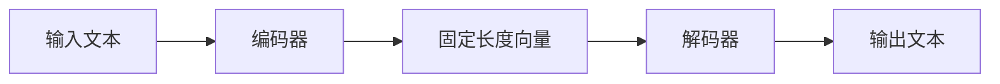
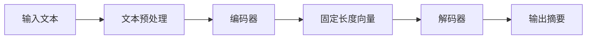

## 1.背景介绍

在我们的日常生活中，信息爆炸已经成为一种常态。无论是新闻报道，还是专业论文，都充斥着大量的文本信息。对于我们这些需要获取信息的人来说，如何在短时间内从海量的文本中提取出最重要的信息，成为了一个迫切的问题。这就是文本摘要生成的任务，它的目标是生成一个简洁、准确、完整的摘要，帮助我们快速理解原文的主要内容。近年来，深度学习技术在此领域取得了显著的进展。

## 2.核心概念与联系

深度学习是机器学习的一个子领域，它试图模拟人脑的工作原理，通过多层神经网络进行学习。在文本摘要生成任务中，我们通常使用的是一种特殊的神经网络结构——序列到序列（Seq2Seq）模型。Seq2Seq模型由两部分组成：编码器和解码器。编码器负责将输入的文本序列转化为一个固定长度的向量，解码器则将这个向量转化为新的文本序列。在这个过程中，编码器和解码器都会通过训练学习到如何最好地完成他们的任务。



## 3.核心算法原理具体操作步骤

在实际操作中，我们通常会首先对输入的文本进行预处理，包括分词、去除停用词等步骤。然后，我们会用编码器将处理后的文本转化为一个固定长度的向量。这个向量可以看作是文本的一种抽象表示，它捕捉了文本的主要信息。接着，我们会用解码器将这个向量转化为新的文本序列，也就是我们想要的摘要。在这个过程中，解码器会尽量保证生成的摘要既能反映原文的主要内容，又具有良好的可读性。



## 4.数学模型和公式详细讲解举例说明

在Seq2Seq模型中，我们通常使用的是循环神经网络（RNN）或者其变种，如长短期记忆网络（LSTM）或者门控循环单元（GRU）。这些网络的主要特点是能够处理变长的输入序列，并且能够在一定程度上记忆序列中的信息。

以RNN为例，其基本的计算公式如下：

$$
h_t = \sigma(W_{hh}h_{t-1} + W_{xh}x_t + b_h)
$$

$$
y_t = W_{hy}h_t + b_y
$$

其中，$h_t$是在时间$t$的隐藏状态，$x_t$是在时间$t$的输入，$y_t$是在时间$t$的输出，$W_{hh}$、$W_{xh}$、$W_{hy}$、$b_h$、$b_y$是模型的参数，$\sigma$是激活函数，通常使用的是tanh或者ReLU函数。

## 5.项目实践：代码实例和详细解释说明

接下来，让我们通过一个简单的例子来看看如何使用Python和TensorFlow实现一个Seq2Seq模型。

首先，我们需要导入必要的库，并定义一些参数：

```python
import tensorflow as tf
from tensorflow.keras.models import Model
from tensorflow.keras.layers import Input, LSTM, Dense

batch_size = 64
epochs = 100
latent_dim = 256
num_samples = 10000
```

然后，我们需要加载并预处理数据：

```python
input_texts = []
target_texts = []
input_characters = set()
target_characters = set()

# 加载数据...
# 预处理数据...
```

接着，我们可以定义我们的模型：

```python
# 定义编码器
encoder_inputs = Input(shape=(None, num_encoder_tokens))
encoder = LSTM(latent_dim, return_state=True)
encoder_outputs, state_h, state_c = encoder(encoder_inputs)
encoder_states = [state_h, state_c]

# 定义解码器
decoder_inputs = Input(shape=(None, num_decoder_tokens))
decoder_lstm = LSTM(latent_dim, return_sequences=True, return_state=True)
decoder_outputs, _, _ = decoder_lstm(decoder_inputs, initial_state=encoder_states)
decoder_dense = Dense(num_decoder_tokens, activation='softmax')
decoder_outputs = decoder_dense(decoder_outputs)

# 定义模型
model = Model([encoder_inputs, decoder_inputs], decoder_outputs)
```

最后，我们可以训练我们的模型，并用它来生成摘要：

```python
# 训练模型...
# 生成摘要...
```

## 6.实际应用场景

深度学习在文本摘要生成中的应用非常广泛。例如，新闻网站可以使用它来自动生成新闻摘要，帮助读者快速了解新闻的主要内容；科研人员可以使用它来自动生成论文摘要，帮助他们快速了解论文的主要研究成果；企业也可以使用它来自动生成报告摘要，帮助管理者快速了解报告的主要内容。

## 7.工具和资源推荐

如果你对深度学习在文本摘要生成中的应用感兴趣，以下是一些推荐的工具和资源：

- TensorFlow：一个强大的深度学习框架，提供了丰富的API和良好的社区支持。
- Keras：一个基于TensorFlow的高级深度学习框架，提供了更简洁的API，适合初学者使用。
- OpenNMT：一个专门用于神经网络机器翻译和神经序列学习的开源工具箱，提供了丰富的预训练模型和教程。

## 8.总结：未来发展趋势与挑战

尽管深度学习在文本摘要生成中的应用已经取得了显著的进展，但仍然面临一些挑战。例如，如何处理长文本、如何保证生成摘要的准确性、如何提高生成摘要的多样性等。未来的研究将会围绕这些问题展开，同时，我们也期待出现更多的创新算法和应用。

## 9.附录：常见问题与解答

1. 问题：为什么我们需要生成文本摘要？
   答：生成文本摘要可以帮助我们快速理解原文的主要内容，节省阅读时间。

2. 问题：什么是Seq2Seq模型？
   答：Seq2Seq模型是一种特殊的神经网络结构，由编码器和解码器组成，主要用于处理序列到序列的任务，如机器翻译、文本摘要生成等。

3. 问题：深度学习在文本摘要生成中的应用有哪些挑战？
   答：深度学习在文本摘要生成中的应用面临的挑战包括如何处理长文本、如何保证生成摘要的准确性、如何提高生成摘要的多样性等。

作者：禅与计算机程序设计艺术 / Zen and the Art of Computer Programming