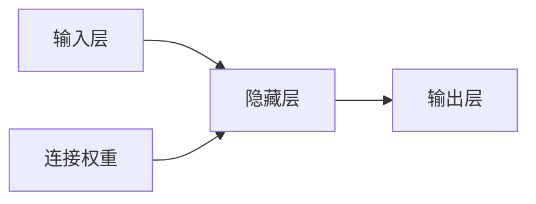
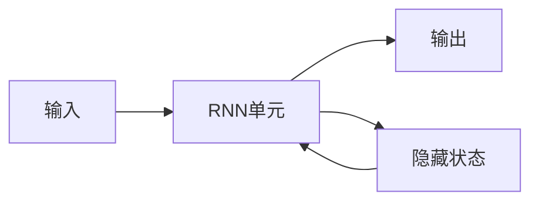

# 一切皆是映射：环境监测中的神经网络算法应用

## 1. 背景介绍

### 1.1 环境监测的重要性

随着工业化进程的不断推进,环境问题日益严峻,对环境质量的监测已经成为当务之急。环境监测不仅关系到人类的生存和发展,也对生态系统的可持续性产生深远影响。通过对大气、水体、土壤等环境要素的实时监测,我们可以及时发现环境污染问题,采取相应的治理措施,从而保护我们赖以生存的家园。

### 1.2 传统环境监测方法的局限性

传统的环境监测方法主要依赖于人工采样和化学分析,这种方式不仅费时费力,而且难以实现全面、连续的监测。随着监测对象的复杂性和监测范围的扩大,传统方法已经无法满足现代环境监测的需求。因此,亟需引入新的技术手段,以提高环境监测的效率和准确性。

### 1.3 神经网络在环境监测中的应用前景

近年来,神经网络技术在各个领域取得了令人瞩目的成就,环境监测领域也不例外。神经网络具有强大的数据处理能力和模式识别能力,可以从海量的环境数据中提取有价值的信息,并对复杂的环境系统进行建模和预测。与传统的统计模型相比,神经网络更加灵活和强大,能够捕捉数据中的非线性关系和隐藏模式。

本文将探讨神经网络在环境监测中的应用,包括核心概念、算法原理、数学模型、实际案例等,旨在为读者提供一个全面的认识。我们将看到,神经网络如何将环境监测过程中的各种要素映射到数字世界,从而实现智能化的环境质量评估和预测。

## 2. 核心概念与联系

### 2.1 神经网络的基本概念

神经网络是一种模拟生物神经系统的计算模型,由大量互相连接的神经元组成。每个神经元接收来自其他神经元的输入信号,经过加权求和和非线性激活函数的处理,产生自身的输出信号。神经网络通过调整神经元之间的连接权重,从而实现对输入数据的学习和模式识别。

上图展示了一个典型的前馈神经网络结构,包括输入层、隐藏层和输出层。输入层接收原始数据,隐藏层对数据进行非线性转换和特征提取,输出层给出最终的预测或分类结果。连接权重则决定了神经元之间信号传递的强度。

### 2.2 环境监测中的映射关系

在环境监测过程中,我们需要将各种环境要素映射到数字世界,以便进行数据处理和分析。例如,将空气中的污染物浓度、气象条件、地理位置等因素映射为一个多维向量,作为神经网络的输入。同时,我们也需要将监测目标(如空气质量指数)映射为神经网络的期望输出。通过训练,神经网络可以学习到输入和输出之间的映射关系,从而实现智能化的环境质量评估和预测。

$$
y = f(x_1, x_2, \ldots, x_n; \theta)
$$

上式中,$ y $表示环境质量指标的预测值,$ x_1, x_2, \ldots, x_n $表示影响因素,$ \theta $表示神经网络的参数(连接权重和偏置项),$ f $表示神经网络所学习的映射函数。

### 2.3 神经网络在环境监测中的优势

相比于传统的统计模型和机器学习算法,神经网络在环境监测领域具有以下优势:

1. **强大的非线性建模能力**:环境系统通常存在复杂的非线性关系,神经网络能够有效捕捉这些非线性模式。
2. **自动特征提取**:神经网络可以自动从原始数据中提取有意义的特征,无需人工设计特征。
3. **高维数据处理能力**:神经网络可以同时处理多个影响因素,适应环境监测的高维数据特点。
4. **可解释性**:通过可视化技术,我们可以解释神经网络内部的工作机制,提高模型的透明度。

## 3. 核心算法原理具体操作步骤

### 3.1 前馈神经网络

前馈神经网络是最基本的神经网络结构,它的工作原理如下:

1. **输入层**:接收原始数据,如空气质量监测站点的污染物浓度、气象条件等。
2. **隐藏层**:对输入数据进行非线性转换,提取有意义的特征。每个隐藏层神经元的输出是其输入的加权和,通过激活函数(如 ReLU、Sigmoid 等)进行非线性变换。
3. **输出层**:根据隐藏层的输出,计算最终的预测结果,如空气质量指数。
4. **反向传播**:将预测结果与实际值进行比较,计算损失函数(如均方误差)。利用梯度下降算法,沿着损失函数的负梯度方向,调整神经网络的连接权重和偏置项,使得预测结果逐步逼近实际值。
5. **迭代训练**:重复上述过程,直到模型收敛或达到预期的性能指标。

### 3.2 卷积神经网络

对于处理图像或时序数据,卷积神经网络(CNN)是一种非常有效的网络结构。在环境监测中,CNN 可以用于分析卫星遥感图像、地理信息数据等。CNN 的核心操作包括卷积和池化:

1. **卷积层**:通过滑动卷积核(一个小矩阵)在输入数据上,提取局部特征。卷积核的权重在训练过程中不断调整,以提取最有意义的特征。
2. **池化层**:对卷积层的输出进行下采样,减小数据维度,提高计算效率。常用的池化方式包括最大池化和平均池化。
3. **全连接层**:将卷积层和池化层的输出展平,送入全连接层进行最终的分类或回归任务。

CNN 能够有效地捕捉数据的局部模式和空间关系,在图像分类、目标检测等任务中表现出色。在环境监测中,CNN 可以用于识别土地利用类型、检测污染源等。

### 3.3 循环神经网络

对于处理序列数据,如时间序列数据,循环神经网络(RNN)是一种常用的网络结构。在环境监测中,RNN 可以用于预测未来的污染物浓度变化、气象条件等。

RNN 的核心思想是引入循环连接,使得网络能够记住过去的状态,并将其与当前输入相结合,产生新的状态和输出。常见的 RNN 变体包括长短期记忆网络(LSTM)和门控循环单元(GRU),它们通过引入门控机制,有效解决了传统 RNN 存在的梯度消失/爆炸问题。

上图展示了 RNN 的基本结构。在每个时间步,RNN 单元接收当前输入和上一时间步的隐藏状态,计算当前时间步的输出和新的隐藏状态。通过这种递归方式,RNN 能够捕捉序列数据中的长期依赖关系。

在环境监测中,我们可以将历史数据(如污染物浓度、气象条件等)作为 RNN 的输入序列,预测未来的环境质量指标。RNN 还可以与其他网络结构(如 CNN)相结合,形成更加强大的混合模型。

## 4. 数学模型和公式详细讲解举例说明

### 4.1 前馈神经网络的数学模型

前馈神经网络的数学模型可以表示为:

$$
y = f_L(W_L f_{L-1}(W_{L-1} \ldots f_1(W_1 x + b_1) \ldots + b_{L-1}) + b_L)
$$

其中:

- $x$ 是输入向量,维度为 $n$
- $y$ 是输出向量,维度为 $m$
- $L$ 是神经网络的层数
- $W_l$ 是第 $l$ 层的权重矩阵,维度为 $d_l \times d_{l-1}$
- $b_l$ 是第 $l$ 层的偏置向量,维度为 $d_l$
- $f_l$ 是第 $l$ 层的激活函数,如 ReLU、Sigmoid 等

对于单层神经网络,其数学表达式为:

$$
y = f(W x + b)
$$

其中 $f$ 是激活函数,如 Sigmoid 函数:

$$
f(z) = \frac{1}{1 + e^{-z}}
$$

或 ReLU 函数:

$$
f(z) = \max(0, z)
$$

在训练过程中,我们需要通过优化算法(如梯度下降)来调整权重矩阵 $W$ 和偏置向量 $b$,使得输出 $y$ 逐步逼近期望值。

### 4.2 卷积神经网络的数学模型

卷积神经网络的核心操作是卷积和池化。

**卷积操作**:

假设输入为二维图像 $I$,卷积核为 $K$,卷积操作可以表示为:

$$
S(i, j) = (I * K)(i, j) = \sum_{m} \sum_{n} I(i+m, j+n) K(m, n)
$$

其中 $S$ 是卷积后的特征图,$(i, j)$ 是特征图上的位置,$(m, n)$ 是卷积核的维度。

**池化操作**:

池化操作通常在卷积后的特征图上进行,目的是降低数据维度,提高计算效率。最大池化和平均池化是两种常见的池化方式。

对于最大池化,公式为:

$$
\text{max\_pool}(B)_{i,j} = \max_{(i',j') \in R_{i,j}} B_{i',j'}
$$

其中 $B$ 是输入特征图,$(i, j)$ 是池化后特征图上的位置,$ R_{i,j} $是以 $(i, j)$ 为中心的池化区域。

对于平均池化,公式为:

$$
\text{avg\_pool}(B)_{i,j} = \frac{1}{|R_{i,j}|} \sum_{(i',j') \in R_{i,j}} B_{i',j'}
$$

其中 $|R_{i,j}|$ 表示池化区域的大小。

通过交替使用卷积和池化操作,CNN 能够逐步提取输入数据的局部特征和全局特征,最终实现对输入数据的分类或回归任务。

### 4.3 循环神经网络的数学模型

循环神经网络的核心思想是引入循环连接,使得网络能够记住过去的状态。对于一个简单的 RNN 单元,其数学表达式为:

$$
h_t = f_h(W_{hx} x_t + W_{hh} h_{t-1} + b_h) \\
y_t = f_y(W_{yh} h_t + b_y)
$$

其中:

- $x_t$ 是时间步 $t$ 的输入
- $h_t$ 是时间步 $t$ 的隐藏状态
- $y_t$ 是时间步 $t$ 的输出
- $W_{hx}$、$W_{hh}$、$W_{yh}$ 分别是输入权重矩阵、递归权重矩阵和输出权重矩阵
- $b_h$、$b_y$ 分别是隐藏层和输出层的偏置项
- $f_h$、$f_y$ 分别是隐藏层和输出层的激活函数

在实际应用中,我们通常使用更加复杂的 RNN 变体,如 LSTM 和 GRU,以解决传统 RNN 存在的梯度消失/爆炸问题。

以 LSTM 为例,其数学模型为:

$$
\begin{aligned}
f_t &= \sigma(W_f x_t + U_f h_{t-1} + b_f) \\
i_t