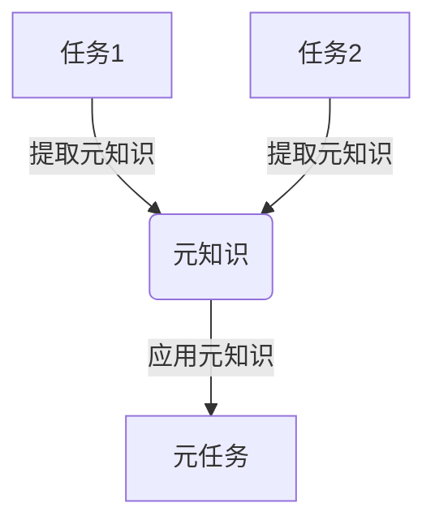
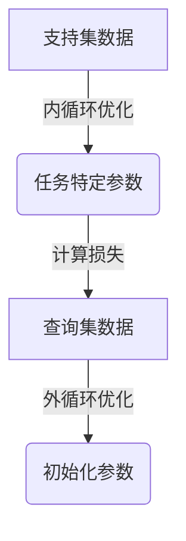
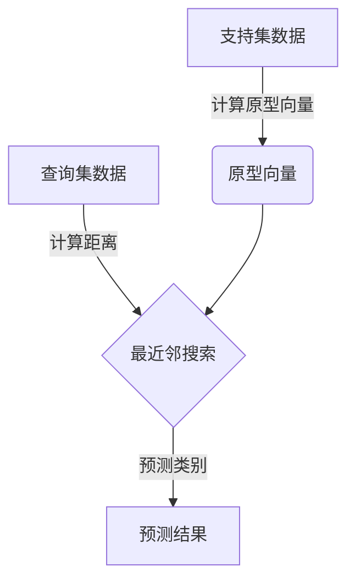
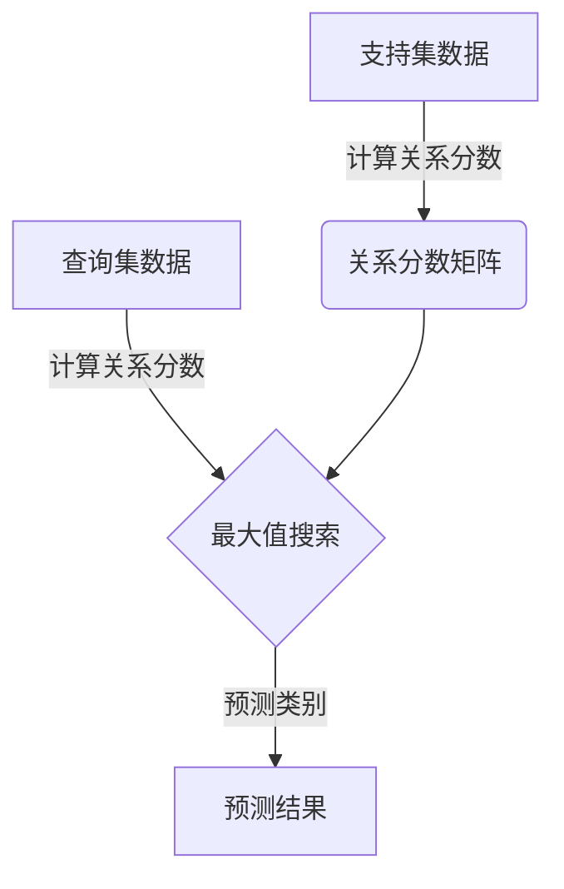
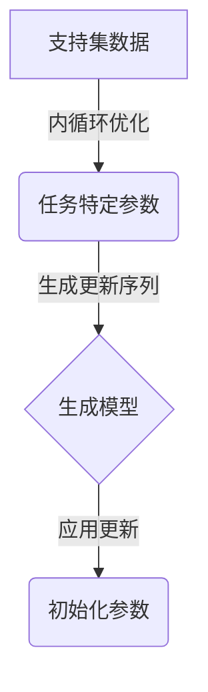

# 一切皆是映射：用元学习预测未来金融市场

## 1. 背景介绍

### 1.1. 金融市场的重要性和挑战

金融市场是现代经济的核心组成部分,其健康运行对于个人投资、企业融资以及整个社会的经济发展至关重要。然而,金融市场的复杂性和动态性使得准确预测未来走势成为一项艰巨的挑战。传统的预测方法往往依赖于人工分析和经验判断,存在着主观性和滞后性的问题。

### 1.2. 人工智能在金融领域的应用

随着人工智能技术的不断发展,越来越多的金融机构开始探索将人工智能应用于金融预测和决策过程中。人工智能算法能够从海量历史数据中发现隐藏的模式和规律,并基于这些规律进行预测和决策。然而,传统的机器学习算法也面临着一些挑战,例如需要大量的标注数据、缺乏泛化能力和可解释性等。

### 1.3. 元学习的崛起

元学习(Meta-Learning)作为一种新兴的人工智能范式,旨在解决传统机器学习算法的局限性。元学习算法能够从多个相关任务中学习元知识,并将这些元知识应用于新的任务上,从而提高了算法的泛化能力和数据效率。近年来,元学习在计算机视觉、自然语言处理等领域取得了令人瞩目的成就,但在金融领域的应用还相对较少。

## 2. 核心概念与联系

### 2.1. 元学习的核心思想

元学习的核心思想是将机器学习过程本身作为一个学习问题。传统的机器学习算法通过优化模型参数来适应特定的任务,而元学习算法则试图学习一种通用的策略,使得模型能够快速适应新的任务。

### 2.2. 任务、元任务和元知识

在元学习中,我们将每个具体的预测或决策问题称为一个"任务"。元学习算法需要从多个相关的任务中学习"元知识",这些元知识包括了任务之间的共性和规律。一旦获得了元知识,算法就能够快速适应新的任务,这个过程被称为"元任务"。

### 2.3. 元学习在金融预测中的应用

将元学习应用于金融预测领域,我们可以将不同的金融指标、不同的时间段或不同的市场视为不同的任务。元学习算法能够从这些任务中学习到通用的规律和模式,例如周期性、趋势性等,并将这些规律应用于新的预测任务上,从而提高预测的准确性和泛化能力。

### 2.4. 映射的概念

在元学习中,我们经常会将任务、元知识和元任务之间的关系抽象为一种映射关系。任务到元知识的映射过程被称为"内循环",而元知识到元任务的映射过程被称为"外循环"。这种映射关系使得元学习算法能够在不同的任务之间进行知识迁移和泛化。

## 3. 核心算法原理具体操作步骤

### 3.1. 基于优化的元学习算法

基于优化的元学习算法是最早提出的一类元学习算法,其核心思想是将内循环和外循环都视为优化问题。具体来说,内循环优化任务特定的模型参数,而外循环优化一种能够快速适应新任务的初始化策略或优化策略。

#### 3.1.1. MAML算法

MAML(Model-Agnostic Meta-Learning)算法是基于优化的元学习算法的代表。它的核心思想是通过求解一个双层优化问题,来获得一个能够快速适应新任务的初始化参数。

在内循环中,MAML算法使用支持集(Support Set)数据对模型参数进行几步梯度更新,得到任务特定的参数$\theta_i'$:

$$\theta_i' = \theta - \alpha \nabla_\theta \mathcal{L}_{\mathcal{D}_i^{tr}}(\theta)$$

其中$\mathcal{D}_i^{tr}$表示第$i$个任务的支持集数据,$\alpha$是内循环的学习率。

在外循环中,MAML算法使用查询集(Query Set)数据,计算任务特定参数$\theta_i'$在所有任务上的总损失,并对初始参数$\theta$进行梯度更新:

$$\theta \leftarrow \theta - \beta \nabla_\theta \sum_{i=1}^{N} \mathcal{L}_{\mathcal{D}_i^{val}}(\theta_i')$$

其中$\mathcal{D}_i^{val}$表示第$i$个任务的查询集数据,$\beta$是外循环的学习率。

通过这种双层优化过程,MAML算法能够找到一个初始化参数$\theta$,使得模型在经过少量梯度更新后,就能够快速适应新的任务。

#### 3.1.2. 其他基于优化的算法

除了MAML算法之外,还有一些其他的基于优化的元学习算法,如Reptile算法、ANIL算法等。这些算法在具体的优化方式上有所不同,但核心思想都是通过优化一种能够快速适应新任务的策略。

### 3.2. 基于度量的元学习算法

基于度量的元学习算法则采取了一种不同的思路。它们试图学习一种度量空间,使得相似的任务在该空间中彼此靠近,而不同的任务则相距较远。一旦获得了这种度量空间,我们就可以通过简单的最近邻搜索,来快速适应新的任务。

#### 3.2.1. 原型网络

原型网络(Prototypical Networks)是基于度量的元学习算法的代表。它的核心思想是将每个类别用一个原型向量(Prototype Vector)表示,这个原型向量是该类别所有样本的平均嵌入向量。

在内循环中,原型网络使用支持集数据计算每个类别的原型向量:

$$c_k = \frac{1}{|S_k|} \sum_{(x_i, y_i) \in S_k} f_\phi(x_i)$$

其中$S_k$表示第$k$类的支持集数据,$f_\phi$是一个嵌入函数,用于将输入映射到一个向量空间中。

在外循环中,原型网络通过最小化查询集数据与原型向量之间的距离,来优化嵌入函数$f_\phi$的参数$\phi$。具体来说,对于一个查询样本$x_q$,我们计算它与每个原型向量的距离,并将其预测为最近的那个原型所对应的类别:

$$\hat{y}_q = \arg\min_k d(f_\phi(x_q), c_k)$$

其中$d$是一种距离度量,如欧氏距离或余弦距离。通过这种方式,原型网络能够学习到一个良好的嵌入空间,使得相似的任务彼此靠近。

#### 3.2.2. 关系网络

关系网络(Relation Networks)是另一种基于度量的元学习算法。它的核心思想是学习一种能够捕捉任务之间关系的度量函数。

在内循环中,关系网络使用支持集数据计算每个样本与每个类别之间的关系分数:

$$r_{i,k} = g_\phi(f_\phi(x_i), c_k)$$

其中$f_\phi$是一个嵌入函数,用于将输入映射到一个向量空间中;$c_k$是第$k$类的原型向量;$g_\phi$是一个关系函数,用于计算样本与原型之间的关系分数。

在外循环中,关系网络通过最大化查询集数据的正确关系分数,来优化嵌入函数$f_\phi$和关系函数$g_\phi$的参数。具体来说,对于一个查询样本$x_q$,我们计算它与每个类别的关系分数,并将其预测为分数最高的那个类别:

$$\hat{y}_q = \arg\max_k r_{q,k}$$

通过这种方式,关系网络能够学习到一种能够捕捉任务之间关系的度量函数,从而实现快速适应新任务的目标。

### 3.3. 基于生成模型的元学习算法

除了基于优化和基于度量的算法之外,还有一类基于生成模型的元学习算法。这些算法试图直接生成能够解决新任务的模型参数或优化策略。

#### 3.3.1. 神经优化器

神经优化器(Neural Optimizer)是基于生成模型的元学习算法的代表。它的核心思想是使用一个生成模型(如递归神经网络或注意力模型)来生成优化新任务所需的参数更新序列。

在内循环中,神经优化器使用支持集数据对模型参数进行几步梯度更新,得到任务特定的参数$\theta_i'$。

在外循环中,神经优化器使用一个生成模型$g_\phi$,根据任务特定的参数$\theta_i'$和初始参数$\theta$,生成一个参数更新序列$\Delta\theta_i$:

$$\Delta\theta_i = g_\phi(\theta_i', \theta)$$

然后,我们使用这个参数更新序列来优化初始参数$\theta$,使得它能够快速适应新的任务:

$$\theta \leftarrow \theta + \Delta\theta_i$$

通过这种方式,神经优化器能够直接生成解决新任务所需的优化策略,从而实现快速适应的目标。

#### 3.3.2. 基于超网络的方法

另一种基于生成模型的方法是使用超网络(Hypernetwork)来生成解决新任务所需的模型参数。超网络是一种特殊的神经网络,它的输入是任务描述符(Task Descriptor),输出是另一个神经网络的参数。

在内循环中,超网络使用支持集数据计算任务描述符。

在外循环中,超网络根据任务描述符生成解决该任务所需的模型参数。然后,我们使用这些生成的参数来预测查询集数据,并基于预测结果优化超网络的参数。

通过这种方式,超网络能够直接生成解决新任务所需的模型参数,从而实现快速适应的目标。

### 3.4. 其他元学习算法

除了上述几种主要的元学习算法之外,还有一些其他的元学习算法,如基于强化学习的方法、基于概率模型的方法等。这些算法在具体的实现方式上有所不同,但核心思想都是试图从多个相关任务中学习元知识,并将这些元知识应用于新的任务上。

## 4. 数学模型和公式详细讲解举例说明

在上一节中,我们介绍了几种主要的元学习算法,并给出了它们的核心公式和流程图。现在,我们将对其中一些关键公式进行更详细的讲解和举例说明。

### 4.1. MAML算法中的双层优化问题

在MAML算法中,我们需要求解一个双层优化问题,即内循环优化任务特定参数,外循环优化初始化参数。具体来说,在内循环中,我们使用支持集数据对模型参数进行几步梯度更新,得