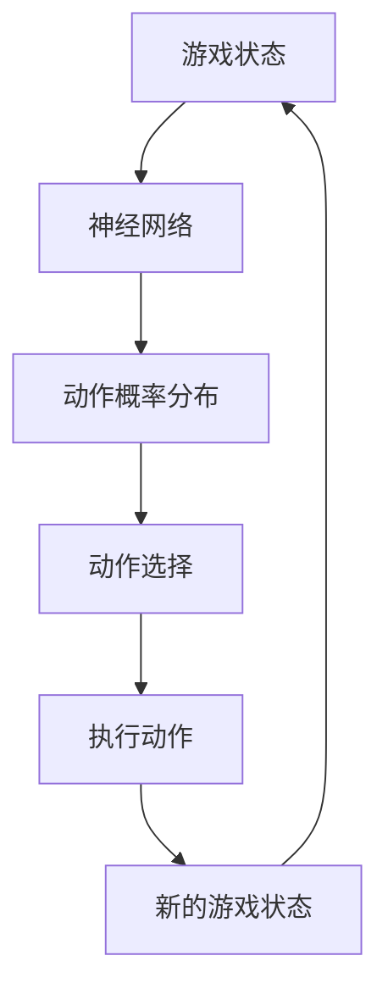

# 一切皆是映射：神经网络在游戏AI中的创新实践

## 1.背景介绍
### 1.1 游戏AI发展历程
### 1.2 神经网络技术的兴起 
### 1.3 神经网络在游戏AI中的应用现状

## 2.核心概念与联系
### 2.1 神经网络基本原理
#### 2.1.1 人工神经元模型
#### 2.1.2 网络结构与层次
#### 2.1.3 激活函数与损失函数
### 2.2 神经网络与游戏AI的关系
#### 2.2.1 游戏状态空间与决策映射
#### 2.2.2 端到端学习与自主决策
#### 2.2.3 泛化能力与适应性

## 3.核心算法原理具体操作步骤
### 3.1 深度Q网络(DQN)
#### 3.1.1 Q学习基础
#### 3.1.2 DQN网络结构设计
#### 3.1.3 经验回放与目标网络
### 3.2 策略梯度(Policy Gradient) 
#### 3.2.1 策略网络与价值网络
#### 3.2.2 蒙特卡洛策略梯度(REINFORCE)
#### 3.2.3 近端策略优化(PPO)
### 3.3 自学习(Self-Play)
#### 3.3.1 自博弈强化学习
#### 3.3.2 AlphaZero算法
#### 3.3.3 纳什均衡与最优策略

## 4.数学模型和公式详细讲解举例说明 
### 4.1 MDP与Bellman方程
#### 4.1.1 马尔可夫决策过程(MDP)
#### 4.1.2 状态价值函数与动作价值函数
#### 4.1.3 Bellman最优方程
### 4.2 策略梯度定理推导
#### 4.2.1 期望与梯度
#### 4.2.2 对数似然trick
#### 4.2.3 策略梯度定理
### 4.3 自学习中的纳什均衡证明
#### 4.3.1 纳什均衡定义
#### 4.3.2 最优反应与最优策略
#### 4.3.3 纳什均衡存在性证明

## 5.项目实践：代码实例和详细解释说明
### 5.1 基于PyTorch的DQN实现
#### 5.1.1 环境接口封装
#### 5.1.2 Q网络定义
#### 5.1.3 训练循环与测试
### 5.2 基于TensorFlow的PPO实现  
#### 5.2.1 并行环境采样
#### 5.2.2 Actor-Critic网络设计
#### 5.2.3 PPO损失函数与更新
### 5.3 AlphaZero的PyTorch实现
#### 5.3.1 蒙特卡洛树搜索
#### 5.3.2 残差网络设计
#### 5.3.3 自学习训练流程

## 6.实际应用场景
### 6.1 棋类游戏
#### 6.1.1 国际象棋
#### 6.1.2 围棋
#### 6.1.3 中国象棋
### 6.2 电子游戏 
#### 6.2.1 Atari游戏
#### 6.2.2 Dota 2
#### 6.2.3 星际争霸
### 6.3 其他领域
#### 6.3.1 无人驾驶
#### 6.3.2 智能助手
#### 6.3.3 推荐系统

## 7.工具和资源推荐
### 7.1 深度学习框架
#### 7.1.1 TensorFlow
#### 7.1.2 PyTorch
#### 7.1.3 Keras
### 7.2 强化学习平台 
#### 7.2.1 OpenAI Gym
#### 7.2.2 Unity ML-Agents
#### 7.2.3 MuJoCo
### 7.3 开源项目
#### 7.3.1 OpenAI Baselines
#### 7.3.2 Dopamine
#### 7.3.3 RLlib

## 8.总结：未来发展趋势与挑战
### 8.1 从感知到推理的跨越
### 8.2 多智能体协作与对抗
### 8.3 跨领域迁移学习
### 8.4 安全性与可解释性
### 8.5 算力与样本效率瓶颈

## 9.附录：常见问题与解答
### 9.1 如何选择适合的神经网络结构？
### 9.2 如何克服稀疏奖励问题？
### 9.3 探索与利用的平衡有哪些策略？
### 9.4 off-policy和on-policy算法的区别是什么？
### 9.5 自学习容易陷入局部最优吗？如何避免？

在游戏AI领域，神经网络被广泛应用于构建端到端的决策系统。上图展示了一个简单的基于神经网络的游戏AI决策流程。游戏当前状态首先被编码成神经网络的输入表示，然后通过神经网络的前向计算，输出一个动作的概率分布。接着根据该分布采样或选择一个具体的动作，执行该动作后游戏进入新的状态，整个循环不断进行下去，使得AI通过与环境的交互来学习和优化自己的策略。

神经网络擅长处理高维输入数据，并自动提取有效特征。通过端到端的学习，神经网络可以直接将原始的游戏状态映射到最优的动作或动作分布上，避免了手工设计特征和规则的繁琐。同时，得益于深度神经网络强大的函数拟合能力，神经网络可以刻画非常复杂的策略函数，挖掘出游戏中的高级策略。

传统的游戏AI往往依赖于人工设计的特征和规则，难以应对复杂多变的游戏环境。而基于神经网络的AI可以通过不断与环境互动，从经验中学习和进化，展现出惊人的智能和适应性。AlphaGo系列、OpenAI Five等里程碑式的成果充分证明了神经网络在构建超人级游戏AI上的潜力。

当然，训练高质量的游戏AI仍然面临不少挑战。其中最主要的是训练样本的稀疏性问题，特别是在奖励稀疏的情况下，AI很难获得有效的学习信号。此外，神经网络容易过拟合有限的训练数据，泛化能力有待提高。对于复杂的策略空间，目前的神经网络结构和优化算法还不够高效。这些问题需要研究者们不断创新算法，改进模型，提升数据利用效率。

未来，游戏AI有望从感知层面的智能走向推理层面的智能，实现多智能体的协作与博弈，展现出更加灵活智能的行为。同时，游戏中积累的AI技术也将反哺到其他实际应用领域，让机器在更广阔的任务上展现智能。

总之，神经网络是游戏AI的一把利剑，它以端到端学习和自适应能力 颠覆了传统的游戏AI开发范式。纵观当前热点的游戏AI技术，从AlphaGo到OpenAI Five，从国际象棋到星际争霸，几乎无一例外都以神经网络作为核心构件。可以预见，随着算法的演进、算力的进步，神经网络 将继续引领游戏AI的发展，创造出更多令人惊艳的成果。让我们拭目以待，见证人工智能在游戏领域的新篇章。

作者：禅与计算机程序设计艺术 / Zen and the Art of Computer Programming