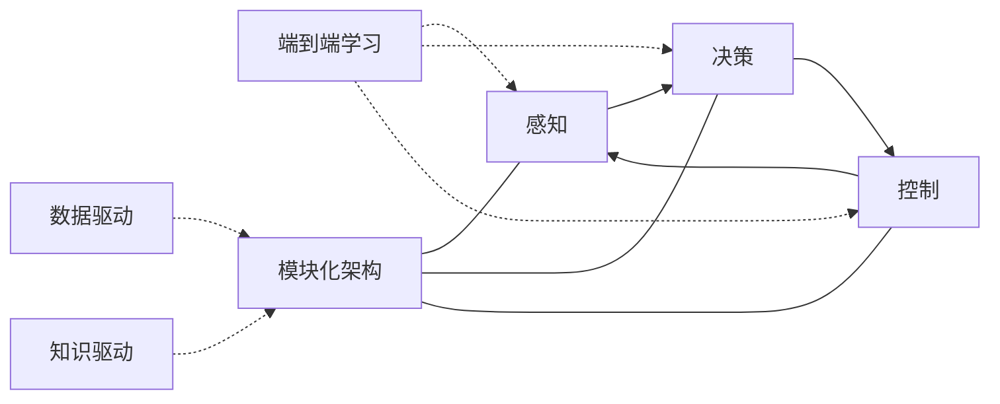

# 一切皆是映射：自动驾驶技术中的AI算法

## 1. 背景介绍

自动驾驶技术正在快速发展,它有望彻底改变我们的出行方式。在自动驾驶系统中,人工智能(AI)算法扮演着关键角色。这些算法能够实时处理海量的传感器数据,并做出精准的决策和控制,使得无人驾驶成为可能。本文将深入探讨自动驾驶技术中的核心AI算法,揭示其内在原理和机制。

### 1.1 自动驾驶的发展现状
#### 1.1.1 全球主要企业布局
#### 1.1.2 技术成熟度与挑战
#### 1.1.3 政策法规与社会接受度

### 1.2 自动驾驶系统的架构
#### 1.2.1 感知层
#### 1.2.2 决策层  
#### 1.2.3 控制层

### 1.3 AI算法在自动驾驶中的重要性
#### 1.3.1 复杂场景下的环境感知
#### 1.3.2 实时精准的决策规划
#### 1.3.3 车辆运动的最优控制

## 2. 核心概念与联系

在深入探讨自动驾驶中的AI算法之前,我们需要理解几个核心概念以及它们之间的联系。

### 2.1 感知-决策-控制闭环
自动驾驶系统可以看作一个感知-决策-控制的闭环。感知通过各类传感器获取车辆周围的环境信息,决策根据感知结果进行路径规划和行为决策,控制则执行决策的结果,通过油门、刹车、转向等操作控制车辆运动。

### 2.2 端到端学习与模块化架构
端到端学习试图建立从感知到控制的直接映射,而模块化架构则将系统拆分为感知、决策、控制等独立的模块。目前业界主流采用模块化架构,但也有一些研究尝试端到端方法。

### 2.3 数据驱动与知识驱动
数据驱动方法通过海量数据训练AI模型,代表性的是深度学习。知识驱动方法则通过人工设计的规则和模型来解决问题,如传统控制理论。现代自动驾驶系统往往是两者的结合。

下图展示了自动驾驶系统的核心概念以及它们之间的关系:

## 3. 核心算法原理具体操作步骤

自动驾驶中的核心AI算法可以分为感知、决策、控制三大类。下面我们分别进行讨论。

### 3.1 感知算法
感知的目标是获取车辆周围环境的信息,主要任务包括定位、检测、跟踪、语义分割等。

#### 3.1.1 视觉感知
视觉是感知的主要来源。典型的视觉感知任务有:
1. 车道线检测:使用语义分割网络如ENet实时分割出车道线。
2. 交通标志检测:使用目标检测网络如YOLOv3检测交通标志。
3. 障碍物检测与跟踪:使用3D目标检测网络如PointPillars检测障碍物,并用卡尔曼滤波等算法跟踪。

#### 3.1.2 激光雷达感知
激光雷达提供精确的3D信息。常见任务有:
1. 3D障碍物检测:将点云输入VoxelNet等网络检测障碍物的3D边界框。  
2. 点云语义分割:使用PointNet++等网络对点云进行逐点分类。
3. 激光雷达与视觉融合:将两种传感器的优势结合,实现更鲁棒的感知。

#### 3.1.3 定位与建图
1. 激光雷达SLAM:同时定位与建图,代表算法有LOAM、LeGO-LOAM等。
2. 视觉SLAM:ORB-SLAM2是其中杰出代表。
3. 惯性导航与GPS融合:用卡尔曼滤波融合IMU和GPS信息,实现精确定位。

### 3.2 决策算法
决策负责根据感知信息进行路径规划和行为决策,是自动驾驶的大脑。

#### 3.2.1 路径规划
1. 全局路径规划:给定起点和终点,规划一条全局路径。主要方法有A*、RRT等。
2. 局部路径规划:在全局路径的基础上,考虑动态障碍物,生成平滑安全的局部轨迹。典型算法有动态窗口法、混合A*等。

#### 3.2.2 行为决策
1. 有限状态机:将驾驶行为抽象为有限个状态,如跟车、变道等,状态之间通过特定条件触发转移。
2. 马尔可夫决策过程:将决策建模为MDP,通过求解最优策略做出行为决策。
3. 强化学习:通过与环境的交互学习最优行为策略,代表算法有DQN、DDPG等。

#### 3.2.3 预测
预测交通参与者的未来轨迹对安全至关重要。常见方法有:
1. 物理模型:假设匀速运动等物理模型,对轨迹进行预测。
2. 机器学习:用神经网络等从数据中学习预测模型。
3. 交互式预测:同时预测多个交通参与者,考虑其交互。

### 3.3 控制算法
控制根据决策的结果,输出油门、刹车、转向等控制指令,保证车辆平稳、精准地执行决策。

#### 3.3.1 纵向控制
1. PID控制:根据目标速度和实际速度的差值,用PID控制器计算油门和刹车。
2. 巡航控制:在纵向保持安全车距的同时,跟随前车速度或保持设定速度。
3. 自适应巡航控制(ACC):在传统巡航控制的基础上,实时调整速度以保持安全车距。

#### 3.3.2 横向控制
1. 横向偏差PID控制:根据车辆横向偏离参考轨迹的距离,用PID控制方向盘转角。
2. 预瞄(Preview)控制:根据前方若干预瞄点的位置,提前计算转角,实现平滑跟踪。
3. 车辆动力学模型控制:如基于二自由度模型的最优控制,考虑车辆动力学特性。

#### 3.3.3 综合控制
1. MPC控制:在一个时间窗口内预测车辆轨迹,求解最优控制序列,可同时实现纵向和横向控制。
2. 智能PID:用神经网络等学习PID控制器参数,实现自适应控制。

## 4. 数学模型和公式详细讲解举例说明

本节选取几个典型的算法,详细讲解其背后的数学原理。

### 4.1 卡尔曼滤波
卡尔曼滤波广泛用于自动驾驶中的感知、定位与跟踪。其核心思想是:用一个线性高斯系统来建模被跟踪对象的运动,并用最小均方误差准则递归地估计系统状态。

考虑线性高斯系统:
$$
\begin{aligned}
\mathbf{x}_{k} &=\mathbf{F}_{k} \mathbf{x}_{k-1}+\mathbf{B}_{k} \mathbf{u}_{k}+\mathbf{w}_{k} \\
\mathbf{z}_{k} &=\mathbf{H}_{k} \mathbf{x}_{k}+\mathbf{v}_{k}
\end{aligned}
$$
其中$\mathbf{x}_k$是k时刻的系统状态,$\mathbf{z}_k$是观测值,$\mathbf{w}_k$和$\mathbf{v}_k$分别是过程噪声和观测噪声,满足高斯分布。

卡尔曼滤波可分为预测和更新两个步骤:

预测:
$$
\begin{aligned}
\hat{\mathbf{x}}_{k \mid k-1} &=\mathbf{F}_{k} \hat{\mathbf{x}}_{k-1 \mid k-1}+\mathbf{B}_{k} \mathbf{u}_{k} \\
\mathbf{P}_{k \mid k-1} &=\mathbf{F}_{k} \mathbf{P}_{k-1 \mid k-1} \mathbf{F}_{k}^{T}+\mathbf{Q}_{k}
\end{aligned}
$$

更新:
$$
\begin{aligned}
\mathbf{K}_{k} &=\mathbf{P}_{k \mid k-1} \mathbf{H}_{k}^{T}\left(\mathbf{H}_{k} \mathbf{P}_{k \mid k-1} \mathbf{H}_{k}^{T}+\mathbf{R}_{k}\right)^{-1} \\
\hat{\mathbf{x}}_{k \mid k} &=\hat{\mathbf{x}}_{k \mid k-1}+\mathbf{K}_{k}\left(\mathbf{z}_{k}-\mathbf{H}_{k} \hat{\mathbf{x}}_{k \mid k-1}\right) \\
\mathbf{P}_{k \mid k} &=\left(\mathbf{I}-\mathbf{K}_{k} \mathbf{H}_{k}\right) \mathbf{P}_{k \mid k-1}
\end{aligned}
$$

其中$\mathbf{K}_k$称为卡尔曼增益,$\mathbf{P}$是状态估计的协方差矩阵。

举例来说,对于匀速运动模型,状态向量可取为$\mathbf{x}=[p_x,p_y,v_x,v_y]^T$,即物体在x和y方向上的位置和速度。状态转移矩阵为:

$$
\mathbf{F}=\left[\begin{array}{cccc}
1 & 0 & \Delta t & 0 \\
0 & 1 & 0 & \Delta t \\
0 & 0 & 1 & 0 \\
0 & 0 & 0 & 1
\end{array}\right]
$$

观测矩阵为:
$$
\mathbf{H}=\left[\begin{array}{llll}
1 & 0 & 0 & 0 \\
0 & 1 & 0 & 0
\end{array}\right]
$$
即观测值只包含位置信息。

### 4.2 A*搜索
A*广泛用于自动驾驶的路径规划。其核心是启发式搜索,每次搜索代价最小的节点,直到找到目标。

定义节点的总代价为:
$$
f(n)=g(n)+h(n)
$$
其中$g(n)$为从起点到节点n的实际代价,$h(n)$为节点n到目标的估计代价,即启发函数。

A*算法流程如下:
1. 初始化开集合和闭集合。
2. 将起点加入开集合,计算$f$值。
3. 从开集合选取$f$值最小的节点n,将其移至闭集合。
4. 如果节点n为目标,则找到路径,算法结束。
5. 否则,扩展节点n的所有子节点,计算它们的$g$值和$f$值,加入开集合。
6. 回到步骤3,直到开集合为空(无解)或找到目标。

举例来说,对于车辆导航,可将道路网格化为一张图。$g(n)$可以是从起点到n的实际距离,而$h(n)$可以是n到目标的直线距离(欧几里得距离或曼哈顿距离)。

### 4.3 PID控制
PID是自动驾驶中最常用的反馈控制器,用于纵向控制和横向控制。

PID控制器的输出由三部分组成:
$$
u(t)=K_p e(t)+K_i \int_{0}^{t} e(\tau) d \tau+K_d \frac{d e(t)}{d t}
$$
其中$e(t)$是跟踪误差,即目标值与实际值之差。$K_p,K_i,K_d$分别是比例、积分、微分系数。

离散化后,PID控制器可表示为:
$$
u(k)=K_p e(k)+K_i \sum_{j=0}^{k} e(j) \Delta t+K_d \frac{e(k)-e(k-1)}{\Delta t}
$$

举例来说,对于车辆的横向控制,可令: