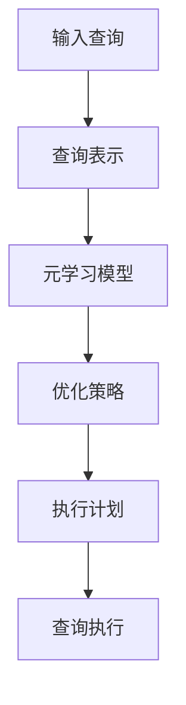

# 一切皆是映射：面向复杂查询的数据库优化通过元学习

## 1. 背景介绍

### 1.1 数据库优化的重要性

在当今大数据时代,数据量呈指数级增长,对数据库系统的性能要求也与日俱增。高效的数据库查询优化对于确保系统的响应速度和可扩展性至关重要。传统的查询优化器通常依赖于成本模型和查询重写规则,但这些方法在处理复杂查询时往往效率低下,无法充分利用查询之间的相似性。

### 1.2 元学习在数据库优化中的应用

元学习(Meta-Learning)是机器学习领域的一个新兴方向,旨在从过去的经验中学习,以更好地适应新的任务。在数据库优化领域,元学习可以帮助查询优化器从历史查询中学习,从而更好地优化新的查询。通过捕获查询之间的相似性和模式,元学习可以显著提高查询优化的效率和质量。

## 2. 核心概念与联系

### 2.1 查询优化的挑战

查询优化是一个NP难问题,涉及查找最优执行计划的组合搜索。随着查询复杂度的增加,搜索空间呈指数级增长,传统的基于规则和成本模型的优化器难以有效处理。此外,查询优化器通常缺乏从历史查询中学习的能力,无法利用查询之间的相似性。

### 2.2 元学习在查询优化中的作用

元学习可以帮助查询优化器从历史查询中学习,捕获查询之间的相似性和模式。通过建立查询表示和优化策略之间的映射,元学习可以为新的查询快速生成高质量的执行计划,从而提高查询优化的效率和质量。

### 2.3 映射的概念

在本文中,我们将查询优化视为一种映射问题。具体而言,我们需要建立从查询表示到优化策略的映射,以便为新的查询快速生成高质量的执行计划。这种映射可以通过元学习从历史查询中学习得到。

## 3. 核心算法原理具体操作步骤

我们提出了一种基于元学习的查询优化框架,其核心算法原理如下:



### 3.1 查询表示

首先,我们需要将输入查询转换为适当的表示形式,以便后续的元学习模型处理。常用的查询表示方法包括:

1. **查询树表示**: 将查询表示为一棵树,其中节点表示查询操作符,边表示操作符之间的依赖关系。
2. **查询向量表示**: 将查询编码为一个固定长度的向量,通过embedding技术捕获查询的语义信息。

### 3.2 元学习模型

接下来,我们利用元学习模型从历史查询中学习查询表示和优化策略之间的映射。常用的元学习模型包括:

1. **基于记忆的元学习**: 通过最近邻搜索在历史查询中查找相似的查询及其优化策略。
2. **基于优化的元学习**: 通过梯度下降等优化算法直接学习映射函数。
3. **基于模型的元学习**: 利用神经网络等模型来学习映射函数。

### 3.3 优化策略生成

通过元学习模型,我们可以为新的查询生成优化策略。优化策略可以包括:

1. **查询重写规则**: 通过等价变换将查询转换为更优的形式。
2. **物化视图选择**: 选择适当的物化视图来加速查询执行。
3. **索引选择**: 选择合适的索引以提高查询性能。

### 3.4 执行计划生成

根据生成的优化策略,我们可以构建查询的执行计划。执行计划描述了查询的具体执行步骤和操作符之间的数据流。

### 3.5 查询执行

最后,我们执行生成的执行计划,并返回查询结果。

## 4. 数学模型和公式详细讲解举例说明

在元学习模型中,我们需要学习一个映射函数 $f$,将查询表示 $x$ 映射到优化策略 $y$:

$$f: x \mapsto y$$

### 4.1 基于记忆的元学习

在基于记忆的元学习中,我们利用最近邻搜索来查找相似的历史查询及其优化策略。具体来说,给定一个新的查询表示 $x_q$,我们计算它与历史查询表示 $x_i$ 之间的距离 $d(x_q, x_i)$,并选择距离最小的 $k$ 个历史查询及其对应的优化策略 $y_i$。然后,我们可以通过一些聚合函数(如加权平均)来生成新的优化策略 $y_q$:

$$y_q = \sum_{i=1}^k w_i y_i$$

其中,权重 $w_i$ 可以根据距离 $d(x_q, x_i)$ 计算得到。

### 4.2 基于优化的元学习

在基于优化的元学习中,我们直接学习一个映射函数 $f_\theta$,其中 $\theta$ 是需要优化的参数。我们可以定义一个损失函数 $\mathcal{L}$,衡量预测的优化策略 $f_\theta(x)$ 与真实优化策略 $y$ 之间的差异:

$$\mathcal{L}(\theta) = d(f_\theta(x), y)$$

其中,距离函数 $d$ 可以是均方误差、交叉熵等。我们可以通过梯度下降等优化算法来最小化损失函数,从而学习映射函数的参数 $\theta$。

### 4.3 基于模型的元学习

在基于模型的元学习中,我们利用神经网络等模型来学习映射函数。例如,我们可以使用编码器-解码器模型,其中编码器将查询表示 $x$ 编码为一个隐藏状态 $h$,解码器则根据隐藏状态 $h$ 生成优化策略 $y$:

$$h = \text{Encoder}(x)$$
$$y = \text{Decoder}(h)$$

我们可以通过监督学习的方式,在训练数据集上优化编码器和解码器的参数,使得生成的优化策略 $y$ 尽可能接近真实的优化策略。

## 5. 项目实践:代码实例和详细解释说明

为了更好地理解元学习在查询优化中的应用,我们提供了一个基于PyTorch的代码示例。

### 5.1 查询表示

在本示例中,我们将查询表示为一个固定长度的向量,并使用预训练的Word2Vec模型对查询进行embedding。具体代码如下:

```python
import gensim

# 加载预训练的Word2Vec模型
model = gensim.models.Word2Vec.load('word2vec.model')

def query_embedding(query):
    """
    将查询转换为向量表示
    """
    tokens = query.split()
    embeddings = [model.wv[token] for token in tokens]
    return sum(embeddings) / len(embeddings)
```

### 5.2 元学习模型

我们使用一个简单的前馈神经网络作为元学习模型,将查询表示映射到优化策略。优化策略在本示例中是一个离散值,表示选择哪种查询重写规则。

```python
import torch
import torch.nn as nn

class MetaLearner(nn.Module):
    def __init__(self, input_size, hidden_size, output_size):
        super(MetaLearner, self).__init__()
        self.fc1 = nn.Linear(input_size, hidden_size)
        self.relu = nn.ReLU()
        self.fc2 = nn.Linear(hidden_size, output_size)

    def forward(self, x):
        out = self.fc1(x)
        out = self.relu(out)
        out = self.fc2(out)
        return out
```

### 5.3 训练和测试

我们使用一些示例数据对元学习模型进行训练,并在测试集上评估其性能。

```python
# 示例数据
queries = [
    "SELECT * FROM table1 JOIN table2 ON table1.id = table2.id",
    "SELECT COUNT(*) FROM table1 WHERE column1 > 10",
    # ...
]

labels = [0, 1, ...]  # 对应的优化策略标签

# 将查询转换为向量表示
X = [query_embedding(q) for q in queries]
X = torch.tensor(X, dtype=torch.float)

# 标签
y = torch.tensor(labels, dtype=torch.long)

# 创建元学习模型
model = MetaLearner(input_size=100, hidden_size=64, output_size=3)

# 定义损失函数和优化器
criterion = nn.CrossEntropyLoss()
optimizer = torch.optim.Adam(model.parameters(), lr=0.001)

# 训练模型
for epoch in range(100):
    optimizer.zero_grad()
    outputs = model(X)
    loss = criterion(outputs, y)
    loss.backward()
    optimizer.step()

# 测试模型
with torch.no_grad():
    test_queries = [
        "SELECT * FROM table1 WHERE column2 = 'value'",
        # ...
    ]
    test_X = [query_embedding(q) for q in test_queries]
    test_X = torch.tensor(test_X, dtype=torch.float)
    test_outputs = model(test_X)
    _, predicted = torch.max(test_outputs.data, 1)
    print(predicted)  # 预测的优化策略
```

在上述示例中,我们首先将查询转换为向量表示,然后使用一个简单的前馈神经网络作为元学习模型。在训练阶段,我们优化模型参数,使得模型能够从查询表示中预测正确的优化策略。在测试阶段,我们可以使用训练好的模型为新的查询生成优化策略。

需要注意的是,这只是一个简单的示例,实际应用中的元学习模型可能会更加复杂,需要处理更多种类的优化策略,并且查询表示方法也可能更加先进。但是,该示例展示了元学习在查询优化中的基本思路和实现方式。

## 6. 实际应用场景

元学习在查询优化领域有着广泛的应用前景,可以应用于以下几个场景:

### 6.1 云数据库服务

在云数据库服务中,查询负载通常是动态变化的,需要快速响应不同的查询模式。元学习可以帮助查询优化器快速适应新的查询模式,生成高质量的执行计划,从而提高系统的响应能力和资源利用率。

### 6.2 物联网数据管理

物联网设备产生了大量的时序数据,对数据库系统的查询性能提出了新的挑战。元学习可以通过学习时序数据的模式,优化相关的查询执行,提高物联网数据管理的效率。

### 6.3 科学数据分析

科学计算领域往往涉及复杂的数据分析查询,传统的查询优化器难以有效处理。元学习可以通过捕获科学数据的特征和查询模式,生成高效的执行计划,加速科学数据分析的过程。

### 6.4 业务智能分析

在业务智能领域,用户通常会提出各种复杂的分析查询,对数据库系统的性能要求很高。元学习可以根据历史查询经验,为新的分析查询生成优化的执行计划,提高业务智能分析的效率。

## 7. 工具和资源推荐

在实现基于元学习的查询优化系统时,可以利用以下工具和资源:

- **PyTorch**: 一个流行的深度学习框架,可以用于构建和训练元学习模型。
- **Gensim**: 一个用于处理文本数据的Python库,可以用于查询表示的embedding。
- **TensorFlow**: 另一个流行的深度学习框架,也可以用于构建元学习模型。
- **LeeOR**: 一个开源的查询优化器,可以作为基础系统进行扩展和改进。
- **HyPE**: 一个用于查询性能预测的基准测试套件,可以用于评估元学习模型的性能。

此外,还有一些相关的研究论文和开源项目可供参考,如:

- "Learning to Optimize Join Queries With Deep Reinforcement Learning" (SIGMOD 2018)
- "Neo: A Learned Query Optimizer" (VLDB 2021)
- "Reinforcement Learning for Automatic Database Management System Tuning" (ICDE 2020)

## 8. 总结:未来发展趋势与挑战

元学习在查询优化领域展现出了巨大的潜力,但也面