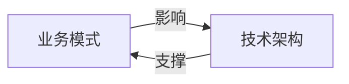

## 1.背景介绍

在当前的互联网时代，电商、O2O、支付等泛交易领域已经成为我们生活中不可或缺的一部分。然而，随着业务体量的不断扩大，如何有效地处理海量的交易数据，保证系统的稳定性和可扩展性，已经成为了这些领域面临的重要挑战。为了解决这些问题，业界已经形成了一些成熟的业务模式和技术架构。

## 2.核心概念与联系

在中大型体量的电商、O2O、支付等泛交易领域，业务模式和技术架构是相互关联的。业务模式主要包括B2C、B2B、C2C、O2O等，而技术架构则主要包括分布式架构、微服务架构、服务网格架构等。



## 3.核心算法原理具体操作步骤

在处理海量交易数据时，我们通常会采用分布式系统。分布式系统的核心算法原理主要包括分布式哈希、一致性哈希、分布式事务等。

例如，一致性哈希算法可以将数据均匀地分布到多个节点上，当新增或移除节点时，只需要重新分配少量的数据，从而保证系统的高可用性和可扩展性。

## 4.数学模型和公式详细讲解举例说明

一致性哈希算法的数学模型可以用函数来描述。设 $f(x)$ 为哈希函数，$x$ 为数据，$y$ 为哈希值，$n$ 为节点数，我们可以得到以下公式：

$$
y = f(x) \mod n
$$

例如，当我们有10个节点，需要存储数据 "hello" 时，我们可以通过哈希函数计算出哈希值，然后对节点数取模，得到数据应该存储的节点。

## 5.项目实践：代码实例和详细解释说明

以下是一段使用一致性哈希算法存储数据的Python代码示例：

```python
import hashlib

def hash_func(data):
    return int(hashlib.md5(data.encode()).hexdigest(), 16)

def store_data(data, nodes):
    node = hash_func(data) % len(nodes)
    nodes[node].store(data)

class Node:
    def __init__(self):
        self.data = []

    def store(self, data):
        self.data.append(data)

nodes = [Node() for _ in range(10)]
store_data("hello", nodes)
```

## 6.实际应用场景

在电商、O2O、支付等泛交易领域，一致性哈希算法广泛应用于分布式缓存、分布式数据库等系统。

## 7.工具和资源推荐

推荐使用Apache Hadoop、Apache Kafka、Apache Cassandra等开源分布式系统。这些系统都内置了一致性哈希等分布式算法，可以方便地处理海量交易数据。

## 8.总结：未来发展趋势与挑战

随着业务体量的不断扩大，我们需要更高效的算法和架构来处理海量交易数据。未来的发展趋势可能会更加注重系统的实时性、智能性和安全性。同时，如何处理数据的隐私和合规问题，也将是一个重要的挑战。

## 9.附录：常见问题与解答

Q: 为什么选择一致性哈希算法？

A: 一致性哈希算法可以将数据均匀地分布到多个节点上，当新增或移除节点时，只需要重新分配少量的数据，从而保证系统的高可用性和可扩展性。

作者：禅与计算机程序设计艺术 / Zen and the Art of Computer Programming