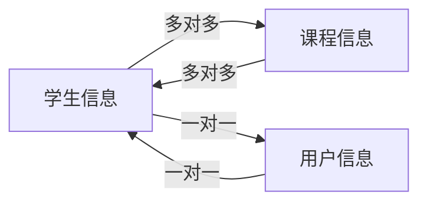

## 1.背景介绍

在当今信息化社会，学籍管理系统已成为中学教育管理的重要组成部分。它通过自动化的方式，帮助学校管理学生的基本信息、成绩、行为等数据，提高了管理效率，同时也为家长、老师和学生自身提供了方便的查询和操作方式。本文将详细介绍一个中学学生学籍管理系统的设计与实现过程。

## 2.核心概念与联系

学籍管理系统的核心概念包括学生信息、课程信息、成绩信息和用户信息四个部分。学生信息包括学号、姓名、性别、年级等基本信息；课程信息包括课程编号、课程名称、学分等；成绩信息则包括学生的学号、课程编号和成绩；用户信息则包括用户的账号、密码和角色（学生、老师或管理员）。

这四个部分之间的联系如下：

- 学生信息与课程信息通过成绩信息关联，每个学生可以选择多个课程，每个课程可以有多个学生选择，他们之间的关系是多对多的关系；
- 用户信息与学生信息关联，每个用户对应一个学生信息，他们之间的关系是一对一的关系。



## 3.核心算法原理具体操作步骤

学籍管理系统的核心算法主要包括数据的增删改查操作。下面我们以学生信息的增加为例，介绍其操作步骤：

1. 用户登录系统，选择“添加学生信息”功能；
2. 系统显示添加学生信息的表单，用户输入学生的学号、姓名、性别、年级等信息；
3. 用户提交表单，系统验证输入的信息是否完整、是否符合规则；
4. 如果验证通过，系统将新的学生信息保存到数据库，然后返回操作成功的提示；
5. 如果验证不通过，系统返回错误信息，用户需要修改输入的信息后重新提交。

## 4.数学模型和公式详细讲解举例说明

在学籍管理系统中，我们需要计算学生的平均成绩。假设学生选择了 $n$ 门课程，每门课程的成绩为 $score_i$，课程的学分为 $credit_i$，那么学生的平均成绩可以用下面的公式计算：

$$
\bar{score} = \frac{\sum_{i=1}^{n} score_i \times credit_i}{\sum_{i=1}^{n} credit_i}
$$

## 5.项目实践：代码实例和详细解释说明

下面我们以 Python 和 Flask 框架为例，实现一个简单的学籍管理系统。首先，我们需要定义学生、课程和成绩的数据模型：

```python
class Student(db.Model):
    __tablename__ = 'students'
    id = db.Column(db.Integer, primary_key=True)
    name = db.Column(db.String(64), index=True)
    gender = db.Column(db.String(64))
    grade = db.Column(db.String(64))

class Course(db.Model):
    __tablename__ = 'courses'
    id = db.Column(db.Integer, primary_key=True)
    name = db.Column(db.String(64), index=True)
    credit = db.Column(db.Float)

class Score(db.Model):
    __tablename__ = 'scores'
    id = db.Column(db.Integer, primary_key=True)
    student_id = db.Column(db.Integer, db.ForeignKey('students.id'))
    course_id = db.Column(db.Integer, db.ForeignKey('courses.id'))
    score = db.Column(db.Float)
```

然后，我们可以实现添加学生信息的功能：

```python
@app.route('/add_student', methods=['GET', 'POST'])
def add_student():
    form = StudentForm()
    if form.validate_on_submit():
        student = Student(name=form.name.data, gender=form.gender.data, grade=form.grade.data)
        db.session.add(student)
        db.session.commit()
        flash('学生信息添加成功！')
        return redirect(url_for('index'))
    return render_template('add_student.html', form=form)
```

## 6.实际应用场景

学籍管理系统广泛应用于各级学校，通过自动化的方式，帮助学校管理学生的基本信息、成绩、行为等数据，提高了管理效率，同时也为家长、老师和学生自身提供了方便的查询和操作方式。

## 7.工具和资源推荐

- Python：一种简单易学的编程语言，适合初学者学习；
- Flask：一个轻量级的 Web 框架，适合小型项目和初学者使用；
- SQLite：一个轻量级的数据库，适合小型项目和初学者使用；
- SQLAlchemy：一个 Python 的 ORM 框架，可以方便地操作数据库。

## 8.总结：未来发展趋势与挑战

随着信息化技术的发展，学籍管理系统将更加智能化、个性化。例如，通过数据分析，系统可以自动预测学生的学习情况，为老师和家长提供参考；通过人工智能，系统可以提供更加个性化的服务，如智能推荐课程等。但同时，也面临数据安全、隐私保护等挑战。

## 9.附录：常见问题与解答

1. 问：如何保证学籍管理系统的数据安全？
   答：可以通过设置权限、加密数据、备份数据等方式保证数据安全。

2. 问：如何保证学籍管理系统的用户隐私？
   答：可以通过匿名化处理、权限设置等方式保证用户隐私。

作者：禅与计算机程序设计艺术 / Zen and the Art of Computer Programming