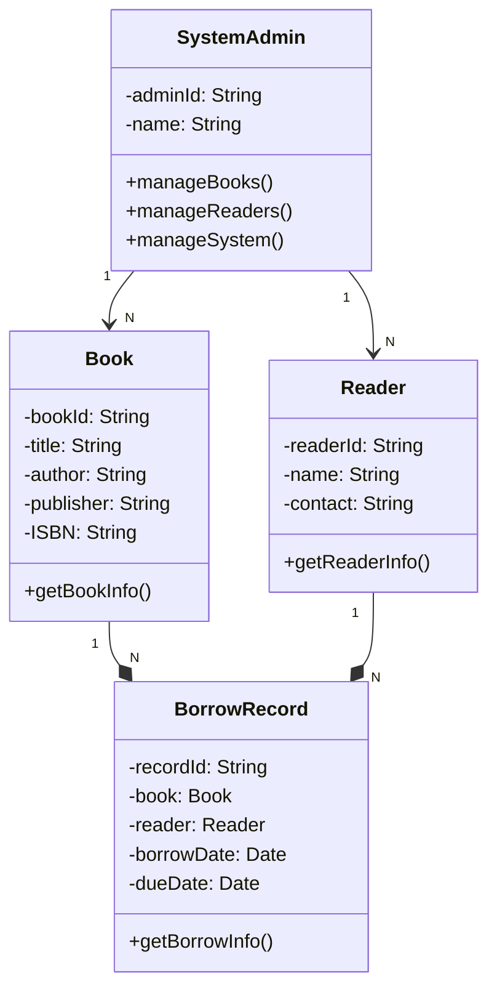

# 书店图书管理系统详细设计与具体代码实现

## 1.背景介绍

### 1.1 图书管理系统的重要性

在当今信息时代,图书作为知识和文化的载体,在各个领域都扮演着重要角色。图书管理系统的建立不仅可以为读者提供更好的阅读体验,也可以帮助图书管理员更高效地管理图书资源。

一个完善的图书管理系统通常包括图书入库、查询、借阅、归还等多个模块,涉及多方面的功能需求。因此,设计和实现一个高效、安全、易用的图书管理系统对于图书馆、书店等单位来说是非常重要的。

### 1.2 系统开发的挑战

在开发图书管理系统时,我们需要面临以下几个主要挑战:

1. **数据管理**:如何高效地存储和检索大量图书信息?
2. **用户体验**:如何为不同角色的用户(读者、管理员等)提供友好的界面和操作流程?
3. **系统安全**:如何防止恶意攻击和数据泄露?
4. **可扩展性**:系统需要具备良好的可扩展性,以适应未来的新需求。

## 2.核心概念与联系

在深入探讨系统设计之前,我们需要了解一些核心概念及其之间的关系。

### 2.1 核心概念

- **图书(Book)**: 包含书名、作者、出版社、ISBN号等基本信息。
- **读者(Reader)**: 拥有借阅图书的权限,包含姓名、联系方式等个人信息。
- **借阅记录(BorrowRecord)**: 记录读者借阅图书的详细信息,如借阅时间、应还时间等。
- **系统管理员(SystemAdmin)**: 拥有最高权限,可以管理图书、读者信息,并进行系统设置。

### 2.2 概念关系

我们可以使用UML类图来直观地展示核心概念之间的关系:



如上图所示,一本图书可以被多个读者借阅,因此`Book`和`BorrowRecord`之间是一对多关系。同理,一个读者也可以借阅多本图书,所以`Reader`和`BorrowRecord`也是一对多关系。

`SystemAdmin`类拥有管理图书、读者信息以及系统设置的方法,与`Book`和`Reader`类存在关联关系。

## 3.核心算法原理具体操作步骤

在图书管理系统中,我们需要实现多个核心功能模块,每个模块都涉及一些算法和具体的操作步骤。

### 3.1 图书入库

当新书到货时,管理员需要将其录入系统。图书入库的主要步骤如下:

1. 检查图书是否已存在于系统中(根据ISBN号或书名进行查询)。
2. 如果不存在,则创建新的`Book`对象,并将其添加到图书列表中。
3. 如果已存在,则更新该书的库存数量。

这个过程可以使用以下伪代码表示:

```
function addBook(book):
    if bookExists(book.ISBN) or bookExists(book.title):
        existingBook = findBook(book.ISBN or book.title)
        existingBook.updateStock(+1)
    else:
        bookList.add(book)
```

### 3.2 图书查询

读者和管理员都可以根据不同条件查询图书信息。常见的查询方式包括:

- 按书名查询
- 按作者查询
- 按出版社查询
- 按ISBN号查询

我们可以使用线性查找或者更高效的数据结构(如哈希表)来实现查询功能。以按书名查询为例,伪代码如下:

```
function searchBookByTitle(title):
    results = []
    for book in bookList:
        if book.title.contains(title):
            results.add(book)
    return results
```

### 3.3 图书借阅

当读者希望借阅某本书时,需要执行以下步骤:

1. 检查读者是否有借阅权限(是否存在逾期未还的情况)。
2. 检查该书是否有库存。
3. 如果条件满足,则创建新的`BorrowRecord`对象,并更新图书库存。

伪代码如下:

```
function borrowBook(reader, book):
    if reader.canBorrow() and book.hasStock():
        borrowRecord = new BorrowRecord(reader, book)
        borrowRecord.calculateDueDate()
        book.updateStock(-1)
        reader.addBorrowRecord(borrowRecord)
        return True
    else:
        return False
```

### 3.4 图书归还

当读者归还图书时,需要执行以下步骤:

1. 查找对应的`BorrowRecord`对象。
2. 检查是否逾期,如果逾期则计算罚金。
3. 更新图书库存,删除`BorrowRecord`对象。

伪代码如下:

```
function returnBook(borrowRecord):
    book = borrowRecord.book
    if borrowRecord.isOverdue():
        fine = calculateFine(borrowRecord)
    book.updateStock(+1)
    reader.removeBorrowRecord(borrowRecord)
    return fine
```

## 4.数学模型和公式详细讲解举例说明

在图书管理系统中,我们可能需要使用一些数学模型和公式来计算特定的值,例如罚金金额。

### 4.1 计算罚金金额

当读者逾期归还图书时,通常需要支付一定的罚金。我们可以使用以下公式来计算罚金金额:

$$
\text{Fine} = \text{OverdueDays} \times \text{FineRate} + \text{BaseFineFee}
$$

其中:

- $\text{Fine}$ 表示应缴纳的罚金金额。
- $\text{OverdueDays}$ 表示逾期天数。
- $\text{FineRate}$ 表示每天的罚金费率,可由系统管理员设置。
- $\text{BaseFineFee}$ 表示基础罚金费用,可由系统管理员设置。

例如,假设逾期10天,每天罚金费率为0.5元,基础罚金费用为2元,则应缴纳的罚金金额为:

$$
\text{Fine} = 10 \times 0.5 + 2 = 7 \text{元}
$$

我们可以在代码中实现相应的计算逻辑:

```python
def calculateFine(borrowRecord, fineRate=0.5, baseFineFee=2):
    overdueDays = (datetime.now() - borrowRecord.dueDate).days
    if overdueDays > 0:
        fine = overdueDays * fineRate + baseFineFee
        return fine
    else:
        return 0
```

### 4.2 计算图书库存

在图书入库和借阅过程中,我们需要实时更新图书的库存数量。我们可以使用以下公式来计算库存:

$$
\text{Stock} = \text{InitialStock} + \text{AddedBooks} - \text{BorrowedBooks}
$$

其中:

- $\text{Stock}$ 表示当前的图书库存数量。
- $\text{InitialStock}$ 表示初始库存数量。
- $\text{AddedBooks}$ 表示后续入库的图书数量。
- $\text{BorrowedBooks}$ 表示已被借阅的图书数量。

我们可以在`Book`类中维护一个`stock`属性,并提供`updateStock`方法来更新库存:

```python
class Book:
    def __init__(self, title, author, publisher, isbn, initialStock=0):
        self.title = title
        self.author = author
        self.publisher = publisher
        self.isbn = isbn
        self.stock = initialStock

    def updateStock(self, amount):
        self.stock += amount
```

在入库和借阅操作时,我们可以调用`updateStock`方法来更新库存:

```python
# 入库时
book.updateStock(10)  # 增加10本

# 借阅时
book.updateStock(-1)  # 减少1本
```

## 5.项目实践: 代码实例和详细解释说明

在这一部分,我们将提供一些核心类和函数的代码实现,并对其进行详细解释。

### 5.1 Book类

`Book`类用于表示一本图书,包含书名、作者、出版社、ISBN号等属性,以及一些基本方法。

```python
class Book:
    def __init__(self, title, author, publisher, isbn, initialStock=0):
        self.title = title
        self.author = author
        self.publisher = publisher
        self.isbn = isbn
        self.stock = initialStock

    def updateStock(self, amount):
        self.stock += amount

    def getBookInfo(self):
        return f"Title: {self.title}, Author: {self.author}, Publisher: {self.publisher}, ISBN: {self.isbn}, Stock: {self.stock}"
```

- `__init__`方法用于初始化图书对象,包括书名、作者、出版社、ISBN号和初始库存数量。
- `updateStock`方法用于更新图书库存,传入正数表示入库,传入负数表示借出。
- `getBookInfo`方法返回一个字符串,包含图书的所有属性信息。

### 5.2 Reader类

`Reader`类用于表示一个读者,包含姓名、联系方式等属性,以及一些基本方法。

```python
class Reader:
    def __init__(self, name, contact):
        self.name = name
        self.contact = contact
        self.borrowRecords = []

    def addBorrowRecord(self, record):
        self.borrowRecords.append(record)

    def removeBorrowRecord(self, record):
        self.borrowRecords.remove(record)

    def canBorrow(self):
        for record in self.borrowRecords:
            if record.isOverdue():
                return False
        return True

    def getReaderInfo(self):
        return f"Name: {self.name}, Contact: {self.contact}"
```

- `__init__`方法用于初始化读者对象,包括姓名和联系方式。
- `addBorrowRecord`方法用于添加一条新的借阅记录。
- `removeBorrowRecord`方法用于移除一条借阅记录。
- `canBorrow`方法用于检查读者是否有资格借阅新书,如果有逾期未还的情况则返回`False`。
- `getReaderInfo`方法返回一个字符串,包含读者的姓名和联系方式。

### 5.3 BorrowRecord类

`BorrowRecord`类用于表示一条借阅记录,包含借阅图书、读者、借阅日期和应还日期等属性。

```python
import datetime

class BorrowRecord:
    def __init__(self, reader, book, borrowDate=None, dueDate=None):
        self.reader = reader
        self.book = book
        if borrowDate is None:
            borrowDate = datetime.date.today()
        self.borrowDate = borrowDate
        if dueDate is None:
            self.dueDate = self.calculateDueDate(borrowDate)
        else:
            self.dueDate = dueDate

    def calculateDueDate(self, borrowDate):
        # 假设借阅期限为30天
        dueDate = borrowDate + datetime.timedelta(days=30)
        return dueDate

    def isOverdue(self):
        today = datetime.date.today()
        return today > self.dueDate

    def getBorrowInfo(self):
        return f"Book: {self.book.title}, Reader: {self.reader.name}, Borrow Date: {self.borrowDate}, Due Date: {self.dueDate}"
```

- `__init__`方法用于初始化借阅记录对象,包括读者、图书、借阅日期和应还日期。如果借阅日期和应还日期未提供,将使用当前日期和默认借阅期限(30天)进行计算。
- `calculateDueDate`方法用于根据借阅日期计算应还日期,这里假设借阅期限为30天。
- `isOverdue`方法用于检查是否逾期,如果当前日期晚于应还日期则返回`True`。
- `getBorrowInfo`方法返回一个字符串,包含借阅记录的所有相关信息。

### 5.4 SystemAdmin类

`SystemAdmin`类用于表示系统管理员,拥有管理图书、读者和系统设置的权限。

```python
class SystemAdmin:
    def __init__(self, name):
        self.name = name
        self.bookList = []
        self.readerList = []

    def addBook(self, book):
        self.bookList.append(book)

    def removeBook(self, book):
        self.bookList.remove(book)

    def addReader(self, reader):
        self.readerList.append(reader)

    def removeReader(self, reader