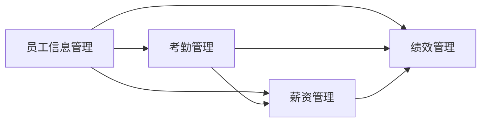

## 1.背景介绍

在现代企业中，人事管理系统已经成为了企业运营的重要组成部分。它不仅可以帮助企业进行人力资源的管理，还可以提高企业的运营效率。本文将详细介绍如何设计并实现一个人事管理系统。

## 2.核心概念与联系

人事管理系统主要包括以下几个核心概念：

- **员工信息管理**：包括员工的基本信息、职位信息、薪资信息等。
- **考勤管理**：记录员工的出勤情况，包括请假、迟到、早退等。
- **薪资管理**：根据员工的考勤情况和工作表现，计算员工的薪资。
- **绩效管理**：评估员工的工作表现，为员工的晋升和薪资调整提供依据。

这些核心概念之间的联系可以通过下面的Mermaid流程图进行展示：



## 3.核心算法原理具体操作步骤

接下来，我们将详细介绍人事管理系统的具体操作步骤。

1. **员工信息管理**：首先，我们需要收集员工的基本信息，包括姓名、性别、出生日期、入职日期、职位等。然后，我们将这些信息存储在数据库中，供其他模块使用。

2. **考勤管理**：我们需要记录员工的出勤情况，包括上班时间、下班时间、请假情况等。我们可以通过打卡系统来收集这些信息，然后将其存储在数据库中。

3. **薪资管理**：我们需要根据员工的考勤情况和工作表现，计算员工的薪资。具体的计算方法可以根据企业的薪资政策来确定。

4. **绩效管理**：我们需要评估员工的工作表现，为员工的晋升和薪资调整提供依据。具体的评估方法可以根据企业的绩效管理政策来确定。

## 4.数学模型和公式详细讲解举例说明

在人事管理系统中，我们经常需要用到一些数学模型和公式。例如，我们可以用以下的公式来计算员工的薪资：

$$
\text{薪资} = \text{基本工资} + \text{岗位工资} + \text{绩效工资} - \text{扣款}
$$

其中，基本工资、岗位工资和绩效工资都是根据员工的职位和工作表现来确定的，扣款主要包括税款和罚款。

## 5.项目实践：代码实例和详细解释说明

接下来，我们将通过一个简单的例子来演示如何实现一个人事管理系统。我们将使用Python语言和Django框架来实现这个系统。

首先，我们需要创建一个Django项目，并在其中创建一个名为"hr"的应用。

然后，我们可以在"hr"应用的models.py文件中定义员工的数据模型：

```python
from django.db import models

class Employee(models.Model):
    name = models.CharField(max_length=100)
    gender = models.CharField(max_length=10)
    birth_date = models.DateField()
    hire_date = models.DateField()
    position = models.CharField(max_length=100)
```

接着，我们可以在"hr"应用的views.py文件中定义员工信息管理的视图函数：

```python
from django.shortcuts import render
from .models import Employee

def employee_list(request):
    employees = Employee.objects.all()
    return render(request, 'hr/employee_list.html', {'employees': employees})
```

最后，我们可以在"hr"应用的urls.py文件中定义员工信息管理的URL映射：

```python
from django.urls import path
from . import views

urlpatterns = [
    path('employees/', views.employee_list, name='employee_list'),
]
```

通过以上的代码，我们就实现了一个简单的人事管理系统。

## 6.实际应用场景

人事管理系统在各种企业中都有广泛的应用。例如，一家大型企业可以使用人事管理系统来管理其数千名员工的信息，包括员工的基本信息、考勤情况、薪资情况和工作表现等。这样，企业可以更有效地管理其人力资源，提高企业的运营效率。

## 7.工具和资源推荐

如果你想进一步学习和实践人事管理系统的设计和实现，我推荐你使用以下的工具和资源：

- **Python**：Python是一种简单易学的编程语言，非常适合初学者使用。Python有丰富的库和框架，可以帮助你快速地开发各种应用。

- **Django**：Django是一个基于Python的开源Web开发框架，它提供了很多强大的功能，可以帮助你快速地开发Web应用。

- **MySQL**：MySQL是一个开源的数据库管理系统，你可以使用它来存储和管理你的数据。

- **Docker**：Docker是一个开源的容器化平台，你可以使用它来部署你的应用。

## 8.总结：未来发展趋势与挑战

随着技术的发展，人事管理系统将会变得更加智能化和自动化。例如，我们可以使用人工智能技术来自动分析员工的工作表现，提供更准确的绩效评估。同时，我们也可以使用大数据技术来分析员工的考勤情况，提供更详细的考勤报告。

然而，这也带来了一些挑战。例如，我们需要处理大量的数据，这需要高效的数据处理技术。同时，我们也需要保护员工的隐私，这需要强大的数据安全技术。

## 9.附录：常见问题与解答

1. **Q: 我可以使用其他编程语言和框架来实现人事管理系统吗?**
   
   A: 当然可以。你可以根据你的需要和喜好来选择合适的编程语言和框架。

2. **Q: 我应该如何设计数据库?**

   A: 你应该根据你的需求来设计数据库。例如，你可以创建一个员工表来存储员工的基本信息，创建一个考勤表来存储员工的考勤情况，创建一个薪资表来存储员工的薪资情况。

作者：禅与计算机程序设计艺术 / Zen and the Art of Computer Programming