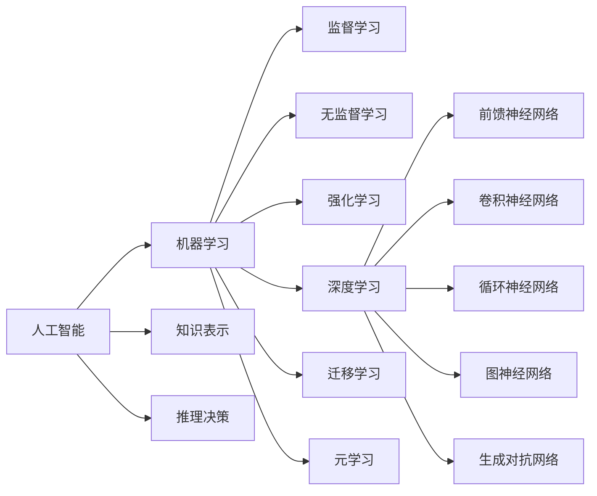

# 人工智能前沿研究热点与发展趋势原理与代码实战案例讲解

## 1.背景介绍

人工智能(Artificial Intelligence, AI)是计算机科学的一个分支,旨在创造能够执行通常需要人类智能的任务的智能机器。近年来,人工智能技术取得了突飞猛进的发展,在各个领域得到广泛应用,如计算机视觉、自然语言处理、语音识别、机器人等。人工智能正在深刻改变着我们的生活和工作方式。

本文将重点介绍人工智能领域的前沿研究热点,包括深度学习、强化学习、迁移学习、元学习、图神经网络、生成对抗网络等,并结合具体的算法原理、数学模型、代码实战案例进行详细讲解,同时探讨人工智能技术的实际应用场景和未来发展趋势。

### 1.1 人工智能的发展历程

人工智能的发展可以追溯到20世纪50年代,经历了几次起起伏伏:

- 1956年,达特茅斯会议奠定了人工智能研究的基础
- 20世纪60-70年代,符号主义人工智能盛行
- 20世纪80年代,专家系统得到广泛应用 
- 1997年,IBM深蓝战胜国际象棋世界冠军
- 2006年,Hinton提出深度信念网络,掀起深度学习热潮
- 2011年,IBM Watson在智力问答节目中战胜人类冠军
- 2016年,AlphaGo战胜围棋世界冠军
- 2020年,GPT-3、DALL·E等大规模预训练模型取得突破

### 1.2 人工智能的分类

根据实现方式和应用领域,人工智能可分为以下几类:

- 符号主义AI:基于逻辑推理、知识表示等方法
- 连接主义AI:基于人工神经网络、深度学习等方法  
- 行为主义AI:基于感知-动作映射、强化学习等方法
- 混合方法:结合以上多种方法

从应用角度看,人工智能主要包括:

- 计算机视觉:图像分类、目标检测、语义分割等
- 自然语言处理:机器翻译、情感分析、文本摘要等  
- 语音识别:语音转文本、说话人识别等
- 知识图谱:知识表示、知识推理等
- 机器人控制:运动规划、环境感知等

## 2.核心概念与联系

### 2.1 机器学习

机器学习是人工智能的核心,使计算机能够在没有明确编程的情况下学习和改进。根据学习方式,可分为:

- 监督学习:从标注数据中学习输入到输出的映射
- 无监督学习:从无标注数据中发现数据内在结构和规律
- 强化学习:通过与环境的交互获得反馈来优化策略
- 半监督学习:同时利用少量标注数据和大量无标注数据 
- 迁移学习:将已学习的知识迁移应用到新任务中

### 2.2 深度学习

深度学习是机器学习的一个分支,通过构建多层神经网络来学习数据的层次化特征表示。主要包括:

- 前馈神经网络(FNN):数据从输入层经隐藏层传递到输出层
- 卷积神经网络(CNN):利用卷积、池化等操作处理网格化数据
- 循环神经网络(RNN):通过循环连接处理序列数据
- 图神经网络(GNN):在图结构数据上传递信息更新节点表示

### 2.3 生成对抗网络

生成对抗网络(GAN)由生成器和判别器组成,通过两者的博弈学习生成接近真实数据分布的样本。常见的GAN变体有:

- DCGAN:利用深度卷积网络实现GAN
- CGAN:引入条件信息指导样本生成
- CycleGAN:实现不同域之间的图像转换
- StyleGAN:从隐空间中解耦内容和风格表示

### 2.4 元学习

元学习(Meta-Learning)旨在学习如何学习,即学习一个可以快速适应新任务的学习器。主要方法包括:

- MAML:通过梯度下降学习模型初始化参数
- Prototypical Network:学习一个度量空间,通过最近邻分类
- 记忆增强神经网络:通过外部记忆模块存储和检索知识

下图展示了这些核心概念之间的联系:

## 3.核心算法原理具体操作步骤

### 3.1 卷积神经网络(CNN)

卷积神经网络在图像识别等领域取得了巨大成功,其核心是通过卷积操作提取局部特征并逐层组合形成层次化特征表示。CNN的主要层类型有:

- 卷积层:通过卷积核(滤波器)与局部感受野进行卷积操作提取特征
- 池化层:对特征图进行下采样,增加感受野并提供平移不变性
- 全连接层:对卷积和池化层输出的特征图进行展平并映射到输出

CNN的训练过程通过反向传播算法优化网络参数,具体步骤如下:

1. 初始化模型参数(卷积核权重、偏置等)
2. 前向传播计算模型输出并计算损失函数 
3. 反向传播计算损失函数对各参数的梯度
4. 用梯度下降等优化算法更新模型参数
5. 重复步骤2-4直到模型收敛或达到预设的迭代次数

### 3.2 长短时记忆网络(LSTM)

LSTM是一种特殊的RNN,通过引入门控机制缓解了RNN的梯度消失问题,能够学习长距离依赖关系。LSTM的核心是存储单元,包括输入门、遗忘门、输出门,其状态更新公式为:

$$
\begin{aligned}
f_t &= \sigma(W_f \cdot [h_{t-1}, x_t] + b_f) \\
i_t &= \sigma(W_i \cdot [h_{t-1}, x_t] + b_i) \\ 
o_t &= \sigma(W_o \cdot [h_{t-1}, x_t] + b_o) \\
\tilde{C}_t &= \tanh(W_C \cdot [h_{t-1}, x_t] + b_C) \\
C_t &= f_t * C_{t-1} + i_t * \tilde{C}_t \\
h_t &= o_t * \tanh(C_t)
\end{aligned}
$$

其中 $f_t, i_t, o_t$ 分别为遗忘门、输入门、输出门,控制信息的流动;$C_t$ 为存储单元状态,$\tilde{C}_t$ 为候选状态;$h_t$ 为隐藏状态(输出)。

LSTM的训练过程与普通RNN类似,通过时间反向传播(BPTT)算法优化模型参数。

### 3.3 Transformer

Transformer是一种基于自注意力机制的序列建模方法,摒弃了RNN中的循环连接,通过自注意力计算序列中元素之间的相关性。Transformer的主要组成部分包括:

- 输入嵌入层:将输入符号映射为连续向量表示
- 位置编码:为每个位置添加位置信息  
- 多头自注意力:并行计算多个注意力函数
- 前馈神经网络:对自注意力输出进行非线性变换
- 残差连接和层归一化:稳定训练过程

自注意力的计算过程如下:

1. 将输入 $X$ 通过线性变换得到查询 $Q$、键 $K$、值 $V$ 
2. 计算 $Q$ 和 $K$ 的点积并归一化得到注意力权重 $\alpha$
3. 将 $\alpha$ 与 $V$ 相乘并求和得到输出 $Z$

$$
\begin{aligned}
Q, K, V &= XW_Q, XW_K, XW_V \\
\alpha &= \text{softmax}(\frac{QK^T}{\sqrt{d_k}}) \\
Z &= \alpha V
\end{aligned}
$$

多头自注意力则是将 $Q,K,V$ 划分为多个头,分别计算自注意力并拼接:

$$
\text{MultiHead}(Q, K, V) = \text{Concat}(\text{head}_1, \dots, \text{head}_h)W^O
$$

其中 $\text{head}_i = \text{Attention}(QW_i^Q, KW_i^K, VW_i^V)$。

Transformer的训练过程通过最大似然估计优化模型参数,即最小化输出概率分布与真实标签的交叉熵损失。

## 4.数学模型和公式详细讲解举例说明

### 4.1 支持向量机(SVM)

支持向量机是一种经典的判别式分类模型,通过寻找最大间隔超平面将不同类别的样本分开。对于线性可分数据,SVM的目标是最小化:

$$
\begin{aligned}
\min_{w, b} \quad & \frac{1}{2} \lVert w \rVert^2 \\
\text{s.t.} \quad & y_i(w^Tx_i + b) \geq 1, \quad i=1,\dots,N
\end{aligned}
$$

其中 $w,b$ 为超平面参数,$x_i,y_i$ 为训练样本及其标签。上述问题可以通过拉格朗日乘子法转化为对偶问题求解:

$$
\begin{aligned}
\max_{\alpha} \quad & \sum_{i=1}^N \alpha_i - \frac{1}{2} \sum_{i,j=1}^N \alpha_i \alpha_j y_i y_j x_i^T x_j \\
\text{s.t.} \quad & \sum_{i=1}^N \alpha_i y_i = 0 \\
& \alpha_i \geq 0, \quad i=1,\dots,N
\end{aligned}
$$

求解出 $\alpha$ 后,可得到超平面参数:

$$
\begin{aligned}
w &= \sum_{i=1}^N \alpha_i y_i x_i \\
b &= y_j - w^T x_j, \quad j \in \{i | \alpha_i > 0\}
\end{aligned}
$$

对于非线性数据,可以通过核函数将数据映射到高维空间,使其线性可分。常用的核函数有:

- 多项式核:$(x^Tx' + c)^d$
- 高斯核:$\exp(-\gamma \lVert x - x' \rVert^2)$
- Sigmoid核:$\tanh(\gamma x^Tx' + c)$  

引入核函数后,对偶问题变为:

$$
\begin{aligned}
\max_{\alpha} \quad & \sum_{i=1}^N \alpha_i - \frac{1}{2} \sum_{i,j=1}^N \alpha_i \alpha_j y_i y_j K(x_i, x_j) \\
\text{s.t.} \quad & \sum_{i=1}^N \alpha_i y_i = 0 \\
& 0 \leq \alpha_i \leq C, \quad i=1,\dots,N
\end{aligned}
$$

其中 $K(x_i, x_j)$ 为核函数,$C$ 为正则化参数,控制模型复杂度。

### 4.2 潜在狄利克雷分配(LDA)

LDA是一种生成式主题模型,通过引入隐变量(主题)对文本集合进行建模。LDA假设每篇文档都是由多个主题混合生成,而每个主题又由多个单词组成。形式化地,LDA的生成过程为:

1. 对于语料库中的每篇文档 $d$:
    - 从狄利克雷分布 $\text{Dir}(\alpha)$ 中采样主题分布 $\theta_d$
    - 对于文档中的每个单词 $w_{dn}$:
        - 从多项式分布 $\text{Multi}(\theta_d)$ 中采样主题 $z_{dn}$
        - 从多项式分布 $\text{Multi}(\beta_{z_{dn}})$ 中采样单词 $w_{dn}$

其中 $\alpha$ 为狄利克雷分布参数,$\beta$ 为主