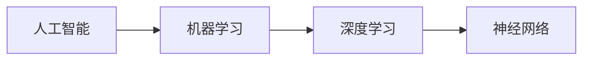

## 1.背景介绍

人工智能（Artificial Intelligence，AI）是近年来科技领域最热门的话题之一，它的发展和应用正在深度改变我们的生活和工作方式。从自动驾驶汽车到智能语音助手，从推荐系统到医疗诊断，AI的应用已经渗透到我们生活的方方面面。本文将对人工智能的原理进行深入探讨，并通过代码实例进行详细讲解。

## 2.核心概念与联系

人工智能是一种使计算机模拟人的思维和学习能力的技术。它的核心概念包括：机器学习（Machine Learning），深度学习（Deep Learning），神经网络（Neural Networks）等。

机器学习是实现人工智能的一种方法，它通过让机器从数据中学习，而不是通过明确的编程来实现。深度学习是机器学习的一个子集，它使用神经网络模拟人脑的工作方式，通过多层神经元的连接和计算，实现对复杂数据的学习和理解。

神经网络是深度学习的基础，它由多个神经元组成，每个神经元都可以进行简单的计算，并将结果传递给下一层的神经元。通过这种方式，神经网络可以对输入数据进行复杂的处理和学习。

以下是人工智能、机器学习和深度学习之间关系的 Mermaid 流程图：



## 3.核心算法原理具体操作步骤

### 3.1 神经网络

神经网络的工作原理是通过神经元之间的连接和权重，对输入的数据进行处理和学习。每个神经元都有一个激活函数（Activation Function），用于决定神经元是否应该被激活。

神经网络的训练过程是一个优化过程，目标是通过调整神经元之间的连接权重，使得网络的输出与期望的输出尽可能接近。这个过程通常使用反向传播（Backpropagation）算法来实现。

### 3.2 机器学习

机器学习的核心是通过算法从数据中学习。这些算法可以分为监督学习（Supervised Learning），无监督学习（Unsupervised Learning），半监督学习（Semi-Supervised Learning）和强化学习（Reinforcement Learning）。

监督学习是最常用的一种机器学习方法，它通过输入和输出的样本对进行学习，然后对新的输入进行预测。无监督学习则是通过输入数据本身的结构进行学习，不需要输出的样本。半监督学习介于监督学习和无监督学习之间，它使用部分有标签的数据进行学习。强化学习则是通过与环境的交互，学习如何做出最优的决策。

### 3.3 深度学习

深度学习是机器学习的一种，它使用多层神经网络进行学习。深度学习的特点是可以自动地从原始数据中提取特征，这使得它在处理图像、语音等复杂数据时有很强的能力。

深度学习的训练过程通常需要大量的数据和计算资源。在训练过程中，深度学习模型会通过反向传播算法，不断调整神经网络的参数，以使得模型的输出与期望的输出尽可能接近。

## 4.数学模型和公式详细讲解举例说明

### 4.1 神经网络

神经网络的基本单元是神经元。每个神经元接收一些输入，然后通过激活函数（Activation Function）处理这些输入，产生一个输出。神经元的输出可以表示为：

$$ y = f(\sum_{i=1}^{n} w_i x_i + b) $$

其中，$x_i$ 是输入，$w_i$ 是权重，$b$ 是偏置，$f$ 是激活函数。

### 4.2 机器学习

在监督学习中，我们通常使用损失函数（Loss Function）来衡量模型的预测结果与真实结果之间的差距。常用的损失函数有均方误差（Mean Squared Error，MSE）和交叉熵（Cross Entropy）等。例如，对于回归问题，我们通常使用均方误差作为损失函数：

$$ L = \frac{1}{n} \sum_{i=1}^{n} (y_i - \hat{y}_i)^2 $$

其中，$y_i$ 是真实值，$\hat{y}_i$ 是预测值，$n$ 是样本数量。

### 4.3 深度学习

深度学习模型的训练过程可以看作是一个优化问题，我们的目标是找到一组参数，使得损失函数的值最小。这个过程通常使用梯度下降（Gradient Descent）算法来实现。梯度下降算法的更新公式为：

$$ w = w - \eta \frac{\partial L}{\partial w} $$

其中，$w$ 是参数，$\eta$ 是学习率，$\frac{\partial L}{\partial w}$ 是损失函数 $L$ 关于参数 $w$ 的梯度。

## 5.项目实践：代码实例和详细解释说明

在这一部分，我们将通过一个简单的人工智能项目来具体展示如何应用上述的原理和方法。我们将使用Python语言和TensorFlow框架，构建一个简单的深度学习模型，用于手写数字的识别。

首先，我们需要导入所需的库：

```python
import tensorflow as tf
from tensorflow.keras.datasets import mnist
```

然后，我们加载数据，并对数据进行预处理：

```python
(x_train, y_train), (x_test, y_test) = mnist.load_data()
x_train, x_test = x_train / 255.0, x_test / 255.0
```

接下来，我们构建模型：

```python
model = tf.keras.models.Sequential([
  tf.keras.layers.Flatten(input_shape=(28, 28)),
  tf.keras.layers.Dense(128, activation='relu'),
  tf.keras.layers.Dropout(0.2),
  tf.keras.layers.Dense(10, activation='softmax')
])
```

然后，我们配置模型的学习过程：

```python
model.compile(optimizer='adam',
              loss='sparse_categorical_crossentropy',
              metrics=['accuracy'])
```

接下来，我们开始训练模型：

```python
model.fit(x_train, y_train, epochs=5)
```

最后，我们评估模型的性能：

```python
model.evaluate(x_test,  y_test, verbose=2)
```

通过这个例子，我们可以看到，虽然深度学习的原理和算法可能很复杂，但是在实际应用中，我们可以通过现有的工具和库，以非常简洁的代码来实现复杂的模型和算法。

## 6.实际应用场景

人工智能的应用场景非常广泛，包括但不限于以下几个方面：

1. 图像识别：通过深度学习的方法，我们可以训练出能够识别图像中对象的模型。这在自动驾驶、医疗影像诊断等领域有广泛的应用。

2. 自然语言处理：人工智能可以用于理解和生成自然语言。这使得我们可以开发出智能的聊天机器人，或者进行情感分析等。

3. 推荐系统：通过机器学习的方法，我们可以预测用户的喜好，从而推荐他们可能感兴趣的内容。这在电商、音乐、电影等领域有广泛的应用。

4. 游戏：人工智能可以用于开发智能的游戏AI，使得玩家可以与电脑进行更有挑战性的对战。

## 7.工具和资源推荐

在进行人工智能的学习和研究时，有一些工具和资源是非常有帮助的：

1. TensorFlow：这是一个由Google开发的开源深度学习框架。它提供了一套完整的工具，包括定义、训练和部署深度学习模型的功能。

2. PyTorch：这是一个由Facebook开发的开源深度学习框架。它的设计理念是简洁和灵活，使得研究人员可以更容易地进行模型的实验和优化。

3. Scikit-learn：这是一个开源的机器学习库，提供了大量的机器学习算法的实现，包括分类、回归、聚类等。

4. Kaggle：这是一个数据科学竞赛平台，提供了大量的数据集和竞赛，是学习和实践机器学习的好地方。

## 8.总结：未来发展趋势与挑战

人工智能的发展前景广阔，但也面临着一些挑战。随着技术的进步，我们将能够解决更多的问题，但同时也会出现新的问题和挑战。例如，如何保证人工智能的决策的公正和透明，如何处理数据的隐私问题，如何防止人工智能的滥用等。

尽管有这些挑战，但人工智能的发展趋势是明确的。随着计算能力的提高和数据的增加，人工智能将在更多的领域发挥更大的作用。我们期待看到更多的创新和突破，让人工智能为我们的生活带来更多的便利和乐趣。

## 9.附录：常见问题与解答

1. 问：人工智能、机器学习和深度学习有什么区别？

答：人工智能是最广泛的概念，它是一种使计算机模拟人的思维和学习能力的技术。机器学习是实现人工智能的一种方法，它通过让机器从数据中学习，而不是通过明确的编程来实现。深度学习是机器学习的一个子集，它使用神经网络模拟人脑的工作方式，通过多层神经元的连接和计算，实现对复杂数据的学习和理解。

2. 问：我应该如何学习人工智能？

答：学习人工智能需要一些基础知识，包括数学（尤其是线性代数和概率论），编程（尤其是Python语言），以及一些基础的机器学习和深度学习的知识。有很多在线的课程和教程可以帮助你开始学习。

3. 问：人工智能会取代人类的工作吗？

答：人工智能确实可能改变一些工作的方式，甚至取代一些工作。但同时，它也会创造出新的工作机会。我们需要做的是，不断学习和适应，以便在这个快速变化的世界中找到自己的位置。

作者：禅与计算机程序设计艺术 / Zen and the Art of Computer Programming