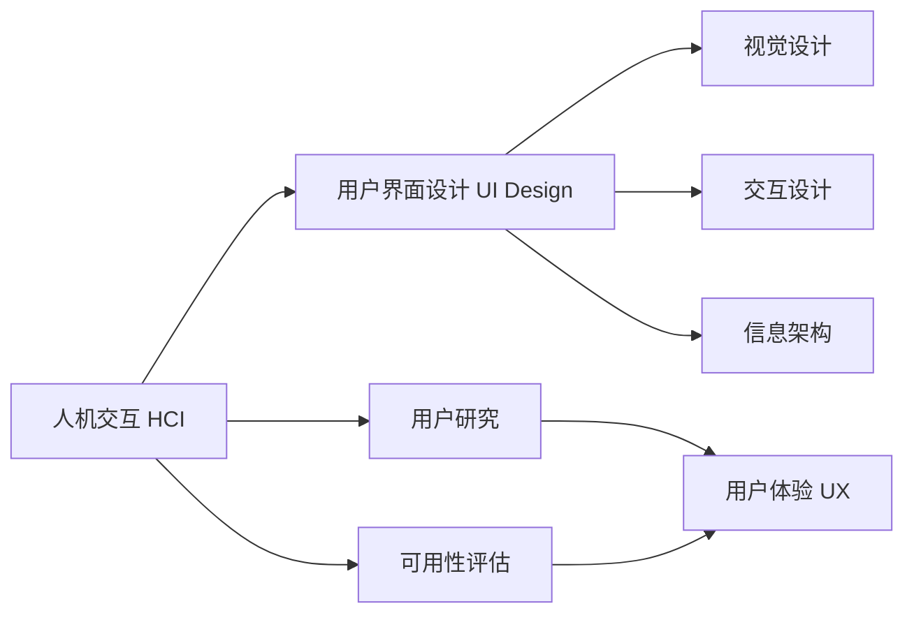

# 人机交互与用户界面设计原理与代码实战案例讲解

## 1. 背景介绍
### 1.1 人机交互与用户界面设计的重要性
在当今数字化时代,人机交互(Human-Computer Interaction, HCI)和用户界面(User Interface,UI)设计在软件开发中扮演着至关重要的角色。随着计算机和移动设备的普及,用户对软件应用的易用性、交互性和视觉吸引力提出了更高的要求。优秀的人机交互和用户界面设计不仅能提升用户体验,增加用户粘性,还能为企业带来更多的商业价值。

### 1.2 人机交互与用户界面设计的发展历程
人机交互与用户界面设计的发展可以追溯到20世纪60年代。早期的计算机使用命令行界面(Command Line Interface, CLI),用户需要通过输入复杂的命令来操作计算机。20世纪80年代,图形用户界面(Graphical User Interface, GUI)的出现极大地改善了人机交互的方式。如今,随着触摸屏、语音交互、手势识别等新技术的发展,人机交互与用户界面设计正朝着更加自然、智能的方向发展。

### 1.3 本文的主要内容与目的
本文将深入探讨人机交互与用户界面设计的原理,并结合实际的代码实战案例进行讲解。通过本文,读者将了解到人机交互与用户界面设计的核心概念、设计原则、常用的设计模式和最佳实践。同时,本文还将介绍一些实用的设计工具和资源,帮助读者提升自己的设计能力。

## 2. 核心概念与联系
### 2.1 人机交互的定义与目标
人机交互(HCI)是研究人与计算机之间交互的学科,旨在设计出高效、易用、令人愉悦的交互方式。HCI的目标是让用户能够以最自然、最高效的方式完成任务,减少认知负荷,提高用户满意度。

### 2.2 用户界面设计的定义与原则
用户界面(UI)设计是创建软件应用或网站的界面布局、视觉设计和交互设计的过程。UI设计的原则包括:
- 一致性原则:在整个系统中保持设计风格的一致性,减少用户的学习成本。
- 简洁性原则:界面设计应简洁明了,去除无用的装饰性元素。
- 直观性原则:使用符合用户心理预期的设计,让用户能够快速理解和使用。
- 反馈原则:对用户的操作给予及时、明确的反馈,增强用户的控制感。
- 容错原则:为可能出错的操作提供恢复或撤销的机会,防止用户的误操作。

### 2.3 人机交互与用户界面设计的关系
人机交互和用户界面设计是密不可分的。UI设计是HCI的重要组成部分,优秀的UI设计能够极大地改善人机交互的质量。同时,HCI的原理和方法也指导着UI设计的实践。二者相辅相成,共同决定了软件应用的用户体验。

### 2.4 用户体验与可用性
用户体验(User Experience, UX)是用户在使用产品或服务时所产生的主观感受,包括使用的便捷性、愉悦性和满意度等。可用性(Usability)是指用户在特定环境下完成特定任务的效率、效果和满意度。优秀的人机交互和用户界面设计应以提升用户体验和可用性为目标。



## 3. 核心算法原理与具体操作步骤
### 3.1 设计思维与以用户为中心的设计
设计思维(Design Thinking)是一种以用户为中心的设计方法,强调从用户的真实需求出发,通过同理心、创意思考和快速迭代来解决问题。以用户为中心的设计流程通常包括以下步骤:
1. 同理用户:深入了解用户的需求、痛点和使用场景。
2. 定义问题:根据用户研究的结果,明确要解决的核心问题。
3. 创意设计:通过头脑风暴等方式,产生多种可能的设计方案。
4. 原型设计:快速制作低保真或高保真原型,以便于评估和改进设计。
5. 用户测试:让真实用户使用原型,收集反馈意见,不断迭代优化设计。

### 3.2 信息架构与导航设计
信息架构(Information Architecture, IA)是组织、标记和呈现信息的艺术和科学。良好的信息架构能够帮助用户快速找到所需的信息,减少认知负荷。导航设计是信息架构的重要组成部分,常用的导航设计模式包括:
- 全局导航:在每个页面上都出现,提供整个网站或应用的主要入口。
- 局部导航:根据用户当前所在的位置,提供相关的导航选项。
- 上下文导航:根据用户当前浏览的内容,提供相关的链接或推荐。
- 面包屑导航:显示用户当前位置在网站层次结构中的位置,方便用户返回上级页面。

### 3.3 视觉设计与布局
视觉设计是创建界面的视觉表现,包括色彩、字体、图标、图像等视觉元素的选择和搭配。优秀的视觉设计能够吸引用户的注意力,传达产品的个性和风格,引导用户的视线流向。界面布局是将各种UI组件合理地排列在界面上,考虑到信息的重要性、互相之间的关系以及用户的阅读习惯。常用的布局模式包括:
- 网格布局:将界面划分为若干列,UI组件在列内对齐排列。
- 卡片布局:将相关信息组合在一个卡片内,卡片之间留有适当的间距。
- 列表布局:将同类型的信息排列成一列,便于用户快速浏览和查找。
- 标签页布局:将不同类别的内容放在不同的标签页中,用户可以切换标签页来查看。

### 3.4 交互设计与动效
交互设计是定义用户如何与界面进行交互,包括输入方式、反馈方式、操作流程等。自然、流畅的交互设计能够让用户专注于任务本身,而不是界面的操作。常见的交互设计技巧包括:
- 渐进式披露:根据用户的操作逐步展示信息和选项,避免一次呈现过多的内容。
- 预览:在用户执行某个操作之前,提供该操作可能产生的效果的预览。
- 撤销:为用户的操作提供撤销或恢复的机会,让用户放心地探索和尝试。
- 手势:利用触摸屏的手势交互,如滑动、捏合、长按等,提供更自然的操作方式。

动效设计是在界面中加入适当的动画和过渡效果,以增强用户的感知和体验。恰当的动效设计能够吸引用户的注意力,提供视觉反馈,让界面更生动、更易于理解。但动效设计也要适度,过多或过于复杂的动画会分散用户的注意力,降低界面的性能。

## 4. 数学模型和公式详细讲解举例说明
在人机交互与用户界面设计中,一些数学模型和公式被用于描述用户行为、预测用户反应,以及评估界面的可用性。下面以Fitts定律为例进行详细讲解。

Fitts定律是一个用于预测人类在指向目标时所需时间的模型。假设用户在屏幕上用鼠标指向一个目标,目标的大小为W,目标的中心与鼠标当前位置的距离为D,则用户完成这个指向任务所需的时间T可以用下面的公式表示:

$T = a + b \log_2 (\frac{D}{W} + 1)$

其中,a和b是通过实验测量得到的常数,分别表示启动时间和指向速度的倒数。这个公式表明,目标越小、距离越远,用户完成指向任务的时间就越长。

举例来说,假设屏幕上有两个按钮,一个较大(W1=100像素),一个较小(W2=50像素),它们分别位于距离鼠标指针200像素(D1)和100像素(D2)的地方。如果a=0.2秒,b=0.1秒/比特,则用户指向这两个按钮所需的时间分别为:

$T_1 = 0.2 + 0.1 \log_2 (\frac{200}{100} + 1) = 0.2 + 0.1 \times 1.58 = 0.36秒$

$T_2 = 0.2 + 0.1 \log_2 (\frac{100}{50} + 1) = 0.2 + 0.1 \times 1.58 = 0.36秒$

可以看出,虽然第二个按钮离鼠标指针更近,但由于它更小,用户指向它所需的时间与指向第一个按钮一样长。

Fitts定律告诉我们,在设计界面时,应该使常用的控件更大、更靠近用户可能的鼠标位置,以减少用户的操作时间。此外,对于一些难以点击的小目标,可以考虑增加其周围的点击区域,或者提供一些辅助的选择机制,如方向键导航、语音输入等。

除了Fitts定律,还有一些其他常用的数学模型,如Hick定律(预测用户在多个选项中做出决策的时间)、Steering law(预测用户沿着特定路径移动鼠标的时间)等。这些模型为设计者提供了一些定量的指标和优化方向,但在实践中还需要结合具体的场景和用户反馈来权衡取舍。

## 5. 项目实践:代码实例和详细解释说明
下面以一个简单的登录界面为例,演示如何使用HTML、CSS和JavaScript实现符合人机交互原则的用户界面。

### 5.1 HTML结构
```html
<form class="login-form">
  <h2>登录</h2>
  <div class="form-group">
    <label for="username">用户名</label>
    <input type="text" id="username" required>
  </div>
  <div class="form-group">
    <label for="password">密码</label>
    <input type="password" id="password" required>
  </div>
  <div class="form-group">
    <button type="submit">登录</button>
  </div>
  <div class="form-group">
    <a href="#">忘记密码?</a>
    <a href="#">注册新账号</a>
  </div>
</form>
```

这个登录表单包含了用户名、密码两个输入框,一个提交按钮,以及忘记密码和注册新账号的链接。为了提高可访问性,为每个输入框都添加了`<label>`标签,并且用`for`属性与输入框的`id`属性关联起来。同时,在输入框上添加了`required`属性,表示这是必填项。

### 5.2 CSS样式
```css
.login-form {
  max-width: 300px;
  margin: 0 auto;
  padding: 20px;
  border: 1px solid #ccc;
  border-radius: 5px;
}

.form-group {
  margin-bottom: 20px;
}

label {
  display: block;
  margin-bottom: 5px;
}

input[type="text"], 
input[type="password"] {
  width: 100%;
  padding: 10px;
  border: 1px solid #ccc;
  border-radius: 3px;
}

button[type="submit"] {
  display: block;
  width: 100%;
  padding: 10px;
  border: none;
  border-radius: 3px;
  background-color: #007bff;
  color: #fff;
  cursor: pointer;
}

a {
  margin-right: 10px;
  color: #007bff;
  text-decoration: none;
}
```

这里使用了一些CSS样式来美化登录表单,主要包括:
- 限制表单的最大宽度,并将其居中显示。
- 为表单添加边框和圆角,增加视觉吸引力。
- 为输入框和按钮设置合适的内边距和边框样式。
- 为提交按钮设置背景色和文字颜色,并添加鼠标