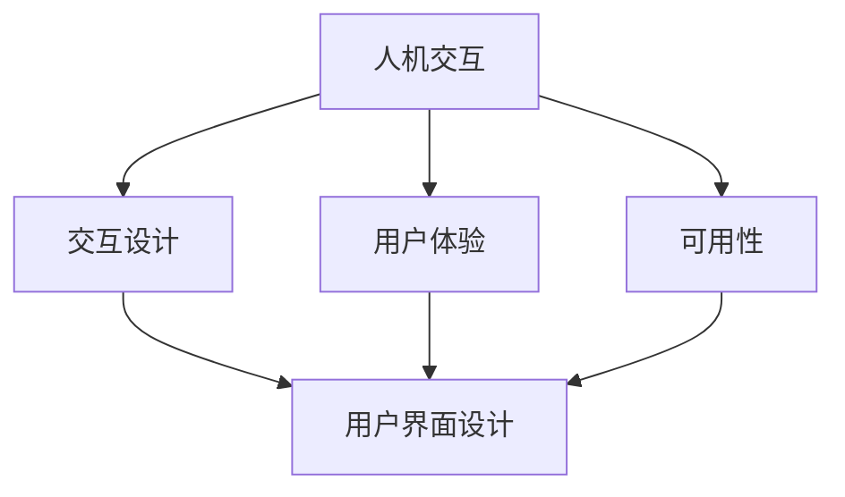

# 人机交互与用户界面设计原理与代码实战案例讲解

## 1. 背景介绍

### 1.1 人机交互的重要性

在当今数字时代,人机交互(Human-Computer Interaction, HCI)已经成为一个不可或缺的领域。随着技术的不断发展,人们与计算机系统的交互变得越来越频繁和复杂。良好的人机交互设计不仅能够提高用户体验,还能够提高工作效率,减少错误发生的风险。因此,研究和优化人机交互已经成为软件开发过程中的一个关键环节。

### 1.2 用户界面设计的作用

用户界面(User Interface, UI)是人机交互的主要载体,它是用户与计算机系统进行交互的桥梁。一个合理、直观、美观的用户界面设计不仅能够吸引用户,还能够帮助用户快速、高效地完成任务。反之,一个设计不当的用户界面会严重影响用户体验,甚至导致用户放弃使用该软件。因此,用户界面设计在软件开发中扮演着至关重要的角色。

## 2. 核心概念与联系

### 2.1 人机交互的核心概念

人机交互涉及以下几个核心概念:

1. **用户体验(User Experience, UX)**: 用户在使用产品或系统时的整体感受和体验。良好的用户体验能够提高用户满意度,增强用户粘性。

2. **可用性(Usability)**: 系统在特定使用环境下,被特定用户使用时的有效性、效率和满意度。可用性是衡量人机交互质量的重要指标。

3. **交互设计(Interaction Design)**: 设计交互式产品、系统或服务的过程,旨在创造有价值和相关的体验。

4. **用户界面(User Interface, UI)**: 用户与计算机系统进行交互的接口,包括视觉、听觉等多种形式。

5. **可访问性(Accessibility)**: 确保产品或系统能够被残障人士或特殊群体使用的能力。

### 2.2 人机交互与用户界面设计的关系

人机交互和用户界面设计是密切相关的两个领域。用户界面设计是人机交互的关键组成部分,它决定了用户与系统交互的方式和体验。同时,人机交互的原则和理论也为用户界面设计提供了指导和依据。

两者的关系可以用下图来表示:



简而言之,人机交互是一个宏观的概念,它包含了用户体验、可用性、交互设计等多个方面。而用户界面设计则是人机交互的具体实现,它直接影响和体现了人机交互的质量。

## 3. 核心算法原理具体操作步骤

### 3.1 人机交互设计的原则

在设计人机交互系统时,需要遵循以下几个基本原则:

1. **可用性原则**:系统应该易于学习、高效使用,并能满足用户的需求。

2. **一致性原则**:系统中的操作、术语、图标等应该保持一致,避免用户产生混淆。

3. **反馈原则**:系统应该及时向用户提供明确的反馈,让用户了解系统的状态和操作结果。

4. **直观性原则**:系统的设计应该符合用户的直觉和习惯,减少认知负荷。

5. **可控性原则**:用户应该能够主导交互过程,系统应该为用户提供充分的控制权。

6. **错误防范原则**:系统应该能够预防和容忍用户的错误操作,并提供友好的错误处理机制。

7. **可访问性原则**:系统应该确保所有用户,包括残障人士,都能够方便地使用。

### 3.2 用户界面设计流程

用户界面设计通常遵循以下流程:

1. **需求分析**:收集和分析用户需求,明确设计目标和约束条件。

2. **用户研究**:研究目标用户群体的特征、行为模式和使用场景。

3. **信息架构**:组织和结构化系统中的信息和功能,确保导航清晰、逻辑合理。

4. **交互设计**:设计用户与系统之间的交互方式,包括操作流程、控制元素等。

5. **视觉设计**:设计界面的视觉样式,包括布局、颜色、图标、字体等。

6. **原型制作**:基于设计方案制作交互原型,用于评估和改进。

7. **测试与迭代**:进行用户测试,收集反馈,并根据反馈进行设计迭代和优化。

8. **实现与集成**:将设计方案转化为实际的用户界面,并集成到系统中。

9. **维护与升级**:持续关注用户反馈,根据需求变化进行界面维护和升级。

该流程并非线性的,在实际项目中,各个阶段可能会交替进行,形成迭代式的设计过程。

## 4. 数学模型和公式详细讲解举例说明

在人机交互和用户界面设计领域,有一些常用的数学模型和公式,用于量化和评估设计的效果。

### 4.1 菲茨定律(Fitts' Law)

菲茨定律是描述人类运动能力的一个重要模型,它可以用于优化用户界面中的目标选取操作。该定律的数学表达式如下:

$$MT = a + b \log_2\left(\frac{D}{W} + 1\right)$$

其中:

- $MT$ 表示运动时间(Motion Time)
- $a$ 和 $b$ 是经验常数
- $D$ 表示目标距离(Distance)
- $W$ 表示目标宽度(Width)

根据菲茨定律,我们可以得出以下设计建议:

- 增加目标的大小,缩短目标距离,可以减少操作时间。
- 对于频繁使用的功能,应该将其放置在容易到达的位置。
- 对于重要的目标,可以使用更大的尺寸或高对比度,以提高可见性。

### 4.2 海宁-莱文定律(Hick-Hyman Law)

海宁-莱文定律描述了人类在做出选择时所需的反应时间,它可以用于优化菜单设计和信息架构。该定律的数学表达式如下:

$$RT = a + b \log_2(n + 1)$$

其中:

- $RT$ 表示反应时间(Reaction Time)
- $a$ 和 $b$ 是经验常数
- $n$ 表示选择项的数量

根据海宁-莱文定律,我们可以得出以下设计建议:

- 减少菜单项或选择项的数量,可以缩短用户的反应时间。
- 对于复杂的菜单或选择列表,可以考虑使用分层结构或搜索功能。
- 对于常用功能,可以将其放置在更容易访问的位置,减少选择步骤。

### 4.3 斯特恩伯格模糊加权公式(Sternberg's Fuzzy Weighted Formula)

斯特恩伯格模糊加权公式用于评估用户界面的可用性,它将多个评估指标进行加权求和,得到一个综合评分。该公式的数学表达式如下:

$$S = \sum_{i=1}^{n} w_i \times r_i$$

其中:

- $S$ 表示综合评分(Score)
- $n$ 表示评估指标的数量
- $w_i$ 表示第 $i$ 个指标的权重
- $r_i$ 表示第 $i$ 个指标的评分

在实际应用中,我们需要根据具体情况确定评估指标及其权重,然后对每个指标进行评分,最终计算出综合评分。常用的评估指标包括:可学习性、效率、易记性、错误率、满意度等。

通过上述数学模型和公式,我们可以更加科学、量化地评估和优化人机交互和用户界面设计,从而提高系统的可用性和用户体验。

## 5. 项目实践:代码实例和详细解释说明

在本节中,我们将通过一个实际的代码示例,展示如何在 Web 应用程序中实现良好的人机交互和用户界面设计。

### 5.1 项目概述

我们将开发一个简单的在线笔记应用程序,允许用户创建、编辑和删除笔记。该应用程序将使用 React 框架构建,并采用 Material-UI 组件库实现用户界面。

### 5.2 设计原则和考虑因素

在设计该应用程序的用户界面时,我们将遵循以下原则和考虑因素:

1. **一致性**:整个应用程序的界面元素、操作方式和视觉样式应该保持一致。
2. **直观性**:界面布局和操作流程应该符合用户的直觉和习惯。
3. **可访问性**:确保界面对残障人士也是可访问的,例如提供适当的对比度和键盘导航支持。
4. **响应式设计**:界面应该能够适应不同屏幕尺寸和设备,提供良好的移动体验。
5. **错误防范**:在用户执行关键操作时,提供适当的确认对话框,防止误操作。
6. **反馈机制**:在用户执行操作时,提供明确的视觉反馈,让用户了解操作状态。

### 5.3 代码实现

以下是该应用程序的核心代码片段,展示了如何使用 React 和 Material-UI 实现良好的用户界面设计。

```jsx
import React, { useState } from 'react';
import { makeStyles } from '@material-ui/core/styles';
import {
  AppBar,
  Toolbar,
  Typography,
  IconButton,
  Drawer,
  List,
  ListItem,
  ListItemIcon,
  ListItemText,
  Divider,
  Container,
  Fab,
  Dialog,
  DialogTitle,
  DialogContent,
  DialogActions,
  Button,
  TextField,
} from '@material-ui/core';
import AddIcon from '@material-ui/icons/Add';
import DeleteIcon from '@material-ui/icons/Delete';
import EditIcon from '@material-ui/icons/Edit';

const useStyles = makeStyles((theme) => ({
  root: {
    display: 'flex',
  },
  appBar: {
    zIndex: theme.zIndex.drawer + 1,
  },
  drawer: {
    width: 240,
    flexShrink: 0,
  },
  drawerPaper: {
    width: 240,
  },
  content: {
    flexGrow: 1,
    padding: theme.spacing(3),
  },
  fab: {
    position: 'absolute',
    bottom: theme.spacing(3),
    right: theme.spacing(3),
  },
}));

function App() {
  const classes = useStyles();
  const [notes, setNotes] = useState([]);
  const [open, setOpen] = useState(false);
  const [editMode, setEditMode] = useState(false);
  const [currentNote, setCurrentNote] = useState('');
  const [currentIndex, setCurrentIndex] = useState(-1);

  const handleAddNote = () => {
    setOpen(true);
    setEditMode(false);
    setCurrentNote('');
  };

  const handleEditNote = (index) => {
    setOpen(true);
    setEditMode(true);
    setCurrentNote(notes[index]);
    setCurrentIndex(index);
  };

  const handleDeleteNote = (index) => {
    const newNotes = [...notes];
    newNotes.splice(index, 1);
    setNotes(newNotes);
  };

  const handleSaveNote = () => {
    if (editMode) {
      const newNotes = [...notes];
      newNotes[currentIndex] = currentNote;
      setNotes(newNotes);
    } else {
      setNotes([...notes, currentNote]);
    }
    setOpen(false);
  };

  const handleCancelNote = () => {
    setOpen(false);
    setCurrentNote('');
  };

  return (
    <div className={classes.root}>
      <AppBar position="fixed" className={classes.appBar}>
        <Toolbar>
          <Typography variant="h6" noWrap>
            笔记应用程序
          </Typography>
        </Toolbar>
      </AppBar>
      <Drawer
        className={classes.drawer}
        variant="permanent"
        classes={{
          paper: classes.drawerPaper,
        }}
      >
        <Toolbar />
        <div>
          <List>
            {notes.map((note, index) => (
              <React.Fragment key={index}>
                <ListItem button>
                  <ListItemIcon>
                    <EditIcon onClick={() => handleEditNote(index)} />
                    <DeleteIcon onClick={() => handleDeleteNote(index)} />
                  </ListItemIcon>
                  <ListItemText primary={note} />
                </ListItem>
                <Divider />
              </React.Fragment>
            ))}
          </List>
        </div>
      </Drawer>
      