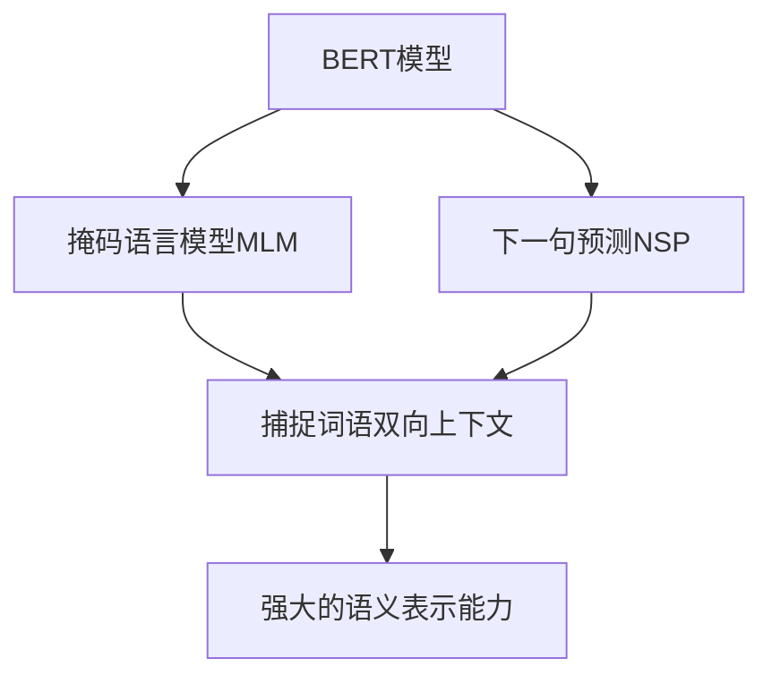
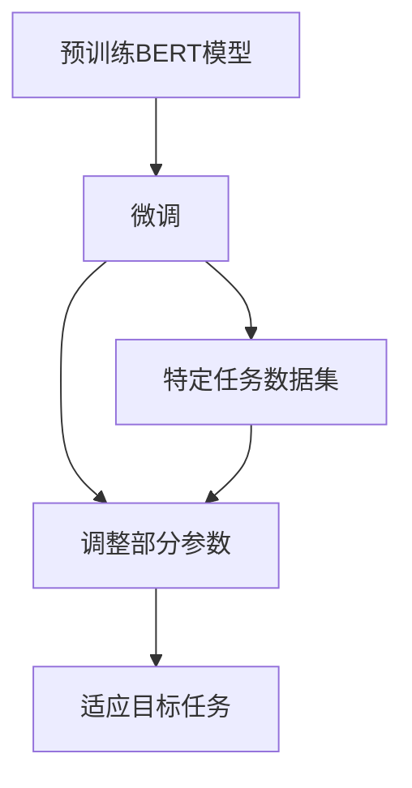
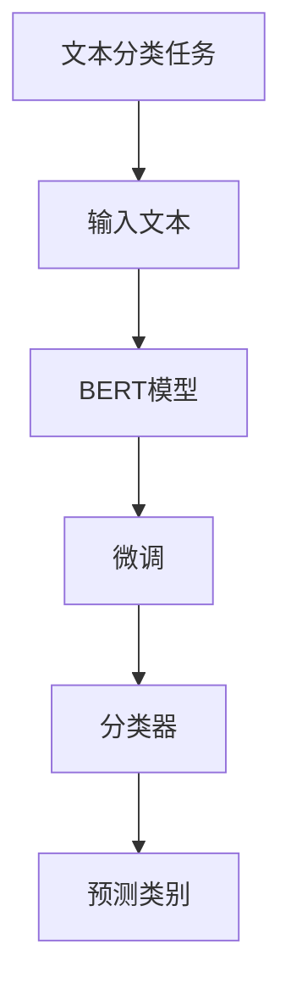
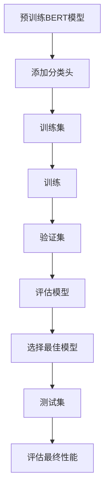

# 从零开始大模型开发与微调：BERT实战文本分类

## 1. 背景介绍

### 1.1 自然语言处理的重要性

在当今的数字时代，自然语言处理(NLP)已经成为一项关键技术,广泛应用于各个领域。随着海量文本数据的爆炸式增长,有效地处理和理解自然语言数据对于提高生产效率、优化用户体验和推动人工智能发展至关重要。文本分类作为NLP的核心任务之一,旨在自动将文本内容归类到预定义的类别中,在信息检索、垃圾邮件过滤、情感分析等领域发挥着重要作用。

### 1.2 传统方法的局限性

早期的文本分类方法主要基于统计机器学习模型,如朴素贝叶斯、支持向量机等。这些模型依赖于手工设计的特征工程,需要对文本进行预处理,提取相关的特征作为模型输入。然而,这种方法存在以下局限性:

1. 特征工程耗时耗力,需要专业知识和领域经验。
2. 难以捕捉文本中的语义和上下文信息。
3. 无法很好地处理未知词和新兴词汇。
4. 模型泛化能力较差,难以适应不同领域的数据。

### 1.3 深度学习在NLP中的突破

近年来,深度学习技术在自然语言处理领域取得了突破性进展。其中,基于transformer的预训练语言模型(Pre-trained Language Model,PLM)成为了NLP领域的关键创新,极大地推动了文本分类等任务的发展。代表性模型包括BERT(Bidirectional Encoder Representations from Transformers)、GPT(Generative Pre-trained Transformer)、XLNet等。这些模型通过在大规模无标注语料库上进行预训练,学习到了丰富的语义和上下文信息,为下游任务提供了强大的语义表示能力。

## 2. 核心概念与联系

### 2.1 BERT模型

BERT是谷歌于2018年提出的一种基于transformer的双向预训练语言模型。它的核心创新在于采用了"掩码语言模型"(Masked Language Model,MLM)和"下一句预测"(Next Sentence Prediction,NSP)两种预训练任务,使得模型能够同时捕捉词语的双向上下文信息。BERT的出色表现使其迅速成为NLP领域的标杆模型,在多项任务上取得了state-of-the-art的效果。



### 2.2 微调(Fine-tuning)

虽然BERT在大规模语料库上进行了预训练,但它并不能直接应用于特定的下游任务。为了解决这个问题,我们需要对BERT模型进行"微调"(Fine-tuning)。微调的过程是在特定任务的标注数据集上,对预训练模型的部分参数进行进一步训练,使其适应目标任务。通过微调,BERT模型可以学习到特定任务的语义和模式,从而提高任务的性能表现。



### 2.3 文本分类任务

文本分类是自然语言处理中的一项基础任务,旨在将给定的文本样本(如新闻文章、评论、社交媒体帖子等)分配到预定义的类别中。它广泛应用于垃圾邮件过滤、情感分析、主题分类等场景。通过对BERT模型进行微调,我们可以充分利用其强大的语义表示能力,提高文本分类的准确性和泛化能力。



## 3. 核心算法原理具体操作步骤

### 3.1 BERT模型架构

BERT模型的核心架构是基于transformer的编码器结构,由多个编码器层堆叠而成。每个编码器层包含一个多头自注意力(Multi-Head Attention)子层和一个前馈神经网络(Feed-Forward Neural Network)子层。自注意力机制使得模型能够捕捉输入序列中任意两个位置之间的关系,而前馈神经网络则用于对每个位置的表示进行非线性转换。

$$
\begin{aligned}
\text{MultiHead}(Q, K, V) &= \text{Concat}(\text{head}_1, \dots, \text{head}_h)W^O\\
\text{where}\,\text{head}_i &= \text{Attention}(QW_i^Q, KW_i^K, VW_i^V)
\end{aligned}
$$

其中,$$Q$$、$$K$$、$$V$$分别表示查询(Query)、键(Key)和值(Value)矩阵。$$W_i^Q$$、$$W_i^K$$、$$W_i^V$$和$$W^O$$是可学习的权重矩阵。

### 3.2 输入表示

为了适应BERT模型的输入格式,我们需要对原始文本进行预处理和特殊标记的添加。具体步骤如下:

1. 将文本分词成词元(token)序列。
2. 在序列开头添加特殊标记`[CLS]`(用于分类任务)。
3. 在序列末尾添加特殊标记`[SEP]`。
4. 对序列进行填充,使所有序列长度相同。
5. 将词元映射为对应的词元ID。

### 3.3 微调过程

微调BERT模型用于文本分类任务的具体步骤如下:

1. 加载预训练好的BERT模型权重。
2. 在BERT模型的输出层之后添加一个分类头(Classification Head),通常是一个线性层和一个softmax层。
3. 将标注的文本数据集划分为训练集、验证集和测试集。
4. 定义损失函数(如交叉熵损失)和优化器(如AdamW)。
5. 对BERT模型和分类头进行端到端的联合训练,使用训练集数据进行多轮迭代。
6. 在验证集上评估模型性能,选择最佳模型权重。
7. 在测试集上评估最终模型的性能。



## 4. 数学模型和公式详细讲解举例说明

### 4.1 自注意力机制

自注意力机制是transformer模型的核心组件,它允许模型捕捉输入序列中任意两个位置之间的关系。给定一个输入序列$$X = (x_1, x_2, \dots, x_n)$$,自注意力机制计算每个位置$$i$$的表示$$y_i$$,作为其他所有位置$$x_j$$的加权和:

$$
y_i = \sum_{j=1}^n \alpha_{ij}(x_jW^V)
$$

其中,$$\alpha_{ij}$$是注意力权重,表示位置$$i$$对位置$$j$$的注意力程度。注意力权重通过对查询(Query)和键(Key)进行缩放点积注意力计算得到:

$$
\alpha_{ij} = \frac{(x_iW^Q)(x_jW^K)^T}{\sqrt{d_k}}
$$

其中,$$W^Q$$和$$W^K$$是可学习的权重矩阵,$$d_k$$是缩放因子,用于防止点积结果过大导致梯度消失或爆炸。

为了捕捉不同的关系模式,BERT采用了多头自注意力机制,将注意力计算分成多个"头"(Head),每个头捕捉不同的关系,最后将所有头的结果拼接起来。

### 4.2 掩码语言模型(MLM)

掩码语言模型(MLM)是BERT预训练的核心任务之一。在MLM任务中,一部分词元(通常是15%的词元)会被随机遮蔽,模型需要根据上下文预测这些被遮蔽的词元。具体来说,对于每个被遮蔽的词元,有以下三种可能的操作:

1. 以概率80%将该词元替换为特殊标记`[MASK]`。
2. 以概率10%保留原始词元不变。
3. 以概率10%用随机词元替换。

MLM任务的目标是最大化被遮蔽词元的预测概率,即最小化以下损失函数:

$$
\mathcal{L}_\text{MLM} = -\frac{1}{N}\sum_{i=1}^N \log P(x_i^\text{masked}|X^\text{unmasked})
$$

其中,$$N$$是被遮蔽词元的总数,$$X^\text{unmasked}$$是原始未遮蔽的序列,$$x_i^\text{masked}$$是第$$i$$个被遮蔽的词元。

通过MLM任务,BERT模型学习到了丰富的语义和上下文信息,能够很好地捕捉词语在不同上下文中的含义。

## 5. 项目实践:代码实例和详细解释说明

在本节中,我们将使用PyTorch框架,通过一个实际项目来演示如何对BERT模型进行微调,应用于文本分类任务。我们将使用一个公开的电影评论数据集,将评论分类为正面或负面情感。

### 5.1 数据准备

首先,我们需要导入必要的库和加载数据集。

```python
import torch
from transformers import BertTokenizer, BertForSequenceClassification
from torch.utils.data import TensorDataset, DataLoader

# 加载数据集
train_data = load_dataset('dataset/train.csv')
test_data = load_dataset('dataset/test.csv')

# 初始化BERT分词器
tokenizer = BertTokenizer.from_pretrained('bert-base-uncased')
```

接下来,我们定义一个函数来对文本进行预处理和编码,使其符合BERT模型的输入格式。

```python
def encode_text(text, max_length=512):
    encoded = tokenizer.encode_plus(
        text,
        add_special_tokens=True,
        max_length=max_length,
        padding='max_length',
        truncation=True,
        return_tensors='pt'
    )
    return encoded['input_ids'], encoded['attention_mask']

# 对训练集和测试集进行编码
train_encodings = [encode_text(text) for text in train_data['text']]
test_encodings = [encode_text(text) for text in test_data['text']]

train_input_ids = torch.cat([encoding[0] for encoding in train_encodings], dim=0)
train_attention_masks = torch.cat([encoding[1] for encoding in train_encodings], dim=0)
train_labels = torch.tensor(train_data['label'])

test_input_ids = torch.cat([encoding[0] for encoding in test_encodings], dim=0)
test_attention_masks = torch.cat([encoding[1] for encoding in test_encodings], dim=0)
test_labels = torch.tensor(test_data['label'])
```

### 5.2 微调BERT模型

接下来,我们加载预训练的BERT模型,并对其进行微调。

```python
# 加载预训练BERT模型
model = BertForSequenceClassification.from_pretrained('bert-base-uncased', num_labels=2)

# 准备数据集
train_dataset = TensorDataset(train_input_ids, train_attention_masks, train_labels)
test_dataset = TensorDataset(test_input_ids, test_attention_masks, test_labels)

# 定义数据加载器
train_loader = DataLoader(train_dataset, batch_size=16, shuffle=True)
test_loader = DataLoader(test_dataset, batch_size=16)

# 定义优化器和损失函数
optimizer = torch.optim.AdamW(model.parameters(), lr=2e-5)
loss_fn = torch.nn.CrossEntropyLoss()

# 训练模型
epochs = 4
for epoch in range(epochs):
    model.train()
    for batch in train_loader:
        input_ids, attention_masks, labels = batch
        outputs = model(input_ids, attention_mask=attention_masks, labels=labels)
        loss = outputs.loss
        loss.backward()
        optimizer.step()
        optimizer.zero_grad()

# 评估模型
model.eval()
correct = 0
total = 0
with torch.no_grad():
    for batch in test_loader:
        input_ids, attention_masks, labels = batch
        outputs = model(input_ids, attention_mask=attention_masks)
        _, predicted = torch.max(outputs.logits, 1)
        total += labels.size(0)
        correct +=