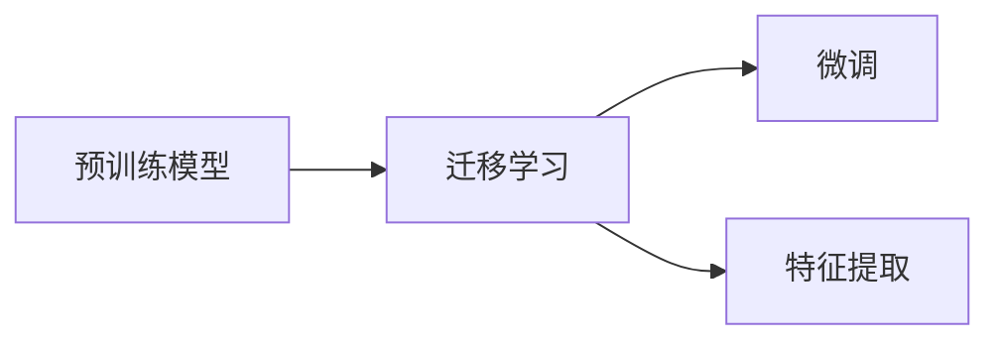

# 从零开始大模型开发与微调：CIFAR-10数据集简介

## 1.背景介绍
### 1.1 大模型开发与微调的重要性
在当前人工智能快速发展的时代，大规模预训练模型(Large Pre-trained Models)已经成为了自然语言处理(NLP)、计算机视觉(CV)等领域的主流技术范式。通过在海量数据上进行预训练，这些大模型能够学习到丰富的语义表示和知识，具备强大的泛化能力。然而，如何将预训练好的大模型应用到下游任务中，并取得优异的性能，是一个值得深入探讨的问题。微调(Fine-tuning)技术应运而生，通过在特定任务的数据集上对预训练模型进行二次训练，使其适应新的任务需求，已经成为了大模型应用的关键一环。

### 1.2 CIFAR-10数据集的地位和作用
在计算机视觉领域，CIFAR-10是一个广泛使用的图像分类基准数据集。它包含了60000张32x32像素的彩色图像，涵盖了10个不同的类别，每个类别有6000张图像，其中5000张用于训练，1000张用于测试。这些类别包括：飞机、汽车、鸟类、猫、鹿、狗、青蛙、马、船和卡车。尽管图像尺寸较小，但CIFAR-10对于评估模型的分类性能和泛化能力具有重要意义。许多经典的卷积神经网络(CNN)模型，如AlexNet、VGGNet、ResNet等，都曾在CIFAR-10上进行过验证和比较。因此，掌握CIFAR-10数据集的特点和使用方法，对于开展图像分类任务的研究和实践具有重要的指导意义。

### 1.3 本文的目标和贡献
本文旨在为读者提供一份全面的CIFAR-10数据集介绍和使用指南，帮助读者从零开始掌握大模型在图像分类任务中的开发与微调流程。我们将详细介绍CIFAR-10数据集的来源、结构和特点，并给出基于PyTorch的数据加载和预处理示例代码。同时，我们还将讨论如何选择适合的预训练模型，并给出微调的具体步骤和注意事项。此外，我们还将介绍一些在CIFAR-10上取得领先性能的模型架构和技巧，为读者提供宝贵的参考。通过本文的学习，读者将能够快速上手CIFAR-10数据集，并掌握大模型微调的核心方法，为进一步开展图像分类任务的研究和应用奠定坚实的基础。

## 2.核心概念与联系
### 2.1 图像分类任务的定义与挑战
图像分类是计算机视觉中的一项基础任务，旨在将给定的图像正确地划分到预定义的类别中。它广泛应用于人脸识别、场景理解、医学影像诊断等领域。然而，图像分类面临着诸多挑战：1)图像的高维度特性，需要设计有效的特征提取方法；2)类别间的相似性和类内差异性，需要学习鲁棒的判别模型；3)数据标注的成本高昂，需要解决少样本学习的问题；4)图像的多尺度和视角变化，需要具备一定的泛化能力。

### 2.2 卷积神经网络的基本原理
卷积神经网络(CNN)是解决图像分类问题的有力工具。它通过局部连接和权重共享，能够有效地提取图像的局部特征，并通过层级结构逐步抽象出高层语义信息。一个典型的CNN由若干卷积层、池化层和全连接层组成。卷积层对输入特征图进行卷积操作，池化层对特征图进行下采样，全连接层将特征展平并映射到类别标签上。通过端到端的训练，CNN能够自动学习到图像的判别特征，避免了手工设计特征的繁琐。

### 2.3 预训练模型与迁移学习
预训练模型是指在大规模数据集上训练得到的通用模型，如在ImageNet上预训练的ResNet、VGGNet等。这些模型往往具有良好的特征提取能力和泛化性能。迁移学习是指将预训练模型应用到新的任务中，通过微调或特征提取的方式，充分利用预训练模型学习到的知识，提升新任务的性能。相比从零开始训练，迁移学习能够显著减少所需的数据量和训练时间，特别适用于小样本场景。

### 2.4 微调的策略与技巧
微调是迁移学习的一种常用策略，通过在新任务的数据集上对预训练模型进行二次训练，使其适应新的任务需求。微调时需要考虑以下几点：1)根据新任务的相似度选择合适的预训练模型；2)根据新任务的数据量调整微调的层数，一般数据量较小时只微调顶部几层；3)适当调小学习率，避免破坏预训练的权重；4)合理设置正则化项，如L2正则、Dropout等，防止过拟合；5)进行数据增强，如随机裁剪、旋转、翻转等，增加数据的多样性。

下图展示了预训练模型与迁移学习的关系：


## 3.核心算法原理具体操作步骤
### 3.1 数据准备
首先，我们需要下载CIFAR-10数据集，并将其组织成适合PyTorch使用的格式。CIFAR-10数据集的官方下载地址为：https://www.cs.toronto.edu/~kriz/cifar.html。下载完成后，我们可以使用以下代码来加载数据集：

```python
import torch
import torchvision
import torchvision.transforms as transforms

# 定义数据预处理
transform_train = transforms.Compose([
    transforms.RandomCrop(32, padding=4),
    transforms.RandomHorizontalFlip(),
    transforms.ToTensor(),
    transforms.Normalize((0.4914, 0.4822, 0.4465), (0.2023, 0.1994, 0.2010)),
])

transform_test = transforms.Compose([
    transforms.ToTensor(),
    transforms.Normalize((0.4914, 0.4822, 0.4465), (0.2023, 0.1994, 0.2010)),
])

# 加载训练集
trainset = torchvision.datasets.CIFAR10(root='./data', train=True, 
                                        download=True, transform=transform_train)
trainloader = torch.utils.data.DataLoader(trainset, batch_size=128,
                                          shuffle=True, num_workers=2)

# 加载测试集
testset = torchvision.datasets.CIFAR10(root='./data', train=False,
                                       download=True, transform=transform_test)
testloader = torch.utils.data.DataLoader(testset, batch_size=100,
                                         shuffle=False, num_workers=2)
```

这里我们定义了两种数据预处理方式，对训练集进行了随机裁剪、随机水平翻转和归一化，对测试集只进行了归一化。然后，我们使用`torchvision.datasets.CIFAR10`来加载CIFAR-10数据集，并将其封装成`DataLoader`对象，方便后续的批次训练。

### 3.2 模型选择与微调
接下来，我们需要选择一个合适的预训练模型，并对其进行微调。这里我们以ResNet-18为例，演示如何在CIFAR-10数据集上进行微调。

```python
import torch.nn as nn
import torch.optim as optim

# 加载预训练的ResNet-18模型
net = torchvision.models.resnet18(pretrained=True)

# 替换最后一层全连接层
num_features = net.fc.in_features
net.fc = nn.Linear(num_features, 10)

# 定义损失函数和优化器
criterion = nn.CrossEntropyLoss()
optimizer = optim.SGD(net.parameters(), lr=0.001, momentum=0.9, weight_decay=5e-4)

# 微调模型
num_epochs = 50
device = torch.device("cuda:0" if torch.cuda.is_available() else "cpu")
net.to(device)

for epoch in range(num_epochs):
    net.train()
    running_loss = 0.0
    for i, data in enumerate(trainloader, 0):
        inputs, labels = data[0].to(device), data[1].to(device)
        
        optimizer.zero_grad()
        
        outputs = net(inputs)
        loss = criterion(outputs, labels)
        loss.backward()
        optimizer.step()
        
        running_loss += loss.item()
        if i % 50 == 49:
            print('[%d, %5d] loss: %.3f' %
                  (epoch + 1, i + 1, running_loss / 50))
            running_loss = 0.0

    # 在测试集上评估模型
    net.eval()
    correct = 0
    total = 0
    with torch.no_grad():
        for data in testloader:
            images, labels = data[0].to(device), data[1].to(device)
            outputs = net(images)
            _, predicted = torch.max(outputs.data, 1)
            total += labels.size(0)
            correct += (predicted == labels).sum().item()

    print('Accuracy of the network on the 10000 test images: %d %%' % (
        100 * correct / total))
```

这里我们首先加载了预训练的ResNet-18模型，并将最后一层全连接层替换成了适合CIFAR-10任务的10分类输出。然后，我们定义了交叉熵损失函数和SGD优化器，并将模型移动到GPU上进行训练。在每个epoch中，我们对模型进行训练，并在测试集上评估模型的性能。

### 3.3 模型评估与结果分析
在微调完成后，我们可以在测试集上评估模型的性能，并分析其预测结果。以下代码展示了如何可视化模型在测试集上的预测结果：

```python
import matplotlib.pyplot as plt
import numpy as np

# 可视化预测结果
dataiter = iter(testloader)
images, labels = dataiter.next()
images, labels = images.to(device), labels.to(device)

outputs = net(images)
_, predicted = torch.max(outputs, 1)

classes = ('plane', 'car', 'bird', 'cat',
           'deer', 'dog', 'frog', 'horse', 'ship', 'truck')

fig, axes = plt.subplots(4, 4, figsize=(10, 10))
for i, ax in enumerate(axes.flat):
    ax.imshow(images[i].cpu().numpy().transpose((1, 2, 0)))
    ax.set_title(f"True: {classes[labels[i]]}\nPred: {classes[predicted[i]]}")
    ax.axis('off')
plt.tight_layout()
plt.show()
```

这里我们从测试集中取出一个批次的图像，并将其输入到模型中进行预测。然后，我们使用Matplotlib将图像可视化，并在每个图像下方标注真实类别和预测类别，直观地展示模型的预测效果。

通过分析模型在测试集上的性能，我们可以评估模型的泛化能力，并发现可能存在的问题，如过拟合、欠拟合等。根据分析结果，我们可以进一步调整模型结构、超参数或数据预处理方式，以提升模型的性能。

## 4.数学模型和公式详细讲解举例说明
在卷积神经网络中，卷积操作是一个核心的数学模型。它通过滑动窗口的方式，对输入特征图进行局部加权求和，得到输出特征图。卷积操作可以表示为：

$$
\mathbf{Y}_{i,j} = \sum_{m=0}^{M-1}\sum_{n=0}^{N-1}\mathbf{W}_{m,n}\mathbf{X}_{i+m,j+n}
$$

其中，$\mathbf{X}$表示输入特征图，$\mathbf{W}$表示卷积核，$\mathbf{Y}$表示输出特征图，$M$和$N$分别表示卷积核的高度和宽度。

举个例子，假设我们有一个3x3的输入特征图$\mathbf{X}$和一个2x2的卷积核$\mathbf{W}$：

$$
\mathbf{X} = \begin{bmatrix}
1 & 2 & 3\\
4 & 5 & 6\\
7 & 8 & 9
\end{bmatrix},\quad
\mathbf{W} = \begin{bmatrix}
1 & 0\\
0 & 1
\end{bmatrix}
$$

对$\mathbf{X}$进行卷积操作，得到输出特征图$\mathbf{Y}$：

$$
\mathbf{Y}_{0,0} = 1\times1 + 2\times0 + 4\times0 + 5\times1 = 6\\
\mathbf{Y}_{0,1} = 2\times1 + 3\times0 