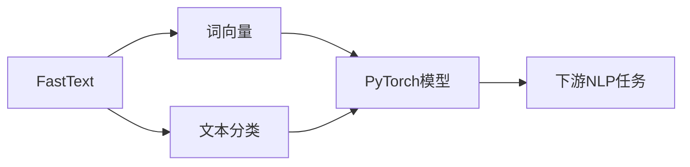

# 从零开始大模型开发与微调：FastText训练及其与PyTorch 2.0的协同使用

## 1. 背景介绍

### 1.1 大模型的兴起与发展

近年来,自然语言处理(NLP)领域出现了一种新的范式——大模型(Large Language Model)。这些模型通过在海量文本数据上进行预训练,能够学习到丰富的语言知识和常识,在各种NLP任务上取得了突破性的进展。从ELMo、BERT到GPT系列模型,大模型不断刷新着NLP任务的性能上限。

### 1.2 FastText与PyTorch在NLP领域的应用

FastText是由Facebook开源的一个高效的文本分类和词向量训练库。它基于word2vec模型,但进行了一些改进,如引入了n-gram特征,使其能够更好地处理稀有词和未登录词。FastText以其简单高效著称,已被广泛应用于各种NLP任务中。

PyTorch是一个灵活的深度学习框架,其动态计算图和强大的GPU加速能力使其在NLP研究和应用中大放异彩。PyTorch 2.0的发布进一步提升了其易用性和性能,为NLP领域带来了新的机遇。

### 1.3 FastText与PyTorch的结合

将FastText与PyTorch结合起来,可以发挥两者的优势,实现高效的NLP模型开发与训练。FastText负责文本预处理和词向量训练,为下游任务提供高质量的输入表示;PyTorch则用于搭建灵活的神经网络模型,进行端到端的训练和微调。这种协同使用的方式已在学术界和工业界得到了广泛应用。

## 2. 核心概念与联系

### 2.1 FastText的核心概念

- 词向量(Word Embedding):将词映射为固定维度的实数向量,捕捉词之间的语义关系。
- n-gram特征:将词划分为字符级别的n-gram,解决未登录词的问题。
- 分层Softmax:一种高效的多分类算法,降低了计算复杂度。

### 2.2 PyTorch的核心概念  

- 张量(Tensor):多维数组,PyTorch的基本数据结构。
- 自动微分(Autograd):自动构建计算图并计算梯度,简化模型训练。
- 动态计算图:每次迭代动态构建计算图,灵活支持控制流。

### 2.3 FastText与PyTorch的联系



如上图所示,FastText负责产生高质量的词向量和初步的文本分类结果,这些信息进一步输入PyTorch搭建的神经网络模型中,最终应用于各种下游的NLP任务。两者相互配合,形成了一套完整的NLP解决方案。

## 3. 核心算法原理与具体操作步骤

### 3.1 FastText的训练流程

FastText的训练主要分为以下几个步骤:

1. 文本预处理:将原始文本进行清洗、分词等操作,得到规范化的训练语料。
2. 构建词汇表:统计语料中的词频,构建词汇表并为每个词分配唯一的索引。
3. 生成训练样本:根据词汇表将文本转换为索引序列,并生成正负样本对。
4. 训练词向量:使用负采样等技术,优化词向量矩阵,使得语义相近的词具有相近的向量表示。
5. 微调分类器:在词向量的基础上,训练一个简单的线性分类器,用于文本分类任务。

### 3.2 基于PyTorch的FastText实现

借助PyTorch的张量运算和自动微分功能,可以方便地实现FastText模型:

1. 定义词嵌入层:使用`nn.Embedding`构建词向量矩阵。
2. 定义分类器:使用`nn.Linear`构建线性分类器。
3. 定义损失函数:使用`nn.CrossEntropyLoss`计算分类损失。
4. 定义优化器:使用`torch.optim.SGD`等优化器更新模型参数。
5. 训练模型:遍历训练数据,进行前向传播和反向传播,不断更新模型参数直至收敛。

### 3.3 FastText与PyTorch的协同使用

在实际应用中,我们可以先使用FastText在大规模语料上预训练词向量,然后将其加载到PyTorch定义的模型中,进行下游任务的微调。这种协同使用的方式可以显著提升模型的性能和泛化能力。

具体操作步骤如下:

1. 使用FastText训练词向量:调用FastText的命令行接口或Python API,在目标语料上训练词向量。
2. 将词向量转换为PyTorch格式:使用`gensim`等工具加载FastText训练的词向量,并转换为PyTorch的张量格式。
3. 搭建PyTorch模型:使用预训练的词向量初始化`nn.Embedding`层,搭建完整的神经网络模型。
4. 微调模型:在下游任务的标注数据上对模型进行微调,更新模型参数以适应特定任务。
5. 评估模型性能:在测试集上评估微调后的模型性能,进行必要的模型选择和超参数调优。

通过FastText与PyTorch的协同使用,我们可以充分利用无监督的语料资源和有监督的标注数据,构建高性能的NLP模型。

## 4. 数学模型与公式详解

### 4.1 FastText的数学模型

FastText的核心是Skip-gram模型,其目标是最大化目标词$w_t$在给定上下文$\mathcal{C}_t$下的条件概率:

$$\arg\max_\theta \prod_{t=1}^T \prod_{w_c \in \mathcal{C}_t} P(w_t | w_c; \theta)$$

其中$\theta$为模型参数,主要包括词向量矩阵$W$和上下文词向量矩阵$C$。$P(w_t|w_c)$的计算采用softmax函数:

$$P(w_t | w_c) = \frac{\exp(v_{w_t}^T v'_{w_c})}{\sum_{w \in \mathcal{V}} \exp(v_w^T v'_{w_c})}$$

其中$v_w$和$v'_w$分别表示词$w$作为中心词和上下文词时的向量表示。由于分母中的归一化项计算复杂度很高,FastText采用了负采样和分层Softmax等技术来进行近似。

### 4.2 负采样

负采样(Negative Sampling)的思想是将多分类问题转化为一系列二分类问题。对于每个正样本$(w_t, w_c)$,我们随机采样$K$个负样本 $\{(w_t, w_i)\}_{i=1}^K$,其中$w_i$根据词频分布$P_n(w)$采样得到。优化目标变为:

$$\arg\max_\theta \prod_{t=1}^T \prod_{w_c \in \mathcal{C}_t} \left( \sigma(v_{w_t}^T v'_{w_c}) \prod_{i=1}^K \mathbb{E}_{w_i \sim P_n(w)} [1 - \sigma(v_{w_t}^T v'_{w_i})] \right)$$

其中$\sigma(x)=1/(1+e^{-x})$为sigmoid函数。这样,我们只需要计算$K+1$个样本的概率,大大减少了计算开销。

### 4.3 分层Softmax

分层Softmax(Hierarchical Softmax)的思想是将词汇表组织成一个二叉树,每个叶子节点代表一个词。计算一个词的概率时,我们只需要计算从根节点到该词对应叶子节点路径上的节点概率乘积:

$$P(w_t | w_c) = \prod_{j=1}^{\text{len}(path_{w_t})} P(d_j | v_{w_c}, \theta_{p_j})$$

其中$path_{w_t}$表示从根节点到词$w_t$的路径,$d_j \in \{0, 1\}$表示在第$j$个节点处的二分类决策,$\theta_{p_j}$为第$j$个父节点的参数。这样,计算复杂度从$O(|\mathcal{V}|)$降到了$O(\log |\mathcal{V}|)$。

### 4.4 PyTorch中的数学运算

PyTorch提供了丰富的数学运算和自动微分功能,可以方便地实现上述模型和优化算法。以下是一些常用的数学运算:

- 矩阵乘法:`torch.matmul()`或`@`运算符
- 逐元素运算:`torch.add()`, `torch.mul()`等
- 广播机制:自动扩展维度以支持不同形状的张量运算
- 激活函数:`torch.sigmoid()`, `torch.tanh()`等
- 损失函数:`torch.nn.functional.cross_entropy()`, `torch.nn.functional.mse_loss()`等
- 优化算法:`torch.optim.SGD()`, `torch.optim.Adam()`等

利用这些数学运算,我们可以方便地在PyTorch中实现FastText模型,并进行高效的训练和推断。

## 5. 项目实践:代码实例与详细解释

下面我们通过一个简单的例子,演示如何使用FastText和PyTorch进行文本分类任务。

### 5.1 数据准备

首先,我们需要准备训练和测试数据。假设我们有一个包含多个文本文件的目录,每个文件名表示其类别标签。我们可以使用以下代码读取数据:

```python
import os

def read_data(data_dir):
    texts = []
    labels = []
    for label in os.listdir(data_dir):
        label_dir = os.path.join(data_dir, label)
        for file in os.listdir(label_dir):
            with open(os.path.join(label_dir, file), 'r', encoding='utf-8') as f:
                texts.append(f.read())
                labels.append(label)
    return texts, labels
```

### 5.2 FastText词向量训练

接下来,我们使用FastText训练词向量。可以直接调用FastText的命令行接口:

```bash
fasttext skipgram -input train.txt -output model -dim 100 -minCount 1 -neg 5 -ws 5 -epoch 10
```

这里我们使用Skip-gram模型,词向量维度为100,负采样数为5,上下文窗口大小为5,训练10个epoch。

### 5.3 PyTorch模型定义

我们使用PyTorch定义一个简单的文本分类模型:

```python
import torch
import torch.nn as nn
import torch.nn.functional as F

class TextClassifier(nn.Module):
    def __init__(self, vocab_size, embed_dim, num_classes):
        super().__init__()
        self.embedding = nn.Embedding(vocab_size, embed_dim)
        self.fc = nn.Linear(embed_dim, num_classes)
        
    def forward(self, x):
        x = self.embedding(x)
        x = x.mean(dim=1)
        x = self.fc(x)
        return x
```

模型主要包括一个词嵌入层`nn.Embedding`和一个全连接层`nn.Linear`。我们将每个文本中的词向量取平均,然后通过全连接层进行分类。

### 5.4 模型训练与评估

最后,我们加载预训练的FastText词向量,对模型进行微调和评估:

```python
from gensim.models import KeyedVectors

# 加载FastText词向量
wv = KeyedVectors.load_word2vec_format('model.vec', binary=False)

# 初始化词嵌入层权重
embed_weights = torch.zeros(len(vocab), embed_dim)
for i, word in enumerate(vocab):
    if word in wv:
        embed_weights[i] = torch.from_numpy(wv[word])
model.embedding.weight.data.copy_(embed_weights)

# 训练模型
criterion = nn.CrossEntropyLoss()
optimizer = torch.optim.Adam(model.parameters(), lr=1e-3)

for epoch in range(num_epochs):
    for texts, labels in dataloader:
        outputs = model(texts)
        loss = criterion(outputs, labels)
        
        optimizer.zero_grad()
        loss.backward()
        optimizer.step()

# 评估模型
model.eval()
with torch.no_grad():
    outputs = model(test_texts)
    _, preds = torch.max(outputs, 1)
    acc = torch.sum(preds == test_labels).item() / len(test_labels)
print(f'Test Accuracy: {acc:.4f}')
```

在加载预训练词向量时,我们使用了`gensim`库来读取FastText的词向量文件。然后,我们将词向量赋值给PyTorch模型的词嵌入层,作为初始化权重。

在训练过程中,我们使用`nn.CrossEntropyLoss`作为损失函数,使用`torch.optim.Adam`作为优化器。通