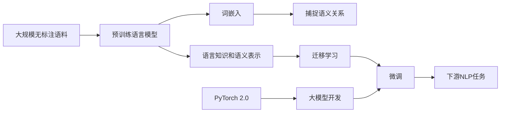

# 从零开始大模型开发与微调：使用其他预训练参数来生成PyTorch 2.0词嵌入矩阵（中文）

## 1. 背景介绍
### 1.1 大语言模型的兴起
近年来，随着深度学习技术的飞速发展，大规模语言模型（Large Language Models，LLMs）在自然语言处理（NLP）领域掀起了一场革命。这些模型通过在海量文本数据上进行无监督预训练，学习到了丰富的语言知识和语义表示，在各种NLP任务上取得了令人瞩目的成果。从GPT系列到BERT，再到最新的GPT-4，LLMs不断刷新着NLP领域的性能上限。

### 1.2 词嵌入在大模型中的重要性
词嵌入（Word Embedding）是大语言模型的重要组成部分，它将每个词映射到一个低维稠密向量空间中，使得语义相近的词在向量空间中也相距较近。高质量的词嵌入能够捕捉词与词之间的语义关系，是大模型取得优异性能的关键因素之一。传统的词嵌入方法如Word2Vec和GloVe通常需要在特定语料上从头训练，而近期的研究表明，利用在大规模语料上预训练得到的词嵌入，能够显著提升下游任务的性能。

### 1.3 PyTorch 2.0与大模型开发
PyTorch是当前最流行的深度学习框架之一，其动态计算图、易用性和灵活性使其备受研究者和工程师的青睐。PyTorch 2.0是PyTorch的一次重大更新，引入了诸如编译器、Distributed RPC等新特性，进一步提升了框架的性能和可用性。在PyTorch 2.0中开发和微调大语言模型，能够充分利用其优势，加速模型迭代和优化的过程。

## 2. 核心概念与联系
### 2.1 词嵌入
词嵌入是一种将词映射到实数向量的技术，通过神经网络等机器学习模型学习得到。其核心思想是将语义相近的词映射到向量空间中的相近位置，从而捕捉词与词之间的语义关系。常见的词嵌入模型包括Word2Vec、GloVe和FastText等。

### 2.2 预训练语言模型
预训练语言模型是指在大规模无标注语料上进行无监督预训练的语言模型，如BERT、GPT等。这些模型通过自监督学习任务（如Masked Language Modeling和Next Sentence Prediction）学习到了丰富的语言知识和语义表示，可以通过微调应用于下游NLP任务，取得优异的性能。

### 2.3 迁移学习
迁移学习是指将在某个任务上学习到的知识迁移应用到另一个相关任务中，以提高后者的性能。在NLP领域，通常采用在大规模语料上预训练得到的语言模型作为基础，通过微调的方式应用于具体的下游任务，实现知识的迁移和复用。

### 2.4 微调
微调（Fine-tuning）是指在预训练模型的基础上，通过较小的学习率和少量的训练数据，针对特定任务进行再训练的过程。微调能够充分利用预训练模型学习到的通用语言知识，同时适应特定任务的需求，在少样本学习场景下表现出色。

### 2.5 PyTorch与大模型开发
PyTorch凭借其动态计算图、易用性和灵活性，成为开发和微调大语言模型的首选框架之一。PyTorch提供了丰富的API和工具，支持快速构建和训练神经网络模型。PyTorch 2.0的推出，进一步增强了框架的性能和可用性，为大模型开发带来了新的机遇和挑战。

以下是核心概念之间的联系示意图（使用Mermaid流程图表示）：



## 3. 核心算法原理与具体操作步骤
### 3.1 使用预训练词嵌入矩阵
#### 3.1.1 加载预训练词嵌入
首先，我们需要加载预训练得到的词嵌入矩阵。常见的预训练词嵌入包括Word2Vec、GloVe和FastText等。这里以GloVe为例，演示如何加载预训练词嵌入：

```python
import numpy as np

def load_glove_embeddings(file_path):
    embeddings = {}
    with open(file_path, 'r', encoding='utf-8') as f:
        for line in f:
            values = line.split()
            word = values[0]
            vector = np.asarray(values[1:], dtype='float32')
            embeddings[word] = vector
    return embeddings

glove_embeddings = load_glove_embeddings('path/to/glove.txt')
```

#### 3.1.2 构建词汇表
接下来，我们需要为目标任务构建词汇表，将每个词映射为一个唯一的索引。可以使用Python中的字典类型来实现：

```python
def build_vocab(texts):
    vocab = {'<PAD>': 0, '<UNK>': 1}
    for text in texts:
        for word in text:
            if word not in vocab:
                vocab[word] = len(vocab)
    return vocab

vocab = build_vocab(texts)
```

#### 3.1.3 初始化词嵌入层
有了词汇表和预训练词嵌入矩阵，我们可以初始化PyTorch中的Embedding层。对于在预训练词嵌入中找不到的词，可以随机初始化其向量或将其映射为一个特殊的未登录词向量。

```python
import torch
import torch.nn as nn

def create_embedding_layer(vocab, glove_embeddings, embedding_dim):
    embedding_matrix = np.zeros((len(vocab), embedding_dim))
    for word, i in vocab.items():
        if word in glove_embeddings:
            embedding_matrix[i] = glove_embeddings[word]
        else:
            embedding_matrix[i] = np.random.normal(scale=0.6, size=(embedding_dim,))
    embedding_layer = nn.Embedding.from_pretrained(
        torch.FloatTensor(embedding_matrix),
        freeze=False
    )
    return embedding_layer

embedding_layer = create_embedding_layer(vocab, glove_embeddings, embedding_dim=300)
```

### 3.2 微调预训练语言模型
#### 3.2.1 加载预训练模型
以BERT为例，我们可以使用Hugging Face的Transformers库加载预训练的BERT模型：

```python
from transformers import BertModel

bert_model = BertModel.from_pretrained('bert-base-uncased')
```

#### 3.2.2 添加任务特定层
根据下游任务的需求，在BERT模型之上添加任务特定的层，如分类层、序列标注层等：

```python
class BertForSequenceClassification(nn.Module):
    def __init__(self, num_classes):
        super().__init__()
        self.bert = BertModel.from_pretrained('bert-base-uncased')
        self.dropout = nn.Dropout(0.1)
        self.classifier = nn.Linear(768, num_classes)
        
    def forward(self, input_ids, attention_mask):
        outputs = self.bert(input_ids, attention_mask=attention_mask)
        pooled_output = outputs[1]
        pooled_output = self.dropout(pooled_output)
        logits = self.classifier(pooled_output)
        return logits
```

#### 3.2.3 准备数据和优化器
将数据处理为BERT需要的输入格式，包括input_ids和attention_mask等。然后，定义优化器和损失函数：

```python
from transformers import AdamW

optimizer = AdamW(model.parameters(), lr=2e-5)
criterion = nn.CrossEntropyLoss()
```

#### 3.2.4 训练和评估
对模型进行微调训练和评估，根据验证集的性能调整超参数：

```python
for epoch in range(num_epochs):
    for batch in train_dataloader:
        input_ids, attention_mask, labels = batch
        logits = model(input_ids, attention_mask)
        loss = criterion(logits, labels)
        optimizer.zero_grad()
        loss.backward()
        optimizer.step()
        
    evaluate(model, val_dataloader)
```

## 4. 数学模型和公式详细讲解举例说明
### 4.1 Word2Vec的Skip-gram模型
Word2Vec是一种经典的词嵌入模型，其中Skip-gram模型旨在通过中心词预测上下文词。给定一个词$w_i$，Skip-gram模型的目标是最大化：

$$\mathcal{L}(\theta) = \prod_{w_i \in \mathcal{C}} \prod_{w_j \in \text{context}(w_i)} P(w_j | w_i; \theta)$$

其中，$\mathcal{C}$是语料库，$\text{context}(w_i)$是词$w_i$的上下文窗口，$\theta$是模型参数。$P(w_j | w_i; \theta)$通常使用softmax函数进行建模：

$$P(w_j | w_i; \theta) = \frac{\exp(v_{w_j}^\top v_{w_i})}{\sum_{k=1}^V \exp(v_{w_k}^\top v_{w_i})}$$

其中，$v_w$是词$w$的嵌入向量，$V$是词汇表的大小。由于softmax函数的计算复杂度高，Word2Vec采用了负采样（Negative Sampling）等技术进行优化。

### 4.2 BERT的Masked Language Modeling
BERT是一种基于Transformer的预训练语言模型，其中的Masked Language Modeling（MLM）任务旨在预测被随机遮挡的词。给定一个输入序列$\mathbf{x} = (x_1, \dots, x_n)$，BERT随机遮挡其中的一部分词，得到遮挡后的序列$\mathbf{\hat{x}}$。MLM的目标是最大化：

$$\mathcal{L}(\theta) = \sum_{i=1}^n m_i \log P(x_i | \mathbf{\hat{x}}; \theta)$$

其中，$m_i$是指示变量，表示第$i$个位置是否被遮挡，$P(x_i | \mathbf{\hat{x}}; \theta)$是BERT预测第$i$个位置词的概率。BERT使用Transformer的多头自注意力机制对输入序列进行编码，得到每个位置的隐藏状态$\mathbf{h}_i$，然后通过一个全连接层和softmax函数计算预测概率：

$$P(x_i | \mathbf{\hat{x}}; \theta) = \text{softmax}(\mathbf{W}\mathbf{h}_i + \mathbf{b})$$

其中，$\mathbf{W}$和$\mathbf{b}$是可学习的参数。通过优化MLM任务，BERT能够学习到上下文相关的词嵌入表示。

## 5. 项目实践：代码实例和详细解释说明
下面通过一个简单的文本分类任务，演示如何使用预训练词嵌入和微调BERT模型进行实践。

### 5.1 加载预训练词嵌入
```python
import numpy as np

def load_glove_embeddings(file_path):
    embeddings = {}
    with open(file_path, 'r', encoding='utf-8') as f:
        for line in f:
            values = line.split()
            word = values[0]
            vector = np.asarray(values[1:], dtype='float32')
            embeddings[word] = vector
    return embeddings

glove_embeddings = load_glove_embeddings('path/to/glove.6B.300d.txt')
```

这段代码加载了预训练的GloVe词嵌入，将每个词映射为一个300维的实数向量。

### 5.2 构建词汇表和词嵌入矩阵
```python
def build_vocab(texts):
    vocab = {'<PAD>': 0, '<UNK>': 1}
    for text in texts:
        for word in text:
            if word not in vocab:
                vocab[word] = len(vocab)
    return vocab

vocab = build_vocab(texts)

def create_embedding_matrix(vocab, glove_embeddings, embedding_dim):
    embedding_matrix = np.zeros((len(vocab), embedding_dim))
    for word, i in vocab.items():
        if word in glove_embeddings:
            embedding_matrix[i] = glove_embeddings[word]
        else:
            embedding_matrix[i] = np.random.normal(scale=0.6, size=(embedding_dim,))
    return embedding_matrix

embedding_matrix = create_embedding_matrix(vocab, glove_embeddings, embedding_dim=300)
```

这段代码首先根据训练文本构建了词汇表，然后使用预训练的GloVe词嵌入初始化词嵌入矩阵。对于词汇表中不存在的词，使用随机初始化的方式处理。

### 5.3 微调BERT模型
```