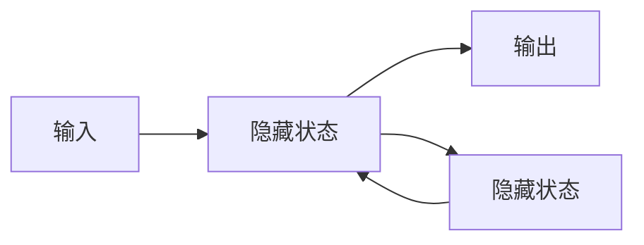

# 从零开始大模型开发与微调：反向传播神经网络的前身历史

## 1. 背景介绍

### 1.1 人工智能的崛起

在过去几十年中,人工智能(AI)已经从一个狭隘的研究领域发展成为一个前沿科技,影响着我们生活的方方面面。大型神经网络模型的兴起,特别是自注意力机制的出现,使得深度学习在自然语言处理、计算机视觉等领域取得了令人瞩目的成就。

### 1.2 大模型的重要性

大型神经网络模型,通常被称为"大模型",已经成为推动人工智能发展的核心动力。这些庞大的模型拥有数十亿甚至上万亿个参数,能够从海量数据中学习丰富的知识表示,展现出惊人的泛化能力。著名的大模型包括 GPT-3、BERT、DALL-E 等,它们在自然语言处理、图像生成等领域表现出色。

### 1.3 微调技术的关键作用

尽管预训练的大模型已经学习到了大量知识,但将它们直接应用于特定任务并不理想。这时,微调(fine-tuning)技术就显得尤为重要。微调是在大模型的基础上,使用特定任务的数据进行进一步训练,从而使模型适应该任务的特征。通过微调,我们可以充分利用大模型的知识,同时专注于特定任务的优化,取得更好的性能表现。

## 2. 核心概念与联系

### 2.1 人工神经网络

人工神经网络是人工智能的核心概念之一,它模仿生物神经系统的工作原理,通过连接大量的人工神经元来学习数据模式。神经网络可以被视为一个高度参数化的函数,通过调整参数(权重和偏置)来拟合输入和输出之间的映射关系。

### 2.2 前馈神经网络

前馈神经网络(Feedforward Neural Network)是最基本的神经网络结构,信息只从输入层单向传递到输出层,中间可以有多个隐藏层。这种结构简单且高效,但无法捕捉序列数据或上下文信息。

### 2.3 反向传播算法

反向传播算法(Backpropagation)是训练神经网络的关键算法,它通过计算损失函数相对于每个权重的梯度,并使用梯度下降法更新权重,从而最小化损失函数。这种端到端的训练方式使得神经网络能够自动学习特征表示和映射关系。

### 2.4 递归神经网络

递归神经网络(Recurrent Neural Network, RNN)是处理序列数据的神经网络结构,它引入了循环连接,使得网络能够捕捉序列中的上下文信息。RNN在自然语言处理、时间序列预测等领域有广泛应用。

### 2.5 长短期记忆网络

长短期记忆网络(Long Short-Term Memory, LSTM)是一种特殊的RNN,它通过引入门控机制和记忆单元,有效解决了RNN在处理长序列时的梯度消失/爆炸问题,显著提高了性能。LSTM广泛应用于机器翻译、语音识别等任务。

### 2.6 自注意力机制

自注意力机制(Self-Attention)是transformer模型的核心,它允许输入序列中的每个位置都直接关注其他位置的信息,捕捉长距离依赖关系。自注意力机制的出现推动了大模型的发展,使得模型能够更好地学习复杂的语义和上下文知识。

## 3. 核心算法原理具体操作步骤

### 3.1 前馈神经网络训练

1. **网络初始化**: 随机初始化神经网络的权重和偏置。
2. **前向传播**: 输入数据通过网络层层传递,计算每一层的激活值。
3. **计算损失**: 在输出层计算损失函数,衡量预测值与真实值的差异。
4. **反向传播**: 根据链式法则,计算损失函数相对于每个权重的梯度。
5. **权重更新**: 使用梯度下降法更新权重,最小化损失函数。
6. **重复训练**: 重复步骤2-5,直到模型收敛或达到最大迭代次数。

### 3.2 递归神经网络训练

1. **初始化**: 初始化RNN的权重、偏置和初始隐藏状态。
2. **前向传播**: 对于每个时间步,计算当前时间步的隐藏状态和输出。
3. **计算损失**: 在最后一个时间步计算损失函数。
4. **反向传播**: 通过时间反向传播,计算每个时间步的梯度。
5. **权重更新**: 使用梯度下降法更新权重和偏置。
6. **重复训练**: 重复步骤2-5,直到模型收敛或达到最大迭代次数。

### 3.3 长短期记忆网络训练

1. **初始化**: 初始化LSTM的权重、偏置和初始记忆单元/隐藏状态。
2. **前向传播**: 对于每个时间步,计算门控值、更新记忆单元和隐藏状态。
3. **计算损失**: 在最后一个时间步计算损失函数。
4. **反向传播**: 通过时间反向传播,计算每个时间步的梯度。
5. **权重更新**: 使用梯度下降法更新权重和偏置。
6. **重复训练**: 重复步骤2-5,直到模型收敛或达到最大迭代次数。

### 3.4 自注意力机制训练

1. **输入embedding**: 将输入序列映射到embedding空间。
2. **多头自注意力**: 计算查询(Query)、键(Key)和值(Value),并进行缩放点积注意力计算。
3. **残差连接**: 将注意力输出与输入相加,进行残差连接。
4. **前馈网络**: 将注意力输出通过前馈网络进行进一步处理。
5. **计算损失**: 在输出层计算损失函数。
6. **反向传播**: 计算梯度,并使用优化器(如Adam)更新模型参数。
7. **重复训练**: 重复步骤2-6,直到模型收敛或达到最大迭代次数。

## 4. 数学模型和公式详细讲解举例说明

### 4.1 前馈神经网络

对于一个具有 $L$ 层的前馈神经网络,第 $l$ 层的输出 $\boldsymbol{a}^{(l)}$ 可以表示为:

$$\boldsymbol{a}^{(l)} = g\left(\boldsymbol{W}^{(l)}\boldsymbol{a}^{(l-1)} + \boldsymbol{b}^{(l)}\right)$$

其中 $\boldsymbol{W}^{(l)}$ 和 $\boldsymbol{b}^{(l)}$ 分别表示第 $l$ 层的权重矩阵和偏置向量, $g(\cdot)$ 是非线性激活函数(如ReLU、Sigmoid等)。

在训练过程中,我们需要最小化损失函数 $J(\boldsymbol{\theta})$,其中 $\boldsymbol{\theta}$ 表示所有可训练参数的集合。使用反向传播算法,我们可以计算损失函数相对于每个权重的梯度:

$$\frac{\partial J(\boldsymbol{\theta})}{\partial \boldsymbol{W}^{(l)}} = \frac{\partial J(\boldsymbol{\theta})}{\partial \boldsymbol{a}^{(l)}} \frac{\partial \boldsymbol{a}^{(l)}}{\partial \boldsymbol{W}^{(l)}}$$

然后使用梯度下降法更新权重:

$$\boldsymbol{W}^{(l)} \leftarrow \boldsymbol{W}^{(l)} - \alpha \frac{\partial J(\boldsymbol{\theta})}{\partial \boldsymbol{W}^{(l)}}$$

其中 $\alpha$ 是学习率。

### 4.2 递归神经网络

对于一个简单的RNN,在时间步 $t$ 的隐藏状态 $\boldsymbol{h}_t$ 可以表示为:

$$\boldsymbol{h}_t = g\left(\boldsymbol{W}_{hh}\boldsymbol{h}_{t-1} + \boldsymbol{W}_{xh}\boldsymbol{x}_t + \boldsymbol{b}_h\right)$$

其中 $\boldsymbol{W}_{hh}$、$\boldsymbol{W}_{xh}$ 和 $\boldsymbol{b}_h$ 分别表示隐藏状态到隐藏状态、输入到隐藏状态的权重矩阵和偏置向量。

在训练过程中,我们需要计算损失函数 $J(\boldsymbol{\theta})$ 相对于每个权重的梯度,并使用反向传播通过时间(BPTT)算法进行更新。对于时间步 $t$,梯度计算如下:

$$\frac{\partial J(\boldsymbol{\theta})}{\partial \boldsymbol{W}_{hh}} = \sum_t \frac{\partial J(\boldsymbol{\theta})}{\partial \boldsymbol{h}_t} \frac{\partial \boldsymbol{h}_t}{\partial \boldsymbol{W}_{hh}}$$

$$\frac{\partial J(\boldsymbol{\theta})}{\partial \boldsymbol{W}_{xh}} = \sum_t \frac{\partial J(\boldsymbol{\theta})}{\partial \boldsymbol{h}_t} \frac{\partial \boldsymbol{h}_t}{\partial \boldsymbol{W}_{xh}}$$

### 4.3 长短期记忆网络

LSTM通过引入门控机制和记忆单元,能够有效捕捉长期依赖关系。在时间步 $t$,LSTM的计算过程如下:

$$\begin{aligned}
\boldsymbol{f}_t &= \sigma\left(\boldsymbol{W}_f\boldsymbol{x}_t + \boldsymbol{U}_f\boldsymbol{h}_{t-1} + \boldsymbol{b}_f\right) &\text{(遗忘门)} \\
\boldsymbol{i}_t &= \sigma\left(\boldsymbol{W}_i\boldsymbol{x}_t + \boldsymbol{U}_i\boldsymbol{h}_{t-1} + \boldsymbol{b}_i\right) &\text{(输入门)} \\
\boldsymbol{o}_t &= \sigma\left(\boldsymbol{W}_o\boldsymbol{x}_t + \boldsymbol{U}_o\boldsymbol{h}_{t-1} + \boldsymbol{b}_o\right) &\text{(输出门)} \\
\boldsymbol{c}_t &= \boldsymbol{f}_t \odot \boldsymbol{c}_{t-1} + \boldsymbol{i}_t \odot \tanh\left(\boldsymbol{W}_c\boldsymbol{x}_t + \boldsymbol{U}_c\boldsymbol{h}_{t-1} + \boldsymbol{b}_c\right) &\text{(记忆单元)} \\
\boldsymbol{h}_t &= \boldsymbol{o}_t \odot \tanh\left(\boldsymbol{c}_t\right) &\text{(隐藏状态)}
\end{aligned}$$

其中 $\sigma$ 是sigmoid函数, $\odot$ 表示元素wise乘积。$\boldsymbol{W}$、$\boldsymbol{U}$ 和 $\boldsymbol{b}$ 分别表示不同门控和记忆单元的权重矩阵和偏置向量。

在训练过程中,我们需要计算损失函数相对于每个权重的梯度,并使用BPTT算法进行更新。

### 4.4 自注意力机制

自注意力机制的核心是缩放点积注意力(Scaled Dot-Product Attention),它的计算过程如下:

$$\text{Attention}(\boldsymbol{Q}, \boldsymbol{K}, \boldsymbol{V}) = \text{softmax}\left(\frac{\boldsymbol{Q}\boldsymbol{K}^\top}{\sqrt{d_k}}\right)\boldsymbol{V}$$

其中 $\boldsymbol{Q}$、$\boldsymbol{K}$ 和 $\boldsymbol{V}$ 分别表示查询(Query)、键(Key)和值(Value)矩阵,它们通过线性投影从输入序列中得到。$d_k$ 是缩放因子,用于防止点积过大导致softmax函数饱和。

多头自注意力(Multi-Head Attention)是通过将注意力分成多个子空间,