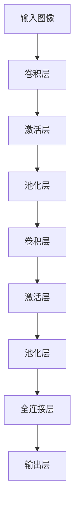

# 从零开始大模型开发与微调：基于卷积的MNIST分类模型

## 1.背景介绍

### 1.1 MNIST数据集简介

MNIST数据集是一个经典的手写数字图像数据集,广泛应用于机器学习和深度学习领域。它包含60,000个训练图像和10,000个测试图像,每个图像都是一个28x28像素的手写数字图像,标记为0到9之间的数字。

MNIST数据集虽然规模较小,但由于其简单性和标准化,非常适合作为入门数据集,用于学习和测试各种机器学习算法和神经网络模型。许多研究人员和从业者都使用它作为基准测试,以评估新算法和模型的性能。

### 1.2 为什么选择MNIST

尽管MNIST数据集看似简单,但对于初学者来说,从零开始构建一个能够成功识别手写数字的深度学习模型并不是一件容易的事情。它需要掌握以下几个关键技能:

- 数据预处理和增强
- 模型设计和构建
- 损失函数选择
- 优化器配置
- 模型训练和调试
- 模型评估和改进

通过学习如何在MNIST数据集上开发一个高性能的卷积神经网络模型,我们可以建立起对深度学习的基本理解,为将来构建更加复杂的模型打下坚实的基础。

## 2.核心概念与联系

### 2.1 卷积神经网络概述

卷积神经网络(Convolutional Neural Network, CNN)是一种专门用于处理图像和其他类型网格结构数据的深度神经网络。它由多个卷积层和池化层组成,能够自动学习图像的局部特征,并逐层提取更高级的抽象特征。

CNN在图像分类、目标检测、语义分割等计算机视觉任务中表现出色,也广泛应用于自然语言处理和其他领域。它的关键思想是通过卷积操作和池化操作来捕获图像的局部模式,从而实现对图像的有效编码和表示。



### 2.2 MNIST分类任务

MNIST分类任务的目标是根据给定的手写数字图像,正确预测它所代表的数字(0-9)。这是一个多分类问题,需要CNN模型学习图像的特征模式,并将其映射到相应的数字标签。

由于MNIST数据集中的图像都是灰度图像,因此我们只需要处理单通道输入。但是,我们仍然需要对图像进行适当的预处理,例如归一化和数据增强,以提高模型的泛化能力。

### 2.3 卷积层

卷积层是CNN的核心组成部分,它通过在输入数据上滑动卷积核(也称为滤波器)来提取局部特征。卷积操作可以用数学公式表示为:

$$
(I * K)(i,j) = \sum_{m}\sum_{n}I(i+m,j+n)K(m,n)
$$

其中,$ I $表示输入数据,$ K $表示卷积核,$ i $和$ j $是输出特征图的坐标。卷积层可以学习到不同的特征模式,例如边缘、曲线和纹理等。

通过堆叠多个卷积层,CNN可以逐层提取更高级的抽象特征,从而更好地表示输入数据。

### 2.4 池化层

池化层通常跟在卷积层之后,其目的是降低特征图的空间维度,从而减少计算量和参数数量,同时提高模型的鲁棒性。最常见的池化操作是最大池化,它会选取输入特征图中的最大值作为输出。

池化操作可以用数学公式表示为:

$$
y_{i,j} = \max_{(m,n) \in R_{i,j}}x_{m,n}
$$

其中,$ y_{i,j} $表示输出特征图的元素,$ R_{i,j} $表示输入特征图上的池化区域。

通过池化操作,CNN可以获得对平移、缩放和其他形式扭曲的鲁棒性,同时保留了输入数据的重要特征信息。

## 3.核心算法原理具体操作步骤

### 3.1 数据预处理

在开始训练MNIST分类模型之前,我们需要对数据进行适当的预处理。这包括以下几个步骤:

1. **加载数据集**:首先,我们需要从MNIST数据集中加载训练数据和测试数据。
2. **数据归一化**:由于图像像素值通常在0到255之间,为了加快模型收敛速度,我们需要将像素值缩放到0到1之间。
3. **数据增强(可选)**:为了增加训练数据的多样性,提高模型的泛化能力,我们可以对训练数据进行一些增强操作,例如随机旋转、平移、缩放等。

### 3.2 模型构建

在MNIST分类任务中,我们将构建一个基于卷积神经网络的模型。模型的基本结构如下:

```python
import torch.nn as nn

class MNISTClassifier(nn.Module):
    def __init__(self):
        super(MNISTClassifier, self).__init__()
        self.conv1 = nn.Conv2d(1, 32, kernel_size=3, padding=1)
        self.conv2 = nn.Conv2d(32, 64, kernel_size=3, padding=1)
        self.pool = nn.MaxPool2d(2, 2)
        self.fc1 = nn.Linear(64 * 7 * 7, 128)
        self.fc2 = nn.Linear(128, 10)

    def forward(self, x):
        x = self.pool(nn.functional.relu(self.conv1(x)))
        x = self.pool(nn.functional.relu(self.conv2(x)))
        x = x.view(-1, 64 * 7 * 7)
        x = nn.functional.relu(self.fc1(x))
        x = self.fc2(x)
        return x
```

该模型包含以下主要组件:

1. **两个卷积层**:第一个卷积层有32个3x3的卷积核,第二个卷积层有64个3x3的卷积核。
2. **两个最大池化层**:池化层的大小为2x2,步长为2,用于降低特征图的空间维度。
3. **两个全连接层**:第一个全连接层有128个神经元,第二个全连接层有10个神经元(对应10个数字类别)。

### 3.3 损失函数和优化器

对于MNIST分类任务,我们将使用交叉熵损失函数和Adam优化器。

交叉熵损失函数定义如下:

$$
L = -\sum_{i=1}^{N}y_i \log(p_i)
$$

其中,$ y_i $是真实标签,$ p_i $是模型预测的概率分布。

Adam优化器是一种自适应学习率优化算法,它可以根据梯度的一阶矩估计和二阶矩估计动态调整每个参数的学习率,从而加快收敛速度。

### 3.4 模型训练

在训练过程中,我们将按照以下步骤进行:

1. **初始化模型、损失函数和优化器**。
2. **定义训练循环**:在每个epoch中,我们将遍历整个训练数据集,计算损失,并使用优化器更新模型参数。
3. **计算准确率**:在每个epoch结束时,我们将在测试数据集上评估模型的性能,计算分类准确率。
4. **保存模型**:如果当前epoch的准确率是最高的,我们将保存模型权重,以便后续使用。

训练过程可以用以下伪代码表示:

```python
for epoch in range(num_epochs):
    for images, labels in train_loader:
        # 前向传播
        outputs = model(images)
        loss = criterion(outputs, labels)

        # 反向传播和优化
        optimizer.zero_grad()
        loss.backward()
        optimizer.step()

    # 计算准确率
    accuracy = evaluate(model, test_loader)

    # 保存模型
    if accuracy > best_accuracy:
        best_accuracy = accuracy
        torch.save(model.state_dict(), 'best_model.pth')
```

## 4.数学模型和公式详细讲解举例说明

在卷积神经网络中,有几个关键的数学模型和公式需要了解。

### 4.1 卷积操作

卷积操作是CNN的核心操作,它可以用数学公式表示为:

$$
(I * K)(i,j) = \sum_{m}\sum_{n}I(i+m,j+n)K(m,n)
$$

其中,$ I $表示输入数据,$ K $表示卷积核,$ i $和$ j $是输出特征图的坐标。

举例说明:

假设我们有一个3x3的输入矩阵$ I $和一个2x2的卷积核$ K $,如下所示:

$$
I = \begin{bmatrix}
1 & 2 & 3\\
4 & 5 & 6\\
7 & 8 & 9
\end{bmatrix}, \quad
K = \begin{bmatrix}
1 & 0\\
0 & 1
\end{bmatrix}
$$

我们可以计算出输出特征图的第一个元素:

$$
(I * K)(0,0) = 1 \times 1 + 2 \times 0 + 4 \times 0 + 5 \times 1 = 6
$$

通过在输入矩阵上滑动卷积核,我们可以得到完整的输出特征图。

### 4.2 最大池化操作

最大池化操作可以用数学公式表示为:

$$
y_{i,j} = \max_{(m,n) \in R_{i,j}}x_{m,n}
$$

其中,$ y_{i,j} $表示输出特征图的元素,$ R_{i,j} $表示输入特征图上的池化区域。

举例说明:

假设我们有一个4x4的输入特征图$ X $,池化区域大小为2x2,步长为2,如下所示:

$$
X = \begin{bmatrix}
1 & 2 & 3 & 4\\
5 & 6 & 7 & 8\\
9 & 10 & 11 & 12\\
13 & 14 & 15 & 16
\end{bmatrix}
$$

我们可以计算出输出特征图的第一个元素:

$$
y_{0,0} = \max_{(m,n) \in \{(0,0), (0,1), (1,0), (1,1)\}}x_{m,n} = \max\{1, 2, 5, 6\} = 6
$$

通过在输入特征图上滑动池化区域,我们可以得到完整的输出特征图,其大小为2x2。

### 4.3 交叉熵损失函数

交叉熵损失函数定义如下:

$$
L = -\sum_{i=1}^{N}y_i \log(p_i)
$$

其中,$ y_i $是真实标签,$ p_i $是模型预测的概率分布。

举例说明:

假设我们有一个二分类问题,真实标签为$ y = [0, 1] $,模型预测的概率分布为$ p = [0.6, 0.4] $。

我们可以计算交叉熵损失如下:

$$
L = -(0 \log(0.6) + 1 \log(0.4)) = -(-0.51 + -0.92) = 1.43
$$

交叉熵损失函数可以衡量模型预测和真实标签之间的差异,损失值越小,模型性能越好。

## 5.项目实践:代码实例和详细解释说明

在本节中,我们将提供一个完整的代码示例,用于在MNIST数据集上训练一个卷积神经网络模型。

### 5.1 导入所需库

```python
import torch
import torch.nn as nn
import torch.optim as optim
from torchvision import datasets, transforms
```

我们导入了PyTorch库,以及一些常用的模块,如`nn`(神经网络模块)、`optim`(优化器模块)和`torchvision`(计算机视觉模块)。

### 5.2 定义模型

```python
class MNISTClassifier(nn.Module):
    def __init__(self):
        super(MNISTClassifier, self).__init__()
        self.conv1 = nn.Conv2d(1, 32, kernel_size=3, padding=1)
        self.conv2 = nn.Conv2d(32, 64, kernel_size=3, padding=1)
        self.pool = nn.MaxPool2d(2, 2)
        self.fc1 = nn.Linear(64 * 7 * 7, 128)
        self.fc2 = nn.Linear(128, 10)

    def forward(self, x):
        x = self.pool(nn.functional.relu(self.conv1