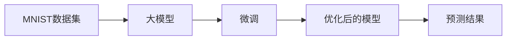

## 1.背景介绍

在人工智能的领域中，图像识别已经成为了一个重要的研究方向。其中，MNIST手写数字识别是一个经典的问题，它既可以用来入门深度学习，又可以用来检验新的模型和算法的效果。本文将从零开始，详细介绍如何开发和微调大模型，以实现对MNIST手写数字的识别。

## 2.核心概念与联系

在开始之前，我们首先需要理解几个核心的概念：

- **MNIST数据集**：MNIST数据集是一个包含了60000个训练样本和10000个测试样本的手写数字数据集，每一个样本都是一个28x28的灰度图像，代表了0-9的十个数字。

- **模型**：模型是我们用来预测结果的工具，它是一个数学函数，通过输入的特征来预测结果。在本文中，我们将使用深度学习的模型，也就是神经网络。

- **开发与微调**：开发是指建立一个新的模型，而微调是指在已有的模型基础上，通过调整参数来提升模型的效果。

- **大模型**：大模型通常指的是参数数量多，结构复杂的模型。这类模型有更强的表达能力，但也更容易过拟合。

这些概念之间的联系是，我们将使用MNIST数据集来训练大模型，然后通过微调来提升模型的效果。



## 3.核心算法原理具体操作步骤

在实战MNIST手写数字识别的过程中，我们将会经历以下几个步骤：

1. **数据预处理**：将MNIST数据集的图像数据进行标准化处理，使其值在0-1之间。同时，将标签转化为one-hot编码。

2. **模型构建**：构建一个深度学习的模型，包含多个卷积层、池化层和全连接层。

3. **模型训练**：使用训练集的数据，通过反向传播算法来训练模型，优化模型的参数。

4. **模型微调**：在验证集上评估模型的效果，通过调整学习率、增加正则化等方法来微调模型。

5. **模型测试**：在测试集上测试模型的效果，得到最终的准确率。

## 4.数学模型和公式详细讲解举例说明

在深度学习的模型中，我们主要使用了卷积层、池化层和全连接层。下面我们来详细讲解这些层的数学模型。

- **卷积层**：卷积层的作用是提取图像的特征。它的数学模型可以表示为：

$$
f(x) = w * x + b
$$

其中，$w$是卷积核，$*$表示卷积操作，$b$是偏置项。我们将卷积核在输入图像上滑动，计算卷积核和图像对应部分的点乘，得到新的特征图。

- **池化层**：池化层的作用是降低特征的维度，同时保留最重要的特征。它的数学模型可以表示为：

$$
f(x) = max(x)
$$

其中，$max$表示取最大值操作。我们在特征图上取一定大小的窗口，取窗口内的最大值作为新的特征。

- **全连接层**：全连接层的作用是将学到的特征进行组合，得到最后的预测结果。它的数学模型可以表示为：

$$
f(x) = wx + b
$$

其中，$w$是权重，$x$是输入特征，$b$是偏置项。

## 5.项目实践：代码实例和详细解释说明

在实战MNIST手写数字识别的过程中，我们将使用Python的深度学习库TensorFlow来构建和训练模型。以下是主要的代码示例和解释。

```python
import tensorflow as tf
from tensorflow.keras.datasets import mnist
from tensorflow.keras.utils import to_categorical

# 加载并预处理数据
(train_images, train_labels), (test_images, test_labels) = mnist.load_data()
train_images = train_images.reshape((60000, 28, 28, 1))
train_images = train_images.astype('float32') / 255
test_images = test_images.reshape((10000, 28, 28, 1))
test_images = test_images.astype('float32') / 255
train_labels = to_categorical(train_labels)
test_labels = to_categorical(test_labels)

# 构建模型
model = tf.keras.models.Sequential()
model.add(tf.keras.layers.Conv2D(32, (3, 3), activation='relu', input_shape=(28, 28, 1)))
model.add(tf.keras.layers.MaxPooling2D((2, 2)))
model.add(tf.keras.layers.Conv2D(64, (3, 3), activation='relu'))
model.add(tf.keras.layers.MaxPooling2D((2, 2)))
model.add(tf.keras.layers.Conv2D(64, (3, 3), activation='relu'))
model.add(tf.keras.layers.Flatten())
model.add(tf.keras.layers.Dense(64, activation='relu'))
model.add(tf.keras.layers.Dense(10, activation='softmax'))

# 编译模型
model.compile(optimizer='adam',
              loss='categorical_crossentropy',
              metrics=['accuracy'])

# 训练模型
model.fit(train_images, train_labels, epochs=5, batch_size=64)

# 测试模型
test_loss, test_acc = model.evaluate(test_images, test_labels)
print('Test accuracy:', test_acc)
```

这段代码首先加载并预处理了MNIST数据集，然后构建了一个包含三个卷积层和两个全连接层的模型，接着使用Adam优化器和交叉熵损失函数来编译模型，最后在训练集上训练模型，并在测试集上测试模型的效果。

## 6.实际应用场景

MNIST手写数字识别的模型在实际中有很多应用场景，例如：

- **数字识别**：在银行、邮局等场所，可以用来识别手写的数字，如支票上的金额、邮编等。

- **验证码识别**：在网站的验证码系统中，可以用来识别用户输入的手写数字，以验证用户的身份。

- **手写识别**：在智能手机、平板电脑等设备上，可以用来识别用户手写的数字，以提供更好的输入体验。

## 7.工具和资源推荐

在实战MNIST手写数字识别的过程中，以下是一些推荐的工具和资源：

- **TensorFlow**：TensorFlow是一个开源的深度学习框架，它提供了丰富的API，可以方便地构建和训练模型。

- **Keras**：Keras是一个在TensorFlow之上的高级API，它提供了更简洁的接口，可以更快速地搭建模型。

- **MNIST数据集**：MNIST数据集是一个公开的手写数字数据集，可以在网上免费下载。

## 8.总结：未来发展趋势与挑战

随着深度学习的发展，MNIST手写数字识别的准确率已经达到了非常高的水平。然而，这并不意味着我们已经完全解决了这个问题。因为在实际应用中，我们可能会遇到更复杂的场景，例如数字的形状、大小、颜色等可能会有很大的变化，这都会对模型的效果产生影响。

未来，我们需要继续研究更强大的模型和算法，以应对更复杂的场景。同时，我们也需要研究如何更好地利用大量的未标记数据，以提升模型的效果。此外，我们还需要关注模型的可解释性，以便更好地理解模型的工作原理。

## 9.附录：常见问题与解答

Q: 为什么要使用大模型？

A: 大模型有更强的表达能力，可以学习到更复杂的特征。然而，大模型也有其缺点，例如更容易过拟合，需要更多的计算资源。

Q: 如何防止过拟合？

A: 可以通过正则化、dropout、early stopping等方法来防止过拟合。

Q: 如何选择模型的参数？

A: 可以通过交叉验证、网格搜索等方法来选择模型的参数。

作者：禅与计算机程序设计艺术 / Zen and the Art of Computer Programming