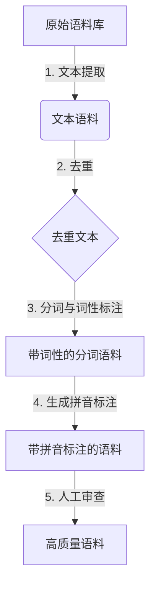
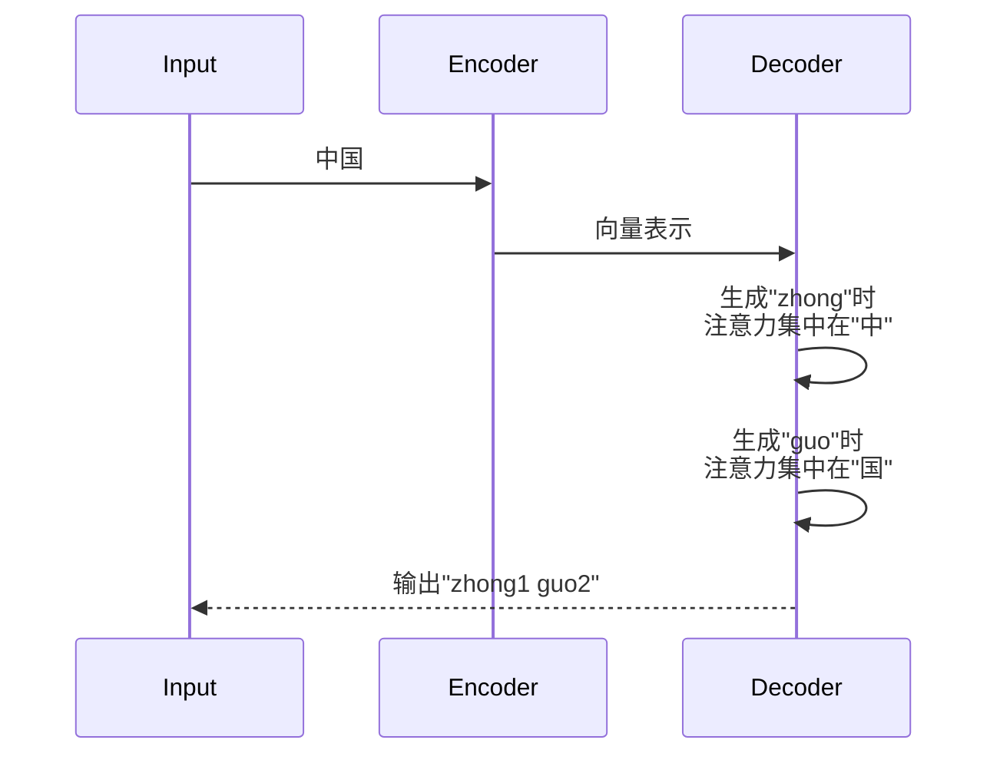

# 从零开始大模型开发与微调：汉字拼音数据集处理

## 1.背景介绍

### 1.1 大模型在自然语言处理中的重要性

在自然语言处理(NLP)领域,大型神经网络模型(通常称为"大模型")已经成为主导范式。这些模型通过在海量文本数据上进行预训练,学习了丰富的语言知识和上下文表示,从而在下游任务(如文本分类、机器翻译等)上展现出卓越的性能。典型的大模型包括GPT、BERT、T5等,它们已经在学术界和工业界得到广泛应用。

### 1.2 汉字拼音处理的重要应用场景

汉字拼音处理是NLP中一个重要的基础任务,在多个应用场景中扮演关键角色,例如:

- **输入法**:汉字拼音是中文输入法的核心组成部分,准确高效的拼音到汉字的转换直接影响着输入体验。
- **语音识别**:语音识别系统需要将语音转录为文本,汉字拼音是这一过程中的重要中间表示。
- **孩童教育**:帮助孩童学习拼音是语文教育的基础,智能拼音教学系统可以提高教学质量。
- **残障人士辅助**:对于视障人士,语音输入配合拼音到汉字的转换可以极大提高他们的计算机使用体验。

因此,构建高质量的大模型来处理汉字拼音数据集,对于提升上述应用的性能至关重要。

## 2.核心概念与联系  

### 2.1 汉字拼音及其表示形式

汉字拼音是汉语拼音方案中对汉字读音的字母表示。常见的汉字拼音表示形式有:

- **带声调的拼音**: 如`zhōng`、`huà`等,每个拼音字母后面用数字标注声调。
- **不带声调的拼音**: 如`zhong`、`hua`等,只包含字母序列。
- **拼音首字母序列**: 如`zg`、`h`等,用作输入法的简码输入。

不同应用场景对拼音表示形式有不同要求,因此数据集需要同时包含多种形式。

### 2.2 输入输出形式

在汉字拼音任务中,输入可以是:

- **单个汉字**:如`中`、`华`等,需要给出对应的拼音形式。
- **汉字序列**:如`中华人民共和国`,需要给出每个汉字的拼音序列。
- **拼音形式**:如`zhong1hua2`,需要给出对应的汉字序列。

输出形式与输入相对应,可以是单个汉字的拼音、拼音序列或者汉字序列。

此外,还可以考虑在输入或输出中引入其他辅助信息,如词性、词义等,以提高模型的理解能力。

### 2.3 数据集构建的挑战

构建高质量的汉字拼音数据集面临以下主要挑战:

1. **覆盖面广**:需要包含常用汉字及拼音形式的全面覆盖。
2. **注音准确**:拼音与汉字的对应关系必须精准无误。
3. **多样性**:包含来自不同领域的文本,反映汉语的多样性。
4. **数据规模**:大模型需要大规模数据集进行有效训练。
5. **标注质量**:人工标注质量的控制至关重要。

只有解决了这些挑战,才能构建出高质量、通用性强的汉字拼音数据集。

## 3.核心算法原理具体操作步骤

### 3.1 数据抽取与清洗



1. **文本提取**: 从各类语料库(如新闻、文学作品、百科全书等)中抽取出文本语料。
2. **去重**: 去除重复的句子或段落,保证语料的唯一性。
3. **分词与词性标注**: 对语料进行分词,并标注每个词的词性,为后续生成拼音标注做准备。
4. **生成拼音标注**: 根据分词结果,为每个汉字生成对应的拼音标注。
5. **人工审查**: 由语言学专家审查语料的质量,包括注音的准确性、覆盖面等,并对低质量数据进行修正或剔除。

### 3.2 数据集构建

经过上述步骤得到的高质量语料,可以进一步构建成满足要求的数据集格式:

- **汉字到拼音**: 将(汉字,拼音)对作为一个样本。
- **拼音到汉字**: 将(拼音,汉字)对作为一个样本。
- **序列到序列**: 将(汉字序列,拼音序列)或(拼音序列,汉字序列)作为一个样本。

在构建过程中,还需要执行数据切分(训练集、验证集、测试集)、编码(将文本转为数值表示)等操作。

### 3.3 数据增强

由于汉字拼音存在一对多的关系(同一个拼音可能对应多个汉字),单纯依赖语料库抽取可能无法获得足够多的正负样本,因此需要进行数据增强:

- **正样本增强**:根据拼音音值规则,枚举出更多的(拼音,汉字)正样本对。
- **负样本增强**:通过替换、插入、交换等方式,从正样本生成负样本。

数据增强不仅能扩充数据量,还能提高模型的泛化能力。

### 3.4 模型训练与微调

在获得大规模高质量的数据集后,我们可以训练或微调大模型来解决汉字拼音任务。常用的做法包括:

- **预训练 + 微调**:先用大规模无监督数据(如书籍、百科等)预训练获得一个基础模型,再在汉字拼音数据集上进行有监督微调。
- **全程有监督训练**:直接在汉字拼音数据集上训练模型。

此外,还可以探索多任务学习、半监督学习、少样本学习等训练范式,以进一步提升模型性能。

## 4.数学模型和公式详细讲解举例说明

### 4.1 Transformer 模型

Transformer 是当前 NLP 领域广泛使用的基于注意力机制的模型架构,也是大模型的核心组成部分。它的核心思想是使用自注意力(Self-Attention)机制来捕获输入序列中任意两个位置之间的长程依赖关系。

Transformer 的自注意力机制可以用下式表示:

$$\mathrm{Attention}(Q, K, V) = \mathrm{softmax}\left(\frac{QK^T}{\sqrt{d_k}}\right)V$$

其中 $Q$ 为查询(Query)向量、$K$ 为键(Key)向量、$V$ 为值(Value)向量。$d_k$ 为缩放因子,用于防止点积过大导致的梯度消失问题。

多头注意力(Multi-Head Attention)则是将多个注意力头的结果拼接起来:

$$\mathrm{MultiHead}(Q, K, V) = \mathrm{Concat}(head_1, ..., head_h)W^O$$
$$\text{where } head_i = \mathrm{Attention}(QW_i^Q, KW_i^K, VW_i^V)$$

其中 $W_i^Q$、$W_i^K$、$W_i^V$ 和 $W^O$ 是可学习的线性变换参数。

Transformer 的编码器(Encoder)和解码器(Decoder)都是由多个相同的层组成,每一层包含了多头注意力子层和全连接前馈网络子层。

### 4.2 Transformer 在汉字拼音任务中的应用

对于汉字到拼音的序列到序列(Seq2Seq)任务,我们可以使用编码器-解码器的 Transformer 架构:

1. **编码器(Encoder)**: 将输入的汉字序列编码为连续的向量表示。
2. **解码器(Decoder)**: 将编码器的输出作为记忆,自回归地生成对应的拼音序列。

在训练过程中,我们最小化模型在训练数据上的负对数似然损失:

$$\mathcal{L} = -\frac{1}{N}\sum_{i=1}^N\sum_{t=1}^{T_i}\log P(y_t^{(i)}|y_1^{(i)}, ..., y_{t-1}^{(i)}, X^{(i)})$$

其中 $N$ 为训练样本数量、$T_i$ 为第 $i$ 个样本的目标序列长度、$X^{(i)}$ 为第 $i$ 个输入汉字序列、$y_t^{(i)}$ 为第 $i$ 个样本的第 $t$ 个目标拼音。

对于拼音到汉字的任务,我们可以交换输入和输出,使用相同的模型架构。

### 4.3 注意力可视化

注意力机制不仅能够提高模型性能,还可以让我们窥视模型内部的工作机制。以下是一个将汉字"中国"转换为拼音的注意力可视化示例:



可以看出,在生成每个拼音时,解码器会自动关注对应的汉字位置,体现了注意力机制的自适应特性。

## 5.项目实践: 代码实例和详细解释说明

在这一部分,我们将使用 PyTorch 框架,实现一个基于 Transformer 的汉字到拼音的序列到序列模型。完整代码可在 [这里](https://github.com/zenmeder/chinese-pinyinizer) 找到。

### 5.1 数据预处理

```python
import re
import unicodedata
from zhon import cedict

# 加载汉字到拼音的映射字典
pinyin_dict = cedict.get_pinyins()

# 将汉字转换为拼音序列
def text_to_pinyin(text):
    pattern = re.compile(r'(\p{IsHan}+)')
    pinyins = []
    for han in pattern.findall(text):
        try:
            pinyins.extend([pinyin_dict[c][0][0] for c in han])
        except KeyError:
            pinyins.extend([c for c in unicodedata.normalize('NFD', han)
                            if unicodedata.category(c) != 'Mn'])
    return ' '.join(pinyins)

# 构建数据集
train_data = [...]  # 包含大量(汉字序列, 拼音序列)对
```

这里我们使用了 `zhon` 库中的 `cedict` 模块,它提供了一个汉字到拼音的映射字典。`text_to_pinyin` 函数则将给定的汉字序列转换为对应的拼音序列。

在构建数据集时,我们需要准备大量的(汉字序列,拼音序列)对作为训练数据。

### 5.2 模型定义

```python
import torch
import torch.nn as nn

class PositionalEncoding(nn.Module):
    # 实现位置编码

class Transformer(nn.Module):
    def __init__(self, src_vocab_size, tgt_vocab_size, ...):
        # 初始化编码器和解码器

    def forward(self, src, tgt, ...):
        # 执行编码、解码和生成
        return outputs
```

我们定义了 `PositionalEncoding` 模块来为输入序列添加位置信息,以及 `Transformer` 模型的主体部分。`Transformer` 模型包含编码器(Encoder)和解码器(Decoder)两个主要组件,其中编码器将输入的汉字序列编码为连续向量表示,解码器则基于该向量表示自回归地生成对应的拼音序列。

### 5.3 训练

```python
import torch.optim as optim

model = Transformer(src_vocab_size, tgt_vocab_size, ...)
criterion = nn.CrossEntropyLoss(ignore_index=pad_idx)
optimizer = optim.Adam(model.parameters(), ...)

for epoch in range(num_epochs):
    for src, tgt in train_data:
        