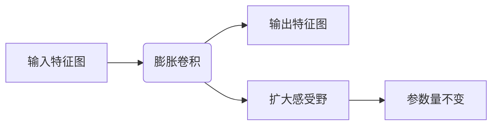
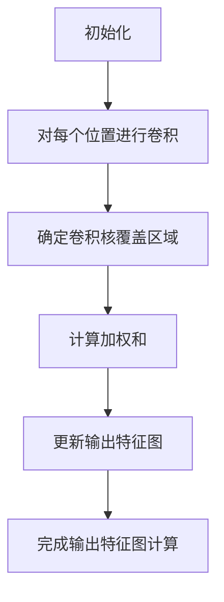

# 从零开始大模型开发与微调：膨胀卷积详解

## 1. 背景介绍

### 1.1 深度学习的发展历程

深度学习作为一种基于人工神经网络的机器学习算法,近年来在计算机视觉、自然语言处理、语音识别等领域取得了突破性的进展。随着算力的不断提升和大规模数据的可用性,深度神经网络的层数和参数量也在不断增加,催生了大模型时代的到来。

### 1.2 大模型的兴起及挑战

大模型指具有数十亿甚至上百亿参数的深度神经网络,其强大的表示能力使其在各种任务上表现出色。然而,大模型也面临着训练时间长、计算资源消耗大、推理效率低下等挑战。因此,如何高效地训练和部署大模型成为了一个迫切需要解决的问题。

### 1.3 膨胀卷积在大模型中的作用

膨胀卷积(Dilated Convolution)作为一种改进的卷积操作,通过引入膨胀率(Dilation Rate)参数,可以有效扩大卷积核的感受野,同时保持参数量不变。这使得膨胀卷积在大模型中具有重要的应用,可以提高模型的表示能力,同时控制参数量,从而提高训练和推理的效率。

## 2. 核心概念与联系

### 2.1 卷积神经网络(CNN)

卷积神经网络是深度学习中最成功的模型之一,广泛应用于计算机视觉任务。它由卷积层、池化层和全连接层等组成,通过学习多层次的特征表示,对输入数据(如图像)进行分类或回归。

### 2.2 膨胀卷积的核心思想

传统卷积操作在每个卷积层中,卷积核只能捕获局部邻域的信息,导致感受野(Receptive Field)的增长速度较慢。膨胀卷积通过在卷积核内引入空洞(Holes),使卷积核覆盖更大的感受野,同时保持参数量不变。



### 2.3 膨胀率(Dilation Rate)

膨胀率是膨胀卷积中的关键参数,它控制了卷积核中元素之间的间隔。膨胀率为1时,即为标准卷积操作。随着膨胀率的增加,卷积核的感受野呈指数级增长,但参数量保持不变。

## 3. 核心算法原理具体操作步骤

### 3.1 标准卷积操作

标准卷积操作可以表示为:

$$
y[m,n] = \sum_{i=0}^{K-1}\sum_{j=0}^{K-1}x[m+i,n+j]w[i,j]
$$

其中,$ y[m,n] $表示输出特征图的元素,$ x[m,n] $表示输入特征图的元素,$ w[i,j] $表示卷积核的权重,$ K $表示卷积核的大小。

### 3.2 膨胀卷积操作

膨胀卷积操作可以表示为:

$$
y[m,n] = \sum_{i=0}^{K-1}\sum_{j=0}^{K-1}x[m+r\cdot i,n+r\cdot j]w[i,j]
$$

其中,$ r $表示膨胀率(Dilation Rate)。当$ r=1 $时,即为标准卷积操作。

### 3.3 算法步骤

1. 初始化卷积核权重和膨胀率。
2. 对输入特征图的每个位置进行卷积操作:
   - 根据当前位置和膨胀率,确定卷积核覆盖的输入特征图区域。
   - 计算该区域内输入特征图元素与卷积核权重的加权和,得到输出特征图的对应元素值。
3. 重复步骤2,直到完成整个输出特征图的计算。



## 4. 数学模型和公式详细讲解举例说明

### 4.1 感受野(Receptive Field)计算

膨胀卷积的一个重要优势是可以显著扩大感受野,同时保持参数量不变。感受野的计算公式如下:

$$
R_{\text{out}} = R_{\text{in}} + (K - 1) \times r
$$

其中,$ R_{\text{out}} $表示输出特征图的感受野大小,$ R_{\text{in}} $表示输入特征图的感受野大小,$ K $表示卷积核大小,$ r $表示膨胀率。

例如,对于一个$ 3\times 3 $的卷积核,膨胀率为1时,感受野为$ 3\times 3 $;膨胀率为2时,感受野为$ 7\times 7 $;膨胀率为4时,感受野为$ 15\times 15 $。可以看出,随着膨胀率的增加,感受野呈指数级增长。

### 4.2 参数量计算

膨胀卷积的另一个优势是参数量保持不变。对于一个$ C_{\text{in}} $通道输入、$ C_{\text{out}} $通道输出、卷积核大小为$ K\times K $的卷积层,参数量计算公式如下:

$$
\text{参数量} = C_{\text{in}} \times C_{\text{out}} \times K \times K
$$

可以看出,参数量与膨胀率无关,只与输入输出通道数和卷积核大小有关。

### 4.3 计算复杂度分析

虽然膨胀卷积可以显著扩大感受野,但同时也会增加计算复杂度。对于一个$ H\times W $的输入特征图,卷积核大小为$ K\times K $,膨胀率为$ r $,计算复杂度为:

$$
\mathcal{O}(H \times W \times C_{\text{in}} \times C_{\text{out}} \times K^2 \times r^2)
$$

可以看出,计算复杂度与膨胀率的平方成正比。因此,在实际应用中,需要权衡感受野大小和计算复杂度之间的平衡。

## 5. 项目实践:代码实例和详细解释说明

在PyTorch中,可以使用`torch.nn.Conv2d`模块实现膨胀卷积操作。下面是一个简单的示例:

```python
import torch
import torch.nn as nn

# 定义输入张量
x = torch.randn(1, 1, 5, 5)

# 定义膨胀卷积层
conv = nn.Conv2d(in_channels=1, out_channels=1, kernel_size=3, dilation=2, padding=2)

# 前向传播
out = conv(x)
print(out.shape)  # 输出: torch.Size([1, 1, 5, 5])
```

在上面的示例中,我们定义了一个单通道输入的膨胀卷积层,卷积核大小为$ 3\times 3 $,膨胀率为2。由于膨胀率为2,因此需要在输入特征图周围填充2个零,以保证输出特征图的大小与输入相同。

我们可以进一步可视化膨胀卷积的过程:

```python
import matplotlib.pyplot as plt

# 可视化输入特征图
plt.imshow(x.squeeze().numpy(), cmap='gray')
plt.title('Input Feature Map')
plt.show()

# 可视化卷积核权重
weights = conv.weight.data.numpy()
plt.imshow(weights.squeeze(), cmap='gray')
plt.title('Kernel Weights')
plt.show()

# 可视化输出特征图
plt.imshow(out.squeeze().numpy(), cmap='gray')
plt.title('Output Feature Map')
plt.show()
```

通过可视化,我们可以直观地观察到膨胀卷积的效果:输出特征图中的每个元素是通过在输入特征图上滑动膨胀卷积核而得到的,卷积核覆盖的区域比标准卷积更大,从而扩大了感受野。

## 6. 实际应用场景

### 6.1 语义分割

语义分割是计算机视觉中的一个重要任务,旨在对图像中的每个像素进行分类,将其分配给相应的物体类别。膨胀卷积在语义分割任务中得到了广泛应用,因为它可以有效捕获更大范围的上下文信息,从而提高分割精度。

### 6.2 目标检测

目标检测是另一个重要的计算机视觉任务,旨在定位图像中的物体并识别它们的类别。膨胀卷积可以用于提取更丰富的特征表示,从而提高目标检测的性能。

### 6.3 图像分类

在图像分类任务中,膨胀卷积也可以发挥作用。通过在卷积网络中引入膨胀卷积层,可以扩大感受野,捕获更广泛的上下文信息,从而提高分类精度。

### 6.4 视频理解

视频理解任务,如行为识别、动作检测等,也可以受益于膨胀卷积。由于视频数据具有时间维度,膨胀卷积可以用于捕获更长时间范围内的运动信息,从而提高视频理解的性能。

## 7. 工具和资源推荐

### 7.1 PyTorch

PyTorch是一个流行的深度学习框架,提供了丰富的API和工具,方便实现和训练各种神经网络模型,包括支持膨胀卷积操作。官方文档和社区资源丰富,是学习和应用膨胀卷积的理想选择。

### 7.2 TensorFlow

TensorFlow是另一个广泛使用的深度学习框架,也提供了对膨胀卷积的支持。与PyTorch相比,TensorFlow在分布式训练和部署方面具有一定优势,适合于大规模模型的训练和部署。

### 7.3 开源模型库

许多开源的深度学习模型库,如Facebook的PyTorch Image Models、Google的TensorFlow Models等,都包含了使用膨胀卷积的模型实现,可以作为学习和研究的参考。

### 7.4 在线课程和教程

网络上有许多优质的在线课程和教程,如斯坦福大学的"CS231n:卷积神经网络"课程、PyTorch官方教程等,都涉及了膨胀卷积的相关内容,可以帮助深入理解和掌握这一技术。

## 8. 总结:未来发展趋势与挑战

### 8.1 膨胀卷积的发展趋势

膨胀卷积作为一种有效扩大感受野的技术,在未来的深度学习模型中仍将扮演重要角色。随着模型规模的不断增大,如何高效地捕获全局信息将成为一个关键挑战,膨胀卷积可以为此提供有力的支持。

### 8.2 高效计算和硬件加速

虽然膨胀卷积可以显著扩大感受野,但也带来了更高的计算复杂度。因此,如何提高膨胀卷积的计算效率,以及利用专用硬件(如GPU、TPU等)进行加速,将是未来需要解决的重要问题。

### 8.3 与其他技术的结合

膨胀卷积可以与其他技术相结合,以进一步提高模型的性能。例如,可以将膨胀卷积与注意力机制、多分支架构等技术相结合,以捕获更丰富的特征表示。

### 8.4 应用领域的拓展

虽然膨胀卷积目前主要应用于计算机视觉领域,但它的潜力并不止于此。未来,膨胀卷积可能会在自然语言处理、时序数据分析等其他领域发挥作用,为更多任务提供有力的支持。

## 9. 附录:常见问题与解答

### 9.1 膨胀卷积与空洞卷积(Atrous Convolution)的区别是什么?

膨胀卷积和空洞卷积实际上是同一个概念,只是名称不同。"空洞"一词强调了在卷积核中引入了空洞或空隙,而"膨胀"一词则强调了卷积核的扩张效果。

### 9.2 膨胀卷积是否会增加参数量?

不会。膨胀卷积只是改变了卷积核在输入特征