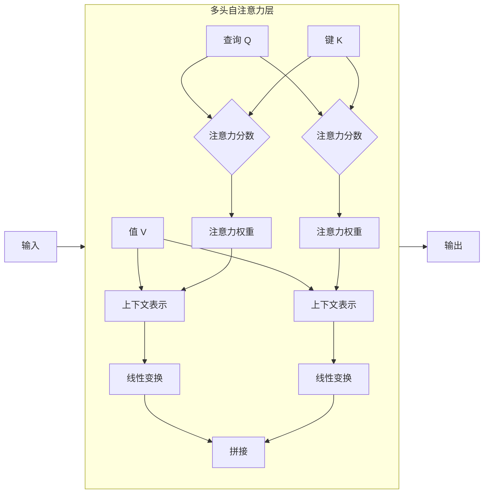

# 从零开始大模型开发与微调：自注意力层

## 1. 背景介绍

### 1.1 人工智能的发展

人工智能(AI)是当代科技发展的核心驱动力之一。近年来,AI技术取得了飞速发展,尤其是深度学习(Deep Learning)的兴起,推动了各个领域的创新与突破。在自然语言处理(NLP)、计算机视觉(CV)、语音识别等多个领域,深度学习模型展现出了超越人类水平的卓越表现。

### 1.2 大模型的兴起

随着数据量的激增和计算能力的提高,大规模神经网络模型(大模型)应运而生。大模型通过在海量数据上进行预训练,能够捕捉到丰富的语义和上下文信息,从而在下游任务上表现出色。典型代表有GPT(Generative Pre-trained Transformer)、BERT(Bidirectional Encoder Representations from Transformers)等,它们在自然语言理解、生成、推理等任务中展现出了强大的能力。

### 1.3 自注意力机制的重要性

自注意力(Self-Attention)机制是大模型的核心组成部分,它赋予了模型捕捉长距离依赖关系的能力,从而更好地理解和生成自然语言。自注意力层通过计算输入序列中每个元素与其他元素的相关性,动态地捕捉上下文信息,从而提高了模型的表现力和泛化能力。

## 2. 核心概念与联系

### 2.1 注意力机制

注意力机制(Attention Mechanism)是深度学习中的一种关键技术,它允许模型在处理序列数据时,动态地分配不同位置的注意力权重,从而更好地捕捉相关信息。传统的序列模型(如RNN)存在梯度消失、难以捕捉长距离依赖等问题,而注意力机制则能够有效地解决这些问题。

### 2.2 自注意力机制

自注意力机制是注意力机制的一种特殊形式,它允许模型在计算注意力权重时,将输入序列中的每个元素与其他所有元素进行关联。这种全局关联的能力使得自注意力能够更好地捕捉长距离依赖关系,从而提高了模型的表现力。

自注意力机制可以形式化地表示为:

$$
\text{Attention}(Q, K, V) = \text{softmax}(\frac{QK^T}{\sqrt{d_k}})V
$$

其中,Q(Query)、K(Key)和V(Value)分别代表查询向量、键向量和值向量。通过计算查询向量与所有键向量的相似性,并对相似性进行软最大化操作,我们可以得到一个注意力权重向量。该向量与值向量相乘,即可得到加权后的上下文表示。

### 2.3 多头自注意力

为了进一步提高模型的表现力,Transformer引入了多头自注意力(Multi-Head Self-Attention)机制。多头自注意力将输入进行线性投影,得到多组Q、K、V,分别计算自注意力,最后将多个注意力头的结果拼接起来,捕捉不同子空间的信息。

多头自注意力可以表示为:

$$
\text{MultiHead}(Q, K, V) = \text{Concat}(\text{head}_1, ..., \text{head}_h)W^O
$$

其中,每个头$\text{head}_i$都是一个独立的自注意力计算过程:

$$
\text{head}_i = \text{Attention}(QW_i^Q, KW_i^K, VW_i^V)
$$

$W_i^Q$、$W_i^K$、$W_i^V$和$W^O$都是可学习的线性投影参数。

### 2.4 位置编码

由于自注意力机制没有显式地捕捉序列的位置信息,因此需要引入位置编码(Positional Encoding)来赋予序列元素位置信息。常见的位置编码方式包括学习的位置嵌入和基于三角函数的位置编码等。

## 3. 核心算法原理具体操作步骤

自注意力层的计算过程可以概括为以下几个步骤:

1. **线性投影**: 将输入序列$X$分别投影到查询$Q$、键$K$和值$V$空间,得到$Q=XW^Q$、$K=XW^K$、$V=XW^V$。

2. **计算注意力分数**: 计算查询$Q$与所有键$K$的点积,并除以缩放因子$\sqrt{d_k}$,得到注意力分数矩阵$S$:

$$
S = \frac{QK^T}{\sqrt{d_k}}
$$

3. **软最大化**: 对注意力分数矩阵$S$的最后一个维度(序列维度)进行软最大化操作,得到注意力权重矩阵$A$:

$$
A = \text{softmax}(S)
$$

4. **加权求和**: 将注意力权重矩阵$A$与值矩阵$V$相乘,得到加权后的上下文表示$C$:

$$
C = AV
$$

5. **线性变换**: 对上下文表示$C$进行线性变换,得到自注意力层的输出$Y$:

$$
Y = CW^O
$$

其中,$W^Q$、$W^K$、$W^V$和$W^O$都是可学习的线性变换参数。

在实际应用中,通常会使用多头自注意力机制,将输入序列投影到多个子空间,分别计算自注意力,最后将多个子空间的结果拼接起来,捕捉不同子空间的信息。

## 4. 数学模型和公式详细讲解举例说明

### 4.1 自注意力计算

自注意力层的核心计算过程可以用以下公式表示:

$$
\text{Attention}(Q, K, V) = \text{softmax}(\frac{QK^T}{\sqrt{d_k}})V
$$

其中:

- $Q \in \mathbb{R}^{n \times d_q}$是查询矩阵,每一行代表一个查询向量。
- $K \in \mathbb{R}^{n \times d_k}$是键矩阵,每一行代表一个键向量。
- $V \in \mathbb{R}^{n \times d_v}$是值矩阵,每一行代表一个值向量。
- $n$是序列长度,即有$n$个元素。
- $d_q$、$d_k$和$d_v$分别是查询、键和值的维度。

计算步骤如下:

1. 计算查询$Q$与所有键$K$的点积,得到注意力分数矩阵$S \in \mathbb{R}^{n \times n}$:

$$
S = QK^T
$$

2. 对注意力分数矩阵$S$进行缩放,即除以$\sqrt{d_k}$,这是为了避免较大的点积值导致softmax函数的梯度较小:

$$
S' = \frac{S}{\sqrt{d_k}}
$$

3. 对缩放后的注意力分数矩阵$S'$的最后一个维度(序列维度)进行softmax操作,得到注意力权重矩阵$A \in \mathbb{R}^{n \times n}$:

$$
A = \text{softmax}(S')
$$

4. 将注意力权重矩阵$A$与值矩阵$V$相乘,得到加权后的上下文表示$C \in \mathbb{R}^{n \times d_v}$:

$$
C = AV
$$

因此,自注意力层的输出$Y \in \mathbb{R}^{n \times d_v}$可以表示为:

$$
Y = \text{Attention}(Q, K, V) = \text{softmax}(\frac{QK^T}{\sqrt{d_k}})V
$$

### 4.2 多头自注意力计算

多头自注意力机制是通过将输入序列投影到多个子空间,分别计算自注意力,最后将多个子空间的结果拼接起来,捕捉不同子空间的信息。

具体计算过程如下:

1. 线性投影:将输入序列$X \in \mathbb{R}^{n \times d}$分别投影到查询$Q_i$、键$K_i$和值$V_i$空间,得到$h$组$Q_i$、$K_i$和$V_i$:

$$
\begin{aligned}
Q_i &= XW_i^Q & K_i &= XW_i^K & V_i &= XW_i^V \\
Q_i &\in \mathbb{R}^{n \times d_q} & K_i &\in \mathbb{R}^{n \times d_k} & V_i &\in \mathbb{R}^{n \times d_v}
\end{aligned}
$$

其中,$W_i^Q \in \mathbb{R}^{d \times d_q}$、$W_i^K \in \mathbb{R}^{d \times d_k}$和$W_i^V \in \mathbb{R}^{d \times d_v}$是可学习的线性变换参数,用于将输入序列投影到不同的子空间。

2. 计算自注意力:对每组$Q_i$、$K_i$和$V_i$,计算自注意力,得到$h$组上下文表示$C_i$:

$$
C_i = \text{Attention}(Q_i, K_i, V_i) = \text{softmax}(\frac{Q_iK_i^T}{\sqrt{d_k}})V_i
$$

3. 拼接:将$h$组上下文表示$C_i$按列拼接,得到最终的上下文表示$C \in \mathbb{R}^{n \times (d_v \times h)}$:

$$
C = \text{Concat}(C_1, C_2, \dots, C_h)
$$

4. 线性变换:对拼接后的上下文表示$C$进行线性变换,得到多头自注意力层的输出$Y \in \mathbb{R}^{n \times d_o}$:

$$
Y = CW^O
$$

其中,$W^O \in \mathbb{R}^{d_v \times h \times d_o}$是可学习的线性变换参数。

多头自注意力机制允许模型从不同的子空间捕捉不同的信息,从而提高了模型的表现力和泛化能力。

### 4.3 实例说明

假设我们有一个长度为5的输入序列$X \in \mathbb{R}^{5 \times 512}$,我们希望使用多头自注意力层,其中有$h=8$个注意力头,查询、键和值的维度分别为$d_q=64$、$d_k=64$和$d_v=64$,输出维度为$d_o=512$。

1. 线性投影:

$$
\begin{aligned}
Q_i &= XW_i^Q & W_i^Q &\in \mathbb{R}^{512 \times 64} \\
K_i &= XW_i^K & W_i^K &\in \mathbb{R}^{512 \times 64} \\
V_i &= XW_i^V & W_i^V &\in \mathbb{R}^{512 \times 64}
\end{aligned}
$$

对于每个注意力头$i$,我们得到$Q_i \in \mathbb{R}^{5 \times 64}$、$K_i \in \mathbb{R}^{5 \times 64}$和$V_i \in \mathbb{R}^{5 \times 64}$。

2. 计算自注意力:

$$
C_i = \text{Attention}(Q_i, K_i, V_i) = \text{softmax}(\frac{Q_iK_i^T}{\sqrt{64}})V_i \in \mathbb{R}^{5 \times 64}
$$

3. 拼接:

$$
C = \text{Concat}(C_1, C_2, \dots, C_8) \in \mathbb{R}^{5 \times 512}
$$

4. 线性变换:

$$
Y = CW^O \in \mathbb{R}^{5 \times 512}, \quad W^O \in \mathbb{R}^{512 \times 512}
$$

因此,多头自注意力层的输出$Y \in \mathbb{R}^{5 \times 512}$与输入$X$具有相同的形状,但捕捉了更丰富的上下文信息