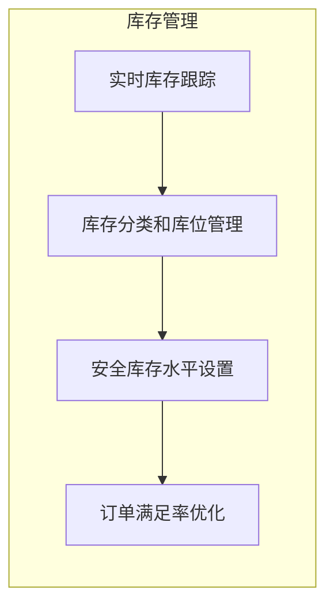
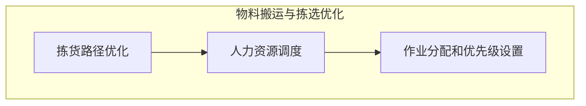
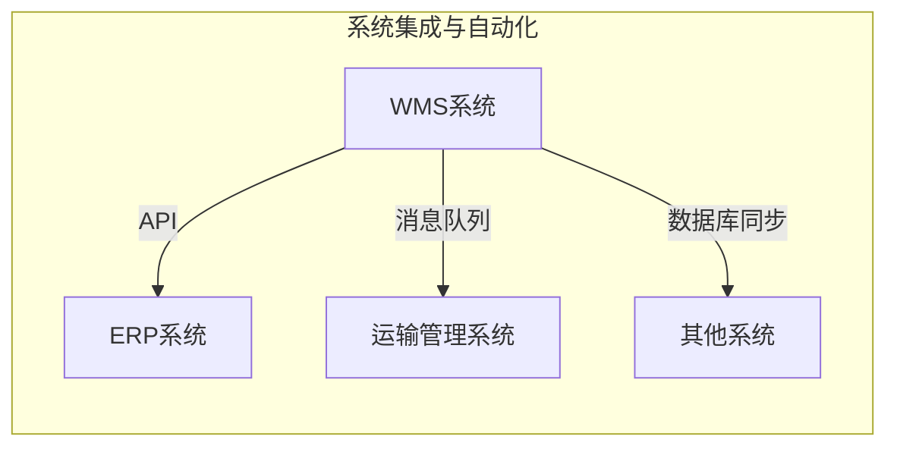
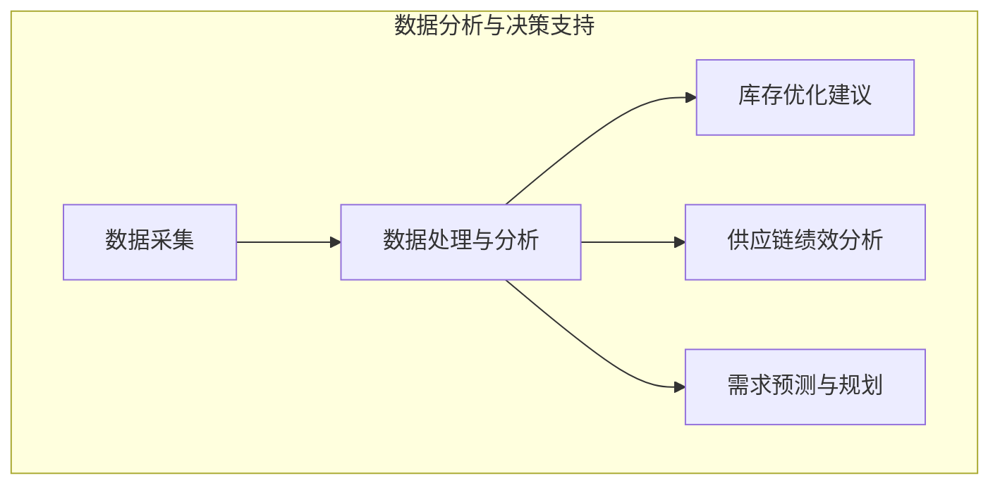
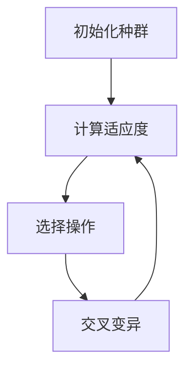
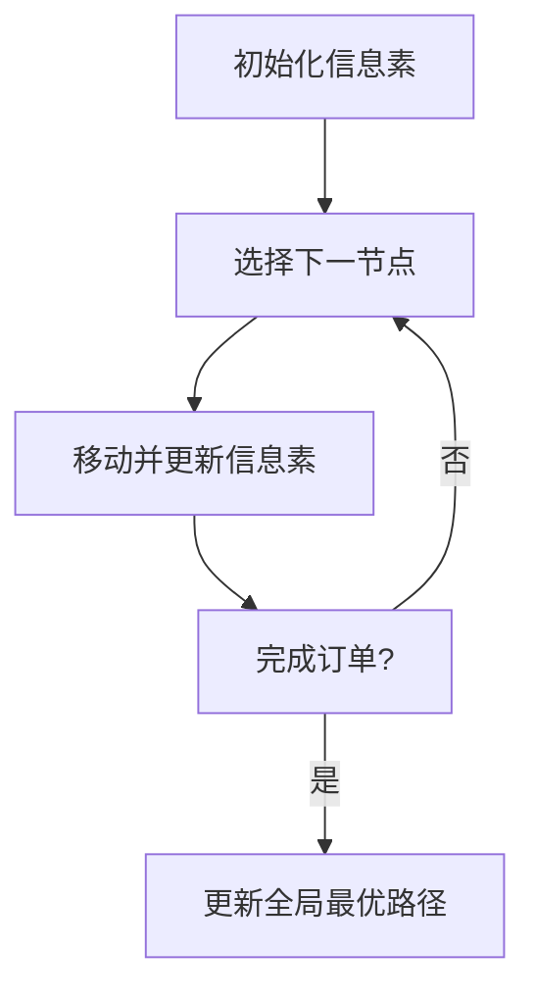
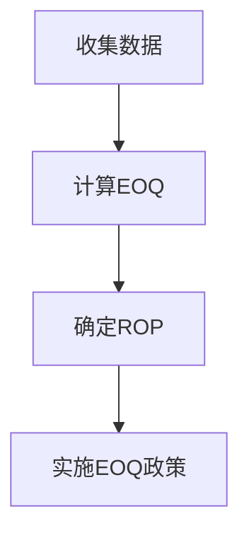
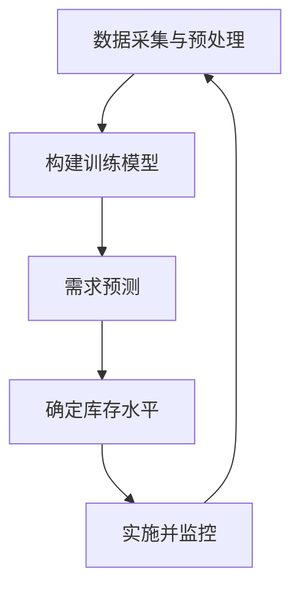
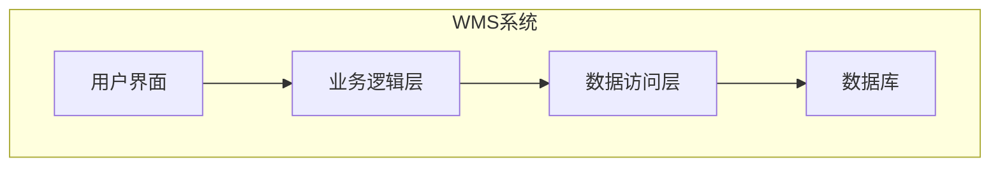

# 仓库管理系统详细设计与具体代码实现

## 1.背景介绍

### 1.1 仓库管理的重要性

在现代商业运营中,仓库管理系统(Warehouse Management System,WMS)扮演着至关重要的角色。有效的仓库管理不仅能够确保库存的准确性,还能优化物流流程,提高运营效率,降低成本。随着电子商务的蓬勃发展,对高效率、可扩展的WMS系统的需求与日俱增。

### 1.2 传统仓库管理系统的局限性

传统的仓库管理系统通常依赖于人工操作和纸质记录,这种方式效率低下且容易出错。此外,由于缺乏实时库存跟踪和智能化调度算法,导致库存管理混乱、拣货效率低下等问题。

### 1.3 现代WMS系统的特点

现代WMS系统通过将自动化技术(如射频识别(RFID)、条形码扫描等)与先进的软件系统相结合,实现了库存管理的自动化和智能化。这些系统能够实时跟踪库存水平、优化拣货路径、管理人力资源等,从而显著提高了仓储运营效率。

## 2.核心概念与联系

### 2.1 库存管理

库存管理是WMS系统的核心功能之一。它包括:

- 实时库存跟踪
- 库存分类和库位管理
- 安全库存水平设置
- 订单满足率优化



### 2.2 物料搬运与拣选优化

高效的物料搬运和拣选对于提高仓储效率至关重要。WMS系统需要解决以下问题:

- 拣货路径优化
- 人力资源调度
- 作业分配和优先级设置



### 2.3 系统集成与自动化

为了实现端到端的自动化,WMS系统需要与其他系统(如ERP、运输管理系统等)集成。常见的集成方式包括:

- 应用程序接口(API)
- 消息队列
- 数据库同步



### 2.4 数据分析与决策支持

通过收集和分析仓储运营数据,WMS系统可以为管理层提供决策支持,如:

- 库存优化建议
- 供应链绩效分析
- 预测需求并制定应对策略



## 3.核心算法原理具体操作步骤

### 3.1 拣货路径优化算法

拣货路径优化是WMS系统的一个核心功能,旨在缩短拣货距离,提高拣货效率。常用的算法包括:

#### 3.1.1 遗传算法

遗传算法模拟生物进化过程,通过选择、交叉和变异操作,逐渐优化路径方案。

1. 初始化一组路径方案(种群)
2. 计算每个方案的适应度(总距离)
3. 选择适应度较高的个体
4. 交叉和变异产生新一代种群
5. 重复2-4,直到满足终止条件



#### 3.1.2 蚁群算法

蚁群算法模拟蚂蚁觅食行为,利用信息素机制逐步找到最优路径。

1. 初始化信息素矩阵
2. 选择下一个节点(货架)
3. 移动到下一个节点,更新信息素
4. 重复2-3,直到完成订单拣货
5. 更新全局最优路径

$$
P_{i,j}^k=\frac{(\tau_{i,j})^\alpha(\eta_{i,j})^\beta}{\sum\limits_{l\in N_i^k}(\tau_{i,l})^\alpha(\eta_{i,l})^\beta}
$$

其中,$P_{i,j}^k$表示蚂蚁k从i节点转移到j节点的概率,$\tau_{i,j}$为i到j的信息素浓度,$\eta_{i,j}$为启发式信息,$\alpha$和$\beta$为控制参数。



### 3.2 库存优化算法

库存优化旨在平衡库存成本和缺货风险,确定最优库存水平。常用算法包括:

#### 3.2.1 经济订货量(EOQ)模型

EOQ模型通过最小化订货成本和库存持有成本,计算最优订货量。

1. 收集相关数据(需求率、订货成本、持有成本等)
2. 使用EOQ公式计算最优订货量Q*

$$
Q^* = \sqrt{\frac{2DC_o}{C_h}}
$$

其中,D为年需求量,Co为订货成本,Ch为年持有成本。

3. 确定重新下单点(ROP)
4. 实施EOQ政策



#### 3.2.2 基于机器学习的需求预测

通过分析历史销售数据,利用机器学习算法(如ARIMA、神经网络等)预测未来需求,从而优化库存水平。

1. 收集和预处理数据
2. 构建并训练预测模型
3. 利用模型预测未来需求
4. 结合其他因素(如安全库存等)确定库存水平
5. 持续监控并调整库存策略



## 4.数学模型和公式详细讲解举例说明

### 4.1 库存管理模型

#### 4.1.1 经典库存模型

经典库存模型描述了在确定性需求和无限期货期的情况下,如何确定最优订货量。

已知:
- 需求率D(单位/年)
- 订货成本A($/订单)
- 持有成本h($/单位/年)

目标是最小化总成本TC:

$$
TC(Q) = \frac{DA}{Q} + \frac{hQ}{2}
$$

其中,第一项为订货成本,第二项为持有成本。

通过求导并令其等于0,可得最优订货量Q*:

$$
Q^* = \sqrt{\frac{2DA}{h}}
$$

#### 4.1.2 考虑缺货成本的模型

在现实中,缺货可能会导致机会成本和顾客流失。我们将缺货成本Cu($/单位缺货)纳入模型:

$$
TC(Q,R) = \frac{DA}{Q} + \frac{hQ}{2} + \frac{D}{Q}\int_{R}^{\infty}(x-R)f(x)dx
$$

其中,R为重新下单点,f(x)为需求分布的概率密度函数。

通过数值优化方法可以求解最优Q*和R*。

### 4.2 拣货路径优化模型

#### 4.2.1 车辆路径规划问题(VRP)

VRP旨在确定一组车辆的最优路线,以满足所有客户需求,同时最小化总行驶距离。这可以建模为一个整数规划问题:

$$
\begin{aligned}
\text{minimize} \quad & \sum_{i=0}^{n}\sum_{j=0}^{n}c_{ij}x_{ij}\\
\text{subject to} \quad & \sum_{i=0}^{n}x_{ij}=1 \qquad \forall j\in \{1,\ldots,n\}\\
& \sum_{j=0}^{n}x_{ij}=1 \qquad \forall i\in \{1,\ldots,n\}\\
& \sum_{i\in S}\sum_{j\in S}x_{ij}\leq |S|-r(S) \qquad \forall S\subset \{1,\ldots,n\},\, |S|\geq 2\\
& x_{ij}\in \{0,1\} \qquad \forall i,j\in \{0,\ldots,n\}
\end{aligned}
$$

其中,n为客户数量,c_ij为从i到j的距离,x_ij是决策变量,表示是否从i到j。约束条件确保每个客户被访问一次且无子回路。

#### 4.2.2 旅行商问题(TSP)

TSP是VRP的一个特例,要求找到访问所有节点的最短回路。这是一个NP难问题,可以通过整数规划或启发式算法(如遗传算法、模拟退火等)求解。

## 5.项目实践:代码实例和详细解释说明

### 5.1 系统架构



WMS系统通常采用三层架构:

1. **用户界面层**: 提供Web或移动应用,供仓库员工和管理人员使用。
2. **业务逻辑层**: 包含系统的核心功能,如库存管理、拣货优化等。
3. **数据访问层**: 负责与数据库进行交互,执行数据持久化和查询。

### 5.2 核心模块

#### 5.2.1 库存管理模块

```python
class InventoryManager:
    def __init__(self, db):
        self.db = db
        
    def update_stock(self, product_id, quantity, location):
        # 更新库存数量和位置
        ...
        
    def get_stock_level(self, product_id):
        # 查询产品库存量
        ...
        
    def set_reorder_level(self, product_id, reorder_level):
        # 设置重新订货水平
        ...
        
    def calculate_order_quantity(self, product_id):
        # 根据经济订货量模型计算订货量
        demand = ... # 获取需求率
        order_cost = ... # 获取订货成本
        holding_cost = ... # 获取持有成本
        eoq = sqrt(2 * demand * order_cost / holding_cost)
        return eoq
```

该模块实现了库存更新、查询、重新订货水平设置以及订货量计算等功能。

#### 5.2.2 拣货优化模块

```python
from ortools.constraint_solver import pywrapcp

def solve_tsp(distances):
    # 创建问题求解器
    solver = pywrapcp.RoutingModel(len(distances), False)
    
    # 创建距离矩阵
    dist_mat = {}
    for i in range(len(distances)):
        for j in range(len(distances[i])):
            dist_mat[(i, j)] = distances[i][j]
    
    # 设置距离函数
    transit_callback_index = solver.RegisterTransitCallback(
        lambda from_node, to_node: dist_mat[from_node, to_node])
    solver.SetArcCostEvaluatorOfAllVehicles(transit_callback_index)
    
    # 求解TSP
    assignment = solver.SolveWithParameters(
        pywrapcp.DefaultRoutingSearchParameters())
    
    # 输出最优路径
    path = []
    node = solver.StartingNode()
    while not solver.IsEnd(node):
        path.append(node)
        node = assignment.Value(solver.NextVar(node))
    path.append(node)
    
    return path
```

该模块使用Google OR-Tools求解旅行商问题(TSP),找到拣货的最优路径。它首先构建距离矩阵,然后使用约束规划求解器求解TSP,最后返回最优路径序列。

### 5.3 系统集成

WMS系统需要与其他系统(如ERP、运输管理系统等)集成,以实现端到端的自动化。常见的集成方式包