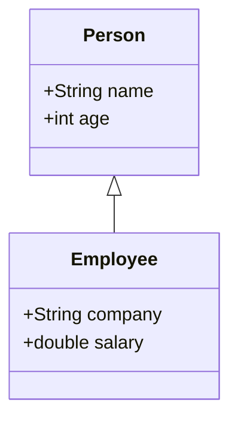

# 代码生成 (Code Generation)

## 1. 背景介绍

### 1.1 什么是代码生成?

代码生成是一种自动化的过程,通过将高级模型或规范转换为可执行的计算机代码。它可以应用于各种编程语言和领域,如Web开发、移动应用程序、数据库系统等。代码生成的主要目标是提高开发效率,减少手工编码的工作量,并确保生成的代码符合预定的标准和规范。

### 1.2 代码生成的优势

- **提高生产力**: 通过自动化重复性任务,减少手工编码,从而提高开发人员的工作效率。
- **一致性和可维护性**: 生成的代码遵循预定义的模板和规则,确保代码质量和一致性,从而提高可维护性。
- **减少人为错误**: 自动化过程可以减少手工编码中容易出现的人为错误,提高代码质量。
- **快速迭代**: 当需求或模型发生变化时,可以快速重新生成代码,加快迭代周期。

### 1.3 代码生成的应用场景

代码生成技术可以应用于多个领域,包括但不限于:

- **模型驱动开发 (Model-Driven Development, MDD)**: 从领域模型或设计模型自动生成应用程序代码。
- **数据访问层 (Data Access Layer)**: 根据数据库模式自动生成与数据库交互的代码。
- **Web服务 (Web Services)**: 从Web服务描述语言 (WSDL) 生成客户端和服务器端代码。
- **用户界面 (User Interface)**: 从UI模型或规范生成用户界面代码。

## 2. 核心概念与联系

### 2.1 模型驱动架构 (Model-Driven Architecture, MDA)

模型驱动架构是代码生成的核心理念之一。它将软件开发过程分为不同的抽象层次,每个层次都有相应的模型。通过模型转换,可以从高层次的模型自动生成低层次的模型或代码。

MDA包含以下三个主要模型层次:

1. **计算机独立模型 (Computation Independent Model, CIM)**: 描述系统在业务环境中的需求和规范,与计算机无关。
2. **平台独立模型 (Platform Independent Model, PIM)**: 描述系统的结构和行为,与特定平台无关。
3. **平台特定模型 (Platform Specific Model, PSM)**: 根据特定平台的技术和约束,从PIM转换而来。

通过模型转换,可以从CIM生成PIM,再从PIM生成PSM,最后从PSM生成可执行的代码。

### 2.2 领域特定语言 (Domain-Specific Language, DSL)

领域特定语言是为特定领域设计的计算机语言,旨在提高该领域的开发效率和表达能力。DSL通常具有以下特点:

1. **面向特定领域**: DSL专注于特定领域的概念和抽象,使用该领域的术语和符号。
2. **高度表达能力**: DSL提供了高度的表达能力,可以更加精确和简洁地描述该领域的问题。
3. **可扩展性**: DSL可以根据需求进行扩展和定制,以满足特定领域的需求。

DSL可以用于代码生成,通过将DSL模型转换为目标代码,实现自动化代码生成。

### 2.3 模板引擎

模板引擎是代码生成过程中常用的工具。它允许开发人员定义模板,并将模型数据与模板合并,生成最终的代码。

常见的模板引擎包括:

- **Jinja (Python)**: 一种现代的、设计师友好的模板语言,用于Python。
- **Mustache (多种语言)**: 基于逻辑无代码的模板语法,可用于多种编程语言。
- **Handlebars (JavaScript)**: 一种基于Mustache的JavaScript模板库。
- **Razor (C#)**: 由Microsoft ASP.NET团队开发的模板引擎,用于生成动态网页。

模板引擎通常支持条件逻辑、循环、变量替换等功能,使代码生成过程更加灵活和可配置。

## 3. 核心算法原理具体操作步骤

### 3.1 模型到模型转换 (Model-to-Model Transformation)

模型到模型转换是模型驱动架构中的一个关键步骤。它将高层次的模型转换为低层次的模型,以便进一步生成代码。常见的模型到模型转换方法包括:

1. **查询/视图/转换 (Query/View/Transformation, QVT)**: 由OMG (Object Management Group) 提出的标准化模型转换语言。
2. **ATL (Atlas Transformation Language)**: 一种用于模型到模型转换的领域特定语言,由INRIA和法国电力公司共同开发。
3. **Acceleo**: 一个基于模板的代码生成工具,可以从UML模型或其他DSL模型生成代码。

模型到模型转换通常涉及以下步骤:

1. **解析源模型**: 读取和解析源模型,构建内存中的模型表示。
2. **匹配和映射规则**: 根据预定义的规则,将源模型元素映射到目标模型元素。
3. **生成目标模型**: 根据映射规则,构建目标模型的实例。
4. **序列化目标模型**: 将内存中的目标模型实例序列化为持久化的模型文件。

### 3.2 模型到文本转换 (Model-to-Text Transformation)

模型到文本转换是将模型直接转换为文本形式的代码或其他artifact。常见的模型到文本转换工具包括:

1. **Acceleo**: 一个基于模板的代码生成工具,支持从UML模型或其他DSL模型生成代码。
2. **Xpand**: 一个基于模板的代码生成框架,集成在Eclipse建模工具中。
3. **EGL (Epsilon Generation Language)**: Epsilon工具集中的一个代码生成语言,支持从各种模型生成代码。

模型到文本转换通常包括以下步骤:

1. **解析源模型**: 读取和解析源模型,构建内存中的模型表示。
2. **模板匹配和执行**: 根据预定义的模板规则,将模型元素与模板进行匹配,并执行相应的模板逻辑。
3. **文本生成**: 根据模板逻辑和模型数据,生成目标文本文件。

模板通常包含静态文本和动态部分,动态部分可以引用模型元素的属性和关系,实现代码的自动生成。

## 4. 数学模型和公式详细讲解举例说明

在代码生成过程中,可能需要使用一些数学模型和公式来描述和优化生成过程。以下是一些常见的数学模型和公式:

### 4.1 形式语言和文法

形式语言和文法是描述编程语言语法的数学基础。它们可以用于定义DSL的语法,并指导代码生成器生成符合语法规则的代码。

一个形式语言 $L$ 由一个终结符集合 $\Sigma$ 和一个产生式集合 $P$ 组成,可以表示为:

$$L = (\Sigma, P, S)$$

其中 $S$ 是开始符号,属于非终结符集合。产生式 $P$ 定义了如何从非终结符推导出终结符和其他非终结符的规则。

例如,一个简单的算术表达式语言可以用以下文法定义:

$$
\begin{align*}
E &\rightarrow E + T \mid E - T \mid T \\
T &\rightarrow T \times F \mid T \div F \mid F \\
F &\rightarrow (E) \mid \text{number}
\end{align*}
$$

其中 $E$、$T$ 和 $F$ 是非终结符,表示表达式、项和因子。终结符包括数字、加号、减号等。

### 4.2 图形理论和模型转换

图形理论可以用于描述模型之间的转换关系。模型可以表示为有向图,节点表示模型元素,边表示元素之间的关系。

设有两个模型 $M_1$ 和 $M_2$,它们分别表示为有向图 $G_1 = (V_1, E_1)$ 和 $G_2 = (V_2, E_2)$。模型转换可以定义为一个函数 $f: V_1 \rightarrow V_2$,将 $M_1$ 中的节点映射到 $M_2$ 中的节点。

对于每个边 $(u, v) \in E_1$,如果存在一条从 $f(u)$ 到 $f(v)$ 的路径 $p$ 在 $G_2$ 中,则称这个转换是合法的。转换的目标是找到一个最优的映射函数 $f$,使得所有边都能在 $G_2$ 中找到对应的路径。

这个问题可以用图同构 (graph isomorphism) 的概念来描述,并使用图匹配算法来求解。

### 4.3 模板匹配和代码生成

代码生成过程中,模板匹配是一个关键步骤。它需要将模型元素与模板中的占位符进行匹配,并用实际的值替换占位符。

设有一个模型 $M$,表示为一个有向图 $G = (V, E)$。每个节点 $v \in V$ 都有一组属性 $\text{attr}(v)$。模板 $T$ 包含一组占位符 $P$,每个占位符 $p \in P$ 都有一个匹配条件 $\text{cond}(p)$。

模板匹配过程可以表示为一个函数 $match: P \rightarrow V$,它将每个占位符 $p$ 映射到一个满足条件 $\text{cond}(p)$ 的节点 $v$。

对于每个占位符 $p$,需要找到一个节点 $v$,使得:

$$\forall a \in \text{cond}(p), a \in \text{attr}(v)$$

换句话说,节点 $v$ 的属性集合必须包含占位符 $p$ 的所有匹配条件。

一旦找到了所有占位符的匹配节点,就可以用节点的实际值替换模板中的占位符,生成最终的代码文本。

## 5. 项目实践: 代码实例和详细解释说明

在这一部分,我们将通过一个实际项目来演示代码生成的过程。我们将使用 Acceleo 作为代码生成工具,从一个简单的 UML 类模型生成 Java 代码。

### 5.1 项目设置

首先,我们需要准备以下工具和环境:

- Eclipse Modeling Tools
- Acceleo 插件

接下来,创建一个新的 Acceleo 项目,并导入一个简单的 UML 类模型。在本例中,我们使用以下类模型:



这个模型定义了两个类 `Person` 和 `Employee`。`Employee` 继承自 `Person`。

### 5.2 创建模板

在 Acceleo 项目中,创建一个新的模板文件 `java.mtl`。这个模板文件将用于生成 Java 代码。

模板文件的内容如下:

```
[comment encoding = UTF-8 /]
[module java('http://www.eclipse.org/uml2/5.0.0/UML')]

[template public generateClass(c : Class)]
[file (c.name.concat('.java'), false, 'UTF-8')]
public class [c.name/] [if (not c.generalization.oclIsUndefined() and not c.generalization.general.oclIsUndefined())]extends [c.generalization.general.name/][/if] {

    [for (attr : Property | c.ownedAttribute)]
    private [attr.type.name/] [attr.name/];
    [/for]

    [for (attr : Property | c.ownedAttribute)]
    public [attr.type.name/] get[attr.name.toUpperFirst()/]() {
        return this.[attr.name/];
    }

    public void set[attr.name.toUpperFirst()/]([attr.type.name/] [attr.name/]) {
        this.[attr.name/] = [attr.name/];
    }
    [/for]
}
[/file]
[/template]

[query public getClassesToGenerate(pkg : Package) : Set(Class) =
    pkg.ownedType->select(oclIsKindOf(Class))->asSet()
/]

[template public generateElement(obj : OpaqueElement)]
[comment @main/]
[file ('src/main/java/', false, 'UTF-8')]
[for (c : Class | obj.getClassesToGenerate())]
[generateClass(c)/]
[/for]
[/file]
[/template]
```

这个模板定义了两个主要部分:

1. `generateClass` 模板用于生成单个 Java 类的代码。它遍历类的属性,为每个属性生