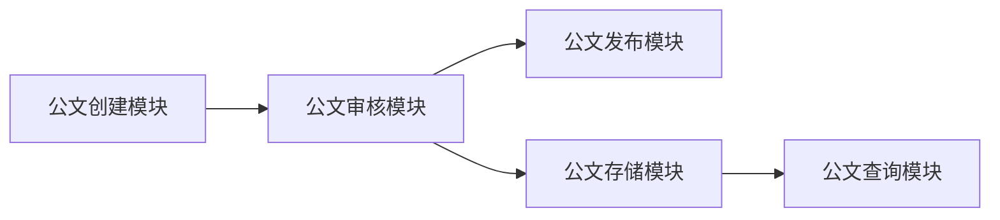

## 1.背景介绍

公文管理系统是企业日常运营的重要组成部分，它涉及到公文的创建、审核、发布、存储和查询等环节。随着企业规模的扩大和业务的复杂化，传统的公文管理方式已经无法满足现代企业的需求。因此，本文将详细介绍企业公文管理系统的设计与实现，帮助企业实现公文管理的自动化和智能化。

## 2.核心概念与联系

企业公文管理系统主要由以下几个核心模块构成：

- 公文创建模块：负责公文的创建和编辑，支持多种公文模板，方便用户快速生成公文。
- 公文审核模块：负责公文的审核流程，支持自定义审核流程，实现公文的多级审核。
- 公文发布模块：负责公文的发布，支持多种发布方式，如邮件、短信、企业微信等。
- 公文存储模块：负责公文的存储，支持全文检索和标签分类，方便用户查询和管理公文。
- 公文查询模块：负责公文的查询，支持多种查询条件，如公文标题、公文内容、公文作者等。

这些模块之间的关系如下图所示：



## 3.核心算法原理具体操作步骤

企业公文管理系统的核心算法主要包括公文审核流程算法和公文查询算法。

公文审核流程算法主要包括以下步骤：

1. 用户创建公文后，系统根据预设的审核流程，将公文发送给第一个审核人。
2. 审核人对公文进行审核，如果通过，则将公文发送给下一个审核人；如果不通过，则将公文退回给公文作者。
3. 如果公文通过了所有审核人的审核，则公文状态变为“审核通过”，可以进行发布操作；如果公文被任何一个审核人拒绝，则公文状态变为“审核未通过”，需要公文作者进行修改后重新提交审核。

公文查询算法主要包括以下步骤：

1. 用户输入查询条件，如公文标题、公文内容、公文作者等。
2. 系统根据查询条件，在公文存储模块中查找符合条件的公文。
3. 将查询结果返回给用户。

## 4.数学模型和公式详细讲解举例说明

在公文管理系统中，我们可以使用图论来描述公文的审核流程。每个审核人可以看作一个节点，每个审核步骤可以看作一个有向边。例如，如果审核流程是“员工->经理->总监”，则可以表示为如下的有向图：


在这个模型中，我们可以定义一个函数 $f(i, j)$，表示从节点 $i$ 到节点 $j$ 的最短路径长度。如果节点 $i$ 和节点 $j$ 之间没有直接的边，则 $f(i, j) = \infty$；如果节点 $i$ 和节点 $j$ 之间有直接的边，则 $f(i, j) = 1$。我们可以使用弗洛伊德算法来求解这个函数。

弗洛伊德算法的核心思想是动态规划，它的状态转移方程为：

$$f(i, j) = \min(f(i, j), f(i, k) + f(k, j))$$

其中，$k$ 是所有可能的中间节点。这个公式的意思是，从节点 $i$ 到节点 $j$ 的最短路径，要么是直接从 $i$ 到 $j$，要么是先从 $i$ 到某个中间节点 $k$，然后再从 $k$ 到 $j$。

## 5.项目实践：代码实例和详细解释说明

下面我们将以公文审核流程算法为例，给出具体的代码实现。

我们首先定义一个二维数组 `f`，用来存储函数 $f(i, j)$ 的值。然后，我们使用弗洛伊德算法来求解这个函数。

```python
n = 10  # 审核人的数量
f = [[float('inf')] * n for _ in range(n)]  # 初始化 f

# 设置直接审核关系
f[0][1] = 1  # 员工到经理
f[1][2] = 1  # 经理到总监

# 使用弗洛伊德算法求解 f
for k in range(n):
    for i in range(n):
        for j in range(n):
            f[i][j] = min(f[i][j], f[i][k] + f[k][j])
```

在这段代码中，我们首先定义了一个二维数组 `f`，并将其所有元素初始化为无穷大。然后，我们设置了直接的审核关系，即员工到经理和经理到总监。最后，我们使用弗洛伊德算法来求解 `f`。这个算法的时间复杂度是 $O(n^3)$，其中 $n$ 是审核人的数量。

## 6.实际应用场景

企业公文管理系统可以广泛应用于各种企业和组织，如政府机关、学校、医院、公司等。它可以帮助这些企业和组织实现公文的自动化和智能化管理，提高工作效率，降低运营成本。

## 7.工具和资源推荐

在实现企业公文管理系统时，我们推荐使用以下工具和资源：

- 编程语言：Python，因为它简单易学，且有丰富的库和框架。
- 开发框架：Django，因为它是一个高级的 Python Web 框架，可以快速开发高质量的 Web 应用。
- 数据库：MySQL，因为它是一个开源的关系型数据库，性能稳定，且有丰富的功能。

## 8.总结：未来发展趋势与挑战

随着信息技术的发展，企业公文管理系统将越来越智能化，例如，它可以使用人工智能技术来自动审核公文，提高审核效率；它也可以使用大数据技术来分析公文数据，提供决策支持。然而，这也带来了新的挑战，例如，如何保护公文的安全和隐私，如何处理大规模的公文数据等。

## 9.附录：常见问题与解答

1. 问题：如何设置公文的审核流程？
   答：在公文创建模块中，用户可以自定义公文的审核流程，例如，可以设置审核人和审核顺序等。

2. 问题：如何查询公文？
   答：在公文查询模块中，用户可以输入查询条件，如公文标题、公文内容、公文作者等，系统会返回符合条件的公文。

3. 问题：如何保护公文的安全和隐私？
   答：企业公文管理系统应使用加密技术来保护公文的安全，例如，可以使用 SSL 加密来保护公文的传输，可以使用 AES 加密来保护公文的存储。

作者：禅与计算机程序设计艺术 / Zen and the Art of Computer Programming