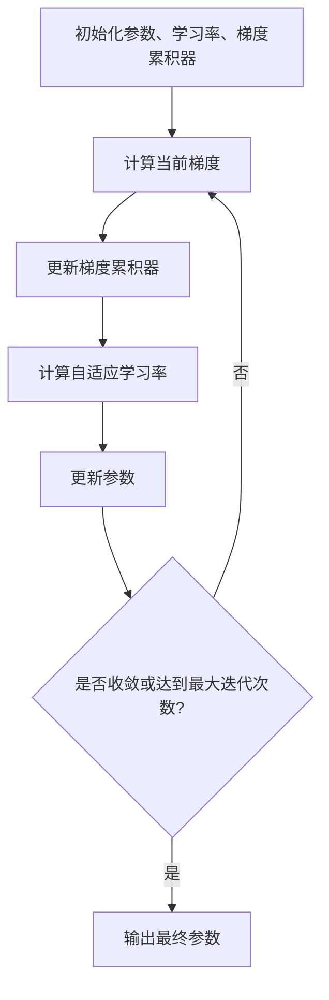

# 优化算法：Adagrad 原理与代码实例讲解

## 1. 背景介绍

### 1.1 优化算法的重要性

在机器学习和深度学习领域中,优化算法扮演着至关重要的角色。它们旨在有效地调整模型参数,以最小化损失函数并提高模型性能。传统的优化算法,如梯度下降(Gradient Descent),虽然简单有效,但在处理高维数据和复杂非凸优化问题时,往往会遇到一些挑战,如陷入局部最优解、收敛缓慢等。

### 1.2 Adagrad 算法的产生背景

为了解决上述问题,研究人员不断探索和发明新的优化算法。Adagrad(Adaptive Gradient)算法就是其中一种创新性的优化算法,由 Duchi 等人于 2011 年提出。它通过自适应地调整每个参数的学习率,从而加速收敛并提高优化效率。

## 2. 核心概念与联系

### 2.1 学习率(Learning Rate)

在优化算法中,学习率是一个非常关键的超参数。它决定了每次迭代时,参数更新的步长大小。一个较大的学习率可以加快收敛速度,但可能会导致振荡和无法收敛。相反,一个较小的学习率虽然可以保证收敛,但收敛速度会变慢。

传统的梯度下降算法使用固定的全局学习率,这在处理不同尺度的特征时可能会遇到困难。例如,对于一些特征,固定的学习率可能太大,导致无法收敛;而对于另一些特征,固定的学习率可能太小,导致收敛缓慢。

### 2.2 自适应学习率(Adaptive Learning Rate)

为了解决固定学习率带来的问题,自适应学习率优化算法应运而生。这些算法通过动态调整每个参数的学习率,以适应不同特征的尺度和梯度变化。Adagrad 算法就是其中一种自适应学习率优化算法。

### 2.3 Adagrad 算法核心思想

Adagrad 算法的核心思想是:对于频繁更新的参数,降低其学习率;对于较少更新的参数,增加其学习率。这样可以平衡不同参数的更新速度,从而加速收敛并提高优化效率。

Adagrad 算法通过累积所有过去梯度的平方和来动态调整每个参数的学习率。具体来说,对于每个参数,其学习率与该参数过去所有梯度平方和的平方根成反比。这意味着,如果一个参数的梯度较大,其学习率会逐渐降低;反之,如果一个参数的梯度较小,其学习率会逐渐增加。

### 2.4 Adagrad 算法与其他优化算法的关系

Adagrad 算法属于自适应学习率优化算法家族,与其他一些著名的优化算法有一定的联系和区别。例如:

- 与 RMSProp 和 Adadelta 算法相比,Adagrad 算法累积的是所有过去梯度的平方和,而不是指数加权的梯度平方和。这可能会导致在后期,学习率过度衰减,收敛变慢。
- 与 Adam 算法相比,Adagrad 算法没有引入动量项,因此可能在某些情况下收敛速度较慢。
- 与 SGD with Momentum 算法相比,Adagrad 算法通过自适应学习率来加速收敛,而不是引入动量项。

总的来说,Adagrad 算法是一种简单而有效的自适应学习率优化算法,为后续的优化算法奠定了基础。

## 3. 核心算法原理具体操作步骤

### 3.1 Adagrad 算法原理

Adagrad 算法的核心思想是通过累积所有过去梯度的平方和来动态调整每个参数的学习率。具体来说,对于第 $t$ 次迭代,参数 $\theta_i$ 的更新规则如下:

$$
\begin{aligned}
g_{t, i} &= \frac{\partial J(\theta_t)}{\partial \theta_{t, i}} \\
s_{t, i} &= s_{t-1, i} + g_{t, i}^2 \\
\theta_{t+1, i} &= \theta_{t, i} - \frac{\eta}{\sqrt{s_{t, i} + \epsilon}} g_{t, i}
\end{aligned}
$$

其中:

- $g_{t, i}$ 是第 $t$ 次迭代时,参数 $\theta_i$ 的梯度;
- $s_{t, i}$ 是截止到第 $t$ 次迭代,参数 $\theta_i$ 的所有过去梯度平方和;
- $\eta$ 是初始学习率,通常取一个较小的正值;
- $\epsilon$ 是一个平滑项,用于避免分母为零的情况,通常取一个很小的正值。

从上述更新规则可以看出,Adagrad 算法通过累积梯度平方和 $s_{t, i}$ 来自适应地调整每个参数的学习率。对于梯度较大的参数,其学习率会逐渐降低;反之,对于梯度较小的参数,其学习率会逐渐增加。

### 3.2 Adagrad 算法步骤

基于上述原理,Adagrad 算法的具体步骤如下:

1. 初始化参数 $\theta_0$,初始学习率 $\eta$,平滑项 $\epsilon$,梯度累积器 $s_0 = 0$。
2. 对于第 $t$ 次迭代:
    a. 计算当前参数 $\theta_t$ 下的梯度 $g_{t, i} = \frac{\partial J(\theta_t)}{\partial \theta_{t, i}}$。
    b. 更新梯度累积器 $s_{t, i} = s_{t-1, i} + g_{t, i}^2$。
    c. 计算自适应学习率 $\alpha_{t, i} = \frac{\eta}{\sqrt{s_{t, i} + \epsilon}}$。
    d. 更新参数 $\theta_{t+1, i} = \theta_{t, i} - \alpha_{t, i} g_{t, i}$。
3. 重复步骤 2,直到收敛或达到最大迭代次数。

### 3.3 Adagrad 算法流程图

为了更好地理解 Adagrad 算法的工作流程,我们可以使用 Mermaid 流程图进行可视化:



上述流程图清晰地展示了 Adagrad 算法的核心步骤:初始化 -> 计算梯度 -> 更新梯度累积器 -> 计算自适应学习率 -> 更新参数 -> 判断是否收敛,直至收敛或达到最大迭代次数。

## 4. 数学模型和公式详细讲解举例说明

在上一节中,我们已经介绍了 Adagrad 算法的核心原理和具体步骤。现在,让我们通过一个具体的例子来详细讲解其中涉及的数学模型和公式。

### 4.1 问题描述

假设我们有一个简单的线性回归问题,目标是找到最佳的参数 $\theta_0$ 和 $\theta_1$,使得预测值 $\hat{y} = \theta_0 + \theta_1 x$ 与真实值 $y$ 之间的均方误差最小。

具体来说,我们有一个训练数据集 $\{(x_i, y_i)\}_{i=1}^N$,其中 $x_i$ 是特征值, $y_i$ 是对应的标签值。我们的目标是最小化以下损失函数:

$$
J(\theta_0, \theta_1) = \frac{1}{2N} \sum_{i=1}^N (\theta_0 + \theta_1 x_i - y_i)^2
$$

### 4.2 梯度计算

为了使用 Adagrad 算法优化参数,我们需要首先计算损失函数相对于参数的梯度。根据链式法则,我们可以得到:

$$
\begin{aligned}
\frac{\partial J}{\partial \theta_0} &= \frac{1}{N} \sum_{i=1}^N (\theta_0 + \theta_1 x_i - y_i) \\
\frac{\partial J}{\partial \theta_1} &= \frac{1}{N} \sum_{i=1}^N (\theta_0 + \theta_1 x_i - y_i) x_i
\end{aligned}
$$

### 4.3 Adagrad 算法更新规则

接下来,我们将使用 Adagrad 算法来更新参数 $\theta_0$ 和 $\theta_1$。根据前面介绍的原理,更新规则如下:

$$
\begin{aligned}
g_{t, 0} &= \frac{\partial J(\theta_t)}{\partial \theta_{t, 0}} \\
g_{t, 1} &= \frac{\partial J(\theta_t)}{\partial \theta_{t, 1}} \\
s_{t, 0} &= s_{t-1, 0} + g_{t, 0}^2 \\
s_{t, 1} &= s_{t-1, 1} + g_{t, 1}^2 \\
\theta_{t+1, 0} &= \theta_{t, 0} - \frac{\eta}{\sqrt{s_{t, 0} + \epsilon}} g_{t, 0} \\
\theta_{t+1, 1} &= \theta_{t, 1} - \frac{\eta}{\sqrt{s_{t, 1} + \epsilon}} g_{t, 1}
\end{aligned}
$$

其中,初始学习率 $\eta$ 和平滑项 $\epsilon$ 是超参数,需要预先设置合适的值。

### 4.4 算法实现

现在,我们可以使用 Python 和 NumPy 库来实现 Adagrad 算法,并应用于上述线性回归问题。以下是一个简单的实现示例:

```python
import numpy as np

# 生成模拟数据
X = np.random.rand(100, 1)
y = 2 + 3 * X + np.random.randn(100, 1)

# 初始化参数和超参数
theta_0 = np.random.randn()
theta_1 = np.random.randn()
eta = 0.1  # 初始学习率
epsilon = 1e-8  # 平滑项
s_0 = 0
s_1 = 0

# 训练
for epoch in range(1000):
    y_pred = theta_0 + theta_1 * X
    
    # 计算梯度
    grad_0 = np.mean(y_pred - y)
    grad_1 = np.mean((y_pred - y) * X)
    
    # 更新梯度累积器
    s_0 += grad_0 ** 2
    s_1 += grad_1 ** 2
    
    # 更新参数
    theta_0 -= eta / np.sqrt(s_0 + epsilon) * grad_0
    theta_1 -= eta / np.sqrt(s_1 + epsilon) * grad_1
    
print(f"最终参数: theta_0 = {theta_0}, theta_1 = {theta_1}")
```

在上述实现中,我们首先生成了一个模拟的线性数据集。然后,我们初始化了参数 $\theta_0$ 和 $\theta_1$,以及超参数 $\eta$ 和 $\epsilon$。接下来,我们进入训练循环,在每次迭代中:

1. 计算当前参数下的预测值 $y_pred$。
2. 计算梯度 $grad_0$ 和 $grad_1$。
3. 更新梯度累积器 $s_0$ 和 $s_1$。
4. 根据 Adagrad 算法的更新规则,更新参数 $\theta_0$ 和 $\theta_1$。

经过足够的迭代次数后,我们可以得到最终的参数值。

通过上述示例,我们可以清楚地看到 Adagrad 算法是如何计算梯度、更新梯度累积器,并根据自适应学习率来更新参数的。这种自适应机制使得 Adagrad 算法能够有效地处理不同尺度的特征,加速收敛并提高优化效率。

## 5. 项目实践:代码实例和详细解释说明

在上一节中,我们已经通过一个简单的线性回归示例,介绍了如何使用 Python 和 NumPy 库实现 Adagrad 算法。现在,让我们进一步探讨如何将 Adagrad 算法应用于实际的机器学习项目中。

### 5.1 项目背景

假设我们正在开发一个图