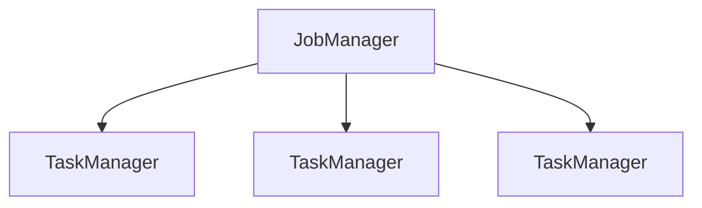

# 使用Flink进行流式图处理

## 1.背景介绍

### 1.1 大数据时代的到来

随着互联网、物联网和移动互联网的快速发展,数据呈现出爆炸式增长。根据IDC的预测,到2025年,全球数据量将达到175ZB。传统的批处理系统已经无法满足对实时数据处理的需求。因此,流式计算应运而生,成为大数据处理的重要组成部分。

### 1.2 流式计算的概念

流式计算是一种新兴的数据处理范式,它能够持续不断地处理来自各种数据源的数据流。与传统的批处理不同,流式计算可以在数据到达时立即对其进行处理,从而实现低延迟和高吞吐量。

### 1.3 Apache Flink简介

Apache Flink是一个开源的分布式流式数据处理框架,它具有低延迟、高吞吐量、精确一次语义和事件时间处理等特点。Flink不仅支持流式计算,还支持批处理,可以将批处理视为流式计算的一个特例。此外,Flink还提供了丰富的API和库,支持多种编程语言,可以处理各种数据源。

## 2.核心概念与联系

### 2.1 流(Stream)

在Flink中,流是一个无界的、不可变的数据记录序列。每个数据记录都与一个时间戳相关联,用于表示该记录的事件时间或处理时间。流可以来自各种数据源,如消息队列、文件系统或数据库。

### 2.2 转换(Transformation)

转换是对流进行处理的操作,包括map、flatMap、filter、keyBy、window等。转换可以将一个或多个输入流转换为一个或多个输出流。

### 2.3 数据源(Source)和数据sink(Sink)

数据源是流的入口,用于从外部系统(如Kafka、文件系统等)读取数据。数据sink是流的出口,用于将处理后的数据写入外部系统(如HDFS、HBase等)。

### 2.4 窗口(Window)

窗口是流处理中的一个重要概念,用于将无界流划分为有界的块或窗口。Flink支持多种窗口类型,如滚动窗口、滑动窗口、会话窗口等。窗口可以根据时间或计数进行划分。

### 2.5 时间语义

Flink支持三种时间语义:事件时间、处理时间和注入时间。事件时间是指数据记录实际发生的时间;处理时间是指数据记录到达Flink系统的时间;注入时间是指数据记录被注入到Flink系统的时间。

### 2.6 状态(State)

Flink支持有状态的流处理,可以在作业执行过程中维护状态。状态可以存储在TaskManager的内存或者状态后端(如RocksDB)中。有状态的流处理可以实现更复杂的计算逻辑,如窗口计算、连接等。

### 2.7 容错机制

Flink采用了基于流重播的容错机制,可以实现精确一次(Exactly-once)的语义。当发生故障时,Flink会从最近一次成功的检查点(Checkpoint)重新启动作业,并重放相关的数据流,从而保证计算结果的正确性。

## 3.核心算法原理具体操作步骤

### 3.1 Flink运行时架构

Flink采用了主从架构,包括一个JobManager(主节点)和多个TaskManager(从节点)。JobManager负责协调分布式执行,调度任务、协调检查点等;TaskManager负责执行具体的任务,例如数据流的转换和计算。



### 3.2 流处理的执行流程

1. **构建执行计划**

   用户通过编写Flink程序,定义数据源、转换操作和数据sink。Flink会根据程序构建一个执行计划,表示为有向无环图(DAG)。

2. **任务调度**

   JobManager将执行计划分解为多个并行的任务,并将这些任务分发到TaskManager上执行。

3. **数据传输**

   TaskManager之间通过网络进行数据传输,采用零拷贝技术提高性能。数据以流的形式在TaskManager之间流动。

4. **算子执行**

   每个TaskManager上运行一个或多个线程,执行分发到本地的任务。算子(Operator)是执行计划中最小的执行单元,负责对数据流进行转换。

5. **状态管理**

   对于有状态的算子,TaskManager会维护其状态,并定期向JobManager发送检查点,以实现容错。

6. **结果输出**

   经过一系列转换后,数据流最终到达Sink算子,将结果输出到外部系统。

### 3.3 流处理的并行度

Flink支持数据并行和管道并行两种并行模型。

1. **数据并行**

   数据并行是指同一个算子的多个并行实例同时处理不同的数据分区。数据并行度可以在算子级别设置。

2. **管道并行**

   管道并行是指不同的算子可以并行执行,形成一个流水线。这种模型可以充分利用CPU和内存资源,提高整体吞吐量。

### 3.4 窗口计算

窗口计算是流处理中的一个核心概念。Flink支持多种窗口类型,如滚动窗口、滑动窗口、会话窗口等。窗口计算的基本步骤如下:

1. 将流数据划分为有界的窗口
2. 对窗口内的数据进行聚合或其他计算
3. 产生窗口结果

Flink提供了丰富的窗口API,支持基于时间和计数的窗口操作。

### 3.5 状态管理与容错

为了实现精确一次(Exactly-once)的语义,Flink采用了基于流重播的容错机制。具体步骤如下:

1. **检查点(Checkpoint)**

   TaskManager会定期向JobManager发送检查点,保存当前的状态快照。

2. **故障恢复**

   当发生故障时,Flink会从最近一次成功的检查点重新启动作业,并重放相关的数据流。

3. **状态重建**

   重新启动的任务会从检查点中恢复状态,并继续处理数据流。

4. **端到端精确一次**

   通过重放源头数据和重建状态,Flink可以确保计算结果的正确性,实现端到端的精确一次语义。

## 4.数学模型和公式详细讲解举例说明

在流式计算中,常见的数学模型包括滑动窗口模型和会话窗口模型。

### 4.1 滑动窗口模型

滑动窗口将数据流划分为固定大小的窗口,每个窗口包含一段时间内的数据。新的窗口会定期产生,旧的窗口会被丢弃。滑动窗口可以设置窗口大小(window size)和滑动步长(slide size)。

假设数据流为$D = \{d_1, d_2, d_3, \ldots\}$,窗口大小为$w$,滑动步长为$s$,则第$i$个窗口$W_i$包含的数据为:

$$W_i = \{d_j | (i-1)s < t(d_j) \le (i-1)s + w\}$$

其中$t(d_j)$表示数据$d_j$的时间戳。

例如,如果$w=10$分钟,$s=5$分钟,则第一个窗口$W_1$包含时间范围$(0, 10]$内的数据,第二个窗口$W_2$包含时间范围$(5, 15]$内的数据,以此类推。

### 4.2 会话窗口模型

会话窗口根据数据之间的活动模式来划分窗口。如果两个数据之间的时间间隔超过了一定的间隙时间(session gap),则它们属于不同的会话窗口。

假设数据流为$D = \{d_1, d_2, d_3, \ldots\}$,间隙时间为$g$,则第$i$个会话窗口$S_i$包含的数据为:

$$S_i = \{d_j | t(d_j) - t(d_{j-1}) \le g, d_j \in D\}$$

其中$t(d_j)$表示数据$d_j$的时间戳。

例如,如果$g=30$分钟,则一个会话窗口可能包含$(10:00, 10:15]$内的数据,另一个会话窗口可能包含$(11:20, 11:45]$内的数据,取决于数据的实际到达时间。

## 5.项目实践:代码实例和详细解释说明

这里我们将使用Flink Java API实现一个简单的流式WordCount程序,统计文本中每个单词出现的次数。

### 5.1 项目依赖

```xml
<dependency>
    <groupId>org.apache.flink</groupId>
    <artifactId>flink-java</artifactId>
    <version>1.14.0</version>
</dependency>
<dependency>
    <groupId>org.apache.flink</groupId>
    <artifactId>flink-streaming-java_2.12</artifactId>
    <version>1.14.0</version>
</dependency>
```

### 5.2 创建执行环境

```java
// 创建流式执行环境
StreamExecutionEnvironment env = StreamExecutionEnvironment.getExecutionEnvironment();
```

### 5.3 定义数据源

```java
// 从socket文本流读取数据
DataStream<String> text = env.socketTextStream("localhost", 9999);
```

### 5.4 定义转换操作

```java
// 分词、统计单词出现次数
DataStream<Tuple2<String, Integer>> wordCounts = text
    .flatMap(new FlatMapFunction<String, Tuple2<String, Integer>>() {
        @Override
        public void flatMap(String value, Collector<Tuple2<String, Integer>> out) {
            String[] words = value.split(" ");
            for (String word : words) {
                out.collect(new Tuple2<>(word, 1));
            }
        }
    })
    .keyBy(0)
    .sum(1);
```

上面的代码执行以下操作:

1. 使用`flatMap`将每行文本拆分为单词
2. 将每个单词映射为`(word, 1)`的元组
3. 使用`keyBy`按照单词进行分组
4. 使用`sum`对每个单词的计数求和

### 5.5 定义数据sink

```java
// 将结果打印到控制台
wordCounts.print();
```

### 5.6 执行作业

```java
// 执行作业
env.execute("Word Count");
```

### 5.7 运行程序

1. 启动Flink集群
2. 运行WordCount程序
3. 通过netcat向socket端口发送文本数据

```
$ nc -lk 9999
hello world
hello flink
```

程序将输出:

```
(world,1)
(hello,2)
(flink,1)
```

## 6.实际应用场景

流式图处理在许多领域都有广泛的应用,包括但不限于:

### 6.1 社交网络分析

分析社交网络上的用户行为、关系和内容传播,为推荐系统、广告投放等提供支持。

### 6.2 物联网数据处理

实时处理来自传感器、智能设备等的海量数据流,用于监控、预测和控制。

### 6.3 金融风险监控

对金融交易数据进行实时分析,及时发现异常行为和风险,保护投资者利益。

### 6.4 网络安全防护

分析网络流量数据,检测入侵行为和攻击模式,提高网络安全性。

### 6.5 智能交通系统

处理实时交通数据,优化路线规划、减少拥堵,提高运输效率。

### 6.6 实时日志分析

对系统日志进行实时处理,发现异常情况,提高系统稳定性和可用性。

## 7.工具和资源推荐

### 7.1 Flink官方文档

Flink官方文档(https://nightlies.apache.org/flink/flink-docs-release-1.14/)提供了详细的概念介绍、API参考和最佳实践指南。

### 7.2 Flink训练营

Flink训练营(https://flink-training.ververica.com/)提供了一系列免费的在线培训课程,涵盖Flink的核心概念和实践技能。

### 7.3 Flink Forward

Flink Forward(https://www.flink-forward.org/)是Flink社区的年度大会,分享最新的技术进展和实践经验。

### 7.4 Flink用户邮件列表

Flink用户邮件列表(https://flink.apache.org/community.html#mailing-lists