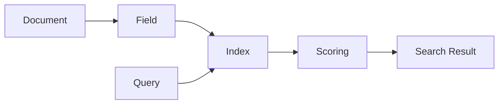

# 使用Lucene构建学术文献搜索系统

## 1.背景介绍

在当今信息爆炸的时代,高效地检索和获取所需的学术文献资源对于研究人员和学者来说至关重要。传统的学术文献检索方式效率低下,无法满足快速获取海量文献的需求。因此,构建一个高效、智能的学术文献搜索系统势在必行。

Lucene是一个功能强大、性能优异的开源全文检索引擎库,被广泛应用于各种搜索场景。本文将详细介绍如何利用Lucene构建一个实用的学术文献搜索系统,帮助用户快速精准地检索到所需的学术资源。

### 1.1 学术文献检索的痛点

- 文献资源分散,缺乏统一的检索入口
- 传统检索方式效率低下,无法处理海量数据  
- 检索结果准确性不高,难以快速获取相关文献
- 缺乏个性化、智能化的搜索服务

### 1.2 Lucene的优势

- 高性能,可快速构建索引和检索
- 丰富的查询语法,支持复杂的搜索需求
- 可扩展性强,易于与其他系统集成
- 跨平台,可在各种环境中运行
- 活跃的社区支持和完善的文档

### 1.3 系统目标

- 为用户提供统一的学术文献检索入口
- 支持海量文献的快速索引和查询
- 提供相关性高、多样化的搜索结果
- 实现个性化、智能化的搜索服务
- 提供友好的用户界面,优化用户体验

## 2.核心概念与关系

在使用Lucene构建学术文献搜索系统时,需要理解以下几个核心概念:

### 2.1 文档(Document)

文档是Lucene中的基本单元,包含一组字段(Field),用于表示一篇学术文献的各种元数据,如标题、作者、摘要、关键词等。

### 2.2 字段(Field) 

字段是文档的组成部分,用于存储文献的具体内容。不同的字段可以有不同的属性,如是否分词、是否索引、是否存储等。合理设计字段可以优化索引和查询性能。

### 2.3 索引(Index)

索引是Lucene对文档进行快速搜索的基础。通过将文档转换为倒排索引结构,Lucene可以高效地进行全文检索。索引过程包括文档分析、词项化、索引写入等步骤。

### 2.4 查询(Query)

查询是用户检索文献的语句,Lucene提供了丰富的查询语法,支持多种查询类型,如词项查询、布尔查询、短语查询、通配符查询等。用户可以根据需求组合不同的查询条件。

### 2.5 打分(Scoring)  

打分是Lucene对查询结果进行排序的依据。Lucene使用TF-IDF等算法对文档的相关性进行评估,计算文档与查询的匹配程度,从而返回最相关的结果。

以下是这些概念之间的关系图:



## 3.核心算法原理与操作步骤

Lucene的核心算法主要包括文档索引和查询两个部分。

### 3.1 文档索引

1. 文档分析:将原始文档解析为一系列的词项(Token),并提取出各个字段的内容。
2. 词项化:对分析后的词项进行规范化处理,如转小写、去除停用词、提取词干等。
3. 倒排索引构建:为每个词项创建一个包含其所在文档ID的倒排列表,并将倒排列表写入索引文件。
4. 索引优化:对索引进行优化,如合并段、删除过期文档等,提高查询性能。

### 3.2 文献查询

1. 查询解析:将用户输入的查询语句解析为Lucene内部的查询对象。
2. 查询执行:根据查询对象,在倒排索引中查找包含查询词项的文档,并计算文档的相关性得分。
3. 结果排序:对查询结果按照相关性得分进行排序,将最相关的文档返回给用户。
4. 结果高亮:对查询结果中的关键词进行高亮显示,方便用户快速定位。

## 4.数学模型与公式讲解

Lucene的打分机制主要基于TF-IDF模型和向量空间模型(VSM)。

### 4.1 TF-IDF模型

TF-IDF(Term Frequency-Inverse Document Frequency)是一种用于评估词项在文档中重要性的统计方法。

- TF(词频):词项t在文档d中出现的频率。

$$
TF(t,d) = \frac{f_{t,d}}{\sum_{t'\in d} f_{t',d}}
$$

其中,$f_{t,d}$表示词项t在文档d中出现的次数。

- IDF(逆文档频率):衡量词项t在整个文档集合中的稀缺程度。

$$
IDF(t) = \log \frac{N}{n_t + 1}
$$

其中,N为文档总数,$n_t$为包含词项t的文档数。

TF-IDF权重是TF和IDF的乘积:

$$
TFIDF(t,d) = TF(t,d) \times IDF(t)
$$

### 4.2 向量空间模型

在向量空间模型中,每个文档和查询都被表示为一个多维向量,维度为词项的数量。文档向量和查询向量的相似度可以用余弦相似度来衡量:

$$
\cos(\vec{d},\vec{q}) = \frac{\vec{d} \cdot \vec{q}}{|\vec{d}| |\vec{q}|} = \frac{\sum_{i=1}^n d_i q_i}{\sqrt{\sum_{i=1}^n d_i^2} \sqrt{\sum_{i=1}^n q_i^2}}
$$

其中,$\vec{d}$和$\vec{q}$分别为文档向量和查询向量,$d_i$和$q_i$为对应维度上的权重值。

Lucene的默认打分公式结合了TF-IDF和向量空间模型:

$$
score(q,d) = \sum_{t \in q} TFIDF(t,d) \cdot \text{boost}(t) \cdot \text{norm}(d)
$$

其中,boost(t)为查询中词项t的权重,norm(d)为文档d的归一化因子,用于平衡不同长度文档的得分。

## 5.项目实践:代码实例与详细解释

下面通过一个简单的示例来演示如何使用Lucene构建学术文献搜索系统。

### 5.1 创建索引

```java
// 创建索引写入器配置
IndexWriterConfig config = new IndexWriterConfig(new StandardAnalyzer());
// 创建索引写入器
IndexWriter writer = new IndexWriter(FSDirectory.open(Paths.get("index")), config);

// 创建文档对象
Document doc = new Document();
// 添加字段
doc.add(new TextField("title", "Lucene in Action", Field.Store.YES));
doc.add(new StringField("author", "Erik Hatcher", Field.Store.YES));
doc.add(new TextField("content", "This is the content of the book.", Field.Store.YES));
// 写入文档到索引
writer.addDocument(doc);

// 提交并关闭索引写入器
writer.close();
```

上述代码创建了一个索引写入器,并添加了一个包含标题、作者和内容字段的文档到索引中。

### 5.2 执行查询

```java
// 创建索引读取器
IndexReader reader = DirectoryReader.open(FSDirectory.open(Paths.get("index")));
// 创建索引搜索器
IndexSearcher searcher = new IndexSearcher(reader);

// 创建查询解析器
QueryParser parser = new QueryParser("content", new StandardAnalyzer());
// 解析查询语句
Query query = parser.parse("Lucene");

// 执行查询,返回前10个结果
TopDocs docs = searcher.search(query, 10);
// 遍历查询结果
for (ScoreDoc scoreDoc : docs.scoreDocs) {
    Document doc = searcher.doc(scoreDoc.doc);
    System.out.println("Title: " + doc.get("title"));
    System.out.println("Author: " + doc.get("author"));
    System.out.println("Content: " + doc.get("content"));
}

// 关闭索引读取器
reader.close();
```

上述代码创建了一个索引读取器和搜索器,并使用查询解析器解析了一个查询语句。然后,执行查询并遍历返回的结果,输出每个文档的字段内容。

## 6.实际应用场景

学术文献搜索系统可以应用于以下场景:

- 学术图书馆:为读者提供高效的文献检索服务,促进学术研究。
- 科研机构:帮助研究人员快速获取相关领域的最新研究进展。  
- 学术出版社:优化文献资源管理,提高文献的可发现性。
- 在线教育平台:为学生和教师提供便捷的学习资料检索功能。

## 7.工具与资源推荐

- Lucene官方网站:https://lucene.apache.org/
- Lucene官方文档:https://lucene.apache.org/core/documentation.html
- Elasticsearch:基于Lucene构建的开源分布式搜索引擎。https://www.elastic.co/
- Solr:基于Lucene构建的开源企业级搜索平台。https://lucene.apache.org/solr/
- Lucene工具包:https://lucene.apache.org/core/coretoolsoverview.html

## 8.总结:未来发展趋势与挑战

随着学术文献数量的不断增长,对文献搜索系统的要求也在不断提高。未来的学术文献搜索系统需要具备以下特点:

- 智能化:引入自然语言处理、机器学习等技术,实现语义理解和个性化推荐。
- 可视化:提供直观的检索结果展示方式,如知识图谱、关系网络等。
- 多源融合:整合多个异构数据源,提供一站式文献检索服务。
- 实时性:支持实时索引更新和查询,及时反映最新研究动态。

然而,实现这些特点也面临着一些挑战:

- 数据质量:学术文献数据的规范化和清洗工作需要大量的人力物力投入。
- 版权问题:需要在尊重版权的前提下,合法合规地获取和使用文献全文数据。  
- 系统性能:如何在海量数据的情况下保证检索的实时性和准确性,是一个技术难题。
- 用户体验:如何设计友好、直观的用户界面,满足不同用户群体的需求,也是一大挑战。

## 9.附录:常见问题与解答

Q1:Lucene和Elasticsearch、Solr的区别是什么?

A1:Lucene是一个底层的全文检索引擎库,而Elasticsearch和Solr都是基于Lucene构建的上层搜索引擎应用。它们提供了更加丰富的功能和更加友好的API,使得构建搜索应用更加便捷。

Q2:学术文献搜索系统如何处理非文本格式的文献,如PDF、Word等?

A2:对于非文本格式的文献,需要先进行格式转换和内容提取,将其转换为纯文本格式。可以使用Apache Tika等工具来实现这一功能。提取出文本内容后,再进行索引和搜索。

Q3:如何评估学术文献搜索系统的性能?  

A3:可以从以下几个方面来评估学术文献搜索系统的性能:
- 索引速度:衡量建立索引所需的时间。
- 查询速度:衡量执行查询并返回结果所需的时间。  
- 准确率和召回率:衡量查询结果的相关性和完备性。
- 资源消耗:衡量系统运行所需的硬件资源,如内存、CPU、磁盘等。

Q4:学术文献搜索系统如何实现增量索引?

A4:增量索引是指在不重建整个索引的情况下,对新增或更新的文献进行索引。Lucene支持增量索引,可以通过以下步骤实现:
1. 定期扫描文献库,识别出新增或更新的文献。
2. 对这些文献进行分析和索引,生成增量索引文件。
3. 将增量索引文件合并到主索引中,完成索引更新。

作者：禅与计算机程序设计艺术 / Zen and the Art of Computer Programming