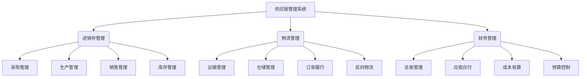

# 供应链进销存、物流、财务系统设计

## 1.背景介绍

### 1.1 供应链管理的重要性

在当今快节奏的商业环境中，供应链管理已经成为企业保持竞争力和盈利能力的关键因素。有效的供应链管理可以确保原材料、产品和服务的高效流动,从而降低成本、提高客户满意度并增强企业的灵活性。

### 1.2 传统供应链管理面临的挑战

传统的供应链管理系统通常存在以下挑战:

- 信息孤岛:不同部门和合作伙伴之间缺乏实时数据共享和协作
- 低效率:手动流程和纸质文档导致效率低下
- 缺乏可视性:难以全面跟踪库存、订单和物流状态
- 缺乏灵活性:系统无法快速响应市场变化和客户需求

### 1.3 现代供应链管理系统的需求

为了解决这些挑战,现代供应链管理系统需要集成进销存、物流和财务模块,提供以下功能:

- 实时数据集成和共享
- 自动化流程和paperless操作
- 端到端可视性和跟踪能力
- 灵活性和可扩展性以适应不断变化的业务需求

## 2.核心概念与联系

### 2.1 进销存管理

进销存管理是指对原材料、半成品和产成品的采购、生产、销售和库存的有效管控。它包括以下关键概念:

- **采购管理**:根据生产计划和库存水平进行原材料采购
- **生产管理**:计划和执行生产活动以满足订单需求
- **销售管理**:处理客户订单、发货和收款
- **库存管理**:跟踪和优化各种库存水平以降低成本

### 2.2 物流管理 

物流管理负责规划、实施和控制原材料、半成品和成品的高效流动和存储。它涉及以下关键领域:

- **运输管理**:选择运输模式并优化路线和装载
- **仓储管理**:管理仓库运营、库存和订单拣选
- **订单履行**:从接收订单到交付产品的端到端流程
- **反向物流**:处理退货、维修和回收利用

### 2.3 财务管理

财务管理确保企业财务健康,涵盖以下主要职能:

- **总账管理**:记录和维护所有财务交易
- **应收账款/应付账款**:跟踪和收付款项
- **成本核算**:计算产品和服务的实际成本
- **预算控制**:制定和监控预算以控制支出

### 2.4 系统集成

上述三个模块需要无缝集成,实现实时数据共享和业务流程自动化,从而提高效率、降低成本并提升客户体验。



## 3.核心算法原理具体操作步骤

### 3.1 需求计划算法

需求计划算法用于确定所需原材料和产品的数量及时间,以满足客户需求并优化库存水平。常用算法包括:

1. **材料需求计划 (MRP)**
   - 依据主生产计划(MPS)、现有库存、已下订单和产品物料清单(BOM)计算所需材料
   - 通过爆炸计算确定所需零件及数量
   - 考虑交货时间和安全库存量

2. **分销需求计划 (DRP)** 
   - 预测每个分销点的需求
   - 根据现有库存和在途库存计算补货需求
   - 考虑运输时间和服务水平

### 3.2 库存优化算法

库存优化旨在平衡库存成本和缺货风险,确保足够库存满足需求,同时避免过多库存。常用算法有:

1. **经济订货量 (EOQ)模型**
   - 确定每次订货的最优数量,使订货成本和库存持有成本之和最小化
   - $$EOQ = \sqrt{\frac{2DC_o}{C_c}}$$
     其中D为年度需求量,Co为每次订货成本,Cc为单位库存持有成本

2. **再订货点 (ROP)模型**
   - 确定何时下单补货,使在下单后到货之前不会出现缺货
   - $$ROP = dL + SS$$
     其中d为日均需求量,L为交货时间,SS为安全库存量

3. **ABC分类法**
   - 根据产品重要性(年度使用价值)将库存分为A、B、C三类
   - A类产品实施严格控制,C类产品实施简化控制

### 3.3 运输优化算法

运输优化算法旨在降低运输成本,提高效率。常用算法包括:

1. **车辆路径问题 (VRP)**
   - 确定一组车辆从中心点出发,经由多个目的地后返回的最优路径
   - 目标是最小化总行驶距离或时间

2. **装载优化**
   - 确定如何将货物装载到车辆/集装箱中以最大化利用空间
   - 考虑货物尺寸、重量和易碎性

3. **模式选择**
   - 根据时间、成本和服务需求选择最佳运输模式(公路、铁路、航空等)

### 3.4 财务核算算法

财务核算算法用于计算产品实际成本,预测现金流并控制预算支出。常用算法有:

1. **作业成本计算**
   - 将直接材料、直接人工和制造费用分配至每个产品/服务
   - 可使用作业成本计算系统自动分配制造费用

2. **现金流预测**
   - 根据预期收入、支出和现有现金余额预测未来现金流
   - 确定是否需要外部融资来满足资金需求  

3. **费用分摊**
   - 将间接费用(如租金、保险等)按适当的分摊基础分配至不同部门或产品
   - 确保每个部门/产品承担适当的间接费用

## 4.数学模型和公式详细讲解举例说明

### 4.1 经济订货量 (EOQ) 模型

EOQ模型是库存管理中一个基本且广泛使用的模型,旨在确定每次订货的最优数量,使订货成本和库存持有成本之和最小化。

$$EOQ = \sqrt{\frac{2DC_o}{C_c}}$$

其中:
- $D$是年度需求量(单位)
- $C_o$是每次订货的固定成本(如运输、下单处理等)
- $C_c$是每单位产品的年库存持有成本(如资金成本、储存费用等)

**例子**:
某公司年需求量为10,000件产品,每次订货固定成本为200元,每件产品的年库存持有成本为5元。计算经济订货量。

给定:
- $D = 10,000$
- $C_o = 200$  
- $C_c = 5$

代入EOQ公式:
$$EOQ = \sqrt{\frac{2 \times 10,000 \times 200}{5}} = 632.46 \approx 633$$

因此,该公司的经济订货量约为633件产品。

### 4.2 再订货点 (ROP) 模型

ROP模型用于确定何时下单补货,以确保在下单后到货之前不会出现缺货情况。

$$ROP = dL + SS$$

其中:
- $d$是日均需求量(单位/天)
- $L$是交货时间(天)  
- $SS$是安全库存量(单位)

**例子**:  
某产品日均需求量为50件,供应商交货时间为10天,公司希望维持安全库存500件。计算再订货点。

给定:
- $d = 50$ 
- $L = 10$
- $SS = 500$

代入ROP公式:
$$ROP = 50 \times 10 + 500 = 1,000$$

因此,当库存量降至1,000件时,公司应下单补货。

### 4.3 现金流预测模型

现金流预测对于企业财务规划至关重要。一个简单的现金流预测模型如下:

$$CF_t = CF_{t-1} + R_t - E_t$$

其中:
- $CF_t$是时间t的现金余额
- $CF_{t-1}$是前一时间段的现金余额  
- $R_t$是时间t的预期收入
- $E_t$是时间t的预期支出

通过迭代计算,可以预测未来每个时间段的现金余额。

**例子**:
某公司当前现金余额为50,000元。预计下月收入为200,000元,支出为180,000元。计算下月现金余额。

给定:
- $CF_{t-1} = 50,000$
- $R_t = 200,000$
- $E_t = 180,000$

代入现金流预测模型:
$$CF_t = 50,000 + 200,000 - 180,000 = 70,000$$

因此,下月该公司的预计现金余额为70,000元。

## 5.项目实践:代码实例和详细解释说明

为了展示供应链系统的实际实现,我们将使用Python编写一个简单的示例项目,包括进销存、物流和财务模块。

### 5.1 项目结构

```
supply_chain_system/
├── inventory/
│   ├── __init__.py
│   ├── inventory.py
│   └── products.csv
├── logistics/
│   ├── __init__.py
│   └── logistics.py  
├── finance/
│   ├── __init__.py
│   └── finance.py
├── main.py
└── README.md
```

- `inventory`模块管理产品库存
- `logistics`模块处理订单发货
- `finance`模块记录财务交易
- `main.py`是主程序入口
- `README.md`包含项目说明

### 5.2 进销存模块

`inventory.py`包含`Inventory`类,用于管理产品库存:

```python
class Product:
    def __init__(self, name, price):
        self.name = name
        self.price = price

class Inventory:
    def __init__(self):
        self.products = {}
        self.load_products('products.csv')

    def load_products(self, file_path):
        with open(file_path, 'r') as f:
            for line in f:
                name, price = line.strip().split(',')
                self.products[name] = Product(name, float(price))

    def get_product(self, name):
        return self.products.get(name)

    def update_quantity(self, name, quantity):
        product = self.get_product(name)
        if product:
            product.quantity = quantity

    def purchase(self, name, quantity):
        product = self.get_product(name)
        if product:
            cost = product.price * quantity
            print(f'Purchased {quantity} {name} for ${cost:.2f}')
            self.update_quantity(name, getattr(product, 'quantity', 0) + quantity)
        else:
            print(f'{name} not found in inventory')

    def sell(self, name, quantity):
        product = self.get_product(name)
        if product and getattr(product, 'quantity', 0) >= quantity:
            revenue = product.price * quantity
            print(f'Sold {quantity} {name} for ${revenue:.2f}')
            self.update_quantity(name, getattr(product, 'quantity', 0) - quantity)
        else:
            print(f'Not enough {name} in stock')
```

该模块从`products.csv`文件加载产品信息,并提供`purchase`和`sell`方法来更新库存。

### 5.3 物流模块  

`logistics.py`包含`Logistics`类,用于处理订单发货:

```python
from inventory import Inventory

class Logistics:
    def __init__(self):
        self.inventory = Inventory()

    def process_order(self, items):
        total_cost = 0
        for name, quantity in items:
            product = self.inventory.get_product(name)
            if product and getattr(product, 'quantity', 0) >= quantity:
                cost = product.price * quantity
                total_cost += cost
                self.inventory.sell(name, quantity)
            else:
                print(f'Not enough {name} in stock to fulfill order')
                return

        print(f'Order processed successfully. Total cost: ${total_cost:.2f}')
```

该模块依赖于`Inventory`类,在处理订单时会检查库存并更新库存数量。

### 5.4 财务模块

`finance.py`包含`Finance`类,用于记录财务交易:

```python
class Finance:
    def __init__(self):
        self.cash = 0
        